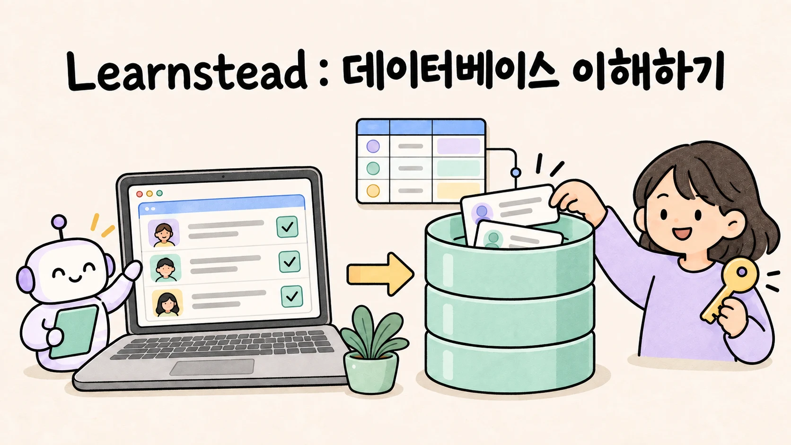
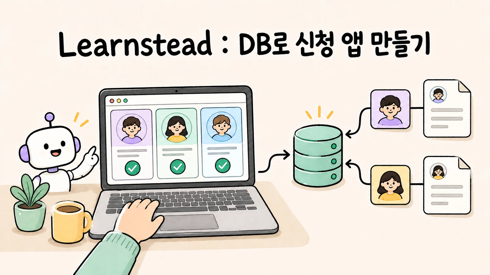
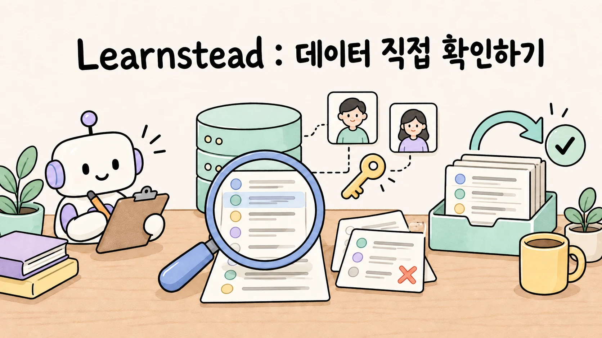

# Learnstead

AI를 직접 실행하고, 앱을 만들고, 결과를 확인하는 학습 자료 모음입니다. **관심 있는 주제 하나를 골라 시작하세요.** 각 자료의 소개 페이지에서 준비물과 읽는 순서, 실제 검증 범위를 확인할 수 있습니다.

## 어디서 시작할까요?

| 하고 싶은 일 | 찾아갈 카테고리 |
| --- | --- |
| AI로 앱을 만들고 변경을 되돌릴 수 있게 관리하기 | [AI와 코딩하기](#ai와-코딩하기--빠르게-만들되-결정권은-놓치지-않기) |
| 앱의 저장 기능·사용자별 권한·백업 이해하기 | [데이터베이스](#ai로-만든-앱의-데이터--이해부터-권한복구-확인까지) |
| 내 컴퓨터에서 모델을 실행하고 프로그램에 연결하기 | [Local LLM](#local-llm--실행한-모델을-프로그램까지-연결하기) |
| 내 문서를 근거로 답하는 AI 만들기 | [RAG와 Graph](#내-문서에-답하는-ai--rag-이해부터-실패-진단까지) |
| Agent에게 반복 절차를 가르치고 도구·정보 연결하기 | [Agent Skills·MCP·Context Engineering](#ai-agent-다루기--절차도구컨텍스트를-설계하기) |
| 여러 모델 호출이나 Agent에게 작업 나눠 맡기기 | [오케스트레이션과 작업 위임](#ai-여러-개로-일하기--코드로-엮기-도구-안에서-맡기기) |

**가이드는** 개념과 선택 기준을 설명합니다. **튜토리얼은** 한 경로를 따라 결과물을 만듭니다. **실습은** 정해진 과제에서 예상과 실제 결과를 비교합니다. 현재 가이드 11편·튜토리얼 2편·실습 8편이 있습니다.

## 학습 자료 한눈에 보기

### AI와 코딩하기 — 빠르게 만들되 결정권은 놓치지 않기

Git으로 변경을 남기는 법부터 익히고, 바이브 코딩의 작업 흐름과 확인 실습으로 이어 갑니다.

| Git으로 변경 관리 | 바이브 코딩 가이드 | 다섯 가지 확인 실습 |
| --- | --- | --- |
|  |  |  |
| AI가 만든 변경을 저장·확인·분리·공유하고, branch와 worktree로 여러 작업을 안전하게 나눕니다. | 목표와 범위를 정하고 한 번에 하나씩 바꾸며, 확인·복구·공개 전 점검까지 이어 갑니다. | 비슷해 보이는 할 일 앱 세 판을 직접 눌러 보며 숨어 있는 실패를 찾아냅니다. |
| **[Git부터 시작 →](guides/git-for-vibe-coders/README.md)** | **[가이드 이어 읽기 →](guides/vibe-coding-practice/README.md)** | **[실습으로 확인 →](labs/five-checks/README.md)** |

### AI로 만든 앱의 데이터 — 이해부터 권한·복구 확인까지

개념 가이드는 단독으로 읽을 수 있습니다. 먼저 실행해 보려면 Python을 사용하는 실습의 SQLite 경로를, 신청 앱을 만들려면 Docker·Node.js를 사용하는 튜토리얼을 선택하세요. 클라우드 계정 없이 가상 데이터로 연습합니다.

<table>
<tr>
<th width="33%">데이터베이스 이해하기</th>
<th width="33%">DB로 신청 앱 만들기</th>
<th width="33%">데이터 직접 확인하기</th>
</tr>
<tr>
<td width="33%"></td>
<td width="33%"></td>
<td width="33%"></td>
</tr>
<tr>
<td>SQLite · PostgreSQL · MySQL · MongoDB · Firestore를 사례로 데이터 구조와 선택 기준을 익힙니다.</td>
<td>로컬 Supabase와 PostgreSQL로 로그인·모임 신청·취소를 연결합니다.</td>
<td>저장·제약·동시성·권한·구조 변경·복원을 가상 데이터로 확인합니다.</td>
</tr>
<tr>
<td><strong><a href="guides/database-for-vibe-coders/README.md">가이드 시작 →</a></strong></td>
<td><strong><a href="tutorials/study-signup-db/README.md">튜토리얼 시작 →</a></strong></td>
<td><strong><a href="labs/database-safety/README.md">실습 시작 →</a></strong></td>
</tr>
</table>

### Local LLM — 실행한 모델을 프로그램까지 연결하기

모델 실행부터 시작하고, 준비된 모델이 있다면 앱 연결 가이드로 이동하세요.

| Local LLM 실행 | Local LLM 앱 연결 |
| --- | --- |
|  |  |
| 내 장비에서 모델을 고르고 실행한 뒤 GPU 적재와 첫 응답까지 확인합니다. | 실행한 모델을 프로그램에서 호출하고 대화·답변 형식·도구 사용 범위를 다룹니다. |
| **[1편 시작 →](guides/local-llm/README.md)** | **[2편 시작 →](guides/local-llm-app-integration/README.md)** |

### 내 문서에 답하는 AI — RAG 이해부터 실패 진단까지

개념 → 만들기 → 실패 진단 순서입니다. 실습 전에 Local LLM 실행 환경을 준비합니다.

| RAG와 Graph 이해 | Local RAG 만들기 | RAG 실패 실습 |
| --- | --- | --- |
|  |  |  |
| RAG의 색인·검색·생성 흐름과 GraphRAG가 필요한 질문을 개념부터 설명합니다. | Ollama와 Python으로 내 문서에 답하는 최소 RAG를 만들고 근거를 판정합니다. | 검색·청킹·생성·그래프의 실패를 재현하고 골든셋 지표로 변경 전후를 비교합니다. |
| **[가이드 시작 →](guides/local-rag/README.md)** | **[튜토리얼 시작 →](tutorials/local-rag-build/README.md)** | **[실습 시작 →](labs/why-rag-fails/README.md)** |

### AI Agent 다루기 — 절차·도구·컨텍스트를 설계하기

Skill → MCP → Context Engineering 순서로 읽되, 각 가이드 바로 다음에 대응 실습을 선택할 수 있습니다. Tool calling이 낯설다면 [앱 연결 가이드 06](guides/local-llm-app-integration/06-tool-calling-workflow-agent.md)을 먼저 읽어 보세요.

| Agent에게 일 가르치기 | MCP로 도구 연결하기 | 필요한 정보 설계하기 |
| --- | --- | --- |
|  |  |  |
| 반복해서 설명하던 절차를 Skill로 만들고, Agent가 필요할 때 찾아 쓰게 하는 방법을 배웁니다. | 내 파일과 API를 Agent에 연결할 때 모델·host·MCP 서버가 맡는 역할과 권한 경계를 익힙니다. | 지시문·Skill·도구 결과·기억 가운데 지금 필요한 정보를 골라 모델에 전달하는 방법을 배웁니다. |
| **[1편 시작 →](guides/agent-skills/README.md)** | **[2편 시작 →](guides/mcp-basics/README.md)** | **[3편 시작 →](guides/context-engineering/README.md)** |

| Skill 워크숍 | 노트 MCP 서버 실습 | 지시문 예산 실습 |
| --- | --- | --- |
|  |  |  |
| 회의록 정리 Skill을 직접 만들고, 명시 호출·자동 호출·과호출과 이름 충돌을 관측합니다. | Python으로 작은 읽기 전용 서버를 만든 뒤 잘못된 경로와 거짓 권한 힌트 같은 실패를 재현합니다. | 같은 과제를 여러 지시문 구성으로 반복해 보고, 규칙 준수율과 토큰 사용량을 기계적으로 비교합니다. |
| **[1편 실습 →](labs/skill-workshop/README.md)** | **[2편 실습 →](labs/mcp-notes-server/README.md)** | **[3편 실습 →](labs/instruction-budget/README.md)** |

### AI 여러 개로 일하기 — 코드로 엮기, 도구 안에서 맡기기

프로그램에서 모델을 호출한다면 왼쪽 코드 경로를, Claude Code나 Codex에서 작업을 나눈다면 오른쪽 코딩 도구 경로를 고르세요. 코드 경로는 Python·Ollama와 tool calling·agent 기초, 코딩 도구 경로는 Context Engineering·Git worktree 기초를 전제로 합니다.

| 코드로 여러 AI 엮기 | 코딩 Agent에게 나눠 맡기기 |
| --- | --- |
|  |  |
| 파이프라인·라우터·워커·평가 루프를 비교하고, 나누는 이유와 실패 신호를 익힙니다. | Subagent·병렬 작업·새 컨텍스트 검토를 구분하고, 맡길 범위와 확인할 결과를 정합니다. |
| **[가이드 시작 →](guides/agent-orchestration/README.md)** | **[가이드 시작 →](guides/agent-delegation/README.md)** |

| 패턴별 실패 재현 | 위임하고 검증하기 |
| --- | --- |
|  |  |
| 같은 과제를 다섯 방식으로 실행해 분류 오류·취합 손실·반복 실패와 토큰 비용을 관측합니다. | 결함을 심은 가계부 코드로 한 세션·위임·병렬·검토를 비교하고, 지적의 타당성과 통합 결과를 확인합니다. |
| **[실습 시작 →](labs/when-splitting-fails/README.md)** | **[실습 시작 →](labs/delegate-and-verify/README.md)** |

## 문서가 지키는 기준

<!--
편집자와 에이전트: 학습 자료를 수정하기 전에 docs/AUTHORING.md, docs/VALIDATION.md,
docs/VISUALS.md를 확인합니다.
-->

Learnstead는 설명만 제시하지 않습니다. 독자가 근거와 검증 범위를 직접 확인할 수 있도록 자료를 구성합니다.

- **출처와 확인 시점을 남깁니다.** 주요 설명은 공식 문서와 공개 자료를 우선 확인하고, 자료별 `SOURCES.md`에
  링크와 확인 날짜를 기록합니다.
- **직접 실행한 범위를 밝힙니다.** 실제로 사용한 환경·버전·명령·결과와 확인하지 못한 부분은
  `VALIDATION.md`에서 구분합니다.
- **사실과 해석을 구분합니다.** 본문에서 `원리`, `실행 검증`, `부분 검증`, `문서 확인`, `자료 확인`, `미검증`,
  `해석`을 표시해 근거의 성격을 드러냅니다.
- **성공과 실패를 함께 다룹니다.** 명령만 나열하지 않고 성공을 판정하는 기준, 흔한 실패, 다음에 확인할 지점을
  함께 설명합니다.
- **변경 내역을 남깁니다.** 독자에게 영향을 주는 수정과 재검증 결과는 각 자료의 `CHANGELOG.md`와
  `VALIDATION.md`에 기록합니다.

도구와 모델은 계속 바뀝니다. 단순히 “된다”고 단정하지 않고, 언제 어떤 환경에서 무엇을 확인했는지 함께 남깁니다.

## Learnstead라는 이름

Learnstead는 learn과 homestead를 합친 이름입니다. 배운 내용을 직접 실행하고 검증하며 차곡차곡 쌓아 가는 작은 배움의 터전이라는 뜻입니다.

## 오류 제보

설명이 모호하거나 명령이 동작하지 않거나 오래된 정보를 발견했다면 GitHub Issue로 알려 주세요. 제보할 때는
문서 위치, 사용한 운영체제와 장비, 실행한 명령, 실제 결과를 포함하면 재현에 도움이 됩니다. 비밀번호, API key,
내부 주소와 개인 정보는 올리지 마세요.

## 라이선스

이 저장소의 문서와 원본 자료는 별도 표시가 없는 한 [Apache License 2.0](LICENSE)으로 배포합니다.

## 자료를 작성하거나 정비하려면

[작성 원칙](docs/AUTHORING.md)에서 시작해 [문서 구조](docs/STRUCTURE.md), [템플릿](docs/templates/README.md), [그림 기준](docs/VISUALS.md), [검증](docs/VALIDATION.md), [발행 절차](docs/PUBLISHING.md)를 확인하세요.
