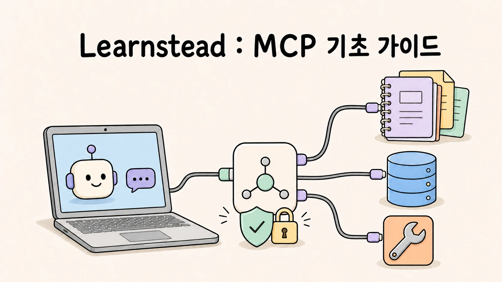
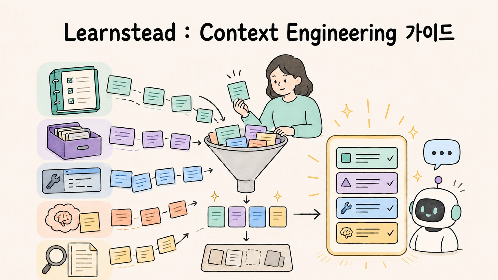
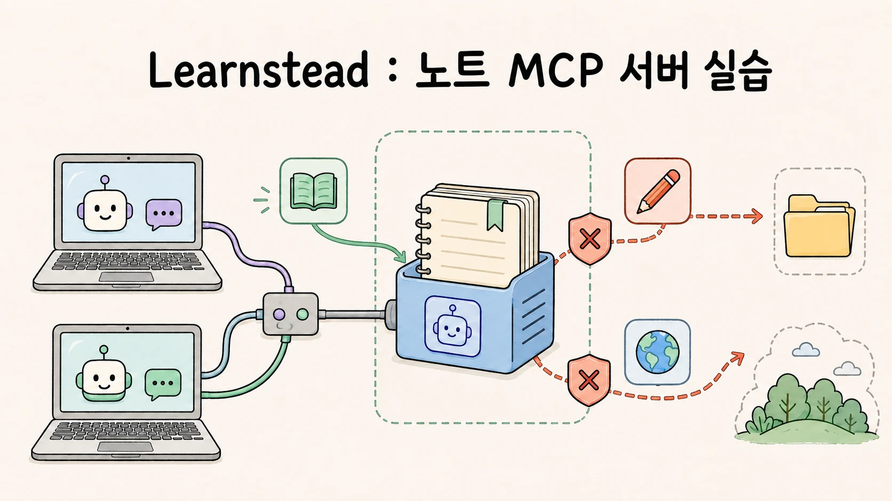
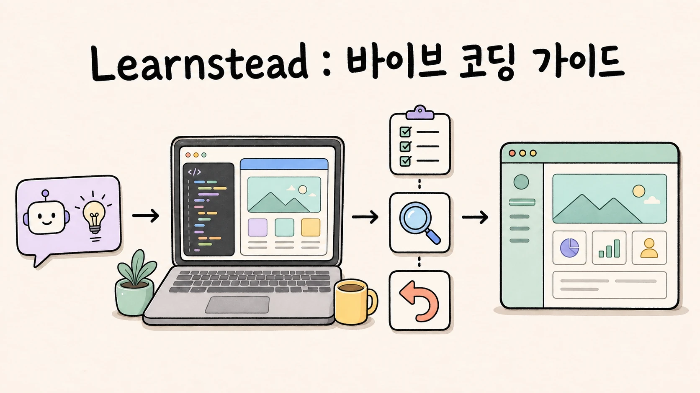

# Learnstead

Learnstead는 한 가지 주제를 직접 이해하고 실행해 볼 수 있도록 정리한 학습 자료 모음입니다.
짧게 읽는 글보다 오래 참고할 수 있는 설명, 따라 할 수 있는 절차, 검증 기록을 한곳에 둡니다.

> **이름에 담긴 뜻**
>
> **Learnstead = learn + homestead.** 배운 내용을 직접 실행하고 검증하며 차곡차곡 쌓아 가는 작은 배움의
> 터전이라는 뜻입니다. 각 자료는 핵심 개념, 따라 할 수 있는 절차, 검증 기록을 함께 제공합니다.

## 학습 자료 한눈에 보기

### Local LLM — 실행한 모델을 프로그램까지 연결하기

| Local LLM 실행 | Local LLM 앱 연결 |
| --- | --- |
|  |  |
| 내 장비에서 모델을 고르고 실행한 뒤 GPU 적재와 첫 응답까지 확인합니다. | 실행한 모델을 프로그램에서 호출하고 대화·답변 형식·도구 사용 범위를 다룹니다. |
| **[1편 시작 →](guides/local-llm/README.md)** | **[2편 시작 →](guides/local-llm-app-integration/README.md)** |

### 내 문서에 답하는 AI — RAG 이해부터 실패 진단까지

| RAG와 Graph 이해 | Local RAG 만들기 | RAG 실패 실습 |
| --- | --- | --- |
|  |  |  |
| RAG의 색인·검색·생성 흐름과 GraphRAG가 필요한 질문을 개념부터 설명합니다. | Ollama와 Python으로 내 문서에 답하는 최소 RAG를 만들고 근거를 판정합니다. | 검색·청킹·생성·그래프의 실패를 재현하고 골든셋 지표로 변경 전후를 비교합니다. |
| **[가이드 시작 →](guides/local-rag/README.md)** | **[튜토리얼 시작 →](tutorials/local-rag-build/README.md)** | **[실습 시작 →](labs/why-rag-fails/README.md)** |

### AI Agent 다루기 — 절차·도구·컨텍스트를 설계하기

| Agent에게 일 가르치기 | MCP로 도구 연결하기 | 필요한 정보 설계하기 |
| --- | --- | --- |
|  |  |  |
| 반복해서 설명하던 절차를 Skill로 만들고, Agent가 필요할 때 찾아 쓰게 하는 방법을 배웁니다. | 내 파일과 API를 Agent에 연결할 때 모델·host·MCP 서버가 맡는 역할과 권한 경계를 익힙니다. | 지시문·Skill·도구 결과·기억 가운데 지금 필요한 정보를 골라 모델에 전달하는 방법을 배웁니다. |
| **[1편 시작 →](guides/agent-skills/README.md)** | **[2편 시작 →](guides/mcp-basics/README.md)** | **[3편 시작 →](guides/context-engineering/README.md)** |

| Skill 워크숍 | 노트 MCP 서버 실습 | 지시문 예산 실습 |
| --- | --- | --- |
|  |  |  |
| 회의록 정리 Skill을 직접 만들고, 명시 호출·자동 호출·과호출과 이름 충돌을 관측합니다. | Python으로 작은 읽기 전용 서버를 만든 뒤 잘못된 경로와 거짓 권한 힌트 같은 실패를 재현합니다. | 같은 과제를 여러 지시문 구성으로 반복해 보고, 규칙 준수율과 토큰 사용량을 기계적으로 비교합니다. |
| **[1편 실습 →](labs/skill-workshop/README.md)** | **[2편 실습 →](labs/mcp-notes-server/README.md)** | **[3편 실습 →](labs/instruction-budget/README.md)** |

### AI와 코딩하기 — 빠르게 만들되 결정권은 놓치지 않기

| Git으로 변경 관리 | 바이브 코딩 가이드 | 다섯 가지 확인 실습 |
| --- | --- | --- |
|  |  |  |
| AI가 만든 변경을 저장·확인·분리·공유하고, branch와 worktree로 여러 작업을 안전하게 나눕니다. | 목표와 범위를 정하고 한 번에 하나씩 바꾸며, 확인·복구·공개 전 점검까지 이어 갑니다. | 비슷해 보이는 할 일 앱 세 판을 직접 눌러 보며 숨어 있는 실패를 찾아냅니다. |
| **[Git부터 시작 →](guides/git-for-vibe-coders/README.md)** | **[가이드 이어 읽기 →](guides/vibe-coding-practice/README.md)** | **[실습으로 확인 →](labs/five-checks/README.md)** |

## 추천 학습 경로

### Local LLM — 실행한 모델을 프로그램까지 연결하기

1. [내 장비에서 LLM 직접 실행하기](guides/local-llm/README.md) — 모델·runtime 선택, 설치, 첫 응답, GPU 적재 확인
2. [Local LLM을 내 프로그램에 연결하기](guides/local-llm-app-integration/README.md) — 대화 상태, 구조화 출력, tool calling, 읽기 전용 agent

Local LLM을 프로그램에서 호출하는 방식이 먼저 궁금하면 [앱 연결 가이드](guides/local-llm-app-integration/README.md)를 1편 다음에
읽어도 좋습니다.

### 내 문서에 답하는 AI — RAG 이해부터 실패 진단까지

1. [내 장비에서 LLM 직접 실행하기](guides/local-llm/README.md) — 모델을 준비하고 로컬 실행을 확인합니다
2. [내 문서와 대화하는 AI 이해하기 — RAG와 Graph](guides/local-rag/README.md) — 색인·검색·생성, 청킹, 근거 제시, GraphRAG 선택 기준을 익힙니다
3. [내 문서에 답하는 Local RAG 만들기](tutorials/local-rag-build/README.md) — Ollama와 Python으로 최소 RAG를 직접 완성합니다
4. [RAG는 왜 틀리는가](labs/why-rag-fails/README.md) — 실패를 재현하고 원인을 구분한 뒤 골든셋으로 다시 잽니다

### AI Agent 다루기 — 절차·도구·컨텍스트를 설계하기

1. [AI Agent에게 일을 가르치는 법 — Agent Skills 기초](guides/agent-skills/README.md) — Agent의 작동 구조를 익히고 반복 절차를 Skill로 만듭니다
2. [Skill 워크숍](labs/skill-workshop/README.md) — 작은 Skill을 두 도구에서 실행하며 선택·충돌·실패를 관측합니다
3. [AI Agent에 내 도구를 연결하는 법 — MCP 기초](guides/mcp-basics/README.md) — 외부 도구 연결과 실제 실행 주체, 권한 경계를 구분합니다
4. [노트 MCP 서버](labs/mcp-notes-server/README.md) — 읽기 전용 서버를 만들고 연결·거부·오염 실패를 재현합니다
5. [AI Agent가 놓치지 않게 정보 설계하기 — Context Engineering 기초](guides/context-engineering/README.md) — Agent가 읽는 정보를 고르고 배치하고 유지하는 기준을 익힙니다
6. [지시문 예산](labs/instruction-budget/README.md) — 지시문의 크기·위치·형태에 따른 준수 결과를 직접 비교합니다

3편의 tool calling이 낯설다면 먼저 [Local LLM 앱 연결 가이드 06](guides/local-llm-app-integration/06-tool-calling-workflow-agent.md)을 읽어도 좋습니다.

### AI와 코딩하기 — 빠르게 만들되 결정권은 놓치지 않기

1. [AI로 코딩하는 사람을 위한 Git](guides/git-for-vibe-coders/README.md) — commit과 diff부터 branch·worktree·PR·공개 전 점검까지
2. [AI와 함께 만들기 — 바이브 코딩에서 Agentic Engineering으로](guides/vibe-coding-practice/README.md) — 목표·범위·확인 방법을 정하고, 작은 변경과 복구를 반복하는 작업 습관
3. [다섯 가지 확인](labs/five-checks/README.md) — 같은 요청을 처리한 것처럼 보이는 세 판을 직접 확인하며 실패를 판정하는 실습

## 문서가 지키는 기준

<!--
편집자와 에이전트: 학습 자료를 수정하기 전에 docs/AUTHORING.md, docs/VALIDATION.md,
docs/VISUALS.md를 확인합니다.
-->

Learnstead는 설명만 제시하지 않습니다. 독자가 근거와 검증 범위를 직접 확인할 수 있도록 자료를 구성합니다.

- **출처와 확인 시점을 남깁니다.** 주요 설명은 공식 문서와 공개 자료를 우선 확인하고, 자료별 `SOURCES.md`에
  링크와 확인 날짜를 기록합니다.
- **직접 실행한 범위를 밝힙니다.** 실제로 사용한 환경·버전·명령·결과와 확인하지 못한 부분은
  `VALIDATION.md`에서 구분합니다.
- **사실과 해석을 구분합니다.** 본문에서 `원리`, `실행 검증`, `부분 검증`, `문서 확인`, `자료 확인`, `미검증`,
  `해석`을 표시해 근거의 성격을 드러냅니다.
- **성공과 실패를 함께 다룹니다.** 명령만 나열하지 않고 성공을 판정하는 기준, 흔한 실패, 다음에 확인할 지점을
  함께 설명합니다.
- **변경 내역을 남깁니다.** 독자에게 영향을 주는 수정과 재검증 결과는 각 자료의 `CHANGELOG.md`와
  `VALIDATION.md`에 기록합니다.

도구와 모델은 계속 바뀝니다. 단순히 “된다”고 단정하지 않고, 언제 어떤 환경에서 무엇을 확인했는지 함께 남깁니다.

## 오류 제보

설명이 모호하거나 명령이 동작하지 않거나 오래된 정보를 발견했다면 GitHub Issue로 알려 주세요. 제보할 때는
문서 위치, 사용한 운영체제와 장비, 실행한 명령, 실제 결과를 포함하면 재현에 도움이 됩니다. 비밀번호, API key,
내부 주소와 개인 정보는 올리지 마세요.

## 라이선스

이 저장소의 문서와 원본 자료는 별도 표시가 없는 한 [Apache License 2.0](LICENSE)으로 배포합니다.
