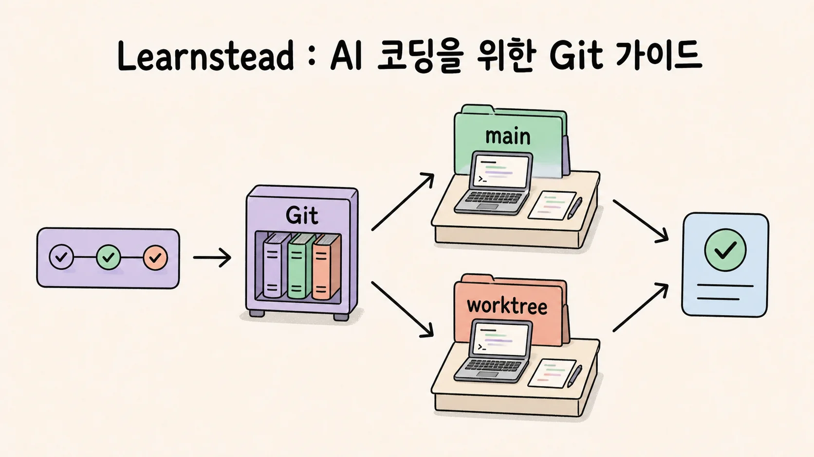
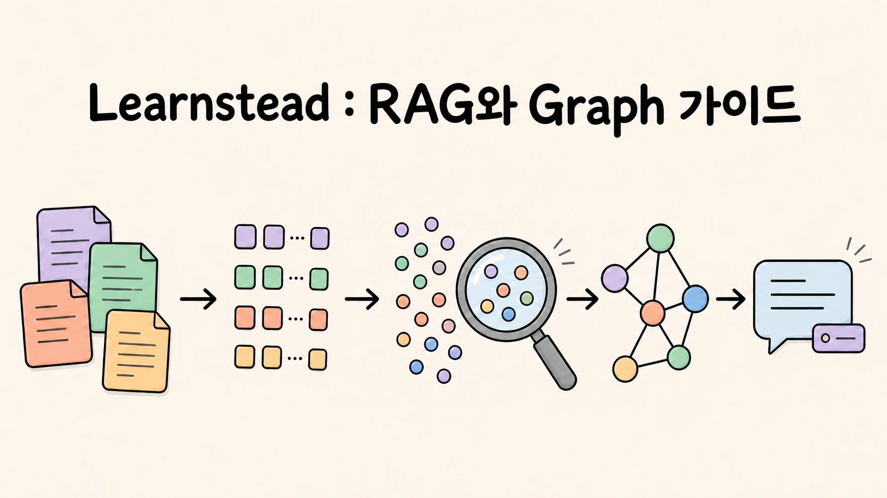
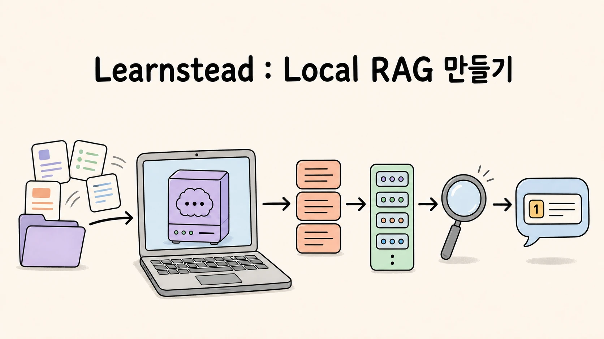
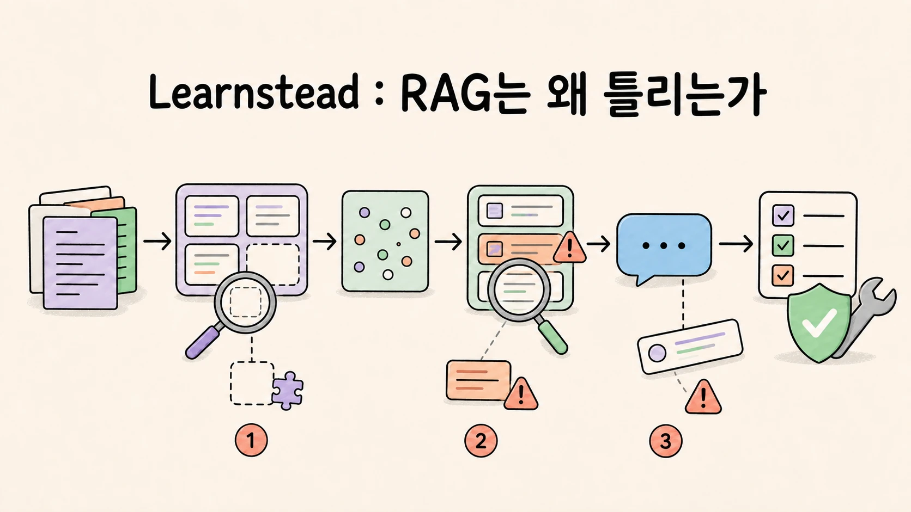

# Learnstead

Learnstead는 한 가지 주제를 직접 이해하고 실행해 볼 수 있도록 정리한 학습 자료 모음입니다.
짧게 읽는 글보다 오래 참고할 수 있는 설명, 따라 할 수 있는 절차, 검증 기록을 한곳에 둡니다.

> **이름에 담긴 뜻**
>
> **Learnstead = learn + homestead.** 배운 내용을 직접 실행하고 검증하며 차곡차곡 쌓아 가는 작은 배움의
> 터전이라는 뜻입니다. 각 자료는 핵심 개념, 따라 할 수 있는 절차, 검증 기록을 함께 제공합니다.

## 가이드 한눈에 보기

| Local LLM 실행 | Local LLM 앱 연결 | AI 코딩을 위한 Git |
| --- | --- | --- |
|  |  |  |
| 내 장비에서 모델을 고르고 실행한 뒤 GPU 적재와 첫 응답까지 확인합니다. | 실행한 모델을 프로그램에서 호출하고 대화·답변 형식·도구 사용 범위를 다룹니다. | AI가 만든 변경을 저장·확인·분리·공유하고, branch와 worktree로 여러 작업을 안전하게 나눕니다. |
| **[1편 시작 →](guides/local-llm/README.md)** | **[2편 시작 →](guides/local-llm-app-integration/README.md)** | **[가이드 시작 →](guides/git-for-vibe-coders/README.md)** |

| RAG와 Graph 이해 | Local RAG 만들기 | RAG 실패 실습 |
| --- | --- | --- |
|  |  |  |
| RAG의 색인·검색·생성 흐름과 GraphRAG가 필요한 질문을 개념부터 설명합니다. | Ollama와 Python으로 내 문서에 답하는 최소 RAG를 만들고 근거를 판정합니다. | 검색·청킹·생성·그래프의 실패를 재현하고 골든셋 지표로 변경 전후를 비교합니다. |
| **[가이드 시작 →](guides/local-rag/README.md)** | **[튜토리얼 시작 →](tutorials/local-rag-build/README.md)** | **[실습 시작 →](labs/why-rag-fails/README.md)** |

## 추천 학습 경로

### Local LLM — 실행한 모델을 프로그램까지 연결하기

1. [내 장비에서 LLM 직접 실행하기](guides/local-llm/README.md) — 모델·runtime 선택, 설치, 첫 응답, GPU 적재 확인
2. [Local LLM을 내 프로그램에 연결하기](guides/local-llm-app-integration/README.md) — 대화 상태, 구조화 출력, tool calling, 읽기 전용 agent

### AI 코딩 기본기 — 변경의 결정권 유지하기

1. [AI로 코딩하는 사람을 위한 Git](guides/git-for-vibe-coders/README.md) — commit과 diff부터 branch·worktree·PR·공개 전 점검까지

### 내 문서에 답하는 AI — RAG 이해부터 실패 진단까지

1. [내 장비에서 LLM 직접 실행하기](guides/local-llm/README.md) — 모델을 준비하고 로컬 실행을 확인합니다
2. [내 문서와 대화하는 AI 이해하기 — RAG와 Graph](guides/local-rag/README.md) — 색인·검색·생성, 청킹, 근거 제시, GraphRAG 선택 기준을 익힙니다
3. [내 문서에 답하는 Local RAG 만들기](tutorials/local-rag-build/README.md) — Ollama와 Python으로 최소 RAG를 직접 완성합니다
4. [RAG는 왜 틀리는가](labs/why-rag-fails/README.md) — 실패를 재현하고 원인을 구분한 뒤 골든셋으로 다시 잽니다

Local LLM을 프로그램에서 호출하는 방식이 먼저 궁금하면 [앱 연결 가이드](guides/local-llm-app-integration/README.md)를 1편 다음에
읽어도 좋습니다.

## 학습 자료

| 시리즈 | 포함 자료 | 대상 |
| --- | --- | --- |
| Local LLM | 가이드 · [내 장비에서 LLM 직접 실행하기](guides/local-llm/README.md) 가이드 · [Local LLM을 내 프로그램에 연결하기](guides/local-llm-app-integration/README.md) | 로컬 LLM을 직접 실행하고 프로그램에 연결하려는 사용자 |
| 내 문서에 답하는 AI | 가이드 · [내 문서와 대화하는 AI 이해하기 — RAG와 Graph](guides/local-rag/README.md) 튜토리얼 · [내 문서에 답하는 Local RAG 만들기](tutorials/local-rag-build/README.md) 실습 · [RAG는 왜 틀리는가](labs/why-rag-fails/README.md) | RAG의 구조를 이해하고 직접 구축한 뒤 검색 품질을 검증하려는 사용자 |
| AI 코딩 기본기 | 가이드 · [AI로 코딩하는 사람을 위한 Git](guides/git-for-vibe-coders/README.md) | AI 코딩 도구와 작업하면서 변경을 저장·검토·분리·공유하려는 입문자 |

## 문서가 지키는 기준

- 본문과 운영 문서는 한국어로 작성합니다. 제품명, 명령어, 파일명처럼 정확성이 필요한 식별자는 원문을 유지합니다.
- 원리, 문서로 확인한 사실, 직접 실행한 결과, 아직 검증하지 못한 내용을 구분합니다.
- 명령만 제시하지 않고 성공 판정과 실패했을 때 확인할 지점을 함께 적습니다.
- 기술 도식은 SVG 원본으로 관리하고, 대표 일러스트를 포함한 모든 그림은 본문·대체 텍스트와 같은 범위의 주장을
  하도록 맞춥니다.
- 변경 내용은 저장소 전체 [변경 기록](CHANGELOG.md)과 각 학습 자료의 변경 기록에 나누어 남깁니다.

작성 원칙은 [AUTHORING](docs/AUTHORING.md), 검증 등급은 [VALIDATION](docs/VALIDATION.md), 그림 기준은
[VISUALS](docs/VISUALS.md)에서 확인할 수 있습니다.

## 오류 제보

설명이 모호하거나 명령이 동작하지 않거나 오래된 정보를 발견했다면 GitHub Issue로 알려 주세요. 제보할 때는
문서 위치, 사용한 운영체제와 장비, 실행한 명령, 실제 결과를 포함하면 재현에 도움이 됩니다. 비밀번호, API key,
내부 주소와 개인 정보는 올리지 마세요.

## 라이선스

이 저장소의 문서와 원본 자료는 별도 표시가 없는 한 [Apache License 2.0](LICENSE)으로 배포합니다.
