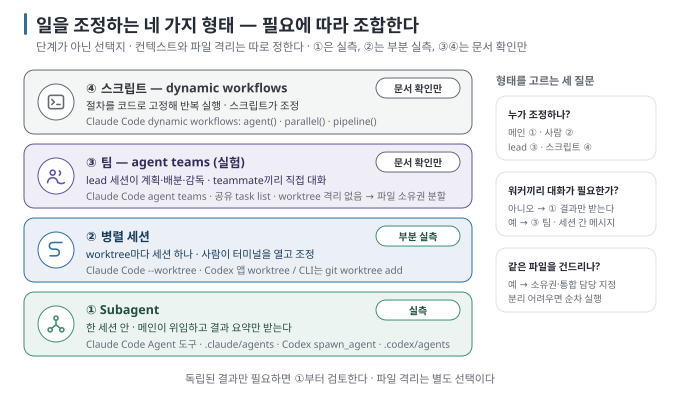

# 02. 일을 나누고 조정하는 네 가지 방식

> 이전 ← [`01-why-split-a-session.md`](01-why-split-a-session.md) · 다음 → [`03-subagent-anatomy.md`](03-subagent-anatomy.md)

## 이 장에서 답하는 질문

- subagent·병렬 세션·팀·스크립트는 무엇이 다른가
- 조정 방식을 고를 때 물어야 할 세 질문은 무엇인가
- 이 가이드가 실측한 방식과 문서로만 확인한 방식은 무엇인가

이 장의 도구 사실은 2026-09-06에 두 도구의 공식 문서로 확인했습니다. 두 도구 모두 이 영역이 빠르게 바뀌므로, 읽는 시점의 버전으로 다시 확인하세요. `[문서 확인 · 2026-09-06]`

## 1. 먼저 구분할 것 — 분리와 조정

subagent는 일을 위임받는 실행 단위이고, worktree는 파일을 따로 편집하는 작업 폴더입니다. 팀과 스크립트는 여러 실행 단위를 조정하는 방식입니다. 따라서 아래 네 행은 서로 배타적인 등급이나 발전 단계가 아닙니다. subagent를 worktree에서 실행할 수도 있고, 스크립트가 여러 subagent를 조정할 수도 있습니다.

예를 들어 메인이 `parse.py`의 규격 검토를 subagent에 맡기면 **조정자는 메인이고, 검토 기록은 별도 컨텍스트에 쌓입니다.** 파일을 읽기만 한다면 작업 폴더까지 나눌 필요는 없습니다. 병렬 편집을 시작할 때는 폴더와 쓰기 범위를 추가로 정합니다.

### 도구별 조정 방식

| 방식 | Claude Code 2.1.263 | Codex CLI 0.153.4 | 누가 조정하나 | 워커끼리 대화 | 같은 파일 |
| --- | --- | --- | --- | --- | --- |
| **Subagent** | `Agent` 도구, `.claude/agents/*.md`, 내장 Explore·Plan·general-purpose | `spawn_agent`·`wait_agent`, `.codex/agents/*.toml`, 내장 `default`·`worker`·`explorer` | 메인 세션이 턴마다 | 결과를 메인에 돌려줌 (Claude Code는 이름 붙인 subagent끼리 메시지 가능) | 같은 checkout을 공유. Claude Code는 `isolation: worktree`로 분리 가능 |
| **병렬 세션** | `claude --worktree <이름>`, 데스크톱 앱 세션마다 worktree | 데스크톱 앱 worktree(`$CODEX_HOME/worktrees`), CLI는 `git worktree add` + `codex --cd` | 사람 | Claude Code는 `SendMessage`로 세션 간 메시지 | worktree로 분리 |
| **팀** | agent teams — 실험, `CLAUDE_CODE_EXPERIMENTAL_AGENT_TEAMS=1`, 공유 task list·mailbox | 해당 없음 | lead 세션 | teammate끼리 직접 | 분리 안 됨 → 파일 소유권을 나눠야 함 |
| **스크립트** | dynamic workflows — `agent()`·`parallel()`·`pipeline()`을 JS로, `ultracode` 옵트인 | 해당 없음 | 스크립트 | 스크립트 변수로 | subagent와 같음 |

Codex 문서는 subagent를 "bounded work를 메인 스레드에서 떼어 내는" 기능으로 소개하고, 쓰기 위주 병렬 편집에는 신중하라고 적습니다. Claude Code 문서는 네 조정 형태를 "누가 조정하나 · 워커끼리 대화가 필요한가 · 같은 파일을 건드리나"라는 세 질문으로 고르라고 안내합니다. 이 세 질문이 이 가이드의 뼈대입니다. `[문서 확인 · 2026-09-06]`

## 2. 세 질문으로 고르기

| 질문 | 답 | 방식 |
| --- | --- | --- |
| **누가 조정하나** | 메인 세션이 위임하고 결과를 모은다 | Subagent |
| | 내가 터미널 여러 개를 열고 각자 시킨다 | 병렬 세션 |
| | 계획·배분·감독까지 한 세션에 맡긴다 | 팀 |
| | 절차를 코드로 고정해 반복 실행한다 | 스크립트 |
| **워커끼리 대화가 필요한가** | 아니오, 결과만 필요 | Subagent |
| | 예, 서로 반박·조율해야 한다 | 팀 (또는 세션 간 메시지) |
| **같은 파일을 건드리나** | 예 | worktree로 분리하거나 파일 소유권을 나눈다. 못 나누면 순차로 |

대부분의 일은 첫 행에서 끝납니다. 조사·검토·요약처럼 **결과만 필요한 일이** subagent의 자리이고, 두 도구의 문서가 권하는 첫 용도도 이것입니다. 팀은 워커 간 직접 조율이 필요할 때, 스크립트는 정해진 절차를 반복할 때 검토할 수 있습니다. 워커 수가 많다는 이유만으로 둘 중 하나가 필요한 것은 아닙니다. `[해석]`

## 3. 이 가이드가 실측한 범위

| 방식 | 다루는 범위 |
| --- | --- |
| Subagent | **실측.** 위임·병렬·검토 세 구성을 두 도구에서 반복 실행([03](03-subagent-anatomy.md)~[05](05-plan-execute-review.md), 실습 [02](../../labs/delegate-and-verify/02-delegate.md)~[04](../../labs/delegate-and-verify/04-review.md)) |
| 병렬 세션 | **부분 실측.** 같은 파일 과제를 worktree 두 개에서 돌려 합칠 때의 충돌만 본다([04](04-parallel-and-worktrees.md)) |
| 팀 · 스크립트 | **문서 확인만.** 위치와 비용 경고를 옮기고 실행하지 않는다. 실험 기능이라 이 가이드의 검증 범위 밖 |

팀과 스크립트를 실측하지 않는 이유는 둘입니다. 도구 버전에 따라 동작이 바뀌고, 먼저 작은 위임에서 입력·결과·파일·비용을 확인하는 방법을 익히는 것이 이 가이드의 범위이기 때문입니다. 이 실습만으로 팀과 스크립트의 실패 양상까지 확인한 것은 아닙니다. 팀과 스크립트는 별도 과제에서 실행·통합·비용을 확인해야 합니다. `[해석]`

## 4. 구성마다 추가되는 비용이 다르다

| 형태 | 비용이 느는 방식 (문서 기준) |
| --- | --- |
| Subagent | 위임한 만큼 subagent 컨텍스트가 따로 든다. 메인은 요약만 받으므로 **메인 컨텍스트는 준다** |
| 병렬 세션 | 각 세션의 사용량을 합산. 과제·이력·캐시가 달라 세션 수와 정확히 비례하지는 않음 |
| 팀 | Claude Code 문서: plan mode teammate 기준 **약 7배** |
| 스크립트 | 동시 최대 16, 실행당 최대 1,000 agent. 큰 실행은 경고 |

"메인 컨텍스트가 줄어든다"와 "전체 토큰이 줄어든다"는 다른 말입니다. subagent의 작업 기록을 메인에 전부 싣지 않아도 되지만, 위임 지시와 결과를 주고받는 토큰은 추가됩니다. 어느 쪽을 아끼려는지 먼저 정합니다. [03](03-subagent-anatomy.md)의 실측이 이 차이를 숫자로 보여 줍니다. `[문서 확인 · 2026-09-06]`

## 이 장을 끝내면

- 네 가지 조정 방식과 worktree의 관계를 설명하고, 도구별 지원 범위를 구분할 수 있습니다.
- 조정 주체·워커 간 대화·같은 파일이라는 세 질문으로 조정 방식을 고를 수 있습니다.
- 메인 컨텍스트 절약과 전체 토큰 절약이 다른 목표임을 설명할 수 있습니다.
