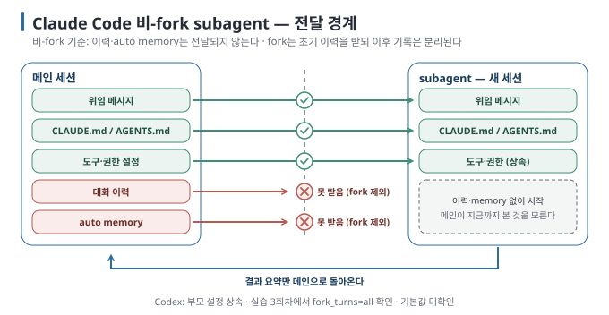

# 03. Subagent 해부 — 무엇을 보고 무엇을 못 보는가

> 이전 ← [`02-layers-of-splitting.md`](02-layers-of-splitting.md) · 다음 → [`04-parallel-and-worktrees.md`](04-parallel-and-worktrees.md)

## 이 장에서 답하는 질문

- subagent는 어디에 어떻게 정의하고, 두 도구에서 무엇이 같고 다른가
- subagent가 시작할 때 받는 것과 받지 못하는 것은 무엇인가
- 위임하면 메인 컨텍스트가 실제로 얼마나 줄어드는가, 언제는 줄지 않는가

## 1. 먼저 한 가지 검토를 맡겨 보기

아래는 실습의 가계부 프로젝트에서 사용할 수 있는 위임 요청입니다. `reviewer` 정의는 바로 아래 표와 예시를 따릅니다.

```text
reviewer subagent 하나에게 src/ledger/parse.py 검토를 맡겨 주세요.
README의 금액 부호 규격과 구현이 일치하는지 확인하고, 파일은 수정하지 마세요.
보고에는 파일·함수·문제가 생기는 입력·기대 결과·실제 동작을 적어 주세요.
메인은 보고를 README와 대조한 뒤 결론을 정리해 주세요.
```

대상, 완료 조건, 금지 범위, 보고 형식이 들어 있어 앞선 대화를 읽지 않아도 과제를 이해할 수 있습니다. subagent를 정의했다고 자동으로 호출되는 것은 아니므로, 처음에는 위임 의도를 명시하고 실제 실행 기록도 확인합니다.

### 정의 파일 — 같은 역할을 다른 형식으로 지정하기

| 항목 | Claude Code | Codex CLI |
| --- | --- | --- |
| 위치 | `.claude/agents/<이름>.md`(프로젝트) · `~/.claude/agents/`(사용자) · `--agents` JSON(세션) | `.codex/agents/<이름>.toml`(프로젝트) · `~/.codex/agents/`(개인) · `config.toml`의 `[agents.<이름>]` |
| 필수 | frontmatter `name`·`description`, 본문 = system prompt | `name`·`description`·`developer_instructions` |
| 도구 제한 | `tools`(허용 목록)·`disallowedTools`. `Agent`를 빼면 subagent가 다시 spawn하지 못한다. `Agent(worker)`처럼 유형을 괄호로 제한하는 문법은 그 정의를 `claude --agent`로 **메인 세션으로** 돌릴 때만 적용되고, subagent 정의에서는 괄호 안이 무시된다 | `sandbox_mode`(read-only·workspace-write) |
| 모델 | `model`(sonnet·opus·haiku·fable·inherit) | `model`·`model_reasoning_effort` |
| 격리 | `isolation: worktree` | 없음 (앱의 worktree는 세션 단위) |
| 내장 | `Explore`(읽기 전용, CLAUDE.md·git status 생략) · `Plan` · `general-purpose` | `default` · `worker` · `explorer`. 같은 이름의 파일이 내장을 덮어쓴다 |
| 켜고 끄기 | `permissions.deny: ["Agent"]`로 전부, `Agent(Explore)`로 하나씩 | `agents.enabled`(기본 true), `features.multi_agent` |

두 형식 모두 이름·용도·작업 지침을 적지만, 권한과 설정을 표현하는 방식은 다릅니다. 아래 두 정의는 같은 검토 역할을 의도한 예시입니다. Claude Code의 `Bash` 허용 목록은 그 자체로 읽기 전용 sandbox가 아니므로 부모 세션의 권한도 함께 확인해야 합니다. `[문서 확인 · 2026-09-06]`

```text
.claude/agents/reviewer.md         .codex/agents/reviewer.toml
---                                name = "reviewer"
name: reviewer                     description = "README 규격 기준으로 …"
description: README 규격 기준으로 … developer_instructions = "당신은 규격 대조 검토자입니다 …"
tools: Read, Grep, Glob, Bash      sandbox_mode = "read-only"
---
당신은 규격 대조 검토자입니다 …
```

## 2. 시작할 때 받는 것과 받지 못하는 것



| 항목 | Claude Code (fork가 아닌 subagent) | Claude Code (fork) | Codex |
| --- | --- | --- | --- |
| 위임 메시지 | 받음 | 받음 | 받음(`spawn_agent` 프롬프트) |
| 대화 이력 | **못 받음** | 전부 받음 | 문서에 명시 없음 → 실습 02에서 실측 |
| `CLAUDE.md` / `AGENTS.md` | 받음 (Explore·Plan은 생략) | 받음 | 받음 |
| auto memory | **못 받음** (subagent 자체 memory는 별도) | 받음 | — |
| 도구·권한 | 정의 파일의 `tools`, 부모 permission mode 상속(부모의 bypass·acceptEdits가 우선) | 부모와 같음 | 부모의 sandbox·approval 상속, `/permissions`·`--yolo` 같은 런타임 변경도 상속 |
| skills | `skills` 필드에 적은 것만 미리 로드 | 부모와 같음 | 부모의 skills 설정 |
| 돌려주는 것 | **결과 요약만** 메인에 돌아옴 | 같음 | 같음. 요청한 subagent가 모두 끝난 뒤 통합 |

[context-engineering 04](../../guides/context-engineering/04-memory.md)가 "서브에이전트는 메인 세션의 memory를 받지 않는다(fork 제외)"라고 적은 것이 이 표의 한 행입니다. 나머지 행은 같은 원리의 확장입니다. **Claude Code의 fork가 아닌 subagent는 새 세션이고, 메인이 지금까지 본 것을 모릅니다.** fork는 전부 물려받고, Codex는 문서에 기본값이 없으며 실측에서는 `fork_turns` 인자로 이력을 넘기는 것이 관측됐습니다. 이 차이가 격리의 이득이자 실패의 원인입니다. `[문서 확인 · 2026-09-06]`

## 3. 한도

| 한도 | Claude Code | Codex |
| --- | --- | --- |
| 중첩 깊이 | 메인 아래 3층(`CLAUDE_CODE_MAX_SUBAGENT_SPAWN_DEPTH`). 한도에서는 `Agent` 도구가 빠진다 | 문서에 명시 없음 |
| 동시 수 | 20(`CLAUDE_CODE_MAX_CONCURRENT_SUBAGENTS`) | `agents.max_concurrent_threads_per_session` |
| 설명 예산 | 사용자 정의 subagent `description` 합계 15,000 토큰 | — |
| 이어 가기 | `SendMessage`로 재개(Explore·Plan은 불가) | `send_input`·`resume_agent` |

한도보다 먼저 만나는 벽은 비용입니다. 다음 절이 그 숫자입니다. `[문서 확인 · 2026-09-06]`

## 4. 위임하면 메인 컨텍스트가 줄어드는가 — 실측

같은 검토 과제(규격 대비 결함 찾기, 파일 5개·결함 3개)를 메인이 직접 하는 경우와 `reviewer` subagent에 위임하는 경우로 두 도구에서 3회씩 돌렸습니다. "메인 컨텍스트"는 메인 세션의 **마지막 API 호출에 실린 입력 토큰**(시스템 프롬프트·지시문·대화 전부)이고, "누적"은 세션이 보낸 입력의 합입니다. 값은 3회 중앙값입니다. `[실행 검증 · 실습 02]`

| 도구 | 구성 | 메인 컨텍스트(끝) | 메인 누적 입력 | 위임 누적 입력 | 벽시계 | 위치 일치/3 |
| --- | --- | --- | --- | --- | --- | --- |
| Claude Code | 직접 | 25,143 | 69,457 | 0 | 17.1초 | 3/3 |
| Claude Code | 위임 | 24,441 (−3%) | 48,022 | 28,757 | 32.6초 | 3/3 |
| Codex | 직접 | 25,291 | 119,121 | 0 | 22.9초 | 3/3 |
| Codex | 위임 | 23,439 (−7%) | 115,646 | 130,481 | 80.1초 | 3/3 |

Codex 직접의 벽시계는 첫 배치 값(19~29초)입니다. 재실행에서는 네트워크 시간 초과가 겹쳐 110초로 부풀었습니다(실습 VALIDATION).

이번 파일 5개 검토에서는 **메인 컨텍스트의 마지막 크기가 3~7% 줄었고, 메인과 위임을 합한 누적 입력은 늘었습니다.** 메인 컨텍스트의 대부분은 시스템 프롬프트·지시문·subagent 왕복이고, 파일 5개는 그 위의 몇천 토큰에 불과했습니다. 벽시계도 Claude Code는 1.9배 늘었습니다. [context-engineering 05](../../guides/context-engineering/05-budget-and-compaction.md)의 "6,100 읽고 420 반환"은 읽을 것이 많을 때의 숫자입니다. 읽기를 맡기고 짧은 결과를 받는 방식은 메인에 남길 기록을 줄일 수 있습니다. 다만 파일 수나 토큰 수만으로 이득을 보장하는 경계값은 이 실험에서 구하지 않았습니다. 나누기 전에 "메인이 직접 읽으면 몇 토큰인가"를 먼저 재는 이유가 이것입니다. `[해석]`

## 5. 위임 프롬프트는 자기완결이어야 한다

Claude Code의 fork가 아닌 subagent는 대화 이력을 못 받으므로 "우리가 확인한 그 결함"은 subagent에게 아무 뜻도 없습니다. Codex는 넘길 수도 있고 안 넘길 수도 있습니다. 실습 02는 메인이 결함을 확인한 뒤 **일부러 그 한 문장만으로** 위임하게 시킵니다. 관측할 것은 둘입니다.

- 메인이 프롬프트를 지시대로 한 문장만 넘기는가, 아니면 알아서 파일·함수 이름을 보태는가 (도구가 이 결핍을 알고 보정하는지)
- subagent가 결국 무엇을 고쳤는가 (맞는 결함 · 다른 결함 · 아무것도)

두 도구가 정반대로 움직였습니다. 3회씩 돌린 결과입니다. `[실행 검증 · 실습 02]`

| 도구 | 메인이 넘긴 프롬프트 | subagent의 반응 | 결과 |
| --- | --- | --- | --- |
| Claude Code (1·2회차) | 지시대로 한 문장 그대로 | "그 결함"이 무엇인지 몰라 추측하지 않고 멈춤. 저장소를 읽고 후보 세 개를 보고하며 되물음 | 아무것도 고치지 않음. 메인이 "subagent는 대화 이력을 받지 않는다"고 원인을 보고 |
| Claude Code (3회차) | 한 문장 그대로 → subagent가 되묻자 메인이 `SendMessage`로 **재개하며** 파일·함수·검사 명령을 보탬 | 두 번째 지시로 고침 | `in_month` 수정·테스트 추가. 재개 후 수정까지 확인 |
| Codex (3회 모두) | `spawn_agent`에 `task_name: fix_month_end`를 붙이고, 3회차는 `fork_turns: "all"`로 대화 이력을 통째로 넘김 | 3회 모두 수정. 이력 전달 인자는 3회차에서 확인 | `in_month` 수정·테스트 추가. 위임 프롬프트 본문은 rollout에 암호화돼 읽을 수 없음 |

Claude Code의 subagent는 모르는 것을 추측하지 않았고, 메인은 그 되물음을 받아 재위임할 수 있었습니다. Codex는 이력을 넘기는 선택지(`fork_turns`)가 있어 결핍이 드러나지 않았지만, 이번 수집 기록에서는 **위임 메시지 본문을 읽을 수 없어 전달 내용을 전부 확인하지 못했습니다.** 같은 결함을 처음부터 **자기완결 프롬프트**(파일·함수·규격·검사 명령·건드리지 말 것)로 위임한 대조군과 비교하면 이렇습니다. 3회 중앙값. `[실행 검증 · 실습 02]`

| 도구 | 위임 프롬프트 | 수정 성공 | 메인 누적 입력 | 위임 누적 입력 | 벽시계 |
| --- | --- | --- | --- | --- | --- |
| Claude Code | 이력 의존 한 문장 | 1/3 (되물음 2회, 재개 후 수정 1회) | 74,234 | 41,143 | 73.8초 |
| Claude Code | 자기완결 | 3/3 | 74,177 | 42,765 | 76.7초 |
| Codex | 이력 의존 한 문장 (3회차 이력 전달 확인) | 3/3 | 249,412 | 136,122 | 123.5초 |
| Codex | 자기완결 | 3/3 | 143,660 (−42%) | 124,967 | 72.9초 (−41%) |

Claude Code에서는 두 조건의 입력량·시간 중앙값이 비슷했지만 수정 성공 횟수는 달랐습니다. 이력 의존 조건에는 미수정 회차가 두 번 포함되므로, 같은 결과를 얻는 데 든 비용이 같다고 해석할 수는 없습니다. Codex에서는 자기완결 요청 조건의 메인 누적 입력과 시간이 약 40% 적었습니다. 다만 두 조건은 프롬프트와 실행 경로도 다르므로 차이를 전부 이력 복제 비용으로 설명할 수는 없습니다. 이번 비교는 명확한 위임 요청이 재질문을 줄이고 실행 효율을 높일 수 있다는 근거로 읽습니다. `[해석]`

두 도구의 공식 안내가 같은 말을 합니다. Claude Code는 "spawn 프롬프트에 작업별 세부를 넣어라. teammate는 lead의 대화 이력을 받지 않는다", Codex는 "bounded work"를 맡기라고 적습니다. 위임 프롬프트에 들어가야 할 최소 네 가지는 [카드](DELEGATION-CARD.md)에 있습니다. `[문서 확인 · 2026-09-06]`

## 이 장을 끝내면

- 두 도구에서 subagent 정의 파일을 쓰고, 내장 유형과 도구 제한을 설명할 수 있습니다.
- Claude Code의 비-fork subagent가 대화 이력과 memory를 받지 않고, Codex는 `fork_turns`로 넘길 수 있다는 차이에서 위임 프롬프트 작성 규칙을 끌어낼 수 있습니다.
- 마지막 컨텍스트 크기와 누적 입력량을 구분하고, 자기 과제에서 위임 효과를 비교할 수 있습니다.
