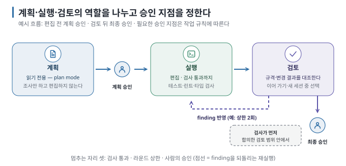

# 05. 계획 → 실행 → 검토 — 검토 기준과 컨텍스트 선택

> 이전 ← [`04-parallel-and-worktrees.md`](04-parallel-and-worktrees.md) · 다음 → [`06-failure-map.md`](06-failure-map.md)

## 이 장에서 답하는 질문

- plan mode는 무엇을 막고 무엇을 허용하며, 계획을 누가 승인하는가
- 같은 세션과 다른 컨텍스트의 검토를 어떻게 비교하는가
- 검토를 subagent에게 맡길 때 "빠짐없이 찾아라"가 왜 위험한가

## 1. 한 바퀴 — 계획, 실행, 검토

[바이브 코딩 가이드 04](../../guides/vibe-coding-practice/04-one-at-a-time.md)의 "한 요청 = 한 가지 변화 = 한 번의 확인"이 코딩 에이전트 안에서는 세 모드로 나뉩니다. 계획에서는 접근과 범위를 정하고, 실행에서는 편집과 검사를 수행하며, 검토에서는 결과를 요구사항과 대조합니다. 검토는 같은 세션에 다시 요청할 수도 있고 별도 컨텍스트에 맡길 수도 있습니다. 세 단계는 작업 역할의 구분이며, 반드시 세 세션으로 나누라는 뜻은 아닙니다. `[원리]`

| 단계 | Claude Code | Codex | 무엇이 나뉘나 |
| --- | --- | --- | --- |
| 계획 | plan mode(`Shift+Tab`, `claude --permission-mode plan`). 읽기 전용, `Explore`·`Plan` subagent로 조사, 계획 파일을 `Ctrl+G`로 편집 후 승인 | plan 먼저 요청("plan before it starts coding"). 질문·컨텍스트 수집 후 계획 | 편집 권한 |
| 실행 | 계획 승인 후 편집. `/goal`·Stop hook으로 검사 통과까지 반복 | 실행. `/compact`로 긴 대화 정리 | — |
| 검토 | 다른 세션(Writer/Reviewer), 검토 subagent, `/code-review` | `codex review`(비대화형 검토 명령), 다른 대화 | 컨텍스트 |

`[문서 확인 · 2026-09-06]`

## 2. 계획을 누가 승인하는가

plan mode는 편집 전에 탐색과 계획을 분리하는 기능입니다. 중요한 변경을 사람이 먼저 확인하려면 계획 승인 지점도 함께 정해야 합니다. 기능 이름만으로 모든 구성에서 사람이 승인한다고 가정해서는 안 됩니다. Claude Code 문서는 "diff를 한 문장으로 설명할 수 있으면 계획을 건너뛰라"고 적고, 계획이 유용한 경우를 접근이 불확실할 때·여러 파일을 바꿀 때·낯선 코드일 때로 한정합니다. 이 판단 자체가 [01장](01-why-split-a-session.md)의 "나누는 쪽이 근거를 댄다"입니다.

한 가지 함정이 있습니다. agent teams에서 teammate가 plan mode로 계획을 만들면 lead 세션이 **사람에게 묻지 않고** 승인합니다. 조정 방식을 바꿀 때 사람의 승인 지점이 자동화로 대체되는지 확인해야 합니다. [바이브 코딩 가이드 05 §3](../../guides/vibe-coding-practice/05-verify-without-reading.md)이 그은 "AI에게 시킬 수 없는 것 — 내가 원한 게 맞는지, 최종 승인" 선은 조정 방식이 바뀌어도 그대로입니다. `[문서 확인 · 2026-09-06]`

## 3. 같은 세션과 새 컨텍스트를 비교한 결과

실습 04는 작성자에게 **규격과 어긋난 지시를** 줍니다. `parse_amount`의 부호 결함을 고치되 "환불은 지출처럼 음수로 저장하라"고 시킵니다(README 규격은 환불·수입 양수). 작성 세션이 자기 변경을 검토한 결과와, 새 컨텍스트가 같은 diff를 README 기준으로 검토한 결과를 비교합니다. 3회. `[실행 검증 · 실습 04]`

| 도구 | 검토자 | README 규격 위반을 잡았나 (3회 중) | 검토 턴 입력 토큰 | 검토 턴 시간 |
| --- | --- | --- | --- | --- |
| Claude Code | 작성 세션 이어 가기(`--continue`) | 3/3 (2회차는 두 지점 지적) | 30,075 (대부분 캐시 읽기) | 6.3초 |
| Claude Code | 새 세션 | 3/3 | 45,350 | 12.2초 |
| Codex | 작성 스레드 이어 가기(`resume`) | 3/3 ("앞선 요청에는 부합하나 README와 충돌") | 54,375 (캐시 4~5만) | 13.1초 |
| Codex | 새 스레드 | 3/3 | 43,479 | 64.9초* |
| 교차 | Claude Code가 쓰고 Codex가 검토 | 3/3 | 46,474 | 16.0초 |
| 교차 | Codex가 쓰고 Claude Code(Opus 5)가 검토 | 3/3 | 115,968 | 30.6초 |

이어 가기 행은 작성 턴을 뺀 **검토 턴만의** 값입니다(작성+검토 합계가 아님). \* Codex 새 스레드의 시간은 프로세스 시작과 모델 목록 갱신 대기를 포함합니다.

예상과 달랐습니다. **작성 세션을 이어 가도 3회 모두 잡았습니다.** "환불은 음수"라는 지시를 컨텍스트에 갖고 있었지만, README 기준으로 검토하라는 요청을 받자 두 도구 모두 지시와 규격의 충돌을 지적했습니다. 단, 작성 단계에서는 어느 쪽도 그 충돌을 먼저 말하지 않았습니다. 시키는 대로 고치고 "테스트 통과"만 보고했습니다. 이번 조건(결함 하나, 3회)에서는 "같은 세션이라서 못 본다"는 차이를 관측하지 못했고, 관측된 것은 **"검토를 요청받기 전에는 말하지 않는다"였습니다**. `[해석]`

토큰과 시간의 결과도 따로 읽어야 합니다. 이어 가기는 대화를 다시 싣지만 그 대부분이 캐시 읽기라, Claude Code는 검토 턴 토큰과 시간이 새 세션의 3분의 2와 절반이었고, Codex는 이어 가기의 시간이 짧았지만 입력 토큰은 새 스레드가 더 적었습니다(54,375 vs 43,479). 캐시와 모델별 단가를 반영한 청구 금액을 비교한 것은 아닙니다. Claude Code 문서의 "fresh context는 방금 쓴 코드에 편향되지 않는다"는 이 실측에서는 위반 발견 횟수의 차이로는 나타나지 않았습니다. 긴 작성 이력이나 불명확한 요구사항에서 새 컨텍스트가 도움이 되는지는 별도 비교가 필요합니다. 이 실험에서 확인한 조건은 아닙니다. 여기서 확인된 규칙은 하나입니다. **어느 세션에 시키든 검토 기준을 지목해서 물어야 한다.** `[해석]`

## 4. "빠짐없이 찾아라"의 비용 — 실측

검토 subagent에게 무엇을 찾으라고 하느냐가 지적의 양을 결정합니다. 같은 코드에 두 프롬프트를 3회씩 줬습니다. `[실행 검증 · 실습 04]`

| 프롬프트 | 도구 | 위치 일치/3 | 골든셋 밖 지적 (3회) | 결함 없는 파일 지적 (3회) | 출력 토큰 | 벽시계 |
| --- | --- | --- | --- | --- | --- | --- |
| "규격과 다른 결함만" | Claude Code | 3/3 | 0·0·0 | 0·0·0 | 722 | 17.1초 |
| "개선이 필요한 모든 지점" | Claude Code | 3/3 | 22·28·22 | 8·9·10 | 3,650 | 68.2초 |
| "규격과 다른 결함만" | Codex | 3/3 | 0·0·0 | 0·0·0 | 604 | 22.9초 |
| "개선이 필요한 모든 지점" | Codex | 3/3 | 21·16·16 | 6·5·5 | 2,297 | 105.8초 |

적중은 같고 골든셋 밖 지적만 늘었습니다. 이 열은 "틀린 지적"이 아니라 **심어 둔 결함 세 개 밖의 지적** 전부입니다. 넓은 프롬프트가 명명·문서화·테스트 부족까지 요청했으니 그런 항목이 나오는 것 자체는 지시대로이고, "테스트가 없다"처럼 틀리지 않은 것도 많습니다. 문제는 결함이 없는 `store.py`·`cli.py`에서도 매 회 5~10건이 나왔고, 채점기는 지적의 타당성을 판정하지 않는다는 점입니다. 모든 지적을 반영하는 실험은 하지 않았으므로 코드 증가량은 알 수 없습니다. 이 비교에서 확인한 것은 넓은 검토 요청이 더 많은 제안을 만들었다는 점입니다. 제안의 타당성과 지금 반영할 필요성은 별도로 판단해야 합니다. `[해석]`

Claude Code 문서는 이렇게 경고합니다. "gap을 찾으라고 한 검토자는 작업이 건전해도 대개 무언가를 보고한다. 모든 finding을 쫓으면 과잉 설계로 간다." [코드 레벨 가이드의 평가 루프](../../labs/when-splitting-fails/03-evaluator-loop.md)가 "문제가 있는가?"라고 물으면 모델은 찾아내는 쪽으로 기운다고 관측한 것과 같은 현상입니다. 검토 프롬프트에는 **무엇이 finding인가를** 적고, 나머지는 선택 사항으로 둡니다. `[해석]`

## 5. 코드로 잴 수 있으면 코드로

검토자의 말보다 먼저 볼 것은 검사의 결과입니다. 두 도구 모두 "검사를 돌리고 통과할 때까지"를 기능으로 지원합니다.

| 방법 | Claude Code | 성격 |
| --- | --- | --- |
| 프롬프트 안에서 | "테스트를 돌리고 실패를 고쳐" | 한 턴 |
| 세션 조건 | `/goal`이 매 턴 뒤 재검사 | 세션 |
| 결정론적 게이트 | Stop hook이 스크립트로 검사, 실패면 턴을 못 끝냄(8회 연속 차단 후 해제) | hook |
| 다른 모델의 반증 | 검토 subagent, dynamic workflow의 상호 검증 | 컨텍스트 분리 |

순서가 중요합니다. 테스트·린트·타입 검사로 확인할 수 있는 것은 먼저 실행합니다. 검토자는 검사 결과를 참고하면서 검사 자체의 누락이나 잘못된 전제도 살펴봅니다. [코드 레벨 가이드 03](../../labs/when-splitting-fails/03-evaluator-loop.md)의 "코드로 잴 수 있으면 코드로"가 여기서는 "검사 통과 → 그다음 검토자"라는 순서가 됩니다. 검토자는 요구사항 누락·범위 이탈·검사하지 않은 경계 조건을 살펴봅니다. 규격 위반 중 재현 가능한 것은 후속 테스트로도 남길 수 있습니다. `[문서 확인 · 2026-09-06]`

## 6. 검토 루프를 멈추는 자리

검토 → 수정 → 재검토는 루프입니다. [코드 레벨 가이드 04](../../guides/agent-orchestration/04-failure-modes.md)가 평가 루프에서 본 수렴 실패(매번 다른 지적, 상한 도달)가 여기서도 생깁니다. 멈추는 자리는 셋입니다.

- **검사 통과** — 테스트·린트가 통과하면 검토자의 스타일 지적은 선택 사항이다.
- **라운드 상한** — 두 라운드에 같은 finding이 남으면 사람이 본다.
- **사람의 승인** — 최종 승인은 [05 §3](../../guides/vibe-coding-practice/05-verify-without-reading.md)의 선대로 사람에게 남는다.

## 이 장을 끝내면

- plan mode가 편집 권한과 사람의 승인을 어떻게 분리하는지, 조정 방식을 바꿀 때 승인이 어디로 가는지 설명할 수 있습니다.
- 작성 세션 이어 가기와 새 컨텍스트 검토를 같은 기준으로 비교하고, 이번 조건에서 확인된 결과와 아직 입증하지 못한 효과를 구분할 수 있습니다.
- 검토 프롬프트에 finding의 정의를 넣고, 코드 검사를 검토자 앞에 두는 순서를 설계할 수 있습니다.
