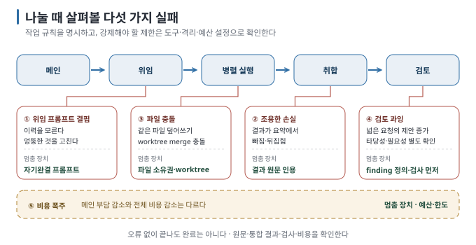

# 06. 실패 지도 — 작업을 맡긴 뒤 생길 수 있는 다섯 가지 문제

> [← 이전: 05. 계획 → 실행 → 검토](05-plan-execute-review.md) · [목차](README.md) · [다음: 07. 작업을 맡길지 결정하기 →](07-when-not-to-split.md)

## 이 장에서 답하는 질문

- 에이전트에게 작업을 맡긴 뒤 어떤 실패가 생길 수 있는가
- 각 실패의 신호를 어디서 읽고, 무엇으로 멈추는가
- subagent에 넘어가지 않는 권한 경계는 무엇인가

## 1. 오류 없이 끝나도 결과는 실패할 수 있다

[코드 레벨 가이드 04](../../guides/agent-orchestration/04-failure-modes.md)의 다섯 실패(오분류 전파·수렴 실패·조용한 손실·비용 폭발·책임 불명)는 전부 "정상 동작처럼 보이는 실패"였습니다. 코딩 에이전트의 작업 분담에서도 이런 실패를 살펴봐야 합니다. 아래 다섯은 이 가이드의 실측과 두 도구의 문서에서 모은 것이고, 일부는 명시적인 오류 없이 끝납니다. merge 충돌이나 테스트 실패처럼 오류로 드러나는 경우도 있습니다. `[해석]`

| # | 실패 | 증상 | 이 가이드의 근거 |
| --- | --- | --- | --- |
| ① | **위임 프롬프트 결핍** | subagent가 엉뚱한 것을 고치거나 "무엇을 하라는지 모르겠다"고 돌아온다. 이력을 넘기는 도구에서도 전달한 내용과 사용량을 확인해야 한다 | [03 §5](03-subagent-anatomy.md) — 비-fork subagent는 대화 이력을 못 받는다 |
| ② | **조용한 손실** | subagent는 맞게 찾았는데 메인의 요약에서 빠지거나 뒤집힌다. 호출 기록이 수집되지 않아 수행 여부를 확인하지 못하는 문제는 아래의 관측 한계로 구분한다 | 코드 레벨 실습의 취합 손실과 연결. 이 실습의 호출 로그 누락은 결과 손실 자체의 증거가 아님 |
| ③ | **파일 충돌** | 두 subagent의 편집 중 하나가 사라지거나, worktree merge에서 충돌 | [04 §4](04-parallel-and-worktrees.md) |
| ④ | **검토 과잉** | 넓은 검토 요청으로 제안이 늘어난다. 전부 반영하면 불필요한 변경이 늘어날 수 있으나, 이 실습은 반영 후 코드 증가량을 측정하지 않음 | [05 §4](05-plan-execute-review.md) |
| ⑤ | **비용 폭주** | 메인 입력 크기는 거의 줄지 않고 전체 입력량은 늘 수 있음. 팀의 약 7배 비용은 별도 문서의 plan mode 조건 | [03 §4](03-subagent-anatomy.md), [02 §4](02-layers-of-splitting.md) |

## 2. 신호는 로그에 있다

| 실패 | 어디서 읽나 | 무엇을 보나 |
| --- | --- | --- |
| ① | 메인이 subagent에 넘긴 프롬프트 원문(Claude Code stream의 `Agent` 도구 입력, Codex는 수집 기록에서 본문이 보이지 않을 수 있음) | 파일·함수·완료 조건이 들어 있는가. 읽을 수 없으면 확인 불가로 기록 |
| ② | subagent의 결과 원문 vs 메인의 최종 답. Claude Code는 `~/.claude/projects/…/subagents/`, Codex는 `parent_thread_id`가 달린 rollout | 결과에 있던 항목이 답에도 있는가 |
| ③ | `git status`·`git diff`, worktree 목록, 테스트 | 두 편집이 모두 살아 있는가 |
| ④ | 검토 지적 목록 vs 미리 정한 결함 목록·규격 | 규격에 없는 지적의 비율. 타당한지는 사람이 판정 |
| ⑤ | Claude Code `usage`(메인)와 `modelUsage`(전체), Codex `turn.completed`와 스레드별 `token_count` | 메인 대비 전체 배수 |

[MCP 가이드 07](../../guides/mcp-basics/07-what-goes-wrong.md)의 "모델의 말은 근거가 아니다 — 로그의 호출 줄을 본다"는 subagent에게 맡긴 작업을 확인할 때도 적용됩니다. 메인이 "subagent가 확인했다"고 말해도, subagent의 transcript가 근거입니다. Codex CLI의 `exec --json` 스트림은 `wait` 호출만 보여 주고 `spawn_agent`를 보여 주지 않았습니다. 스트림에 없다고 안 한 것이 아니고, 세션 rollout을 봐야 했습니다. `[실행 검증 · 2026-09-06]`

## 3. 멈춤 장치

| 실패 | 장치 | 두 도구에서 |
| --- | --- | --- |
| ① | 위임 프롬프트 최소 네 항목(대상·완료 조건·건드리지 말 것·보고 형식) — [카드](DELEGATION-CARD.md) | 프롬프트 규율. 도구가 보정해 주는지는 실습 02 관측 |
| ② | subagent 원문과 메인 결론을 대조한다. 긴 원문은 파일로 보존하고 답에는 근거 위치와 중요한 차이만 적는다 | 결과 확인 절차 |
| ③ | 별도 branch·worktree + 쓰기 범위 분할 + 통합 담당자. 범위를 나누기 어려우면 순차 | Claude Code `isolation: worktree`, Codex `git worktree add` |
| ④ | 보고할 문제의 기준을 요청에 적고, 자동 검사 후 검토를 요청 | `/code-review`도 correctness 위주 |
| ⑤ | 예산: Claude Code `--max-budget-usd`, 동시 수 한도, teammate 수 3~5 | Codex `agents.max_concurrent_threads_per_session` |

위 표의 장치는 강도가 다릅니다. **프롬프트는 행동 지침이고, 도구가 강제하는 권한·한도는 실행 제한입니다.** 결과 대조는 누락을 찾아내는 검사입니다. 셋을 같은 보장으로 취급하면 안 됩니다. [코드 레벨 가이드 실습 03](../../labs/when-splitting-fails/03-evaluator-loop.md)이 "멈춤 장치는 문구가 아니라 예산에 걸어야 한다"고 결론 낸 것과 같은 이유입니다. `[해석]`

## 4. 권한 경계 — 넘어가지 않는 것

작업을 맡은 에이전트가 많아지면 어떤 권한으로 작업하는지 확인하기 어려워질 수 있습니다. 도구가 적용하는 제한과 모델에게 주는 지침을 구분해 봅니다. `[문서 확인 · 2026-09-06]`

| 경계 | Claude Code | Codex |
| --- | --- | --- |
| 권한 상속 | subagent는 정의 파일의 `tools`·`permissionMode`를 갖되, 부모의 bypass·acceptEdits가 더 넓으면 부모가 이긴다. 부모가 auto면 자식도 auto | 부모의 sandbox·approval을 그대로 상속. 자식이 더 넓게 못 간다 |
| 승인 대행 | 다른 세션·teammate가 보낸 메시지는 "다른 세션이 보냄"으로 표시되고 **승인으로 치지 않는다.** 거부된 행동을 다른 agent에게 넘겨 우회할 수 없다 | 비활성 스레드의 승인 요청도 메인 화면에 떠서 사람이 판단 |
| worktree 격리 | 메인 checkout 편집·git 우회를 도구 단계에서 거부 | — |
| 설정 변경 | 수신 메시지로 permission·CLAUDE.md를 바꾸지 않도록 지시 | — |
| 출력 스캔 | subagent 보고에서 도구 태그를 흉내 낸 텍스트를 이스케이프 | — |

[MCP 가이드 05](../../guides/mcp-basics/05-permission-boundaries.md)의 "경계를 한 곳에만 두면 다른 도구로 샌다"는 메인과 subagent의 권한을 확인할 때도 적용됩니다. 검토용 subagent를 읽기 전용으로 만들어도 메인에 쓰기 권한이 있으면 메인은 파일을 수정할 수 있습니다. 경계는 **가장 넓은 권한을 가진 세션** 기준으로 봅니다. `[해석]`

## 5. 로그와 책임은 별도로 남긴다

로그는 누가 무엇을 했는지 확인하는 근거입니다. 그러나 로그가 있다고 해서 누가 결과를 통합하고 최종 승인할지가 정해지지는 않습니다. 위임할 때 담당 범위와 통합 담당자를 정하고, 끝날 때 미완료 항목과 승인 대상을 남깁니다.

수집 도구가 일부 호출을 생략하거나 메시지 본문을 읽을 수 없으면 그 부분은 확인 불가입니다. 로그가 없다는 이유로 작업을 안 했다고 단정하거나, 메인의 완료 보고만으로 수행을 확인하지 않습니다. `[해석]`

## 이 장을 끝내면

- 다섯 실패를 증상으로 알아보고, 각각의 신호를 어느 로그에서 읽는지 말할 수 있습니다.
- 작업 지침, 작업 폴더 격리, 사용량 제한이 각각 어떤 실패에 대비하는지 설명할 수 있습니다.
- subagent에 넘어가지 않는 권한 경계를 두 도구에서 설명하고, 가장 넓은 권한 기준으로 경계를 볼 수 있습니다.

---

> [← 이전: 05. 계획 → 실행 → 검토](05-plan-execute-review.md) · [목차](README.md) · [다음: 07. 작업을 맡길지 결정하기 →](07-when-not-to-split.md)
