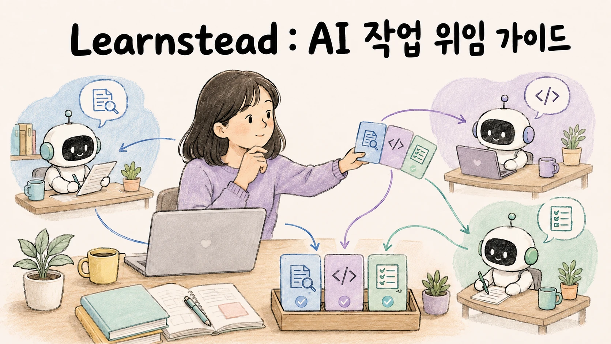

# AI Agent에게 일을 나눠 맡기는 법 — Subagent·병렬·검토 기초

> 조사를 맡겼는데 토큰만 늘고, 병렬로 고친 코드를 합치느라 시간이 더 든 적이 있나요? 이 가이드는 Claude Code와 Codex CLI에서 작은 과제를 직접 처리하거나 나눠 맡긴 결과를 비교합니다. **위임할 일과 직접 할 일을 고르고, 결과를 확인하는 방법**을 익히는 것이 목표입니다. 작업을 맡길 에이전트를 늘리기 전에, 현재 방식의 어떤 문제를 해결하려는지와 실제 효과를 확인합니다.

## 먼저 보는 큰 그림

이 가이드에서 **메인 세션**은 사용자가 요청을 전달하고 최종 결과를 받는 대화입니다. **서브에이전트(subagent)는** 메인이 맡긴 작업을 별도로 수행하고 결과를 돌려주는 에이전트입니다. 각 세션이 작업할 때 참고하는 지시·대화·자료를 **컨텍스트(context)라고** 합니다.

예를 들어 메인은 구현을 진행하고 서브에이전트는 규격을 검토할 수 있습니다. 이렇게 일을 맡길 때는 세 가지를 따로 정합니다.

| 정할 것 | 예시 | 확인할 것 |
| --- | --- | --- |
| 무엇을 맡길까 | `parse.py`의 규격 검토를 subagent 하나에게 맡김 | 대상·완료 조건·보고 형식이 명확한가 |
| 어디에서 일할까 | 읽기만 하면 현재 checkout, 병렬 편집이면 별도 branch·worktree | 쓰기 범위가 겹치지 않는가 |
| 누가 결과를 마무리할까 | 메인이 보고를 대조하고 변경을 통합 | 최종 파일·검사·미완료 항목을 확인했는가 |

처음 읽는다면 **01 → 03 → 04 → 05 → 07** 순서로 읽으세요. 02는 도구별 조정 방식 비교, 06은 문제가 생겼을 때의 진단, 08과 카드는 다시 찾아보는 용도입니다. 정의 파일보다 실제 요청이 궁금하다면 [03장 첫 위임 예시](03-subagent-anatomy.md#1-먼저-한-가지-검토를-맡겨-보기)부터 시작해도 됩니다.

## 학습 달성 목표(Learning Objective)

이 가이드를 끝내면:

- 작업 분담으로 개선하려는 문제를 정하고, 위임·병렬·새 컨텍스트 검토가 적절한지 판단할 수 있습니다.
- Claude Code와 Codex CLI에서 작업을 맡기고 결과를 모으는 기능을 네 가지 조정 방식(subagent·병렬 세션·팀·스크립트)으로 비교하고 worktree와의 관계를 설명할 수 있습니다.
- subagent 정의 파일을 쓰고, Claude Code의 비-fork subagent가 대화 이력과 memory를 받지 않는다는 사실(Codex는 `fork_turns`로 넘길 수 있음)에서 위임 프롬프트 규칙을 끌어낼 수 있습니다.
- 병렬이 실제로 빨랐는지 순차와 대조하고, 같은 파일 과제를 담당 파일 범위와 별도 작업 폴더(worktree)를 정해 다룰 수 있습니다.
- plan mode·Writer/Reviewer·검사 우선 순서로 검토 루프를 구성하고, 결함 검토와 개선 제안을 구분할 수 있습니다.
- 다섯 가지 실패를 실행 기록에서 구분하고, 작업을 분담한 결과를 기존 방식의 측정값(기준선)과 비교해 유지할지 판단할 수 있습니다.

## 누구를 위한 가이드인가

- Claude Code나 Codex CLI로 코딩하면서 subagent·worktree·plan mode를 써 봤거나 써 보라는 권유를 받은 분.
- 하나의 에이전트로 처리하기 어려운 작업을 여러 에이전트에게 맡기려는 분. 실제로 결과가 좋아지는지, 시간과 비용은 얼마나 드는지 확인하고 싶은 분.
- 이미 작업을 분담했는데 토큰 사용량이 늘거나 subagent가 요청과 다른 부분을 고친 분. [06](06-failure-map.md)과 [07](07-when-not-to-split.md)부터 읽어도 됩니다.

필요한 배경은 코딩 에이전트를 써 본 경험과 Git의 branch·worktree 개념입니다. [Agent Skills 가이드](../../guides/agent-skills/README.md) 00장이 Agent 구조를, [Git 가이드 07](../../guides/git-for-vibe-coders/07-worktrees.md)이 worktree를 설명합니다.

## 읽는 순서

| 장 | 파일 | 한 줄 |
| --- | --- | --- |
| 01 | [`01-why-split-a-session.md`](01-why-split-a-session.md) | 작업 분담으로 개선할 문제를 정하고, 컨텍스트·누적 입력·시간·품질을 기록한다 |
| 02 | [`02-layers-of-splitting.md`](02-layers-of-splitting.md) | subagent·세션·팀·스크립트의 조정 방식과 worktree의 관계 |
| 03 | [`03-subagent-anatomy.md`](03-subagent-anatomy.md) | 작은 위임 예시 → 정의 파일·상속 → 위임 효과 측정 |
| 04 | [`04-parallel-and-worktrees.md`](04-parallel-and-worktrees.md) | 동시 실행과 시간 절감의 차이. 작업 폴더 분리와 최종 통합 |
| 05 | [`05-plan-execute-review.md`](05-plan-execute-review.md) | plan mode, 작성자와 검토자 분리, 검사가 먼저, "빠짐없이"의 비용 |
| 06 | [`06-failure-map.md`](06-failure-map.md) | 위임 프롬프트 결핍·조용한 손실·파일 충돌·검토 과잉·비용 폭주와 권한 경계 |
| 07 | [`07-when-not-to-split.md`](07-when-not-to-split.md) | 다섯 질문, 현재 방식을 유지할 신호, 측정 결과, 변경 후 확인표 |
| 08 | [`08-glossary.md`](08-glossary.md) | 용어와 혼동하기 쉬운 쌍 |
| — | [`DELEGATION-CARD.md`](DELEGATION-CARD.md) | 한 장 요약. 위임 프롬프트 네 항목·병렬 전 확인·검토 구성·멈춤 장치 |

## 함께 보는 실습

[나눠 맡기고 확인하기](../../labs/delegate-and-verify/README.md)가 결함 세 개를 심은 가계부 프로젝트를 한 세션·위임·병렬·새 컨텍스트 검토로 두 도구에서 3회씩 돌립니다. 채점기는 메인과 subagent의 토큰 사용량, 실행 시작부터 끝까지 걸린 시간(벽시계 시간), 미리 정한 결함 목록(골든셋)과 일치하는 위치의 지적 수, 그 목록 밖의 지적 수를 기록합니다. 이를 통해 불충분한 위임 요청·같은 파일의 편집 충돌·검토 범위를 넓혔을 때 늘어나는 제안을 살펴봅니다. 이 가이드의 실측 표는 전부 그 실습에서 나왔습니다.

## 가이드 작성 중 직접 확인한 검증 기록

작성 환경: macOS(Apple M4 Pro), Claude Code 2.1.263(claude-fable-5-1, `-p` 비대화형), Codex CLI 0.153.4(계정 기본 모델, `exec`), 2026-09-06. 상세는 [`VALIDATION.md`](VALIDATION.md)와 실습 [`VALIDATION.md`](../../labs/delegate-and-verify/VALIDATION.md).

- 파일 5개 검토를 `reviewer` subagent에 위임해도 메인 컨텍스트 끝 크기는 Claude Code −3%, Codex −7%에 그쳤고, 위임 쪽에 2.9만·13만 입력 토큰이 들었습니다. 결함 위치 일치는 3/3 그대로였습니다. (03 §4)
- "우리가 확인한 그 결함을 고쳐" 한 문장 위임에 Claude Code subagent는 추측하지 않고 되물었고(2회 미수정, 1회는 메인이 재개해 수정), Codex는 3회 모두 수정했고, 3회차에서 `fork_turns`로 대화 이력을 넘긴 기록을 확인했습니다. 위임 메시지 본문은 확인하지 못했습니다. Codex의 위임 프롬프트 본문은 rollout에 암호화돼 읽을 수 없었습니다. (03 §5)
- 독립 과제 셋을 subagent 셋에 동시에 맡기면 순차 대비 Claude Code(Opus 5) 150초 vs 256초, Codex 223초 vs 344초. subagent transcript의 시각으로 실제 겹침을 확인했습니다. (04 §3)
- 같은 함수를 두 subagent가 격리 없이 고쳐도 두 도구 모두 3회 전부 두 기능이 살아남았습니다. `isolation: worktree`로 나누자 결과가 각자의 worktree에 남았고 메인이 합친 것은 3회 중 1회뿐이었습니다. Codex를 worktree 둘로 나누면 merge 충돌 3/3. (04 §4)
- 규격과 어긋난 지시로 고친 diff를 작성 세션 이어 가기·새 세션·다른 도구가 검토했더니 두 도구 모두 전부 규격 위반을 잡았고, 검토 턴 시간은 이어 가기가 짧았습니다. 입력 토큰은 Claude Code에서 이어 가기가, Codex에서 새 세션이 적었습니다. 이번 조건에서는 위반 발견 횟수의 차이가 없었습니다. "모든 gap을 찾아라"는 결함 위치 일치 수를 늘리지 않았고 골든셋 밖 지적을 16~28건 더했습니다. 그 지적이 잘못됐다는 뜻은 아닙니다. (05 §3·§4)

## 검증 표기

| 표기 | 뜻 |
| --- | --- |
| `원리` | 특정 제품 version보다 오래 유지되는 구조·수학·물리 설명 |
| `실행 검증 · YYYY-MM-DD` | 기록한 환경에서 명령과 성공 조건을 실제로 확인함 |
| `부분 검증 · YYYY-MM-DD` | 명시한 단계만 실제로 확인함 |
| `문서 확인 · YYYY-MM-DD` | 공식 문서나 발표를 확인했지만 직접 실행하지는 않음 |
| `자료 확인 · YYYY-MM-DD` | 공개 자료를 확인했지만 1차 출처나 직접 실행으로 확정하지 못함 |
| `미검증` | 아직 직접 확인하지 못함 |
| `해석` | 근거를 바탕으로 저자가 정리한 판단 |

두 도구 모두 이 영역이 릴리스마다 바뀝니다. 도구 사실의 확인일은 2026-09-06이며, 그 뒤 버전에서는 공식 문서를 다시 확인하세요.

## 관련 자료

선행 자료는 필요한 개념만 찾아보면 됩니다. 모두 읽고 와야 하는 필수 과정은 아닙니다.

- [Agent Skills 00](../../guides/agent-skills/00-how-an-agent-works.md): 모델·runtime·도구·harness의 역할
- [Context Engineering 05](../../guides/context-engineering/05-budget-and-compaction.md): 읽기 위임과 컨텍스트 예산
- [Git 가이드 07](../../guides/git-for-vibe-coders/07-worktrees.md): branch·worktree와 통합
- [바이브 코딩 05](../../guides/vibe-coding-practice/05-verify-without-reading.md): 사람이 확인하고 승인할 것
- [여러 AI를 엮어 일하게 하기](../../guides/agent-orchestration/README.md): 내 코드로 여러 모델 호출을 조정하는 짝 가이드

- 출처: [`SOURCES.md`](SOURCES.md) · 변경: [`CHANGELOG.md`](CHANGELOG.md)
- 이 가이드가 다루지 않는 것: agent teams·dynamic workflows·agent view의 실측(위치와 비용 경고만 옮김) · 오케스트레이션 프레임워크 · 여러 사용자를 받는 agent 서비스 · 쓰기 권한 subagent의 자율 커밋·배포 · 코드로 여러 호출을 엮는 패턴(→ [여러 AI를 엮어 일하게 하기](../../guides/agent-orchestration/README.md))
