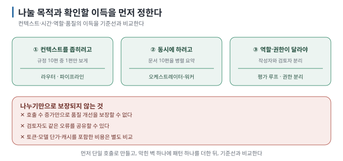

# 01. 왜 하나로는 안 되는가

> [목차](README.md) · [다음: 02. 패턴 지도 →](02-pattern-map.md)

## 이 장에서 답하는 질문

- "AI를 여러 개 붙이면 낫다"는 말에서 진짜 이유는 무엇이고 잘못된 이유는 무엇인가
- 여러 역할이나 처리 단계를 추가해도 해결되지 않는 문제와 추가 비용은 무엇인가
- 작업 분담이 필요한지 어떤 순서로 판단하는가

## 0. 결론 먼저 ★

- 이 가이드에서 작업 분담을 검토하는 **이유는 셋입니다** — ① 각 호출에 필요한 자료만 전달하기 ② 독립적인 작업을 동시에 처리하기 ③ 역할과 권한을 구분하기. `[해석]`
- **결과의 품질을 높이기 위해 작업을 분담할 수도 있습니다.** 다만 같은 모델을 여러 번 호출했다는 사실만으로 개선을 보장할 수는 없습니다. 기준선과 같은 과제로 확인해야 합니다. `[해석]`
- 역할이나 단계를 늘리면 **작업을 배정하고 결과를 전달·확인하는 비용과 실패 가능성도 늘어납니다.** 전체 토큰 사용량과 처리 시간은 구성에 따라 달라지므로, 얻는 효과가 추가 부담보다 큰지 비교해야 합니다. `[해석]`
- 작성 환경에서 같은 질문을 다섯 방식으로 돌린 결과, **단일 호출로 충분했습니다.** 파이프라인만 토큰을 줄였고(508 → 365), 라우터는
  틀렸으며, 워커와 루프는 토큰을 1.5~2배 썼습니다. `[실행 검증 · 2026-08-30]`

## 1. 단일 호출의 한계는 어디서 오나

한 번의 호출에 전부 넣을 때 생길 수 있는 문제 세 가지를 살펴봅니다. `[해석]`

| 한계 | 무슨 일이 일어나나 | 관련 |
| --- | --- | --- |
| **컨텍스트 창** | 모델이 한 번에 읽을 수 있는 입력 한도를 넘으면, 실행 프로그램(runtime)에 따라 앞부분이 잘리거나 오류가 남 | [앱 연결 04 §2](../../guides/local-llm-app-integration/04-parameters-and-context.md) |
| **주의력 분산** | 입력 자료가 많아지면 관련 없는 내용이 답변에 영향을 줄 수 있음 | [RAG 05](../../guides/local-rag/05-chunking-and-retrieval-quality.md)의 잡음과 같은 문제 |
| **역할 혼선** | "요약도 하고 번역도 하고 검토도 해"를 한 번에 시키면 어느 하나가 흐려짐 | — |

이 문제들은 입력을 고르거나 요청을 명확하게 만드는 것만으로 줄어들 수 있습니다. 작업 분담은 해결 방법 중 하나입니다. 프롬프트를 보완한 뒤에도 별도 모델 호출이 필요한지 확인합니다. `[해석]`

## 2. 먼저 살펴볼 이유 셋



| 이유 | 예 | 어떤 패턴 |
| --- | --- | --- |
| **① 컨텍스트를 좁히려고** | 규정 10편 중 질문에 맞는 1편만 보게 | 라우터·파이프라인 ([실습 01](../../labs/when-splitting-fails/01-pipeline-router.md)) |
| **② 동시에 하려고** | 문서 10편을 각각 요약해 합치기 | 오케스트레이터-워커 ([실습 02](../../labs/when-splitting-fails/02-orchestrator-workers.md)) |
| **③ 다른 역할·권한** | 작성자와 검토자를 분리, 읽기 전용 워커와 쓰기 가능 상위 | 평가 루프 ([실습 03](../../labs/when-splitting-fails/03-evaluator-loop.md)) · 권한 분리 |

`[해석]` — 이 셋은 구조를 바꿀 때 확인하기 쉬운 출발점입니다. 서로 다른 풀이·검토 관점으로 품질을 높이려는 경우도 있지만, 이 실습은 그 모든 구성을 비교한 실험이 아닙니다.

## 3. 역할이나 단계를 늘려도 보장되지 않는 것 ★

| 기대 | 현실 |
| --- | --- |
| "여러 개면 더 똑똑해진다" | 여러 풀이를 비교하거나 피드백으로 답을 개선할 수 있지만, 호출 수만으로 품질이 보장되지는 않습니다 `[해석]` |
| "서로 검토하면 정확해진다" | 같은 오류를 공유할 수 있습니다. 작성 환경에서는 안내문 과제의 평가 루프가 **상한까지 수렴하지 않았습니다** ([실습 03 §3](../../labs/when-splitting-fails/03-evaluator-loop.md)) |
| "나누면 빨라진다" | 동시 실행과 짧아진 개별 호출이 시간을 줄일 수 있으나, 대기·취합을 포함해 재야 합니다 |
| "나누면 싸진다" | 입력·출력·캐시·모델 단가에 따라 달라집니다. 이 실습은 같은 모델의 토큰을 비교합니다 ([03](03-context-isolation.md)) |
| "틀리면 다른 agent가 잡아 준다" | 앞이 틀리면 뒤는 **틀린 전제 위에서** 일합니다 ([실습 01 §3](../../labs/when-splitting-fails/01-pipeline-router.md)의 라우터 오분류) |

## 4. 작업을 분담할 때 추가되는 비용

```text
단일:   [모델 1회]                        실패 지점 1개
멀티:   [모델 N회] + [연결 코드] + [로그]   실패 지점 N + 연결부
```

`[해석]` 구체적으로 늘어나는 것:

- **비용·지연:** 호출 수에 비례하지는 않습니다. 단계마다 앞 단계 결과를 다시 넣으면 토큰이 누적됩니다.
- **실패 지점:** 각 단계가 틀릴 수 있고, 단계 사이 전달도 틀릴 수 있습니다.
- **디버깅 난이도:** 어느 단계에서 틀렸는지 **로그가 없으면 알 수 없습니다** ([04 §2](04-failure-modes.md)).
- **판단의 불투명함:** 라우터가 출력한 이유도 검증할 대상입니다. 그 설명만으로 분류가 맞다고 판단할 수 없습니다.

## 5. 그래서 순서는

1. **먼저 단일 호출로 만듭니다.** 이게 기준선이 됩니다.
2. **현재 방식이 부족한 이유를 확인합니다** (§1의 입력 한도·관련 없는 정보·역할 혼선 등).
3. **그 문제를 해결할 패턴 하나만** 추가합니다 ([02](02-pattern-map.md)).
4. **기준선과 비교합니다** — 토큰·시간·정확도. 나아지지 않았으면 되돌립니다.

이 순서는 작업 분담을 선택한 이유와 실제 효과가 일치하는지 확인하기 위한 절차입니다. `[해석]`


## 이 장을 끝내면

- 작업 분담으로 기대하는 효과(입력량·시간·역할 구분·품질)와 이를 확인할 지표를 연결할 수 있습니다.
- 역할이나 단계를 늘려도 보장되지 않는 효과와 추가로 드는 비용을 구분할 수 있습니다.
- 한 번의 호출로 구현한 뒤 한계를 확인하고, 패턴 하나를 추가해 기존 측정값과 비교하는 순서를 지킬 수 있습니다.

---

> [목차](README.md) · [다음: 02. 패턴 지도 →](02-pattern-map.md)
