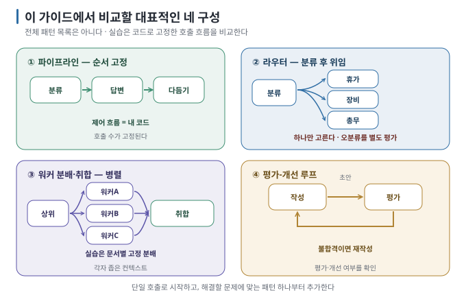

# 02. 패턴 지도 — 대표적인 네 구성

> 이전 ← [`01-why-more-than-one.md`](01-why-more-than-one.md) · 다음 → [`03-context-isolation.md`](03-context-isolation.md)

## 이 장에서 답하는 질문

- 이 가이드에서 다룰 구성은 무엇이고, 무엇이 워크플로이며 무엇이 agent인가
- 내 작업의 처리 절차와 역할에 어떤 패턴이 맞는가
- 프레임워크는 언제 필요한가

## 0. 결론 먼저 ★

- 여기서 다룰 네 구성 — **파이프라인 · 라우터 · 오케스트레이터-워커 · 평가-개선 루프.** `[자료 확인 · 2026-08-23]`
- 실습의 네 구성은 모두 **코드가 제어 흐름을 정하는 워크플로입니다.** 모델이 분류·평가를 맡는 것과 전체 행동 경로를 스스로 정하는 것은 구분합니다. `[코드 확인 · 2026-09-07]`
- 먼저 **어떻게 처리해야 하는 작업인지** 확인합니다. 정해진 순서를 따라야 하면 파이프라인, 담당 분야를 선택해야 하면 라우터, 독립적인 대상을 동시에 처리하려면 워커, 평가 결과를 받아 수정하려면 평가-개선 루프를 검토합니다. `[해석]`
- 실제 시스템에서는 라우터 뒤에 파이프라인을 연결하는 등 여러 패턴을 함께 사용하기도 합니다. 처음에는 한 패턴부터 적용하고 효과를 확인하세요. `[해석]`

## 1. 한 장으로



## 2. 네 패턴 비교

| | 파이프라인 | 라우터 | 오케스트레이터-워커 | 평가-개선 루프 |
| --- | --- | --- | --- | --- |
| **모양** | 순서 고정 A→B→C | 분류 후 한 곳으로 | 여러 워커에게 배정한 뒤 결과 취합 | 작성↔평가 반복 |
| **제어 흐름** | 내 코드 | 내 코드(+모델 판단 1회) | 내 코드(작업 배정·결과 취합) | 조건부 반복 |
| **호출 수** | 단계 수만큼 (고정) | 2회 (분류+담당) | 워커 수 + 1 | 2~2N+1회 (가변, N=상한) |
| **병렬** | 불가 | 불가 | **가능** | 불가 |
| **쓰는 곳** | 절차가 정해진 처리 | 분야가 갈리는 문의 | 여러 대상 동시 처리 | 품질 기준이 명확한 산출물 |
| **실패 모드** | 앞 단계 오류가 전파 | **오분류** | 취합에서 정보 손실 | **수렴 실패** |
| **작성 환경 결과** | 토큰 감소(365), 정답 | **8문항 중 4개 오분류** | 토큰 1.5배, 취합이 내용을 바꿈, 병렬 효과 없음 | 객관적 기준 1회 통과 / 주관적 과제 **상한 도달, 토큰 8.5배** |

`[실행 검증 · 2026-08-30]` — 마지막 줄은 [실습 01](../../labs/when-splitting-fails/01-pipeline-router.md)·[02](../../labs/when-splitting-fails/02-orchestrator-workers.md)·[03](../../labs/when-splitting-fails/03-evaluator-loop.md)에서
실제로 돌린 결과입니다. 9월 6일 병렬 재측정에서는 서버 동시 처리 설정 후 시간 이득을 관측했습니다(실습 02 §3).

이 네 구성은 전체 패턴 목록이 아닙니다. 특히 `workers`는 문서별 과제를 미리 정해 여러 워커에게 배정하고 결과를 모으는 방식(fan-out/fan-in)입니다. 모델이 하위 과제를 동적으로 정하는 오케스트레이터-워커와 형태는 비슷하지만 작업 분해 방식이 다릅니다. [출처](SOURCES.md)의 2026-09-07 재확인 범위를 참고하세요.

## 3. 각 패턴 한 문단씩

### 파이프라인 (pipeline / chain)

단계 순서를 **내가** 정하고 각 단계가 모델 호출 하나입니다. 앞 단계의 출력이 뒤 단계의 입력이 됩니다. 예측 가능하고
디버깅이 쉽습니다. **단계마다 문맥을 좁힐 수 있다면** 토큰이 오히려 줄어듭니다. `[원리]`

> 쓰지 말아야 할 때: 단계가 사실상 하나거나, 한 번의 프롬프트로 같은 결과가 나올 때.

### 라우터 (router)

들어온 요청을 **분류해서** 담당에게 넘깁니다. 담당은 자기 분야 문맥만 봅니다. 분야가 뚜렷하게 갈리고 각 분야의 자료가
많을 때 값어치가 큽니다. `[원리]`

> **이 실습에서 반복된 실패는 오분류입니다.** 잘못 선택된 담당이 "모르겠다"고 답하면 분류 오류가 눈에 잘 띄지 않을 수 있습니다. 작성 환경에서 오분류가 반복 재현됐습니다([실습 01 §3](../../labs/when-splitting-fails/01-pipeline-router.md)).

### 오케스트레이터-워커 (orchestrator-workers / subagents)

작업을 조정하는 오케스트레이터가 하위 과제를 워커에게 배정하고, 각 워커의 결과를 취합합니다. 실습에서는 문서 하나당 워커 하나를 코드가 정하며, 각 워커에 필요한 문서만 전달합니다([03](03-context-isolation.md)). 컨텍스트를 좁히는 것은 설계 선택이고, subagent라는 이름만으로 보장되지는 않습니다. `[코드 확인 · 2026-09-07]` 용어의 정의는 [Agent Skills 가이드 용어집](../../guides/agent-skills/09-glossary.md)을, 도구 안에서 나눠 맡기는 법은 [짝이 되는 가이드](../../guides/agent-delegation/README.md)를 보세요.

> 쓰지 말아야 할 때: 한 워커가 작업을 끝내려면 다른 워커의 진행 상황이나 결과를 알아야 할 때. 이 실습의 워커는 서로 정보를 주고받지 않습니다.

### 평가-개선 루프 (evaluator-optimizer)

작성자가 만들고 평가자가 검사해서, 통과할 때까지(또는 상한까지) 반복합니다. **평가 기준이 명확하고 피드백이 유용할 때** 개선을 기대할 수 있습니다. 기준이 있다는 것만으로 수렴이 보장되지는 않습니다. `[해석]`

> 기준이 모호하면 평가가 일관되지 않을 수 있습니다. 작성 환경에서는 안내문 과제가 상한까지 수렴하지 않았습니다([실습 03 §3](../../labs/when-splitting-fails/03-evaluator-loop.md)).

## 4. 여러 패턴을 함께 사용하기

실제 시스템은 이렇게 생깁니다. `[해석]`

```text
[문의] ─▶ 라우터 ─▶ (분야별) 파이프라인 ─▶ 초안 ─▶ 평가 루프 1회 ─▶ 답
```

다만 **처음부터 이렇게 만들지 마세요.** 먼저 한 번의 호출로 구현하고, 해결할 문제에 맞는 패턴 하나를 추가한 뒤 결과를 측정합니다. 추가 개선이 필요하면 같은 과정을 반복합니다([01 §5](01-why-more-than-one.md)).

## 5. 프레임워크는?

LangGraph·CrewAI·Microsoft Agent Framework·OpenAI Agents SDK 같은 도구가 이 패턴들을 부품으로 제공합니다. 다만 핵심 호출 흐름은 짧은 코드로도 표현할 수 있습니다. 입력 검증·실패 처리·통계·중단 조건을 갖추는 코드는 별도로 필요합니다. 이 가이드의 실습은 전부 `openai` SDK만 씁니다. `[해석]`

`[자료 확인 · 2026-08-30]` — 2026년 기준 여러 프레임워크가 subagent·handoff·router를 직접 구성할 수 있는 기능을 제공하지만, 이름과 API가
빠르게 바뀝니다. 한때 대표 예시였던 AutoGen은 Microsoft Agent Framework로, OpenAI Swarm은 Agents SDK로 대체됐습니다 — 이름을 외우지 마세요. 각 패턴의 역할과 실행 흐름을 이해하면 다른 도구에서도 대응하는 기능을 찾기 쉽습니다.


## 이 장을 끝내면

- 파이프라인·라우터·오케스트레이터-워커·평가 루프를 그림과 제어 흐름으로 구분할 수 있습니다.
- 처리 순서·담당 분야·동시 실행·평가 필요성에 따라 패턴을 고르고, 처음부터 여러 패턴을 함께 적용하지 않는 이유를 설명할 수 있습니다.
- 프레임워크가 대신해 주는 것과 실습 코드가 직접 처리하는 것을 가릴 수 있습니다.
