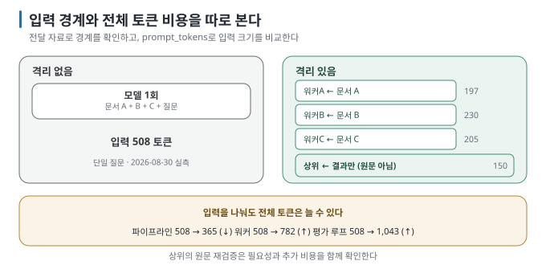

# 03. 컨텍스트 격리가 핵심이다

> 이전 ← [`02-pattern-map.md`](02-pattern-map.md) · 다음 → [`04-failure-modes.md`](04-failure-modes.md)

## 이 장에서 답하는 질문

- 하위 작업마다 입력 자료를 제한하는 이유는 무엇이고, 그 효과를 어떻게 확인하는가
- 격리가 되는 구성과 안 되는 구성은 어떻게 다른가
- 컨텍스트를 줄이는 방법 세 가지는 무엇인가

## 0. 결론 먼저 ★

- 이 장에서 살펴볼 설계는 **컨텍스트 격리** — 각 호출이 볼 정보를 따로 정하는 것입니다. `[해석]`
- **컨텍스트 격리와 토큰 절감은 다릅니다.** 워커마다 필요한 자료만 전달하더라도, 작업 지시와 결과 취합에 토큰을 사용하므로 전체 사용량은 늘 수 있습니다. `[해석]`
- 작성 환경에서 파이프라인은 입력 토큰을 508 → **365로** 줄였고(문서 1편만 봄), 워커 구성은 508 → **782로** 늘렸습니다
  (워커 셋이 각자 보고 취합까지 함). `[실행 검증 · 2026-08-30]`
- **전달 입력과 사용량을 함께 확인합니다.** 각 호출이 어떤 자료를 받았는지는 코드·입력 기록으로, 비용은 입력·출력 토큰으로 봅니다. `[해석]`
- 코딩 에이전트에서는 같은 원리가 subagent 위임으로 나타납니다. [Context Engineering 05](../../guides/context-engineering/05-budget-and-compaction.md)의 "6,100 읽고 420 반환"이 그 숫자이고, [나눠 맡기는 법 03](../../guides/agent-delegation/03-subagent-anatomy.md)이 작은 과제에서 메인 컨텍스트 감소와 추가 위임 비용을 따로 잽니다. 이 장은 코드 레벨에서 같은 원리를 확인합니다. `[해석]`

## 1. 격리란 무엇인가



```text
격리 없음:  [모델] ← 문서 A + 문서 B + 문서 C + 지금까지의 대화 전부
격리 있음:  [워커A] ← 문서 A          [워커B] ← 문서 B          [워커C] ← 문서 C
            [상위] ← 세 워커의 "결과"만 (문서 원문은 안 봄)
```

`[해석]` 결과만 전달하면 상위가 원문 전체를 다시 읽는 양을 줄일 수 있습니다. 검증을 위해 필요한 원문 일부를 다시 읽는 설계도 가능합니다. 이 경우에도 워커의 입력 경계는 유지되며, 상위의 추가 입력 비용을 따로 셉니다.

> **초심자용 한 줄:** 팀장이 팀원 셋에게 각각 다른 자료를 주고 "요약만 가져와"라고 하는 것입니다. 팀장이 검증할 부분을 원본에서 다시 읽으면 그 시간과 비용도 포함해 비교합니다.

## 2. 숫자로 확인하기

작성 환경에서 같은 질문("관리자는 연차를 며칠까지 이월할 수 있나요?")을 다섯 방식으로 돌린 결과입니다. `[실행 검증 · 2026-08-30]`

| 방식 | 호출 | **입력 토큰** | 출력 토큰 | 시간 | 결과 |
| --- | --- | --- | --- | --- | --- |
| 단일 | 1 | 508 | 19 | 0.6초 | 정답 |
| 파이프라인 | 3 | **365** ↓ | 29 | 1.1초 | 정답 |
| 라우터 | 2 | **268** ↓ | 33 | 1.2초 | **틀림** (오분류 → "찾지 못했습니다") |
| 오케스트레이터-워커 | 4 | **782** ↑ | 150 | 3.7초 | 정답에 "규정 없음" 혼재 |
| 평가 루프 | 2 | **1,043** ↑ | 45 | 2.3초 | 정답 |

**읽는 법** `[해석]`:

- **파이프라인·라우터가 입력을 줄인 이유:** 분류 단계가 "볼 문서 하나"를 골라 줘서, 답변 단계가 문서 1편만 봤습니다. 라우터는
  줄이는 데 성공했지만 **엉뚱한 문서 하나를** 골랐습니다 — 격리와 정확도는 별개입니다([실습 01 §3](../../labs/when-splitting-fails/01-pipeline-router.md)).
- **워커 구성의 입력 토큰이 늘어난 이유:** 워커 셋이 각자 문서를 보고(3×), 상위가 결과 셋을 다시 봤습니다(+1).
- **평가 루프의 입력 토큰이 늘어난 이유:** 평가자가 문서 전체 + 초안을 봐야 해서, 한 라운드에 문서를 두 번 읽는 셈이 됐습니다.
- **호출 수와 토큰은 따로 움직입니다.** 호출 3회짜리가 1회짜리보다 쌀 수 있습니다.

## 3. 격리가 되는 구성 / 안 되는 구성

| 구성 | 입력 경계 | 비용에서 볼 것 |
| --- | --- | --- |
| 라우터 → 담당(자기 문서만) | 담당별 문서 제한 | 분류·폴백까지 포함한 합계 |
| 파이프라인(단계마다 좁힘) | 단계별 필요한 자료 | 앞 단계 출력의 반복 입력 |
| 워커 → 상위가 결과만 취합 | 워커별 문서와 상위 결과 분리 | 워커 전체 + 취합 호출 |
| 워커 → 상위가 원문도 검증 | 워커 경계 유지, 상위 입력 확대 | 추가 검증 비용과 품질 이득 |
| 모든 단계에 같은 기록 전달 | 입력 범위를 좁히지 않음 | 중복 입력량과 역할 분리의 이득 |
| 평가자가 전체 문맥을 읽음 | 별도 평가 호출에 같은 근거 전달 | 라운드별 입력·출력과 개선 정도 |

`[해석]` — 호출을 별도로 실행했는지, 각 호출에 어떤 정보를 전달했는지, 전체 비용이 얼마나 들었는지를 따로 확인합니다.

## 4. 줄이는 세 가지 방법

1. **입력을 고르기** — 분류·검색으로 "볼 것"을 먼저 좁힙니다(라우터·[RAG 가이드](../../guides/local-rag/README.md)).
2. **요약 결과 전달하기** — 워커가 원문을 읽고, 결과를 취합하는 쪽에는 **요약된 결과만** 전달합니다.
3. **필요한 기록만 전달하기** — 단계 사이에 대화 기록 전체를 넘기지 않습니다. 필요한 값만 넘깁니다
   ([앱 연결 04 §4](../../guides/local-llm-app-integration/04-parameters-and-context.md)).

> 🔧 **한 단계 더 — 무엇을 넘길지 스키마로 고정**
>
> 단계 사이를 자유 텍스트로 넘기면 앞 단계가 장황해질수록 뒤 단계의 입력이 커집니다. 구조화 출력으로
> `{topic, key_facts[], confidence}` 같은 **작은 스키마를** 정하면 전달 형식을 관리하기 쉽습니다. 필드 길이와 실제 출력 크기는 별도로 확인합니다
> ([앱 연결 05](../../guides/local-llm-app-integration/05-structured-output.md)). 실습의 라우터가 이 방식입니다.

## 5. 내 구성 점검하기

- [ ] 각 호출의 `prompt_tokens`를 로그로 찍고 있다
- [ ] 단일 호출로 만든 **기준선 숫자가** 있다
- [ ] 역할별로 입력 자료를 제한한 뒤, 전체 입력 토큰이 기존 방식보다 줄었는지 확인했다
- [ ] 상위가 다시 읽는 원문이 있다면 검증 목적과 비용을 확인했다
- [ ] 단계 사이에 넘기는 것이 "전부"가 아니라 "필요한 것"이다

**합계가 늘어도 각 호출의 입력은 좁아질 수 있습니다.** 개별 컨텍스트 제한을 해결했는지, 품질·시간 이득이 추가 비용에 맞는지 비교합니다([05](05-when-not-to.md)).


## 이 장을 끝내면

- 각 호출의 전달 입력으로 컨텍스트 경계를 확인하고 토큰 비용을 별도로 비교할 수 있습니다.
- 상위의 원문 재검증이 워커 입력 경계와 전체 비용에 어떤 영향을 주는지 설명할 수 있습니다.
- 입력 자료 선택·요약 결과 전달·필요한 기록만 전달하는 방법을 적용하고 토큰 절감 효과를 확인할 수 있습니다.
