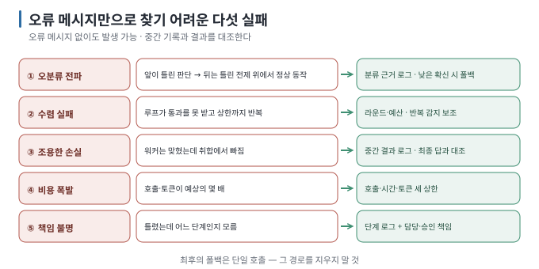

# 04. 실패 모드와 멈추는 법

> 이전 ← [`03-context-isolation.md`](03-context-isolation.md) · 다음 → [`05-when-not-to.md`](05-when-not-to.md)

## 이 장에서 답하는 질문

- 여러 역할과 단계를 연결했을 때의 실패 다섯 가지는 무엇이고 왜 오류 메시지만으로 알아보기 어려운가
- 최소한 남겨야 할 로그와 세 종류의 상한은 무엇인가
- 폴백과 사람이 개입할 지점은 어디에 두는가

## 0. 결론 먼저 ★

- 다섯 가지 — **오분류 전파 · 수렴 실패 · 조용한 손실 · 비용 폭발 · 책임 불명.** `[해석]`
- 오류 메시지 없이도 일어날 수 있습니다. **중간 기록과 결과를 대조해야 합니다.** `[해석]`
- 실패에 대비하려면 **실행 상한(횟수·시간·토큰), 대체 처리 경로(폴백), 단계별 로그**가 필요합니다. 상한은 실행을 멈추고, 폴백은 다른 경로로 처리하며, 로그는 실패 원인을 확인하는 데 씁니다. `[해석]`
- 실습에서 실제로 관측한 것은 **오분류 전파**(실습 01), **조용한 손실**(실습 02 — 취합이 워커의 답을 뒤집음), **수렴 실패와**
  **비용 폭발**(실습 03 — 8.5배)입니다. 로그로 실패 단계를 찾았지만, 운영상 책임 배분은 이 실습에서 검증하지 않았습니다. `[실행 검증 · 2026-08-30]`

## 1. 다섯 가지 실패 모드



| 실패 | 증상 | 예외가 나나 | 멈춤 장치 |
| --- | --- | --- | --- |
| **① 오분류 전파** | 앞 단계가 틀린 판단 → 뒤는 틀린 전제 위에서 정상 동작 | ✗ | 분류 근거 로그 · 낮은 확신 시 폴백 |
| **② 수렴 실패** | 루프가 통과를 못 받고 상한까지 반복 | ✗ | 횟수 상한 · **토큰 예산** (지적 문구 비교는 실습에서 발동하지 않음) |
| **③ 조용한 손실** | 워커는 맞혔는데 취합에서 빠지거나 뒤집힘 | ✗ | 중간 결과 로그 · 최종 답과 대조 |
| **④ 비용 폭발** | 호출·토큰이 예상의 몇 배 | ✗ | 요청당 토큰·호출 예산 |
| **⑤ 책임 불명** | 틀렸는데 어느 단계인지 모름 | ✗ | 단계별 로그 + 담당자·승인 책임 명시 |

`[해석]` — 표의 "✗"는 오류 메시지 없이도 생길 수 있다는 뜻입니다. 해당 문제가 항상 예외 없이 끝난다는 뜻은 아닙니다.

코딩 에이전트의 subagent·worktree·검토 루프에서 같은 실패가 어떤 모양으로 나타나는지는 [나눠 맡기는 법 06](../../guides/agent-delegation/06-failure-map.md)이 이 표를 이어받아 다룹니다.

## 2. 최소한의 로그 — 이것만은

각 단계마다 다섯 가지를 남깁니다. 실습 코드의 `ask()`가 하는 일이 이것입니다. `[해석]`

```text
[단계 이름] 소요시간 · 입력토큰→출력토큰 · 출력 앞부분
```

| 항목 | 왜 |
| --- | --- |
| 단계 이름 | ⑤ 어느 단계인지 |
| 입력 토큰 | ④ 예산 감시, [03](03-context-isolation.md)의 격리 확인 |
| 출력 토큰 | ④ 비용 |
| 소요 시간 | 병렬이 실제로 되는지 |
| 출력 앞부분 | ①③ 중간 판단이 맞는지 눈으로 |

**추가로 남기면 좋은 것:** 분류 결과의 `reason`(①), 루프 라운드 번호와 지적 내용(②), 워커별 결과 전문(③).

> 실습 코드는 `--quiet` 없이 실행하면 이 로그가 전부 나옵니다. [실습 01 §3](../../labs/when-splitting-fails/01-pipeline-router.md)의 오분류를 발견한 것도 `reason` 로그 덕분이었습니다.

## 3. 상한 — 세 종류

상한을 agent 루프 코드에 넣는 방법 자체는 [앱 연결 06](../../guides/local-llm-app-integration/06-tool-calling-workflow-agent.md)의 최소 루프와 [앱 연결 10 §5](../../guides/local-llm-app-integration/10-reliability-and-operations.md)의 운영 수칙에 있습니다. 여기서는 여러 호출을 연결한 구성에서 각 상한이 어떤 위험을 제한하는지만 봅니다.

```python
MAX_ROUNDS = 3         # 평가 라운드 수 (실습: --rounds, 호출은 최대 2N+1회)
MAX_SECONDS = 60       # 벽시계 시간    (실습에는 없음 — 직접 넣어 보세요)
MAX_TOKENS = 20000     # 누적 토큰      (실습: --budget-tokens)
```

`[해석]` 상한을 하나만 두면 다른 종류의 부담을 제한하지 못할 수 있습니다.

- **횟수만** 두면: 각 호출이 거대해질 수 있음
- **토큰만** 두면: 느린 호출이 쌓여 사용자가 기다림
- **시간만** 두면: 병렬이면 빨리 끝나면서 비용은 큼

**상한에 닿았을 때 무엇을 반환할지를** 반드시 정합니다 — 마지막 초안? 오류? 부분 결과? 실습의 라운드 상한은 마지막 초안과 안내를 반환합니다. 토큰 예산 중단은 중단 안내와 현재까지의 사용량을 출력하고 종료 코드 1을 냅니다.

`--budget-tokens`는 응답에 보고된 사용량으로 다음 호출을 막습니다. 한 호출 또는 이미 진행 중인 병렬 호출이 기준을 넘을 수 있어 엄격한 총량 상한은 아닙니다. 사용량이 누락되면 예산 활성화 상태에서는 중단합니다.

## 4. 폴백 — 되돌아갈 길

아래 표는 설계 선택지입니다. 실습은 워커 일부 실패를 무시하고 취합하는 경로를 구현하지 않습니다.

| 실패 지점 | 폴백 |
| --- | --- |
| 라우터가 엉뚱한 곳으로 | 담당이 "모른다"고 하면 **전체 문맥으로 한 번 더** |
| 워커 하나가 예외 | 그 워커만 "실패"로 표시하고 나머지로 취합 |
| 루프가 상한 도달 | 첫 초안과 마지막 초안 중 **첫 초안을** 낼 수도 있음 |
| 구조화 출력 파싱 실패 | **통과로 치지 않는다.** 경고를 내고 멈추거나 1회 재시도 (실습 코드가 이 방식) |
| 전체가 이상함 | **단일 호출로 되돌아가기** — 가장 확실한 폴백 |

마지막 줄이 중요합니다. **단일 호출 경로를 지우지 마세요.** 비교 기준선이자 최후의 폴백입니다. `[해석]`

## 5. 사람이 개입할 지점

여러 역할과 단계를 연결한 구성에서 사람이 확인해야 할 주요 지점은 셋입니다. `[해석]`

1. **분기 판단** — 라우터가 고른 분야가 맞는지 (신뢰도가 낮을 때만 물어도 됨)
2. **상한 도달** — 상한에 도달해 중단했음을 알리고 미완료 부분을 표시
3. **쓰기·전송 직전** — 도구가 파일을 수정하거나 외부로 내용을 전송하기 전 ([앱 연결 06 §3](../../guides/local-llm-app-integration/06-tool-calling-workflow-agent.md))

## 6. 이 문서의 점검표

- [ ] 단계마다 이름·토큰·시간·출력 앞부분을 로그로 남긴다
- [ ] 호출 수·시간·토큰 세 상한이 다 있다
- [ ] 상한 도달 시 무엇을 반환할지 정했다
- [ ] 단일 호출 폴백 경로가 살아 있다
- [ ] 사람이 개입할 세 지점을 정했다


## 이 장을 끝내면

- 오분류 전파·수렴 실패·조용한 손실·비용 폭발·책임 불명을 증상으로 알아볼 수 있습니다.
- 단계별 로그와 호출·시간·토큰 상한, 단일 호출 폴백을 구성에 붙일 수 있습니다.
- 분기 판단·상한 도달·쓰기 직전이라는 세 개입 지점을 설계할 수 있습니다.
