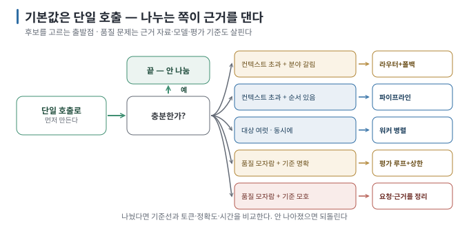
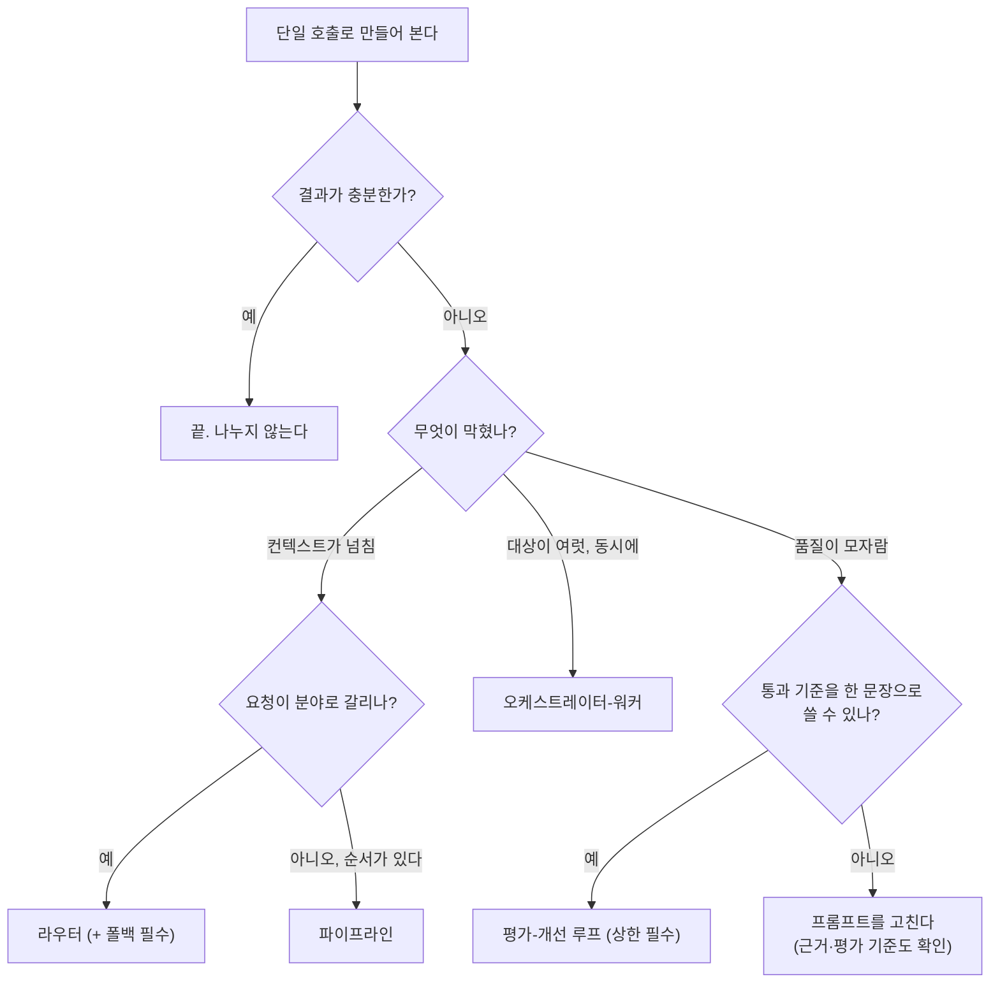

# 05. 언제 멀티가 아닌가 — 선택 규칙

> 이전 ← [`04-failure-modes.md`](04-failure-modes.md) · 다음 → [`06-glossary.md`](06-glossary.md)

## 이 장에서 답하는 질문

- 나눌지 말지를 어떤 다섯 질문으로 결정하는가
- 나누지 말아야 한다는 신호는 무엇인가
- 나눈 뒤 무엇을 확인해야 되돌릴지 알 수 있는가

## 0. 결론 먼저 ★

- **기본값은 단일 호출입니다.** 나누는 쪽이 근거를 대야 합니다. `[해석]`
- 먼저 확인할 구조적 필요는 — 컨텍스트가 넘침 · 동시에 해야 함 · 권한/역할이 달라야 함 ([01 §2](01-why-more-than-one.md)).
- 작성 환경 실측: 단일로 충분했고, 나눈 구성 중 **라우터는 틀렸고, 워커는 없는 말을 섞었고, 루프는 주관적 과제에서 수렴하지 못했습니다.**
  토큰을 줄인 것은 파이프라인뿐입니다. `[실행 검증 · 2026-08-30]`
- 나눴다면 **기준선과 비교해서** 나아졌는지 확인합니다. 안 나아졌으면 되돌립니다. `[해석]`

## 1. 다섯 질문





`[해석]` — 마지막 갈래가 중요합니다. 품질이 부족하면 프롬프트뿐 아니라 근거 자료·모델·평가 기준도 확인합니다. 이 실습의 수렴 실패만으로 모든 품질 문제의 원인을 정할 수는 없습니다([실습 03 §3](../../labs/when-splitting-fails/03-evaluator-loop.md)).

## 2. 나누지 말아야 할 신호

| 신호 | 왜 |
| --- | --- |
| "여러 개면 더 똑똑할 것 같아서" | 개선할 항목과 측정 방법이 아직 없습니다 ([01 §3](01-why-more-than-one.md)) |
| 단계가 사실상 하나 | 프롬프트 한 줄로 합칠 수 있음 |
| 각 단계가 **같은 문맥 전체를** 봄 | 입력을 좁히는 이득은 적음. 검토·역할 분리의 가치는 별도 확인 ([03](03-context-isolation.md)) |
| 통과 기준을 말로 못 함 | 개선 여부를 판단하기 어려움 |
| 분야 경계가 흐림 | 오분류 위험을 확인해야 함 ([실습 01 §3](../../labs/when-splitting-fails/01-pipeline-router.md)) |
| 측정할 기준선이 없음 | 나아졌는지 알 수 없음 |

## 3. 실측 종합표

같은 질문("관리자는 연차를 며칠까지 이월할 수 있나요?"), 같은 모델(`gemma3:4b`), 같은 문서 3편. 루프 행만 두 과제(사실 질문 / 안내문
작성)의 범위입니다. `[실행 검증 · 2026-08-30]`

| 방식 | 호출 | 입력 토큰 | 출력 토큰 | 시간 | 정확도 | 비고 |
| --- | --- | --- | --- | --- | --- | --- |
| **단일** | 1 | 508 | 19 | 0.6초 | ✅ | 기준선 |
| 파이프라인 | 3 | **365** | 29 | 1.1초 | ✅ | 토큰이 오히려 감소 |
| 라우터 | 2 | **268** | 33 | 1.2초 | ❌ | 오분류 → "찾지 못했습니다". 8문항 정확도 0.50 |
| 워커 | 4 | 782 | 150 | 3.7초 | ⚠️ | 정답 옆에 "규정 없음"이 섞임. 당시 병렬 시간 이득 미관측 |
| 평가 루프 | 2~7 | 1,043~4,339 | 45~585 | 2.3~16.7초 | ✅ / ❌ | 사실 질문 1회 통과 / 안내문은 수렴 실패 |

**읽는 법:** 토큰이 준 둘(파이프라인·라우터)은 **분류로 문맥을 좁혔기** 때문이고, 그중 하나는 그 분류가 틀렸습니다. 토큰이 는 둘은
같은 근거를 평가에 다시 넣었거나(루프), 워커 호출에 취합 호출을 더했습니다(워커). 워커 결과의 왜곡은 이 비용 증가와 별도로 확인한 품질 문제입니다. 로그와 판정은
[실습](../../labs/when-splitting-fails/README.md)에 있습니다. `[해석]`

9월 6일 서버 동시 처리 설정을 바꾼 [재측정](../../labs/when-splitting-fails/02-orchestrator-workers.md)에서는 워커 실행이 겹쳤고 0.4~0.7초 이득이 있었습니다. 위 표는 8월 30일 기록을 유지합니다.

## 4. 나눈 뒤 확인표

나눴다면 이 다섯 개를 기준선과 비교합니다. `[해석]`

```text
□ 입력 토큰 합계가 줄었나?          (개별 입력 경계와 구분 — 03)
□ 정확도가 같거나 나아졌나?          (질문 10~20개로 측정)
□ 벽시계 시간이 나빠지지 않았나?
□ 어느 단계에서 틀렸는지 로그로 알 수 있나?   (04 §2)
□ 상한과 폴백이 있나?                (04 §3·§4)
```

**목적에 필요한 조건을 먼저 정합니다.** 예를 들어 토큰은 늘어도 품질이 충분히 개선됐다면 유지 후보입니다. 필요한 조건을 충족하지 못하면 수정하거나 되돌립니다. 되돌릴 수 있게 단일 호출 경로를 지우지 않는 것이 [04 §4](04-failure-modes.md)의 마지막 줄입니다.

## 5. 한 줄 요약

> **나누기는 최적화입니다. 최적화는 측정한 뒤에 합니다.**

코딩 에이전트 안에서 subagent·병렬·검토로 나눌지 판단하는 다섯 질문은 [나눠 맡기는 법 07](../../guides/agent-delegation/07-when-not-to-split.md)에 같은 꼴로 있습니다.


## 이 장을 끝내면

- 다섯 질문 흐름으로 단일·파이프라인·라우터·워커·루프 중 하나를 고르거나 나누지 않기로 결정할 수 있습니다.
- 나누지 말아야 할 신호 여섯을 알아볼 수 있습니다.
- 나눈 뒤 확인표 다섯 줄로 유지·되돌림을 판정할 수 있습니다.
