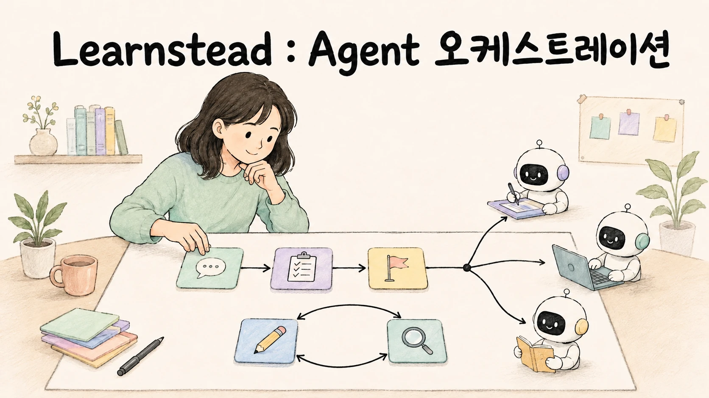
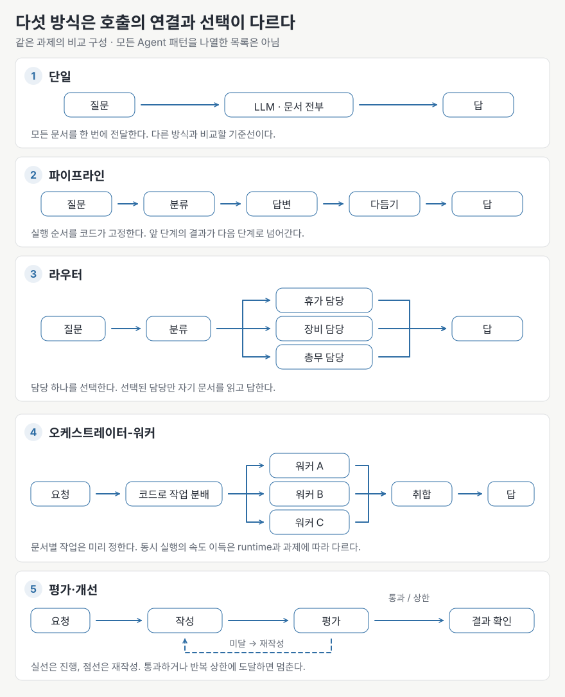

# 여러 AI를 엮어 일하게 하기 — Agent와 오케스트레이션



> 하나의 에이전트로 처리하던 일을 여러 역할이나 단계로 분담하면 결과가 좋아질까요? 이 가이드는 **같은 질문·같은 모델·같은 문서 3편을 사용해 다섯 가지 처리 방식을 비교한 결과**로 그 질문을 살펴봅니다. 한 번에 답하기, 순서대로 처리하기, 담당 분야를 선택하기, 여러 작업 결과를 취합하기, 작성과 평가를 반복하기를 비교했습니다. 다섯 방식 중 셋은 정답을 냈지만, 담당을 선택하는 라우터는 분야를 잘못 골랐고 워커의 답에는 규정에 없는 설명이 섞였습니다. 정답을 유지하면서 토큰 사용량도 줄인 것은 파이프라인이었습니다. 역할과 단계를 늘리기 전에, 현재 방식보다 무엇이 나아지는지 확인하는 것이 이 가이드의 출발점입니다.

## 먼저 보는 큰 그림

이 가이드에서 말하는 **오케스트레이션(orchestration)은** 여러 모델 호출이나 에이전트의 작업 순서와 결과 전달을 조정하는 일입니다. 예를 들어 질문을 분류한 뒤 담당 역할에 답변을 맡기거나, 여러 문서를 각각 요약한 결과를 하나로 정리합니다. 실습에서는 같은 모델을 역할별로 호출하고 **Python 코드가 실행 순서를 정합니다.** 따라서 모든 예시가 자율적으로 협업하는 멀티 에이전트(Multi-agent) 시스템인 것은 아닙니다. Claude Code·Codex 안에서 서브에이전트에게 일을 맡기고 검토하는 방법은 짝이 되는 가이드에서 다룹니다.

| 앞선 가이드 | 이 가이드에서 맡는 자리 |
| --- | --- |
| [Local LLM 앱 연결 06](../../guides/local-llm-app-integration/06-tool-calling-workflow-agent.md) — tool calling·workflow·agent, 누가 제어 흐름을 쥐는가 | 거기서 만든 "도구 쓰는 agent 하나"를 여러 개로 늘릴 때 무엇이 좋아지고 나빠지는가 |
| [RAG 가이드 05](../../guides/local-rag/05-chunking-and-retrieval-quality.md) — 잡음이 답을 흐린다 | 각 모델 호출에 필요한 자료만 전달해 관련 없는 정보의 영향을 줄이는 방법 |
| [Context Engineering 05](../../guides/context-engineering/05-budget-and-compaction.md) — 큰 읽기는 서브에이전트로 | 별도 호출에 자료 검토를 맡겼을 때 입력량이 어떻게 달라지는지 코드와 토큰 수로 확인 |
| [나눠 맡기는 법](../../guides/agent-delegation/README.md) — 코딩 에이전트 안의 subagent·병렬·검토 | 코딩 도구 안에서도 작업 분담의 효과와 실패를 비교. 두 가이드는 한 시리즈 |

다음 그림은 이 가이드와 실습에서 비교할 다섯 가지 처리 방식입니다. 전체 패턴 목록은 아닙니다. 여기서 **워커(worker)는** 문서 하나의 검토나 답변처럼 정해진 하위 작업을 맡는 역할이며, 실습 코드는 워커별 담당 문서를 미리 지정합니다. `[코드 확인 · 2026-09-07]`



## 학습 달성 목표(Learning Objective)

이 가이드를 끝내면:

- 네 가지 오케스트레이션 패턴(파이프라인·라우터·오케스트레이터-워커·평가 루프)을 그림과 코드로 구분할 수 있습니다.
- 각 호출이 받는 정보와 전체 토큰 비용을 구분해 확인할 수 있습니다.
- 같은 과제를 여러 패턴으로 돌려 호출 수·토큰·정확도를 비교하고 근거를 대며 고를 수 있습니다.
- 다섯 가지 실패를 구분하고, 실행 기록(로그)·사용량 제한(상한)·실패 시 대체 경로(폴백)를 마련할 수 있습니다.
- 여러 역할이나 단계를 추가할 필요 없이 한 번의 모델 호출로 충분한지 판단할 수 있습니다.

## 누구를 위한 가이드인가

- Local LLM을 프로그램에서 호출하고 구조화 출력·tool calling을 써 본 분. 앱 연결 가이드 06~08의 내용을 전제로 합니다.
- 하나의 에이전트로 처리하기 어려운 작업을 여러 에이전트에게 맡기려는 분. 실제로 결과가 좋아지는지, 시간과 비용은 얼마나 드는지 확인하고 싶은 분.
- 여러 역할이나 처리 단계를 추가한 뒤 토큰 사용량이 늘거나 답변의 정확도가 낮아진 분. [04](04-failure-modes.md)와 [05](05-when-not-to.md)부터 읽어도 됩니다.

필요한 배경은 Python으로 API를 부르는 정도입니다. 프레임워크는 쓰지 않습니다.

## 읽는 순서

| 장 | 파일 | 한 줄 |
| --- | --- | --- |
| 01 | [`01-why-more-than-one.md`](01-why-more-than-one.md) | 작업을 분담하려는 목적과 효과를 확인할 지표를 정한다 |
| 02 | [`02-pattern-map.md`](02-pattern-map.md) | 처리 순서·담당 분야·동시 실행·평가 필요성에 따라 구성을 고른다 |
| 03 | [`03-context-isolation.md`](03-context-isolation.md) | 입력 경계와 토큰 절감을 구분하고 전달 자료·사용량으로 확인한다 |
| 04 | [`04-failure-modes.md`](04-failure-modes.md) | 오류 메시지 없이도 발생하는 실패와 기록·중단·복구 방법 |
| 05 | [`05-when-not-to.md`](05-when-not-to.md) | 다섯 질문으로 작업 분담의 필요성을 판단한다 |
| 06 | [`06-glossary.md`](06-glossary.md) | 용어와 혼동하기 쉬운 쌍 |
| — | [`ORCHESTRATION-CARD.md`](ORCHESTRATION-CARD.md) | Split → Isolate → Stop → Prove를 같은 형식으로 기록하는 카드 |

이 가이드에서는 **분담할 작업 정하기(Split) → 역할별 입력 자료 정하기(Isolate) → 중단 조건 정하기(Stop)를** 차례로 확인합니다. 역할이나 단계를 추가할 이유가 있는지(01·02·05), 각 호출에 어떤 자료를 전달할지(03), 실패하거나 비용이 늘면 언제 멈출지(04)를 정하는 과정입니다. 카드에는 이 판단과 함께 기존 방식의 측정값인 **기준선(baseline)을** 기록합니다.

## 함께 보는 실습

[나눴더니 틀렸다 — 패턴별 실측과 실패 재현](../../labs/when-splitting-fails/README.md)이 다섯 방식을 한 스크립트로 돌립니다. Ollama와 Python 환경을 준비하면 스크립트로 실행할 수 있습니다. 측정 결과부터 확인하고 싶다면 실습에서 시작해도 됩니다. `[실행 검증 · 2026-08-30]`

```bash
ollama pull gemma3:4b && pip install openai
cd labs
python3 patterns.py all "관리자는 연차를 며칠까지 이월할 수 있나요?"
```

## 가이드 작성 중 직접 확인한 검증 기록

작성 환경: Apple M4 Pro·24GB Mac, Ollama 0.33.0, `gemma3:4b`(temperature 0), 2026-08-30. 상세는 [`VALIDATION.md`](VALIDATION.md)와 실습 [검증 기록](../../labs/when-splitting-fails/VALIDATION.md).

- 같은 질문에 단일 508 / 파이프라인 365 / 라우터 268 / 워커 782 / 루프 1,043 입력 토큰. 호출 수와 토큰은 따로 움직였습니다.
- 라우터가 8문항 중 4개를 잘못 보냈습니다. 기준 질문에서도 `reason`에는 "연차 관련 문의"라고 적었지만, 실제로는 회의실 담당에게 요청을 보냈습니다. 3회 반복해도 같았습니다. (실습 01 §3)
- 병렬로 돌린 워커가 순차보다 빠르지 않았습니다. 개별 워커의 완료 시간은 2.0/3.5/5.2초였고, 순차 실행의 전체 워커 시간은 3.9초였습니다. 다만 이 시간 기록만으로 서버가 실제 계산을 하나씩 처리했다고 단정할 수는 없습니다. (실습 02 §3)
- 취합 단계가 워커의 답을 뒤집었습니다. "15분 이내에 입실하지 않으면 자동 취소"라는 조건을 "15분 내 입실해야 자동 취소"로 바꿨습니다. (실습 02 §2)
- 평가-개선 루프가 수렴하지 않았습니다. 평가자가 매 라운드 다른 말로 지적해 상한인 3회까지 반복했으며, 입력 토큰은 비교 기준의 8.5배였습니다. "같은 지적이면 멈추기"는 발동하지 않았고 토큰 예산만 발동했습니다. (실습 03 §3·§4)

## 검증 표기

| 표기 | 뜻 |
| --- | --- |
| `원리` | 특정 제품 version보다 오래 유지되는 구조·수학·물리 설명 |
| `실행 검증 · YYYY-MM-DD` | 기록한 환경에서 명령과 성공 조건을 실제로 확인함 |
| `부분 검증 · YYYY-MM-DD` | 명시한 단계만 실제로 확인함 |
| `문서 확인 · YYYY-MM-DD` | 공식 문서나 발표를 확인했지만 직접 실행하지는 않음 |
| `자료 확인 · YYYY-MM-DD` | 공개 자료를 확인했지만 1차 출처나 직접 실행으로 확정하지 못함 |
| `미검증` | 아직 직접 확인하지 못함 |
| `해석` | 근거를 바탕으로 저자가 정리한 판단 |

각 표기의 근거는 [출처](SOURCES.md)와 [검증 기록](VALIDATION.md)에 연결합니다. 프레임워크와 패턴 이름은 빠르게 바뀌므로 확인일이 오래됐다면 공식 문서를 다시 확인하세요.

## 관련 자료

- 출처: [`SOURCES.md`](SOURCES.md) · 변경: [`CHANGELOG.md`](CHANGELOG.md)
- 이 가이드가 다루지 않는 것: 오케스트레이션 프레임워크(LangGraph·CrewAI·Microsoft Agent Framework·OpenAI Agents SDK 등)의 사용법과 비교 · 장기 기억·계획(planning) 알고리즘·자율 목표 설정 · 여러 사용자를 받는 agent 서비스의 인프라·큐·상태 관리 · 쓰기·실행 권한을 가진 agent의 안전 설계([앱 연결 06 §3](../../guides/local-llm-app-integration/06-tool-calling-workflow-agent.md)의 경계 원칙까지만) · 품질을 수치로 재는 평가 체계(→ 평가와 관측 가이드) · 코딩 에이전트 안의 subagent·worktree·검토(→ [나눠 맡기는 법](../../guides/agent-delegation/README.md))
