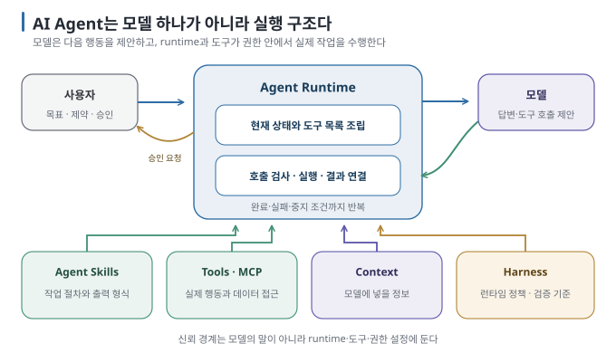

# 00. AI Agent는 어떻게 움직이는가

> 이 문서는 [`README.md`](README.md)의 0장입니다. 다음 → [`01-why-skills.md`](01-why-skills.md)

## 이 장에서 답하는 질문

- 채팅형 AI와 Agent의 차이는 어디에서 생기는가
- 모델·런타임·도구는 각각 무엇을 하는가
- skill·MCP·hook·지시문은 이 구조의 어디에 놓이는가

## 1. 모델 혼자서는 파일을 고칠 수 없다

채팅형 AI는 질문을 받고 답을 만듭니다. Agent는 답을 만드는 데서 멈추지 않고, 필요한 도구를 고르고 결과를 확인하며 다음 행동을
이어 갑니다. 둘 사이에 완전히 다른 종류의 모델이 있는 것은 아닙니다. 도구 호출 형식을 다루도록 학습된 모델에 **실행을 이어 주는
런타임과 도구가** 붙으면 Agent처럼 일할 수 있습니다.

| 구성 요소 | 맡는 일 | 직접 하지 않는 일 |
| --- | --- | --- |
| **모델** | 문장을 이해하고 답이나 다음 도구 호출을 제안 | 파일·DB·브라우저를 직접 조작 |
| **런타임** | 대화 상태를 들고 모델을 반복 호출하며 도구 실행을 연결 | 어떤 결과가 옳은지 스스로 보장 |
| **도구** | 파일 읽기·명령 실행·API 호출처럼 실제 효과를 냄 | 다른 도구를 언제 쓸지 판단 |
| **사용자** | 목표·허용 범위·승인·최종 판정 | 모든 중간 명령을 직접 작성 |

모델이 `read_file`을 호출하겠다는 형식의 답을 내더라도 아직 파일을 읽은 것은 아닙니다. 하네스가 마련한 권한 규칙과 검증 절차를
런타임이 적용하고, 필요하면 사용자 승인을 받은 뒤 실제 함수를 실행해야 합니다. 실행 결과는 다시 모델의 컨텍스트에 들어가며, 모델은 그 결과를 보고 답하거나 다음
도구를 고릅니다. 이 반복을 **Agent loop(에이전트 루프)라고** 부릅니다.

여기서 말하는 Agent loop는 한 번의 실행 안에서 모델과 도구가 결과를 주고받는 '도구 호출 루프'입니다. 작업을 반복 실행하고
평가·승인·개선하는 더 큰 흐름은 [AI 에이전트 개발은 루프를 돌리는 일이다](https://kyungseo.github.io/posts/agent-development-loop/)에서
자세히 설명합니다.

## 2. 규칙과 권한은 모델 바깥에도 있어야 한다

"이 폴더 밖은 읽지 마"라고 프롬프트에 적는 것만으로는 경계가 강제되지 않습니다. 모델은 지시를 따르도록 만들어졌지만, 모호한 상황에서
잘못 판단하거나 외부 문서에 섞인 지시를 따를 수 있습니다. 중요한 경계는 런타임의 승인 정책, 도구의 입력 검사, 운영체제의 파일 권한처럼
**모델 바깥의 코드와 설정으로** 막아야 합니다.

이 구분은 이후 세 팩을 관통합니다.

| 필요한 것 | 둘 자리 | 이유 |
| --- | --- | --- |
| 프로젝트 전체의 짧은 규칙 | `CLAUDE.md`·`AGENTS.md` | 세션 시작부터 배경으로 읽힘 |
| 반복 작업의 절차와 출력 형식 | **skill** | 필요할 때만 본문을 읽음 |
| 파일·DB·API 같은 외부 능력 | **MCP** 또는 내장 도구 | 런타임이 실제 코드를 호출 |
| 반드시 막거나 실행할 검사 | **hook·권한 정책·도구 코드** | 모델의 준수 여부에 기대지 않음 |
| 지금 모델이 볼 정보의 선택 | **Context Engineering** | 지시문·대화·검색 결과·도구 결과의 양과 순서를 설계 |

## 3. Runtime·harness·framework/SDK

세 용어는 제품마다 겹쳐 쓰입니다. Claude Code·Agent SDK 문서는 실행기 자체를 harness라고도 부릅니다. 이 가이드에서는 실행 주체와
운영 장치를 구분하기 위해 다음처럼 사용합니다.

- **런타임(runtime):** 모델 호출과 도구 실행을 반복하는 실제 실행기. Claude Code·Codex 같은 코딩 Agent가 여기에 해당합니다.
- **하네스(harness):** 런타임이 적용할 정책과 완료 조건을 정하고, 작업 순서·검증·기록을 묶는 운영 장치입니다. 저장소 규칙, 테스트,
  리뷰 절차가 함께 들어갈 수 있습니다. 실제 도구 호출을 허용하거나 거부하는 주체는 런타임입니다.
- **프레임워크/SDK:** 내 프로그램에 Agent loop나 도구 연결을 구현하도록 돕는 코드 라이브러리입니다.

처음부터 셋을 모두 만들 필요는 없습니다. 완성된 코딩 Agent를 쓰면서 지시문과 skill을 정리하는 것부터 시작하고, 외부 능력이 필요할
때 MCP를 붙이는 편이 단순합니다. 직접 Agent 앱을 만들 때만 framework/SDK가 필요합니다.

## 4. 이 팩에서 다루는 범위

이 팩은 위 구조 가운데 **반복 절차를 Skill로 만드는 법에** 집중합니다. 다음 팩은 능력을 연결하는
[MCP](../mcp-basics/README.md), 그다음은 무엇을 언제 읽힐지 다루는
[Context Engineering](../context-engineering/README.md)으로 이어집니다.

## 이 장을 끝내면

- 모델의 제안과 실제 도구 실행을 구분할 수 있습니다.
- 지시문·skill·MCP·hook을 각각 배치할 수 있습니다.
- 중요한 권한 경계를 모델 바깥에서 강제해야 하는 이유를 설명할 수 있습니다.
