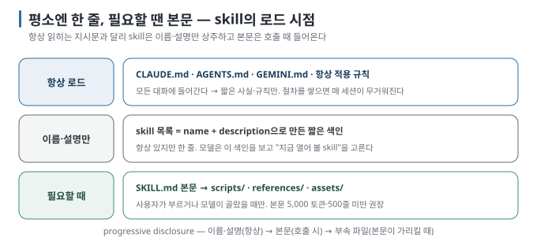

# 01. 왜 같은 프롬프트를 매번 다시 쓰는가

> 이전 ← [`00-how-an-agent-works.md`](00-how-an-agent-works.md) · 다음 → [`02-anatomy.md`](02-anatomy.md)

## 이 장에서 답하는 질문

- 나는 AI 도구에게 같은 절차를 몇 번이나 다시 설명하고 있는가
- 항상 읽히는 지시문(`CLAUDE.md`, `AGENTS.md`)과 skill은 무엇이 다른가
- skill이 컨텍스트 비용을 어떻게 줄이는가

## 1. 반복되는 프롬프트의 정체

코딩 에이전트를 몇 주 쓰다 보면 채팅창에 붙여 넣는 문장이 정해집니다.

- "회의록에서 액션 아이템만 표로 뽑아 줘. 담당자와 기한이 없으면 미정으로."
- "릴리스 노트는 이 형식으로. 커밋은 기능·수정·문서 순서로 묶고."
- "SVG를 만들 때는 이 색 팔레트와 폰트 규칙을 지켜."

이 문장들은 **한 번 정한 절차를 매번 다시 말해야 한다는 공통점이** 있습니다. 다시 말하지 않으면 도구는 그때그때 다르게 처리합니다. 표 형식이 바뀌고, 기한을 멋대로 계산하고, 요약을 덧붙이기도 합니다. 이 가이드와 함께 만든 실습에서도 실제로 그렇게 됐습니다. 같은 회의록을 같은 요청으로 세 번 처리하게 했더니, 절차를 프롬프트에 붙였을 때는 3회 모두 판정에서 떨어졌고(열이 늘어나거나 기한을 임의로 환산), 같은 절차를 skill로 두었을 때는 3회 모두 통과했습니다 [실행 검증 · 실습 05].

절차를 **한 번 파일로 적어 두고 도구가 필요할 때 스스로 꺼내 읽게 하는 것**, 그것이 skill입니다. 이 정도면 정의는 충분합니다. 이제 "필요할 때"를 어떻게 판단하는지, 파일을 어디에 두는지, 도구마다 무엇이 다른지 살펴보겠습니다.

## 2. "항상 읽히는 것"과 "필요할 때 읽히는 것"

skill을 이해하는 첫 번째 기준은 **로드 시점입니다.**

`CLAUDE.md`·`AGENTS.md`는 **항상** 읽힙니다. 여기에 긴 절차를 쌓으면 모든 대화가 그만큼 무거워지고, 관련 없는 작업에서도 그 절차가 모델의 주의를 끕니다. skill은 반대입니다. 평소에는 **이름과 설명 한 줄만** 컨텍스트에 있고, 본문은 호출될 때만 들어옵니다. Agent Skills 규격은 이를 **progressive disclosure(점진적 공개)라고** 부르며, 단계별 크기 지침을 제공합니다 [문서 확인].

| 단계 | 들어가는 것 | 크기 지침 |
| --- | --- | --- |
| 1 | `name` + `description` | 짧은 목록 정보. 세션 시작 시 전부 |
| 2 | `SKILL.md` 본문 | 5,000 토큰 · 500줄 미만 권장. 호출 시 |
| 3 | `scripts/` `references/` `assets/` | 제한 없음. 본문이 가리킬 때 모델이 읽거나 런타임에 실행을 요청 |

도구는 skill 목록에 별도의 예산을 둡니다. 현재 Codex는 전체 목록을 컨텍스트 창의 최대 2% 또는 창 크기를 모를 때 8,000자로 제한하며, 넘으면 설명을 줄이거나 일부 skill을 생략하고 경고합니다 [문서 확인 · 2026-09-02]. 따라서 skill을 많이 만들수록 **설명 한 줄의 품질과 목록의 크기가** 발견 여부를 좌우합니다. 이 내용은 [`05-discovery-and-invocation.md`](05-discovery-and-invocation.md)에서 이어집니다.

## 3. skill이 아닌 것과의 첫 구분

이 시점에서 자주 섞이는 세 가지만 먼저 구분하겠습니다. 자세한 비교표는 [`03-same-thing-different-names.md`](03-same-thing-different-names.md)에 있습니다.

| 이것은 | 무엇인가 | skill과 다른 점 |
| --- | --- | --- |
| `CLAUDE.md` / `AGENTS.md` | 항상 로드되는 프로젝트 지시문 | 로드 시점이 "항상". 절차가 아니라 사실·규칙을 담는 자리 |
| MCP 서버 | 외부 프로세스가 제공하는 **도구(tool)** | 능력을 더한다(파일을 읽는 새 방법, DB 질의). skill은 이미 있는 능력을 **어떻게 쓸지** 적는다 |
| hook | 이벤트에 묶인 shell 명령 | 모델이 판단하지 않고 무조건 실행된다. skill은 모델이 읽고 따르는 지시다 |

한 문장으로 정리하면 **skill은 "지식·절차", MCP는 "능력", hook은 "강제", 진입 지시문은 "상시 배경"입니다.** 이 네 칸을 머릿속에 두면 이후 도구별 이름 차이에 흔들리지 않습니다.

## 4. 언제 skill로 만들 만한가

다음과 같은 신호가 보이면 skill로 만들 만합니다.

- 같은 설명을 **세 번 이상** 다시 붙여 넣었다.
- 출력 형식이 정해져 있고, 어길 때 손해가 있다(표 열이 바뀌면 다음 단계가 깨진다).
- 절차에 **스크립트나 참조 문서가** 딸려 있다(검증 스크립트, 템플릿, 체크리스트).
- 같은 절차를 **다른 도구**(Claude Code와 Codex)에서도 쓰고 싶다.

반대로 다음 경우에는 skill이 과할 수 있습니다.

- 프로젝트 전체에 항상 적용되는 한 줄 규칙("들여쓰기는 2칸") → `CLAUDE.md`/`AGENTS.md`.
- 특정 파일 유형에서만 켜지는 규칙("`*.sql`을 건드릴 땐 이 규칙") → Cursor의 glob 규칙이나 Claude Code skill의 `paths`처럼 **경로 조건이 있는 형태**.
- 무조건 실행돼야 하는 검사(commit 전 lint) → hook.

## 5. 이 장의 실습 연결

- 실습 [`labs/skill-workshop/01-first-skill.md`](../../labs/skill-workshop/01-first-skill.md): 회의록 → 액션 아이템 skill을 설치하고 명시 호출·자동 호출을 관측합니다.
- 실습 05: 같은 절차를 skill로 둔 경우와 프롬프트에 붙인 경우를 3회씩 비교합니다. 이 장 1절의 수치가 여기서 나왔습니다.

## 이 장을 끝내면

- "skill은 필요할 때 로드되는 절차 파일"이라고 한 문장으로 말할 수 있습니다.
- 항상 로드되는 지시문과 skill을 로드 시점에 따라 구분할 수 있습니다.
- 반복되는 프롬프트 하나를 골라 skill 후보로 지목할 수 있습니다.
