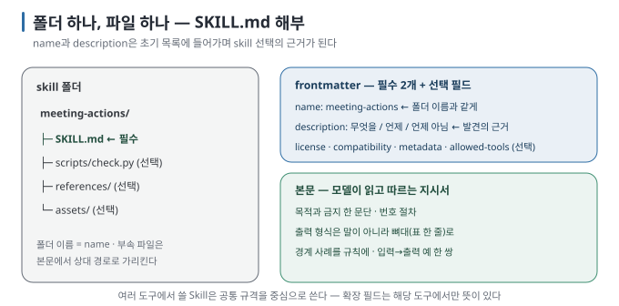

# 02. SKILL.md 해부

> 이전 ← [`01-why-skills.md`](01-why-skills.md) · 다음 → [`03-same-thing-different-names.md`](03-same-thing-different-names.md)

## 이 장에서 답하는 질문

- skill 폴더에는 무엇이 들어가고, 무엇이 필수인가
- frontmatter의 각 필드가 어느 시점에 어떤 역할을 하는가
- 본문은 어떻게 써야 모델이 따르는가

## 1. 폴더 하나, 파일 하나

skill은 **폴더입니다.** 폴더 이름이 skill 이름이고, 그 안의 `SKILL.md` 하나가 필수입니다.



```text
meeting-actions/            ← 폴더 이름 = name
├── SKILL.md                ← 필수. frontmatter + 본문
├── scripts/                ← 선택. 런타임이 실행할 코드
│   └── check.py
├── references/             ← 선택. 필요할 때만 읽을 긴 문서
└── assets/                 ← 선택. 템플릿, 이미지, 출력에 쓰일 파일
```

이 구조는 Agent Skills 규격(agentskills.io)이 정한 것이고, Claude Code·Codex·Gemini CLI·Cursor가 모두 같은 구조를 읽습니다 [문서 확인 · 2026-08-30]. 세 하위 폴더는 관례이지 강제는 아닙니다. 규격은 "SKILL.md 외의 파일은 본문에서 상대 경로로 가리키라"고만 정합니다.

## 2. frontmatter — 필수 2개, 선택 4개

`SKILL.md`는 YAML frontmatter로 시작합니다. 현재 Agent Skills 규격은 `name`과 `description`을 필수로, `license`·`compatibility`·`metadata`·`allowed-tools`를 선택 필드로 정의합니다. `allowed-tools`는 아직 실험적입니다 [문서 확인 · 2026-09-02].

```yaml
---
name: meeting-actions                      # 필수
description: 회의록에서 액션 아이템을 뽑아 담당자·기한·항목 표로 정리한다. 사용자가 회의록·미팅 노트·액션 아이템을 말하면 사용한다. 일반 요약에는 쓰지 않는다.   # 필수
license: MIT                               # 선택
compatibility: python3 필요                 # 선택 · 환경 요구사항
metadata:                                  # 선택 · 자유 키-값
  version: "1.1"
allowed-tools: Bash(python3 *)             # 선택 · 실험적
---
```

| 필드 | 규칙 | 언제 쓰이나 |
| --- | --- | --- |
| `name` | 1~64자, 소문자·숫자·하이픈. 앞뒤·연속 하이픈 금지. **폴더 이름과 일치** | 호출 이름(`/name`, `$name`), 목록의 키 |
| `description` | 1~1024자, 비어 있으면 안 됨 | **항상 컨텍스트에 있는 유일한 부분.** 모델이 "이 skill을 지금 쓸까"를 판단하는 근거 |
| `license` | 자유 텍스트 또는 파일명 | 배포·공개 시 |
| `compatibility` | 1~500자 | 필요한 런타임·패키지·네트워크를 사람과 모델에게 알림 |
| `metadata` | 문자열 키-값 | 버전, 작성자 등. 도구가 해석하지 않음 |
| `allowed-tools` | 공백 구분 목록 | 도구가 지원하면 호출 턴 동안 해당 tool을 사전 승인 |

여기서 가장 중요한 한 줄은 `description`입니다. 본문이 아무리 좋아도 description이 요청과 맞지 않으면 모델은 skill을 열어 보지 않습니다. 반대로 description이 너무 넓으면 관련 없는 요청에도 열립니다. 실습에서 description을 "문서·회의록·노트를 읽고 정리한다. 요약… 전반에 사용한다"로 넓혔더니 "세 문장으로 요약해 줘"라는 요청에 3회 모두 skill이 호출됐고, 그중 한 번은 모델이 "description은 요약이라는데 본문은 요약을 금지한다"며 불일치를 지적했습니다 [실행 검증 · 실습 02]. description은 **무엇을 하는지 + 언제 쓰는지 + 언제 쓰지 않는지** 세 부분으로 씁니다.

### 도구별 확장 필드

규격 밖의 필드는 도구가 제각기 더합니다. Claude Code는 `disable-model-invocation`, `user-invocable`, `context: fork`, `paths`, `hooks` 같은 확장 필드를 읽고, Cursor는 `paths`·`disable-model-invocation`을, Codex는 별도 파일(`agents/openai.yaml`)에 표시 정보와 호출 정책을 둡니다 [문서 확인]. 어떤 도구가 어떤 확장을 읽는지는 [`04-tool-differences.md`](04-tool-differences.md)에 정리했습니다. 여러 도구에서 쓸 skill은 **Agent Skills 규격 안에서 먼저 작성하고**, 실제로 필요한 기능만 도구별 adapter에 둡니다.

## 3. 본문 — 모델이 읽고 따르는 절차

frontmatter 아래는 평범한 Markdown입니다. 도구는 이 본문을 해석하지 않고 **그대로 모델에게 줍니다**(Claude Code는 대화에 메시지로 삽입하고, Codex는 모델이 파일을 직접 읽습니다 — [`05`](05-discovery-and-invocation.md) 참조). 따라서 본문은 코드가 아니라 **동료에게 주는 작업 지시서처럼** 씁니다.

실습에서 쓴 본문의 뼈대는 다음과 같습니다.

```markdown
# meeting-actions

회의록에서 **누가 · 무엇을 · 언제까지** 하기로 했는지만 뽑아 표로 만든다. 요약이나 의견은 쓰지 않는다.

## 절차
1. "~가 ~하기로 함" 같은 **사람이 할 일을 약속한 문장을** 찾는다. 날짜·장소만 정한 것은 액션이 아니다.
2. 담당자와 기한을 원문에서 찾는다. 없으면 지어내지 말고 `미정`.
3. 아래 형식의 표 **하나만** 출력한다. 앞뒤 설명 금지.
   (표 형식)
4. "다음 주 금요일" 같은 상대 표현은 계산하지 말고 원문 그대로.

## 예
입력 → 출력 한 쌍
```

이 뼈대에는 다음 내용이 들어 있습니다.

- **첫 문단에 목적과 금지**: 무엇을 하고 무엇을 하지 않는지 밝힙니다. 모델은 본문 전체를 읽기 전에 방향을 잡습니다.
- **번호 있는 절차**: 순서가 있으면 번호, 없으면 불릿.
- **출력 형식을 실제 예로**: "표로 정리해"라고만 쓰는 것보다 표 뼈대 한 줄을 보여 줄 때 형식이 훨씬 잘 지켜집니다.
- **경계 사례**: 실습에서 두 도구가 갈린 지점(날짜만 정한 결정을 액션으로 볼 것인가)을 규칙 1에 명시하자 두 도구 모두 통과했습니다 [실행 검증 · 실습 04]. 본문 규칙은 처음부터 완벽할 수 없습니다. **틀린 출력을 보고 규칙을 한 줄 더하는 순환이** 정상적인 개선 경로입니다.
- **예 한 쌍**: 입력과 기대 출력을 함께 보여 줍니다. 규칙을 글로만 설명하는 것보다 예가 더 강하게 작동합니다.

## 4. 본문 크기와 나누기

규격은 본문을 500줄 미만으로 권장하고, Claude Code는 skill 하나가 압축(compaction) 후 다시 붙을 때 앞 5,000 토큰만 유지합니다 [문서 확인]. 긴 참조 자료(API 명세, 스타일 가이드 전문)는 `references/`로 빼고 본문에는 "언제 그 파일을 읽으라"는 한 줄만 둡니다.

```markdown
## 참고
- 날짜 표기 규칙이 애매하면 `references/date-style.md`를 읽는다.
- 출력을 검증하려면 `python3 scripts/check.py <출력 파일>`을 실행한다.
```

스크립트 경로는 도구가 치환 변수를 제공하면 그것을 사용합니다. Claude Code는 `${CLAUDE_SKILL_DIR}`를 skill 폴더 절대 경로로 바꿔 줍니다 [문서 확인]. 규격 자체에는 그런 변수가 없으므로, 여러 도구용 skill이면 "이 skill 폴더의 `scripts/check.py`"처럼 **폴더 기준 상대 경로를 말로** 적는 편이 안전합니다. 실습의 Codex 실행에서는 모델이 `sed -n '1,240p' .agents/skills/meeting-actions/SKILL.md`로 파일을 직접 읽었습니다 [실행 검증]. 따라서 Codex에서는 상대 경로가 작업 디렉터리를 기준으로 해석됩니다.

## 5. 검증기

frontmatter 오류는 조용히 실패합니다. Claude Code는 YAML이 깨지면 본문은 로드하되 description이 비어 자동 호출이 되지 않습니다 [문서 확인]. 배포 전에 다음 항목을 최소한으로 검증합니다.

| 도구 | 명령 |
| --- | --- |
| 규격 참조 구현 | `skills-ref validate <skill-dir>` (agentskills.io 제공) |
| Claude Code plugin에 포함할 때 | `claude plugin validate <plugin-dir>`로 plugin 전체 검사 |
| Codex | 시스템 skill `$skill-creator`가 작성·검토 절차를 안내 |

> [!TIP]
> **실제로 공개된 Skill 살펴보기**
>
> 이 장에서는 구조를 익히기 위해 작은 예제를 사용했습니다. 실제로 배포되고 사용되는 Skill은
> [Skillstead](https://github.com/kyungseo/skillstead)에서 볼 수 있습니다. 먼저
> [`docs-claim-check`](https://github.com/kyungseo/skillstead/blob/main/skills/docs-claim-check/SKILL.md)처럼 단순한 구성을 살펴본 뒤,
> [`writing-quality-editor`](https://github.com/kyungseo/skillstead/tree/main/skills/writing-quality-editor)가 긴 기준을 `references/`로 나누는 방식과 비교해 보세요.

## 이 장을 끝내면

- `SKILL.md`의 필수 필드 두 개와 선택 필드 네 개를 말할 수 있습니다.
- description을 "무엇/언제/언제 아님" 세 부분으로 쓸 수 있습니다.
- 본문을 목적·절차·형식 예·경계 사례·예 한 쌍의 뼈대로 구성할 수 있습니다.
