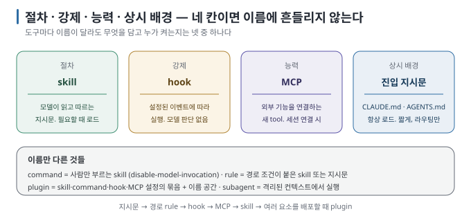

# 03. 이름이 다른 같은 것들 — skill · command · plugin · rule · hook · MCP

> 이전 ← [`02-anatomy.md`](02-anatomy.md) · 다음 → [`04-tool-differences.md`](04-tool-differences.md)

## 이 장에서 답하는 질문

- "slash command", "rule", "plugin", "hook", "MCP"가 skill과 어떻게 다른가
- 도구마다 다른 이름을 어떤 축으로 정리하면 헷갈리지 않는가
- 내 절차를 어느 형태로 만들어야 하는가

## 1. 네 가지 축

이름은 도구마다 다르지만 네 가지 기준으로 나누면 충분합니다.



| 축 | 질문 | 값 |
| --- | --- | --- |
| **트리거** | 누가 켜는가 | 사람(`/name`) · 모델(설명을 보고 선택) · 이벤트(파일 저장, tool 실행 전) · 항상 |
| **로드 시점** | 언제 컨텍스트에 들어가는가 | 항상 · 조건 충족 시(경로 glob) · 호출 시 |
| **내용물** | 무엇이 들어 있는가 | 지시문(모델이 읽고 따름) · 코드(무조건 실행) · 능력(새 tool) · 묶음(여럿의 패키지) |
| **실행 주체** | 누가 해석하는가 | 모델 · 도구 런타임 · 외부 프로세스 |

00장의 큰 그림과 연결하면 더 단순해집니다. 모델이 읽을 내용은 진입 지시문과 skill에, 런타임이 반드시 실행하거나 막을 일은 hook과
권한 정책에, 외부 능력은 MCP에 둡니다. plugin은 이 여러 구성 요소를 설치 가능한 단위로 묶습니다.

## 2. 한 표로 보기

| 형태 | 트리거 | 로드 시점 | 내용물 | 실행 주체 | 대표 위치 (2026-08-30 기준) |
| --- | --- | --- | --- | --- | --- |
| **skill** | 사람 또는 모델 | 호출 시 (설명만 항상) | 지시문 + 스크립트·참조 | 모델 | `.claude/skills/`, `.agents/skills/`, `.gemini/skills/`, `.cursor/skills/` |
| **slash command** | 사람 | 호출 시 | 지시문(프롬프트 템플릿) | 모델 | Claude Code `.claude/commands/`(skill로 통합됨), Cursor commands(skill로 이전 권고), Gemini `commands/*.toml` |
| **진입 지시문** | 항상 | 항상 | 사실·규칙·라우팅 | 모델 | `CLAUDE.md`, `AGENTS.md`, `GEMINI.md`, `.claude/rules/*.md` |
| **rule (경로 조건)** | 이벤트(파일 경로 일치) 또는 항상 | 조건 충족 시 | 지시문 | 모델 | Cursor `.cursor/rules/*.mdc`(`alwaysApply`·`globs`·`description`), Claude Code skill의 `paths` |
| **hook** | 이벤트(tool 실행 전후, 세션 시작·종료 등) | 해당 이벤트 | 명령 또는 MCP tool | 도구 런타임 | Claude Code settings/skill `hooks`, Codex `hooks.json`·`config.toml` |
| **subagent** | 사람 또는 모델 | 위임 시 | 별도 system prompt + tool 집합 | 모델(격리 컨텍스트) | Claude Code `.claude/agents/`, skill의 `context: fork` |
| **MCP 서버** | 모델(tool 호출) | 세션 연결 시 tool 목록 | **능력**(파일·DB·API) | 외부 프로세스 | 각 도구의 MCP 설정 |
| **plugin** | — (묶음) | 설치 시 | skill·command·agent·hook·MCP의 패키지 + manifest | 도구 런타임 | Claude Code `.claude-plugin/plugin.json`, Codex plugin, Gemini extension |

## 3. 자주 헷갈리는 쌍

### skill vs slash command

Claude Code에서 둘은 **이제 같은 형태입니다.** `.claude/commands/name.md`는 계속 동작하지만 skill과 같은 목록에 합쳐지고, 같은 이름이 있으면 skill이 우선합니다 [문서 확인 · 2.1.251]. 차이는 "누가 부르는가"이며, 이것도 skill frontmatter 한 줄로 정합니다.

```yaml
disable-model-invocation: true   # 사람만 부른다 → 옛 slash command와 같음
user-invocable: false            # 모델만 부른다 → 배경 지식형 skill
```

Cursor도 같은 방향입니다. 2.4의 `/migrate-to-skills`는 기존 command를 `disable-model-invocation: true`인 skill로 바꿉니다 [문서 확인]. 따라서 "command를 만들까 skill을 만들까"보다 **skill을 만들고 트리거를 어떻게 정할지** 판단하면 됩니다.

### skill vs 진입 지시문(`CLAUDE.md`·`AGENTS.md`)

로드 시점이 다릅니다. 진입 지시문은 항상 읽히고, skill은 호출할 때 읽힙니다. Gemini CLI 문서는 이를 "GEMINI.md는 상시 배경(persistent background), skill은 필요할 때 꺼내는 전문성(on-demand expertise)"이라고 표현합니다 [문서 확인 · 2026-04-30]. 다음 기준으로 판단할 수 있습니다.

- 모든 작업에 적용되고 짧다 → 진입 지시문
- 특정 작업에만 필요하고 길다 → skill
- 진입 지시문이 길어져서 매 세션이 무거워졌다 → 절차 부분을 skill로 빼고 진입 지시문에는 "이럴 땐 이 skill"이라는 라우팅 한 줄만 남긴다

### skill vs rule(경로 조건)

Cursor의 `.mdc` rule에는 네 가지 모드가 있습니다. 항상 적용(`alwaysApply`), 경로 일치 시 적용(`globs`), 모델이 설명을 보고 선택(`description`), 사람이 `@`로 지정하는 방식입니다 [문서 확인]. 뒤의 두 방식은 skill과 같은 트리거이며, Cursor가 이들을 skill로 이전하라고 안내하는 이유도 여기에 있습니다. 남는 차이는 **경로 조건이며**, Claude Code는 skill frontmatter의 `paths`로 같은 역할을 구현합니다 [문서 확인]. 따라서 rule은 "경로 조건이 붙은 skill 또는 진입 지시문"으로 이해하면 됩니다.

### skill vs hook

hook은 모델이 판단하지 않습니다. "commit 전에 lint를 돌려라"를 skill에 쓰면 모델이 잊을 수 있지만 hook에 걸면 반드시 실행됩니다. Claude Code 문서도 "skill이 첫 응답 이후 무시되는 것 같으면 hook으로 결정적으로 강제하라"고 안내합니다 [문서 확인]. 둘은 경쟁 관계가 아니라 서로 보완합니다. **절차는 skill에, 강제는 hook에 둡니다.**

### skill vs MCP

MCP는 새로운 **능력을** 제공합니다(브라우저 조작, DB 질의, 사내 API). skill은 이미 있는 능력을 **어떻게 조합해 쓸지** 적습니다. "우리 DB에서 지표를 뽑는 절차"를 만든다면 DB 접근은 MCP가 맡고, 질의 순서와 표 작성 방식은 skill이 맡습니다. skill 본문에서 MCP tool을 이름으로 가리킬 수 있지만, 그러면 그 MCP가 없는 환경에서 skill이 깨집니다. 필요한 MCP는 `compatibility` 필드에 적어 둡니다.

### skill vs plugin

plugin은 여러 구성 요소를 담는 **묶음입니다.** skill 여러 개와 command, subagent, hook, MCP 설정을 manifest 하나로 배포합니다. 혼자 쓰는 절차 하나라면 skill 폴더로 충분하고, 팀에 배포하거나 marketplace에 올릴 때 plugin으로 묶을 수 있습니다. plugin 안의 skill에는 `plugin-name:skill-name`처럼 이름 공간이 붙어 다른 skill과 충돌하지 않습니다 [실행 검증 · Claude Code·Codex 모두 목록에서 `plugin:skill` 표기 관측].

## 4. 결정 순서

1. 모든 작업에 필요한 짧은 규칙이면 진입 지시문에 둔다.
2. 특정 파일을 다룰 때만 필요하면 경로 조건 rule이나 해당 작업용 skill을 쓴다.
3. 특정 이벤트에 반드시 실행하거나 막아야 하면 hook·권한 정책·CI로 보낸다.
4. 새 외부 능력이 필요하면 MCP를 연결하고, 그 능력을 쓰는 순서는 skill에 둔다.
5. 여러 구성 요소를 다른 사람에게 배포해야 할 때 plugin으로 묶는다.

## 이 장을 끝내면

- 네 축(트리거·로드 시점·내용물·실행 주체)으로 어떤 도구의 어떤 이름이든 분류할 수 있습니다.
- "command냐 skill이냐"보다 트리거를 정하는 일이 중요하다는 점을 설명할 수 있습니다.
- 절차·강제·능력·상시 배경을 각각 skill·hook·MCP·진입 지시문에 배정할 수 있습니다.
