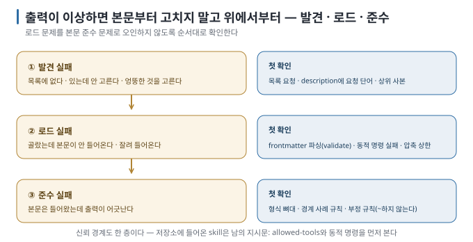

# 07. 잘못되는 방식 — 실패 지도

> 이전 ← [`06-canonical-and-adapters.md`](06-canonical-and-adapters.md) · 다음 → [`08-sharing-and-boundaries.md`](08-sharing-and-boundaries.md)

## 이 장에서 답하는 질문

- skill이 "안 뜨는", "너무 뜨는", "떴는데 안 지키는" 세 가지 실패를 어떻게 구분하는가
- 각 실패의 원인 후보와 확인 순서는 무엇인가

## 1. 실패는 세 층에서 난다

이 순서로 확인하면 원인을 빨리 좁힐 수 있습니다. 출력이 이상하다고 본문부터 고치면 ①·②의 문제를 ③으로 오진할 수 있습니다.

## 2. ① 발견 실패

| 증상 | 원인 후보 | 확인 · 조치 |
| --- | --- | --- |
| 목록에 없다 | 경로가 그 도구가 읽는 곳이 아님 (`.agents/skills`에 두고 Claude Code에서 찾음, 또는 반대) | [`04`](04-tool-differences.md) 1절. Claude Code는 symlink로 해결 |
| 목록에 없다 | 폴더 이름 ≠ `name`, 대문자·밑줄 사용 | 이름 규칙: 소문자·숫자·하이픈, 폴더와 일치 |
| 목록에 있지만 설명이 비었거나 자동 호출이 안 된다 | frontmatter YAML 오류 | `skills-ref validate <skill-dir>`. plugin이라면 `claude plugin validate <plugin-dir>`도 실행 [문서 확인] |
| 목록에 없다 | `disable-model-invocation: true` 또는 `skillOverrides: off` | 의도한 설정인지 확인. 사람 호출(`/name`)은 여전히 된다 |
| 목록에서 빠지거나 설명이 잘림 | skill 목록 예산 초과 | 도구의 경고와 `/context`를 확인하고, 겹치거나 쓰지 않는 skill을 정리 |
| 있는데 안 고른다 | description에 요청의 단어가 없음 | 요청을 description 어휘로 바꿔 시험 → 되면 description을 고친다 |
| 엉뚱한 것을 고른다 | description이 이웃 skill과 겹침 | 실습 04: "정리해 줘"는 `notes-summary`, "액션 아이템"은 `meeting-actions`로 갈렸다. 제외 조건을 각 description에 명시 |
| 다른 사본이 잡힌다 | 같은 이름의 상위 우선순위 사본 | Claude Code: 개인 > 프로젝트 / Codex: 저장소 우선(관측). `~/.claude/skills`와 `~/.agents/skills`를 뒤진다 |
| 너무 자주 뜬다 | description이 넓음 ("문서 작업 전반") | 실습 02: 요약 요청에 3/3 호출. "언제 안 쓴다"를 추가하거나 `disable-model-invocation` |

## 3. ② 로드 실패

| 증상 | 원인 후보 | 확인 · 조치 |
| --- | --- | --- |
| 호출이 중단되고 `Shell command failed for pattern` (Claude Code) | 동적 컨텍스트 `` !`명령` ``이 0이 아닌 종료 | 실패해도 되는 명령은 `\|\| true`. 명령 자체를 터미널에서 먼저 실행 |
| 호출이 중단되고 `permission check failed` (Claude Code) | 동적 명령이 권한 규칙에서 allow가 아님 | `allowed-tools`로 사전 승인하거나 설정에서 허용 |
| 본문 일부만 적용되는 듯 | 압축 후 재첨부 상한(각 5,000 · 합 25,000 토큰)에 밀림 | 긴 참조는 `references/`로 빼고, 필요 시 다시 호출 [문서 확인] |
| Codex에서 본문이 없다 | 모델이 파일을 읽는 단계를 건너뜀 | transcript에 `SKILL.md` 읽기 흔적이 있는지 확인. 없으면 `$name`으로 명시 호출 |
| 과거 비-대화형 실행이 멈춤 | 당시 0.144.1 실행에서 stdin 대기 | 현재도 재현되는지 먼저 확인하고, 필요할 때만 stdin을 닫음 [과거 실행 검증] |

## 4. ③ 준수 실패

| 증상 | 원인 후보 | 확인 · 조치 |
| --- | --- | --- |
| 형식이 어긋난다 (열이 늘고 설명이 붙음) | 형식을 말로만 설명 | 표 뼈대·예 한 쌍을 본문에. 실습 05에서 프롬프트에 붙인 지시는 0/3, skill은 3/3 통과 |
| 경계 사례에서 도구마다 다르다 | 규칙이 모호 | 실습 03: "결정 문장"을 Codex는 일정 확정까지 포함해 5행, Claude Code는 4행. 규칙에 경계 사례를 명시하자 둘 다 통과 |
| 지어낸다 (기한 환산, 담당 추정) | 금지를 안 적음 | "원문에 없으면 `미정`", "상대 표현은 그대로" 같은 **부정 규칙** 추가 |
| 첫 응답만 지키고 이후 무시 | 본문은 남아 있으나 모델이 다른 접근을 택함 | description·본문을 강화하거나, 반드시 지켜야 하면 hook으로 강제 [문서 확인] |
| description과 본문이 모순 | 넓힌 description을 본문에 반영 안 함 | 실습 02에서 모델이 모순을 지적함. 둘을 함께 고친다 |

## 5. 신뢰 경계 실패

skill은 지시문이며, 저장소에 들어온 skill은 **다른 사람이 쓴 지시문입니다.**

- Claude Code의 `allowed-tools`는 폴더 신뢰 여부와 무관하게 적용됩니다. 처음 여는 저장소의 `.claude/skills/*/SKILL.md`에서 `allowed-tools`를 먼저 확인합니다 [문서 확인].
- 동적 컨텍스트 `` !`명령` ``은 본문 전송 전에 **내 장비에서** 실행됩니다. 정책으로 끄려면 `disableSkillShellExecution: true`를 사용합니다 [문서 확인].
- Gemini CLI만 skill을 활성화할 때 동의 프롬프트를 표시합니다 [문서 확인]. 나머지 도구는 묻지 않습니다.
- 2026-08-30 실측에서는 Codex가 `~/.codex/skills`의 symlink를 따라갔습니다. 현재 공식 사용자 경로는 `$HOME/.agents/skills`이므로 새 설치는 그 경로를 기준으로 삼고, symlink 대상도 함께 검토합니다 [과거 실행 검증 · 현재 문서 확인].

## 6. 실패 재현 습관

실패를 고칠 때 흔히 하는 실수는 **같은 세션에서 수정하고 다시 묻는 것입니다.** 작성 중 대화에 남은 맥락이 skill의 빈틈을 가릴 수 있습니다. Claude Code 문서도 "새 세션에서, skill이 있을 때와 껐을 때(`skillOverrides`)를 비교하라"고 안내합니다 [문서 확인]. 실습은 모든 실행을 `claude -p`·`codex exec` 새 프로세스로 돌려 이 조건을 맞췄습니다.

## 이 장을 끝내면

- 실패를 발견·로드·준수 세 층으로 나눠 위에서부터 확인할 수 있습니다.
- 각 층의 대표 증상과 첫 확인 명령을 알 수 있습니다.
- 저장소에 들어온 skill을 열어 볼 때 `allowed-tools`와 동적 명령을 먼저 확인할 수 있습니다.
