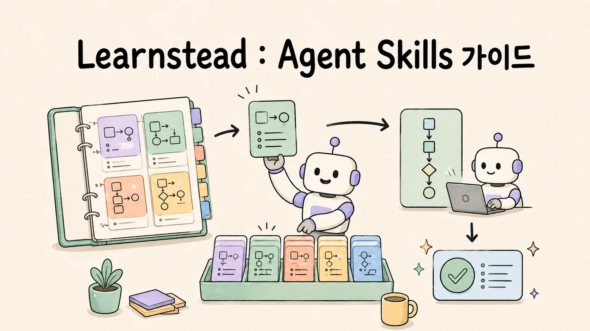

# AI Agent에게 일을 가르치는 법 — Agent Skills 기초

AI Agent를 쓰다 보면 같은 설명을 되풀이하게 됩니다. "이 형식으로 정리해", "이 검사를 먼저 해", "여기까지는 건드리지 마"라고
매번 다시 말해도 결과가 조금씩 달라집니다. 이런 반복 절차를 파일 하나로 만들고, 필요할 때 Agent가 꺼내 쓰게 하는 방법이
**Agent Skill입니다.**

이 가이드는 모델·런타임·도구의 관계부터 시작해 `SKILL.md` 작성, 자동 선택, 도구별 차이, 공유와 공개 전 점검까지 이어집니다.
회의록에서 액션 아이템을 뽑는 작은 skill을 Claude Code와 Codex에서 직접 실행한 기록도 함께 제공합니다.

## 학습 달성 목표(Learning Objective)

이 가이드를 끝내면:

- 모델·런타임·도구가 각각 무엇을 하는지 구분하고, 중요한 권한을 모델 바깥에서 강제해야 하는 이유를 설명할 수 있습니다.
- **skill이 무엇인지** 한 문장으로 말하고, 항상 로드되는 지시문(`CLAUDE.md`·`AGENTS.md`)과 로드 시점 기준으로 구분할 수 있습니다.
- `SKILL.md`의 필수·선택 필드를 구분하고, description을 "무엇/언제/언제 아님"으로 쓸 수 있습니다.
- slash command·rule·hook·subagent·MCP·plugin을 **네 축**(트리거·로드 시점·내용물·실행 주체)으로 분류할 수 있습니다.
- Claude Code·Codex·Gemini CLI·Cursor가 skill을 어디서 읽고 어떻게 부르는지 확인할 수 있습니다.
- 한 절차를 여러 도구에서 재사용할 배치와 도구 전용 adapter가 필요한 시점을 고를 수 있습니다.
- 실패를 발견·로드·준수 세 층으로 나눠 확인하고, 공개 전 경계 검사를 수행할 수 있습니다.

## 누구를 위한 가이드인가

- Claude Code나 Codex를 몇 주 써 봤고, 같은 프롬프트를 반복해서 붙여 넣고 있는 사람.
- 팀 저장소에 `.claude/skills`나 `.agents/skills` 폴더가 생겼는데 무엇이 언제 읽히는지 모르는 사람.
- "command를 만들까 skill을 만들까 rule을 만들까"에서 멈춘 사람.

필요한 배경은 터미널에서 코딩 Agent를 한 번 이상 써 본 경험뿐입니다. YAML frontmatter는 2장에서 설명합니다.

## 읽는 순서

| 장 | 파일 | 한 줄 |
| --- | --- | --- |
| 00 | [`00-how-an-agent-works.md`](00-how-an-agent-works.md) | 모델·런타임·도구의 역할과 skill·MCP·hook의 자리 |
| 01 | [`01-why-skills.md`](01-why-skills.md) | 반복 프롬프트의 정체, 항상 로드 vs 필요 시 로드, progressive disclosure |
| 02 | [`02-anatomy.md`](02-anatomy.md) | 폴더 구조, 필수·선택 frontmatter, 본문 뼈대, 검증기 |
| 03 | [`03-same-thing-different-names.md`](03-same-thing-different-names.md) | skill·command·rule·hook·subagent·MCP·plugin 비교표와 결정 순서 |
| 04 | [`04-tool-differences.md`](04-tool-differences.md) | 네 도구의 경로·호출·충돌 규칙·확장 필드·비-대화형 실행 |
| 05 | [`05-discovery-and-invocation.md`](05-discovery-and-invocation.md) | description이 하는 일, 트리거 제어, 인자, 본문의 수명, 동적 컨텍스트 |
| 06 | [`06-canonical-and-adapters.md`](06-canonical-and-adapters.md) | 규격 안에서 한 벌로, 도구 전용 기능은 canonical + adapter |
| 07 | [`07-what-goes-wrong.md`](07-what-goes-wrong.md) | 발견·로드·준수 세 층의 실패 지도, 신뢰 경계 |
| 08 | [`08-sharing-and-boundaries.md`](08-sharing-and-boundaries.md) | 개인·프로젝트·조직·공개 범위, plugin, 버전, 공개 전 검사 |
| 09 | [`09-glossary.md`](09-glossary.md) | 등장 순서대로 정리한 용어 |
| — | [`SKILL-CARD.md`](SKILL-CARD.md) | 한 장 요약 |

## 함께 보는 실습

이 가이드의 수치와 관측은 모두 **[실습: skill 워크숍](../../labs/skill-workshop/README.md)** 에서 나왔습니다. 회의록에서 액션 아이템을 뽑는 skill 하나를 만들어 Claude Code와 Codex에서 명시 호출·자동 호출·과호출·경로 발견·이름 충돌·프롬프트 대비 비교를 직접 관측합니다. 가이드만 읽어도 되지만, 04·05·07장은 실습을 한 번 돌리고 읽으면 표가 더 잘 보입니다.

## 가이드 작성 중 직접 확인한 검증 기록

최초 작성 환경은 macOS, Claude Code 2.1.251, Codex CLI 0.144.1, 2026-08-30입니다. 2026-09-02에 최신 공식 문서와 현재 설치본을 다시 확인했습니다. 세부는 [`VALIDATION.md`](VALIDATION.md)에 있습니다.

- 규격 필드만 쓴 `SKILL.md`가 Claude Code(`.claude/skills`)와 Codex(`.agents/skills`)에서 명시·자동 호출 모두 동작했습니다.
- 2026-08-30 실측에서 Codex는 `.agents/skills`·`~/.agents/skills`·`~/.codex/skills`를 읽고 `.claude/skills`는 읽지 않았습니다. 현재 Codex 공식 문서가 안내하는 사용자 경로는 `$HOME/.agents/skills`이며, `~/.codex/skills` 관측은 버전이 붙은 호환 기록으로만 남깁니다.
- 같은 이름이 충돌했을 때 Claude Code는 개인 사본이 프로젝트 사본을 가렸고, Codex는 둘 다 표시하되 저장소 사본을 호출했습니다.
- 넓은 description은 요약 요청에도 3/3 skill을 호출시켰고, description이 겹치는 두 skill은 요청 어휘에 따라 갈렸습니다.
- 같은 본문을 프롬프트에 붙였을 때 0/3, skill로 두었을 때 3/3이 판정을 통과했습니다.
- Gemini CLI와 Cursor는 실행하지 않고 공식 문서만 확인했습니다. 본문에서는 [문서 확인]으로 구분합니다.

## 검증 표기

본문의 대괄호 표기는 그 문장의 근거 수준이다.

| 표기 | 뜻 |
| --- | --- |
| [원리] | 설계 원칙·정의에서 따라오는 내용 |
| [실행 검증] | 작성 환경에서 실제로 실행해 관측 |
| [부분 검증] | 일부 조건에서만 실행 확인 |
| [문서 확인] | 공식 문서·규격에서 확인, 미실행 |
| [자료 확인] | 2차 자료에서 확인 |
| [미검증] | 확인하지 못한 추정 |
| [해석] | 관측에 대한 작성자의 해석 |

## 관련 자료

- 규격: [Agent Skills](https://agentskills.io) — `SKILL.md` 구조와 frontmatter 정의
- 다음 학습: [MCP 기초](../mcp-basics/README.md) — skill이 정한 절차에 파일·DB·API를 다루는 능력을 붙입니다.
- 이어서 읽기: [Context Engineering 기초](../context-engineering/README.md) — 지시문·skill·도구 결과를 언제 얼마나 읽힐지 설계합니다.
- 이 가이드가 다루지 않는 것: 특정 업무용 skill 전문, 각 도구의 설치·인증, MCP 서버 개발.

**시작 →** [00 AI Agent는 어떻게 움직이는가](00-how-an-agent-works.md)
