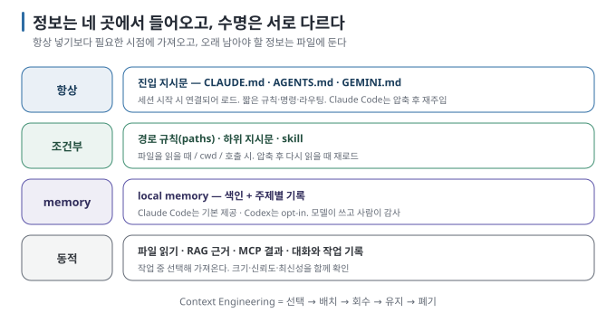

# 01. Agent가 판단할 때 보는 것

> 이 문서는 [`README.md`](README.md)의 1장입니다. 다음 → [`02-entry-instructions.md`](02-entry-instructions.md)

## 이 장에서 답하는 질문

- 내가 한 줄을 입력하기 전에 모델은 이미 무엇을 보고 있는가
- 정보는 어디에서 들어오고 언제 사라지는가
- Context Engineering은 프롬프트 작성과 무엇이 다른가

## 1. 첫 요청 전에 이미 들어온 것

코딩 에이전트의 세션이 시작되면 사용자가 아무것도 입력하지 않아도 컨텍스트 창은 이미 채워져 있습니다. 다음 표는 그 구성을 이해하기 위한 순서입니다. 토큰 수는 모델·제품·설정에 따라 달라지므로 고정값으로 보지 않습니다.

| 순서 | 무엇 | 내가 설계하는 부분 |
| --- | --- | --- |
| 1 | 제품의 system prompt·도구 사용 규칙 | 도구가 소유하므로 직접 바꾸기 어렵다 |
| 2 | 환경 정보와 사용 가능한 도구·Skill 목록 | 연결하거나 설치한 범위 |
| 3 | 사용자·프로젝트 진입 지시문 | 파일의 내용과 배치 |
| 4 | 로컬 memory 색인 | 켜기·끄기, 감사와 정리 |
| 5 | 이번 요청과 대화 이력 | 질문, 제약, 완료 조건 |
| 6 | 작업 중 읽은 파일·검색 결과·MCP 결과 | 무엇을 언제 얼마나 가져올지 |

그리고 작업이 진행되면서 파일 읽기(수천 토큰씩), 경로 조건 규칙, hook 출력, 명령 결과, 서브에이전트 요약이 쌓입니다. 실습에서 작은 Python 과제 한 번에 Claude Code의 캐시 읽기 토큰은 7.5만~20만이었다 [실행 검증 · 실습 05]. 시작 컨텍스트를 보여 주는 공식 예시는 약 1.4만~2만 토큰이었고, 그 안에서 지시문은 짧은 변형이 1천 토큰 미만, 긴 변형이 약 6천 토큰이었다 [문서 확인 · 실행 검증]. **내가 설계하는 것은 전체의 일부이지만**, 세션마다 반복되고 모델의 첫 판단을 좌우하는 부분입니다.

## 2. 출처와 수명 주기로 보기

| 출처 | 언제 들어가나 | 대표 예 | 이 가이드의 장 |
| --- | --- | --- | --- |
| **진입 지시문** | 항상, 세션 시작 | `CLAUDE.md`, `AGENTS.md`, `GEMINI.md` | 02 |
| **조건부 지시문** | 조건 충족 시 — 파일 경로, 하위 디렉터리, 호출 | `.claude/rules/*.md`(`paths`), 하위 `CLAUDE.md`·`AGENTS.md`, skill | 03 |
| **로컬 memory** | 세션 시작(색인) + 필요 시(본문) | Claude Code·Codex의 `MEMORY.md`와 주제 파일 | 04 |
| **동적 컨텍스트** | 작업 중 — 파일 읽기, 검색, 도구 결과, 서브에이전트 | Read·Grep·MCP 결과, subagent 요약, RAG | 05, [rag-and-graph](../local-rag/README.md) |

[Agent Skills 가이드 01장](../agent-skills/01-why-skills.md)의 "항상 vs 필요할 때"라는 구분이 여기서 네 종류의 정보로 펼쳐집니다. Skill은 조건부 지시문의 한 형태이고, MCP와 RAG의 결과는 작업 중 들어오는 동적 컨텍스트입니다. [Local LLM 앱 연동 가이드](../local-llm-app-integration/README.md)에서 직접 조립한 `messages`와 tool result도 같은 자리에 놓입니다.

## 3. 컨텍스트 엔지니어링이란

Anthropic의 정의를 빌리면, Context Engineering은 추론 시점에 모델이 보는 **토큰 집합 전체를 고르고 유지하는 일입니다.** 지시문뿐 아니라 도구·외부 데이터·대화 이력도 여러 턴에 걸쳐 다룬다 [자료 확인 · Anthropic 2025-09-29]. 프롬프트 작성은 그중 "무엇을 어떻게 지시할지"에 초점을 둔 중요한 한 부분입니다.

- **주의 예산(attention budget)**: 컨텍스트가 길어질수록 그 안의 정보를 정확히 꺼내는 능력이 떨어진다(context rot). 토큰은 공짜가 아니라 주의를 나눠 쓰는 자원입니다.
- **"원하는 결과를 최대화하는 가장 작은 고신호 토큰 집합을 찾아라."**

이 가이드는 그 원칙을 코딩 에이전트의 파일과 도구 수준으로 구체화합니다. 정보를 고르는 데서 끝나지 않고 **선택 → 배치 → 회수 → 유지 → 폐기의** 수명 주기를 다룹니다.

## 4. 실습이 보여 준 것 한 가지 먼저

실습의 첫 라운드에서 지시문을 **아예 주지 않은** 상태로 과제를 시켰더니 두 도구 모두 규칙 5개를 전부 지켰습니다(3/3회). 기존 코드가 이미 그 규칙을 따르고 있었기 때문에 모델이 코드에서 관례를 **추론했습니다.** 다만 지시문이 없을 때 Claude Code는 8턴·캐시 읽기 16.8만 토큰을, 짧은 지시문이 있을 때는 4턴·7.5만 토큰을 썼습니다 [실행 검증 · 실습 01]. 지시문의 첫 효과는 준수율이 아니라 **탐색 비용이었습니다.** 코드에서 읽어 낼 수 있는 것을 지시문에 적는 것은 낭비이고, 코드에서 읽어 낼 수 없는 것을 적지 않는 것은 탐색 비용입니다. 이 둘을 구분하는 것이 이 가이드의 반복 주제입니다.

## 이 장을 끝내면

- 세션 시작 시 컨텍스트에 무엇이 어떤 순서로 들어가는지 말할 수 있습니다.
- 네 출처(진입·조건부·memory·동적)를 구분합니다.
- "코드에서 추론 가능한가"를 지시문 작성의 첫 질문으로 둡니다.
