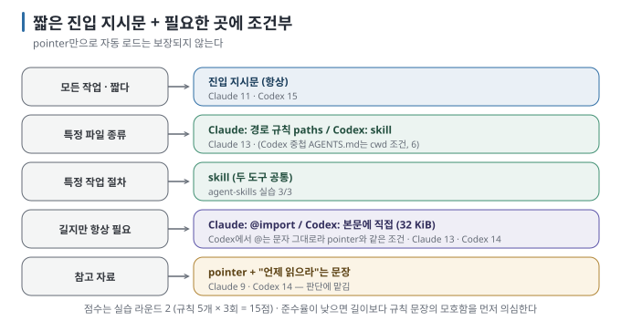

# 03. 항상 vs 조건부 — 규칙·하위 지시문·skill·pointer

> 이전 ← [`02-entry-instructions.md`](02-entry-instructions.md) · 다음 → [`04-memory.md`](04-memory.md)

## 이 장에서 답하는 질문

- 항상 로드하지 않고 "필요할 때만" 넣는 방법은 몇 가지이며 각각 언제 켜지는가
- "자세한 건 이 파일을 봐"라고 가리키기만 하면 읽는가
- 두 도구에서 같은 의도가 어떻게 다르게 동작하는가

## 1. 조건부 로드의 네 형태

| 형태 | 켜지는 조건 | Claude Code | Codex |
| --- | --- | --- | --- |
| **경로 조건 규칙** | 조건에 맞는 **파일을 읽을 때** | `.claude/rules/*.md` + `paths:` glob. `paths` 없으면 항상 로드 | — (상응 기능 없음) |
| **하위 디렉터리 지시문** | 그 디렉터리의 파일을 읽을 때 / cwd 경로 | 하위 `CLAUDE.md`: 파일을 읽을 때 로드 | 하위 `AGENTS.md`: **cwd가 그 아래일 때만**(루트→cwd 경로) |
| **Skill** | 사용자가 부르거나 모델이 description 보고 선택 | `.claude/skills`(하위 디렉터리도 파일 접근 시 발견) | `.agents/skills` |
| **pointer** | 모델이 읽기로 **판단할** 때 | `@import`는 항상 로드(조건부 아님). 문장으로 가리키면 판단에 맡김 | 문장으로 가리키면 판단에 맡김 |

세 번째는 [agent-skills 가이드](../agent-skills/README.md)에서 다뤘습니다. 이 장에서는 나머지 세 가지를 실습으로 살펴봅니다.

## 2. 실측 — 같은 규칙 5개를 어디에 두느냐

규칙은 고정하고 두는 자리만 바꿨습니다. 과제도 작은 함수 추가, 테스트, CHANGELOG 수정으로 고정했습니다. 각 조건을 3회씩 실행하고 5점 만점으로 판정했습니다 [실행 검증 · 실습 03·04].

| 두는 자리 | Claude Code | Codex | 비고 |
| --- | --- | --- | --- |
| 진입 지시문에 직접 (짧게) | 11/15 | 15/15 | 기준 |
| 진입 지시문에 **pointer만** ("규칙은 `docs/RULES.md`를 따른다") | **9/15** | 14/15 | Claude는 3회 모두 RULES.md를 읽었다고 답했지만 점수는 기준보다 낮음 |
| 진입 지시문에 **`@docs/RULES.md` import** | 13/15 | 14/15 | Claude: import는 시작 시 로드. Codex: `@`는 문자 그대로 → pointer와 같은 결과 |
| **경로 조건 규칙** `.claude/rules/python.md` (`paths: **/*.py`) / Codex는 `src/AGENTS.md` | 13/15 | **6/15** | Claude: `.py`를 읽는 순간 로드. Codex: cwd가 루트라 `src/AGENTS.md`는 자동 로드되지 않았고, 모델이 파일로 읽고도 3/5 규칙을 놓침 |

읽히는 것 세 가지:

- **pointer는 조건부 로드가 아닙니다.** 모델이 읽을지 말지를 판단하고, 읽어도 "지시"보다 "참고"로 취급하는 경향이 보였습니다. Claude Code에서 pointer(9)와 import(13)의 차이가 그것입니다. 조건부로 넣고 싶으면 도구가 제공하는 조건부 기제(경로 규칙·skill)를 씁니다.
- **경로 조건 규칙은 Claude Code에서 잘 작동했습니다.** 파일을 읽는 순간 규칙이 들어오므로 "그 파일을 만지는 작업"에 정확히 맞습니다. 다만 시작 시에는 없으므로 파일을 읽기 전에 결정하는 일(어디에 파일을 만들지)에는 늦을 수 있습니다 [해석].
- **Codex의 하위 AGENTS.md는 경로 조건이 아니라 cwd 조건입니다.** `src/`에서 실행해야 로드됩니다. 루트에서 실행하면 그냥 파일입니다. Codex에서 "특정 디렉터리 규칙"을 조건부로 주는 방법은 사실상 skill뿐입니다.

## 3. Claude Code 규칙 파일의 동작 [문서 확인]

- `.claude/rules/*.md`를 재귀로 찾습니다. `paths` 없는 파일은 시작 시 `.claude/CLAUDE.md`와 같은 우선순위로 로드.
- `paths`는 glob(`src/**/*.ts`, `*.md`, brace `{ts,tsx}`). **파일을 읽을 때** 매칭되면 로드되고, 터미널에 "Loaded .claude/rules/…" 한 줄이 보입니다.
- 사용자 규칙 `~/.claude/rules/`는 프로젝트 규칙보다 먼저 로드(프로젝트가 우선).
- symlink 허용 — 여러 프로젝트가 규칙을 공유할 수 있습니다.
- 압축(compaction) 후: `paths` 규칙은 대화 이력과 함께 요약되고, 그 뒤 해당 파일을 다시 읽을 때 재로드됩니다. 압축 이후에도 반드시 살아야 하는 규칙은 `paths`를 빼거나 루트 지시문에 둡니다. 자세한 내용은 5장에서 다룹니다.

## 4. 어디에 둘지 결정 순서

| 필요한 범위 | 둘 자리 |
| --- | --- |
| 모든 작업에 필요한 짧은 규칙 | 진입 지시문 |
| 특정 파일 종류에만 필요한 규칙 | Claude Code 경로 규칙 / Codex Skill, 또는 cwd가 고정된 하위 `AGENTS.md` |
| 여러 단계 작업 절차 | Skill |
| 길지만 항상 필요한 규칙 | Claude Code import / Codex 진입 지시문 한도 안의 본문 |
| 필요할 때 확인할 참고 자료 | pointer와 함께 읽을 시점을 명시 |

마지막 줄이 중요합니다. pointer를 쓸 때는 "규칙은 X를 따른다"가 아니라 **"`.py` 파일을 만들기 전에 `docs/RULES.md`를 읽는다"처럼** 읽을 시점을 적습니다. 모델이 판단할 여지를 줄일 수 있습니다.

## 5. 로드 여부 확인

- Claude Code: `/context`의 Memory files, 터미널의 "Loaded …" 줄, `InstructionsLoaded` hook으로 기록 [문서 확인]. 비-대화형 `-p`에서는 결과 JSON에 규칙 파일 이름이 남는지로 간접 확인했다 [실행 검증].
- Codex: transcript에 `sed … src/AGENTS.md` 같은 **파일 읽기 줄이** 보이면 자동 로드가 아니라 모델이 읽은 것입니다. 자동 로드된 지시문은 transcript에 나타나지 않는다 [실행 검증].

## 이 장을 끝내면

- 조건부 로드 네 형태와 각각의 켜지는 조건을 도구별로 말할 수 있습니다.
- pointer가 조건부 로드가 아님을 실측으로 설명할 수 있습니다.
- 규칙을 둘 자리를 결정 순서로 고릅니다.
