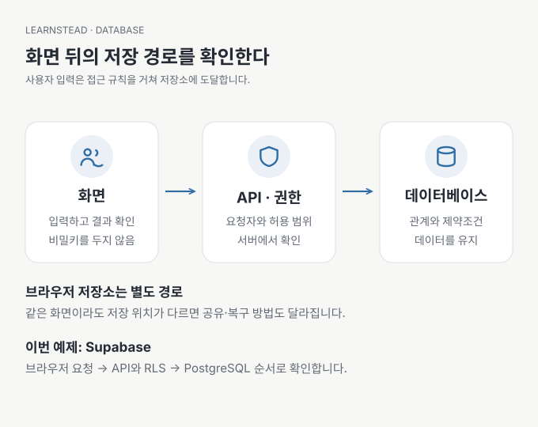

# 01. 저장 버튼을 눌렀는데, 어디에 저장됐을까?

[이전: 가이드 소개](README.md) · [목차](README.md) · [다음: 02. 내 앱에는 어떤 DB가 필요할까?](02-choose-a-database.md)

스터디 신청 화면에 이름이 나타났습니다. 새로고침하면 사라질 수도 있고, 내 컴퓨터에서는 보이지만 다른 사람에게는 보이지 않을 수도 있습니다. 이 차이를 설명할 수 있으면 DB를 선택하기 전에 가장 중요한 질문 하나를 해결한 셈입니다.

이 장의 결과는 **내 앱이 데이터를 보관하는 위치를 설명하는 것입니다**. SQL이나 설치 지식은 필요하지 않습니다. 이미 앱을 만들었다면 아래 표와 자신의 앱부터 대조해 보세요.

## 화면, 프로그램, 저장소를 나누어 보기

화면의 목록은 저장소 자체가 아닙니다. 프로그램은 저장소에서 읽어 온 값을 화면에 그릴 수도 있고, 임시로 만든 목록만 보여 줄 수도 있습니다. DB(database)는 데이터를 구조에 맞춰 저장하고 찾아 쓰는 곳이고, DBMS는 그 일을 처리하는 프로그램입니다. 일상에서는 둘을 묶어 ‘DB’라고도 부릅니다.

| 위치 | 신청 내역을 담는 예 | 어디까지 기대할 수 있나 |
| --- | --- | --- |
| 프로그램 메모리 | 실행 중인 배열·변수 | 프로세스가 종료되면 잃을 수 있음 |
| 브라우저 저장소 | `localStorage`, IndexedDB | 같은 브라우저 환경에 남을 수 있지만 다른 기기에 자동 공유되지 않음 |
| 로컬 파일 | JSON, CSV, SQLite 파일 | 파일이 유지되는 장치에 남음. 삭제·교체·저장장치 장애는 별도 문제 |
| 서버의 DB | PostgreSQL 등 | 여러 기기가 같은 서비스를 통해 접근 가능. 권한과 백업이 필요 |

브라우저 저장도 쓸모가 있습니다. 테마 설정이나 임시 작성 내용처럼 특정 기기에만 있어도 되는 데이터에 적합할 수 있습니다. 반대로 여러 사람이 함께 보는 신청 명단이라면 공통으로 접근할 저장소가 필요합니다. 인터넷 없이 쓰는 개인 기록장은 로컬 DB가 더 단순할 수 있습니다.

‘저장된다’는 말에는 기간과 조건이 빠져 있습니다. **앱을 다시 실행해도 남는다는 것과 영원히 사라지지 않는다는 것은 다릅니다.** 서버 DB도 잘못된 삭제, 계정 해지, 저장장치 장애로 잃을 수 있습니다. 계속 남기는 장치와 잃은 뒤 되살리는 장치를 따로 생각합니다.

## 가장 짧게 확인하는 방법

자신의 앱에 가상 이름 `연습 사용자 A`를 넣고 다음을 관찰합니다. 실제 서비스나 실제 개인정보로 시험하지 않습니다.

1. 새로고침 뒤 값이 남는지 봅니다.
2. 앱을 종료하고 다시 실행한 뒤 조회합니다.
3. 다른 브라우저에서 같은 계정으로 조회합니다. 계정 기능이 없다면 다른 브라우저가 별도 사용자라는 점을 기록합니다.
4. AI에게 저장 코드와 읽는 코드, 저장소 위치를 찾아 설명하게 합니다.

1번 통과만으로 DB 사용이 증명되지는 않습니다. 브라우저 저장소도 새로고침을 견딜 수 있습니다. 3번에서 다르게 보여도 오류라고 단정하지 않습니다. 사용자별 접근 규칙 때문일 수 있기 때문입니다. 화면 관찰과 실제 연결 대상 설명을 함께 남깁니다.

앱이 없다면 [DB 안전 실습](../../labs/database-safety/README.md)의 SQLite 시작 경로로 파일에 쓰고 다시 읽어 보세요. 클라우드 계정 없이 저장을 관찰한 뒤 다음 장으로 돌아올 수 있습니다.

## AI에게 부탁할 말

> 이 앱의 신청 정보가 저장되는 곳을 찾아 설명해 줘. 화면 상태, 브라우저 저장소, 서버 메모리, DB를 구분하고, 실제로 쓰고 읽는 코드 위치를 알려 줘. 새로고침, 서버 재시작, 다른 기기 접속에서 무엇이 유지되는지 설명해 줘. 비밀값이나 실제 사용자 데이터는 출력하지 마.

확인할 결과는 제품명이 적힌 답변보다 구체적이어야 합니다. ‘신청 버튼 → 이 API → 이 DB의 registrations → 목록 조회 API’처럼 한 데이터가 움직이는 길을 따라갈 수 있어야 합니다.

## 배포하면 파일 위치도 달라진다

내 컴퓨터에서 SQLite 파일에 저장한 앱을 그대로 배포해도 같은 보관 조건이 보장되지는 않습니다. 배포 플랫폼의 실행 공간이 임시이거나 실행 인스턴스마다 분리될 수 있습니다. 예를 들어 Vercel은 로컬 SQLite 파일과 서버리스 파일시스템의 제약을 설명합니다. 서버에서 SQLite를 쓸 수 있는 환경도 있으므로 제품 이름만으로 가능·불가능을 일반화하지 않습니다. `문서 확인 · 2026-09-13` — [Vercel의 SQLite 안내](https://vercel.com/kb/guide/is-sqlite-supported-in-vercel).

다음 장에서는 ‘DB를 붙여 줘’라고 요청하기 전에 무엇을 선택해야 하는지 살펴봅니다.

---

[이전: 가이드 소개](README.md) · [목차](README.md) · [다음: 02. 내 앱에는 어떤 DB가 필요할까?](02-choose-a-database.md)
