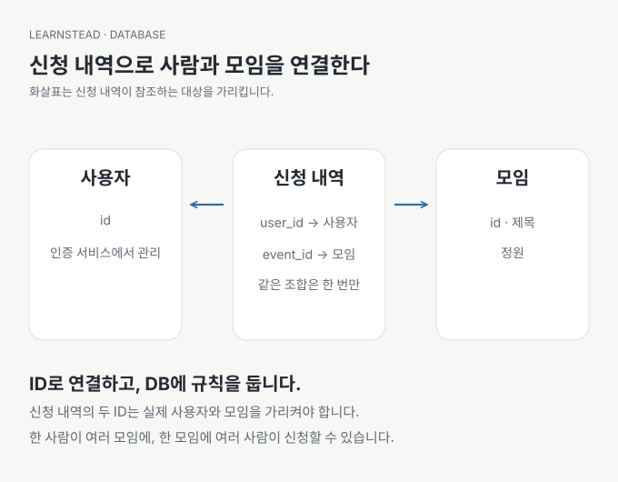

# 03. 데이터를 어떤 모양으로 나눌까?

[이전: 02. 내 앱에는 어떤 DB가 필요할까?](02-choose-a-database.md) · [목차](README.md) · [다음: 04. 앱은 DB에 어떻게 부탁할까?](04-talk-to-the-database.md)

신청자 이름 옆에 모임 이름을 써 둔 표 하나로도 첫 화면을 만들 수 있습니다. 그런데 모임 이름이 바뀌면 모든 신청 행을 수정해야 하고, 동명이인이 생기면 누구의 신청인지 헷갈립니다. 데이터 구조는 이런 변경을 견디도록 정합니다.

이 장의 결과는 **사용자·모임·신청의 관계를 작은 그림으로 설명하는 것입니다**. 첫 설계에서는 필드를 많이 만드는 대신 무엇을 서로 구분해야 하는지 먼저 적습니다.

## 신청은 사람도 모임도 아니다

| 대상 | 식별자 예 | 함께 보관하는 값 |
| --- | --- | --- |
| 사용자 | `user_id` | 인증 서비스가 관리하는 계정 식별자 |
| 모임 `events` | `id` | 제목 `title`, 정원 `capacity` |
| 신청 `registrations` | `id` | 모임 `event_id`, 신청자 `user_id`, 메모 `note` |

테이블은 같은 종류의 기록을 모아 둔 구조이고, 한 행은 개별 기록입니다. 열은 제목·정원 같은 항목입니다. ID는 한 기록을 안정적으로 가리키는 값입니다. 사람 이름과 화면의 행 번호는 바뀌거나 중복될 수 있으므로 ID를 대신하기 어렵습니다.



한 사용자는 여러 모임에 신청할 수 있고 한 모임에는 여러 사용자가 신청합니다. 그래서 가운데 ‘신청’을 별도 기록으로 둡니다. 사용자와 모임 사이의 관계에 신청 메모나 신청 시각처럼 자체 정보가 생기기 때문입니다.

## 구조와 규칙을 함께 적기

스키마(schema)는 테이블·열·타입·관계 같은 데이터 구조의 약속입니다. 제약조건(constraint)은 저장할 때 DB가 지켜야 할 규칙입니다. ‘한 사람이 같은 모임에 한 번만 신청한다’는 문장을 `(event_id, user_id)` 조합의 고유 제약으로 옮길 수 있습니다.

외래키(foreign key)는 신청의 `event_id`가 실제 모임을 가리키도록 돕습니다. 모임 삭제 시 신청도 지울지, 모임 삭제를 막을지는 별도 선택입니다. AI가 자동으로 `CASCADE`를 붙였다면 연쇄 삭제되는 데이터를 먼저 확인합니다. `문서 확인 · 2026-09-13` — [PostgreSQL 제약조건](https://www.postgresql.org/docs/current/ddl-constraints.html).

SQLite는 외래키 선언만 보고 활성화됐다고 가정하면 안 됩니다. 사용하는 연결에서 `PRAGMA foreign_keys`의 결과를 확인하고 필요한 설정을 적용합니다. 다른 연결도 같은지 확인해야 합니다. `문서 확인 · 2026-09-13` — [SQLite 외래키 지원](https://www.sqlite.org/foreignkeys.html).

## ‘빈 값’과 ‘0’을 구분하기

신청 인원이 0명인 것과 아직 집계하지 않은 것은 다릅니다. SQL의 `NULL`은 값이 없거나 알려지지 않았음을 표현합니다. 빈 문자열 `''`이나 숫자 `0`과 같은 값으로 취급하지 않습니다. NULL을 허용하면 화면에서 무엇으로 보이고 집계에서 어떻게 처리할지 정해야 합니다.

날짜도 의미부터 정합니다. 모임 날짜만 필요하면 날짜를 저장하고, 실제 시작 순간이 중요하면 시간대까지 고려한 시각을 사용합니다. `2026-10-01 19:00`만으로는 어느 지역의 19시인지 알 수 없습니다. 저장 기준과 사용자에게 보여 줄 시간대를 구분합니다.

금액에는 통화와 단위가 필요합니다. 원화 정수 금액이라면 ‘원 단위 정수’라고 약속할 수 있고, 소수 단위가 필요한 통화나 계산에는 정확한 소수 타입과 반올림 규칙을 검토합니다. 일반적인 부동소수 타입을 사용하고 화면의 반올림만으로 오차를 숨기지 않습니다. 이 예제는 결제를 구현하지 않습니다.

## 문서 DB에서는 어떻게 보일까?

설명을 위한 문서 하나는 이렇게 생길 수 있습니다. 실행 명령이나 이 시리즈의 실제 DB 구조는 아닙니다.

```json
{
  "event_id": "reading-01",
  "title": "토요일 독서 모임",
  "venue": {"room": "연습방", "online": false}
}
```

자주 함께 읽는 작은 장소 정보를 모임 안에 넣는 것은 자연스러울 수 있습니다. 반면 계속 늘어나는 모든 신청을 한 문서 안에 넣을지는 크기·동시 갱신·권한·조회 방식을 고려해야 합니다. 같은 모임 제목을 여러 문서에 복제했다면 제목을 바꿀 때 어디까지 갱신할지도 정합니다. 테이블이 없다고 관계와 중복 문제가 사라지지는 않습니다.

## AI에게 부탁할 말

> 스터디 앱의 사용자, 모임, 신청을 나눠서 설명해 줘. 각 기록의 ID, 필수값, 중복 금지, 다른 기록과의 관계를 표로 보여 줘. 모임을 삭제하면 기존 신청에 어떤 영향이 있는지도 알려 줘. 코드 작성 전 가상 데이터 세 건으로 구조를 설명해 줘.

사람이 볼 것은 필드 개수보다 바뀌는 상황입니다. ‘동명이인 둘’, ‘모임 이름 변경’, ‘같은 사람의 두 번째 신청’이 생겨도 의도를 유지하는지 말로 따라가 보세요.

---

[이전: 02. 내 앱에는 어떤 DB가 필요할까?](02-choose-a-database.md) · [목차](README.md) · [다음: 04. 앱은 DB에 어떻게 부탁할까?](04-talk-to-the-database.md)
