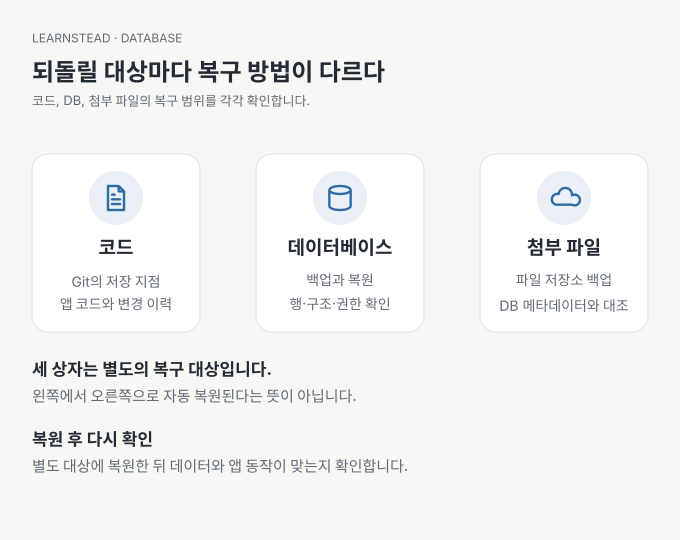

# 08. 데이터가 늘거나 사라지면 어떻게 할까?

[이전: 07. AI에게 DB 변경을 어떻게 맡길까?](07-change-without-losing-data.md) · [목차](README.md) · [다음: 09. 다른 사람에게 공개해도 될까?](09-ready-to-share.md)

신청자가 열 명일 때는 빨랐던 목록이 수천 명이 되면 느려질 수 있습니다. 반대로 사고는 단 한 건의 기록에서도 발생합니다. 규모가 커졌을 때의 조회와 잃었을 때의 복구를 처음부터 작게 연습해 둡니다.

이 장의 결과는 **속도·비용·복구를 확인할 질문을 갖는 것입니다**. 성능 수치나 요금제별 한도를 외우지 않습니다.

## 필요한 만큼, 일정한 순서로 읽기

모든 기록과 모든 열을 매번 내려받는 대신 화면에서 필요한 범위를 조회합니다. 페이지 나누기는 한 번에 가져올 양을 제한합니다. `LIMIT`만 넣으면 페이지 간 순서가 안정적으로 유지된다는 보장은 없습니다. 같은 제목이나 시각이 있을 때도 구분되도록 ID까지 정렬 기준에 포함하는 식으로 순서를 명확히 합니다. `문서 확인 · 2026-09-13` — [PostgreSQL LIMIT과 OFFSET](https://www.postgresql.org/docs/current/queries-limit.html).

인덱스(index)는 특정 조건의 데이터를 빨리 찾도록 돕는 추가 구조입니다. 책의 찾아보기처럼 생각할 수 있지만 모든 열에 만들면 좋은 것은 아닙니다. 저장 공간과 쓰기 비용이 들고, 실제 조회 형태와 맞아야 합니다. ‘느리다’는 말만으로 DB를 바꾸기 전에 어떤 조회가 느린지, 얼마나 많은 데이터를 읽는지 확인합니다. `문서 확인 · 2026-09-13` — [PostgreSQL 인덱스 소개](https://www.postgresql.org/docs/current/indexes-intro.html).

> 🔧 한 단계 더: 데이터가 계속 추가되는 목록에서는 OFFSET 기반 페이지가 중복·누락을 만들 수 있습니다. 마지막으로 본 정렬값을 기준으로 다음 구간을 읽는 커서 방식도 검토합니다. 이 가이드는 대규모 페이지 처리 성능을 측정하지 않았습니다.

## 저장 공간만 비용이 아니다

관리형 서비스의 비용은 저장량 외에도 읽기·쓰기·네트워크·백업·계산 자원에 따라 달라질 수 있습니다. Firestore는 읽기와 쓰기 등의 사용량이 과금에 반영되고 실시간 리스너도 읽기를 발생시킬 수 있습니다. 화면 하나가 실제로 몇 번 조회하는지 모르면 작은 데이터로도 예상 밖 사용량이 생길 수 있습니다. `문서 확인 · 2026-09-13` — [Firestore 과금 구조](https://firebase.google.com/docs/firestore/pricing).

정해진 무료 한도 숫자를 오래된 글에서 복사하기보다 발행일과 현재 요금 페이지를 대조합니다. 예산 알림이 사용을 강제로 중단하는 기능인지도 별도로 확인합니다. 이 시리즈는 유료 사용량을 측정하거나 특정 서비스 비용을 보장하지 않습니다.

## 백업은 별도 대상에 복원해 보기

백업 파일 생성 성공은 복구 성공과 다릅니다. 복구 연습은 원래 DB를 바로 덮어쓰지 않고 별도 대상에 복원한 뒤 비교하는 방식으로 시작합니다. 대표 기록 몇 개, 전체 개수, 관계, 새 기록 저장과 사용자별 접근을 함께 확인합니다.

SQLite가 사용 중일 때 파일을 무작정 복사하면 원하는 시점의 일관된 백업을 얻지 못할 수 있습니다. 공식 backup API 같은 해당 DB의 백업 방법을 사용합니다. `문서 확인 · 2026-09-13` — [SQLite backup API](https://www.sqlite.org/backup.html).

Supabase의 DB 백업에는 Storage API에 저장된 파일 본체가 포함되지 않습니다. DB에 파일 경로가 복원되어도 이미지 자체는 사라져 있을 수 있습니다. 첨부 파일을 쓰는 앱은 파일·메타데이터·접근 규칙의 복구 범위를 함께 정합니다. `문서 확인 · 2026-09-13` — [Supabase 백업 범위](https://supabase.com/docs/guides/platform/backups).

## ‘얼마나 잃어도 되는가’를 먼저 정하기

하루 한 번 백업한다면 사고 시 마지막 백업 이후 기록을 잃을 수 있습니다. 이것을 시간으로 표현한 목표가 RPO입니다. 복구에 허용하는 시간이 RTO입니다. 용어보다 ‘최대 몇 시간의 기록 손실을 감당할 수 있는가’, ‘몇 시간 안에 다시 열어야 하는가’를 정하는 것이 먼저입니다.

백업을 원본과 같은 장치에만 두면 장치 장애에서 둘을 함께 잃을 수 있습니다. 백업에도 실제 데이터가 들어 있으므로 읽기 권한·보관 기간·삭제 방법을 정합니다. 실습에서는 가상 데이터만 사용합니다.

## 다른 서비스로 옮길 수 있을까?

CSV 내보내기는 기록을 확인하는 데 유용하지만 DB의 권한 정책, 제약조건, 함수, 인증 사용자, 파일 저장소까지 옮기지는 않습니다. PostgreSQL 기반 서비스를 쓰더라도 플랫폼 전용 기능은 따로 이전해야 할 수 있습니다. 작은 가상 데이터로 내보내고 다른 환경에서 읽어 보는 것이 이전 가능성을 판단하는 출발점입니다.

## AI에게 부탁할 말

> 목록 화면에서 요청 횟수와 반환 건수를 확인해 줘. 필요 이상으로 읽는 부분과 인덱스 후보를 근거와 함께 제안해 줘. 백업은 별도 복원 대상에서 시험하고 기록 개수, 관계, 권한, 첨부 파일의 포함 여부를 나눠 보고해 줘. 검증하지 않은 복원 대상도 적어 줘.

복구 결과를 [데이터 관리 카드](DATA-CARD.md)에 기록합니다. 마지막 성공 날짜와 실제로 복원한 범위가 있어야 다음 사람이 같은 작업을 이어받을 수 있습니다.

---

[이전: 07. AI에게 DB 변경을 어떻게 맡길까?](07-change-without-losing-data.md) · [목차](README.md) · [다음: 09. 다른 사람에게 공개해도 될까?](09-ready-to-share.md)
