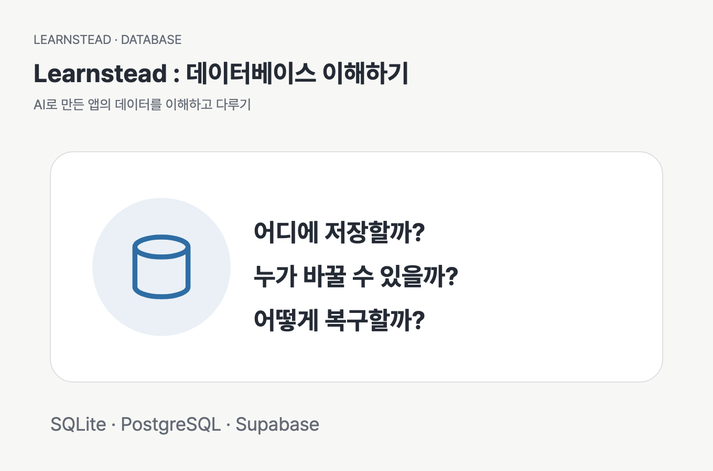

# AI로 만든 앱의 데이터, 이해하고 다루기 — 비개발자를 위한 데이터베이스

[시작: 저장 위치](01-where-data-lives.md) · [직접 만들기](../../tutorials/study-signup-db/README.md) · [실패 확인 실습](../../labs/database-safety/README.md)

AI가 만든 앱에 ‘저장’ 버튼이 생겼습니다. 이제 데이터가 어디에 남는지, 다른 사용자가 무엇을 볼 수 있는지, 잘못 바뀌면 어떻게 되살릴지 알아볼 차례입니다.

이 가이드는 코드를 깊이 읽기 어려운 사람도 **앱이 데이터를 다루는 방식을 설명하고 확인하도록** 돕습니다. 스터디 모임 신청 앱을 공통 예로 삼아 SQLite·PostgreSQL·MySQL·MongoDB·Cloud Firestore를 비교하고, 저장 구조·접근 권한·변경·복구를 연결합니다.

## 누구를 위한 자료인가요?

AI와 작은 웹앱이나 개인 도구를 만들고 있으며, DB를 연결하라는 제안을 받았거나 저장 기능을 추가하려는 독자를 대상으로 합니다. 파일과 폴더, 브라우저, 터미널이 무엇인지 알면 읽을 수 있습니다. SQL·서버 운영·클라우드 계정은 가이드를 읽기 위한 전제가 아닙니다.

읽고 나면 자신의 앱에 대해 다음을 설명할 수 있습니다.

- 무엇을 어디에 저장하며, 언제까지 유지되는가?
- 어떤 기록을 서로 연결하고, 어떤 잘못된 입력을 막는가?
- 누가 읽고 바꿀 수 있으며, 그 거절을 어떻게 확인했는가?
- 기존 데이터가 있을 때 어떻게 변경하고, 사고 뒤 무엇을 복원하는가?

DB 관리자 자격 과정, 대규모 성능 튜닝, 결제 시스템, 개인정보 법률 판단은 다루지 않습니다. 예제는 가상 데이터로 학습하는 작은 앱입니다.

## 가장 짧은 경로

저장 위치가 궁금하다면 **01장 → 03장 → 06장 → 09장을** 먼저 읽고 [데이터 관리 카드](DATA-CARD.md)를 채워 보세요. 선택부터 차근차근 이해하려면 아래 순서대로 읽습니다.

계정 없이 먼저 손으로 확인하고 싶다면 [DB 안전 실습](../../labs/database-safety/README.md)의 SQLite 경로로 이동합니다. 완성 앱을 따라 만들고 싶다면 [신청 앱 튜토리얼](../../tutorials/study-signup-db/README.md)을 읽습니다. 해당 자료에서 설치 전제와 검증 환경을 먼저 확인합니다.

## 목차

- [01. 저장 버튼을 눌렀는데, 어디에 저장됐을까?](01-where-data-lives.md)
- [02. 내 앱에는 어떤 DB가 필요할까?](02-choose-a-database.md)
- [03. 데이터를 어떤 모양으로 나눌까?](03-model-your-data.md)
- [04. 앱은 DB에 어떻게 부탁할까?](04-talk-to-the-database.md)
- [05. 틀린 데이터가 들어오면 누가 막을까?](05-keep-data-consistent.md)
- [06. 로그인하면 내 데이터만 보일까?](06-permissions-and-keys.md)
- [07. AI에게 DB 변경을 어떻게 맡길까?](07-change-without-losing-data.md)
- [08. 데이터가 늘거나 사라지면 어떻게 할까?](08-operate-and-recover.md)
- [09. 다른 사람에게 공개해도 될까?](09-ready-to-share.md)
- [10. 데이터베이스 용어집](10-glossary.md)

## 개념과 실제 실행의 경계

이 가이드는 개념과 선택 기준이 중심입니다. SQL 블록은 별도 표시가 없다면 읽기 위한 예이며, 기존 DB에 붙여 넣는 설치 스크립트가 아닙니다. 전체 실행 명령과 결과는 튜토리얼·실습에 둡니다.

`문서 확인 · 2026-09-13`: 제품 기능은 [공식 출처](SOURCES.md)를 확인했습니다. MySQL·MongoDB·Firestore의 설치와 운영은 이 시리즈에서 직접 실행한 경로가 아닙니다. 로컬 Supabase에서 확인한 내용을 클라우드 운영 검증으로 일반화하지 않습니다. 정확한 실행 범위는 [검증 기록](VALIDATION.md)에서 구분합니다.

공통 앱에서 모임 목록도 로그인 후 조회합니다. 브라우저의 로그인 상태와 DB에 보관된 신청은 서로 다르므로, 새로고침 후 다시 로그인해야 해도 신청 데이터가 사라졌다는 뜻은 아닙니다.

## 함께 사용할 자료

- [데이터 관리 카드](DATA-CARD.md): 자신의 앱에 남길 저장·권한·변경·복구 기록
- [튜토리얼 — 작은 신청 앱 만들기](../../tutorials/study-signup-db/README.md): 한 경로로 구축하기
- [실습 — 저장됐다고 끝이 아니다](../../labs/database-safety/README.md): 고정된 정상·실패·복원 조건 판정하기
- [출처](SOURCES.md) · [검증 기록](VALIDATION.md) · [변경 기록](CHANGELOG.md)

---

[시작: 01. 저장 위치](01-where-data-lives.md) · [다음 자료: 신청 앱 튜토리얼](../../tutorials/study-signup-db/README.md)
