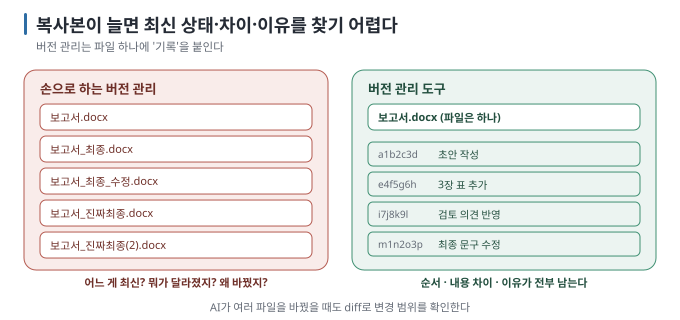
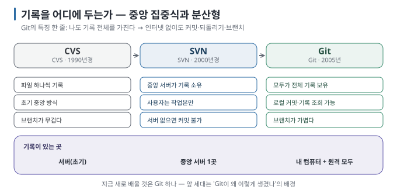

# 01 — 버전 관리란 무엇인가: "최종_진짜최종"에서 Git까지

<!-- learnstead:nav:start -->
[← 이전: 자료 소개](README.md) · [목차](README.md) · [다음: 02 — Git과 GitHub는 다르다: 도구와 서비스](02-git-vs-github.md)
<!-- learnstead:nav:end -->

> **왜 읽나:** `보고서_최종.docx`, `보고서_최종_수정.docx`, `보고서_진짜최종.docx`를 만들어 본 적이 있다면 이미 버전 관리를 손으로
> 하고 있었던 것입니다. Git은 그 일을 대신하는 도구이고, 코드가 아니라도 똑같이 씁니다.
>
> **읽고 나면:** "버전 관리"가 무슨 문제를 푸는지, 중앙 집중식 도구와 Git이 무엇이 다른지, AI 코딩에서 왜 Git이 필요한지
> 설명할 수 있습니다.
>
> **바쁘면:** §0만 읽고 [03](03-setup-mac-windows.md)으로 가도 됩니다.

---

## 0. 결론 먼저 ★

- 버전 관리 = **"언제, 누가, 무엇을, 왜 바꿨는지"를 기록하고, 아무 때나 그 지점으로 돌아갈 수 있게 하는 것.** 파일 복사로도
  하지만 금방 무너집니다. `[원리]`
- 대표 도구를 비교하면 **CVS·SVN은 중앙 집중식**, **Git은 분산형입니다.** 아래의 세 도구를 서로 다른 세 구조로 분류하는 것은 아닙니다. `[원리]`
- 새 프로젝트를 시작한다면 Git부터 익히는 것이 가장 실용적입니다. CVS와 SVN은 Git의 분산 구조가 왜 유용한지 이해하기 위한
  배경으로 다룹니다. `[해석]`
- AI 코딩 도구는 한 번에 여러 파일을 바꿀 수 있습니다. Git이 있으면 **변경 전 상태를 남기고, 바뀐 범위를 확인하고, 필요한
  부분만 되돌릴 수 있습니다.** `[해석]`

## 1. 파일 복사의 한계 — 누구나 해 본 버전 관리

복사본 방식은 세 가지에서 무너집니다. `[원리]`

| 질문 | 복사본 방식 | 버전 관리 도구 |
| --- | --- | --- |
| 어느 것이 최신인가? | 파일명과 수정 시각을 믿어야 함 | 기록이 한 줄로 순서대로 |
| 둘 사이에 **무엇이** 달라졌나? | 두 파일을 열어 눈으로 비교 | 바뀐 줄만 보여 줌(diff) |
| **왜** 바꿨나? | 기억 또는 파일명 힌트 | 바꿀 때 적은 메시지가 남음 |

AI와 코딩하면 변경 범위가 빠르게 커질 수 있습니다. 한 번의 요청으로 여러 파일이 바뀌었을 때 Git의 diff를 보면
"어느 파일의 어느 줄이 바뀌었는가"를 기억에 의존하지 않고 확인할 수 있습니다. `[해석]`

> **초심자용 한 줄:** 버전 관리는 "게임의 세이브 포인트"입니다. 보스전(AI에게 큰 수정 시키기) 전에 세이브하고, 죽으면 거기서
> 다시 시작합니다. 복사본 방식은 세이브 파일 이름을 손으로 짓는 것이고, Git은 저장 지점마다 고유한 ID를 붙이는 것입니다. 단, 파일을 고쳤다고 자동 저장되지는 않고 직접 commit해야 합니다.

## 2. 세 세대 — 기록을 어디에 두는가

| | CVS | SVN (Subversion) | Git |
| --- | --- | --- | --- |
| 기록이 있는 곳 | 중앙 저장소 | **중앙 서버 하나** | **내 컴퓨터에도 전부** + 원격에도 |
| 인터넷 없이 기록 보기·저장하기 | 어려움 | 불가 (서버에 연결해야 함) | **가능** — 커밋·되돌리기·브랜치 전부 로컬 |
| 서버가 죽으면 | 기록 유실 위험 | 기록 유실 위험 | 누구 컴퓨터에나 전체 복사본이 있음 |
| 브랜치(시도 가르기) | 무겁고 드묾 | 저장소 내 복사로 분기 | **가볍고 즉시** — 일상적으로 씀 |
| 단위 | 파일 하나씩 | 변경 묶음(리비전) | 변경 묶음(커밋) + 전체 스냅샷 |

`[원리]` — 핵심 차이는 한 줄입니다. **SVN까지는 "기록은 서버에, 나는 작업본만"이고, Git은 "나도 기록 전체를 가진다"입니다.**
그래서 Git에서는 인터넷이 없어도 커밋하고 되돌리고 브랜치를 만들 수 있고, GitHub에 올리는 것은 **선택입니다**([02](02-git-vs-github.md)).

`[자료 확인 · 2026-08-23]` — 그림의 연도는 대략의 등장 시기입니다. CVS·SVN도 중앙 집중식 버전 관리의 예이며, 이 가이드는 Git의 분산 구조를 이해하기 위한 비교로 다룹니다.

## 3. 왜 Git만 알면 되는가

- 현재 널리 쓰이는 코드 호스팅 서비스와 AI 코딩 도구는 Git 작업 흐름을 기본으로 지원합니다. AI 코딩 도구가
  "커밋할까요?"라고 묻는 것도 보통 Git commit을 뜻합니다. `[문서 확인 · 2026-08-27]`
- GitHub·GitLab·Bitbucket 같은 서비스는 모두 **Git 저장소를 올려 두는 곳입니다.** 서비스는 달라도 Git은 같습니다. `[원리]`
- 앞 세대의 개념(체크아웃·리비전·트렁크)은 Git에도 비슷한 이름으로 남아 있어, 용어가 낯설면 "SVN에서 온 말"인 경우가
  많습니다([13 용어집](13-glossary.md)).

## 4. Git이 하는 일을 한 문장으로

**Git은 폴더의 "현재 상태"를 내가 원할 때마다 사진(스냅샷)으로 찍어 두고, 사진들 사이를 자유롭게 오가게 해 주는 도구입니다.** `[원리]`

선택한 파일 상태를 담은 사진 한 장이 **커밋**, 사진과 기록을 보관하는 곳이 **저장소(repository)**, 같은 기록에서 갈라져 이어지는 시도가 **브랜치입니다.** **GitHub는** 그 저장소의 복사본을 온라인에 두는 서비스입니다. 이 네 단어가 이 가이드의 뼈대이고, 나머지는 전부 이 네 가지의 조작입니다.

> 💬 **AI에게 이렇게 말하세요:** 개념을 확인하고 싶을 때 — "지금 이 프로젝트에 git 기록이 있어? 있으면 최근 저장 지점 5개를
> 한 줄씩 보여 줘." (기록이 없다면 AI가 `git init`부터 제안할 것입니다 — [README 10분 경로](README.md))

<!-- learnstead:footer:start -->

---

[← 이전: 자료 소개](README.md) · [목차](README.md) · [다음: 02 — Git과 GitHub는 다르다: 도구와 서비스](02-git-vs-github.md)

<!-- learnstead:footer:end -->
