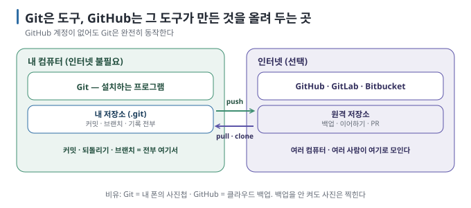

# 02 — Git과 GitHub는 다르다: 도구와 서비스

← [01 버전 관리란](01-what-is-version-control.md) · 다음 → [03 내 컴퓨터에 Git 준비하기](03-setup-mac-windows.md)

> **왜 읽나:** "GitHub 계정이 없어서 Git을 못 쓴다"는 사람이 많습니다. 반대입니다 — Git은 계정도 인터넷도 필요 없고, GitHub는
> 그 위에 얹는 선택지입니다. 이 둘을 섞으면 AI에게 Git 작업을 지시할 때도 엉뚱한 요청을 하게 됩니다.
>
> **읽고 나면:** Git(도구)과 호스팅 서비스(GitHub·GitLab·Bitbucket)의 역할을 나누고, 언제 서비스가 필요해지는지 말할 수 있습니다.
>
> **바쁘면:** §0과 §2의 표만.

---

## 0. 결론 먼저 ★

- **Git은** 내 컴퓨터에서 도는 프로그램입니다. 커밋·되돌리기·브랜치 전부 인터넷 없이 됩니다. `[원리]`
- **GitHub는** Git 저장소를 올려 두는 **인터넷 서비스입니다.** GitLab·Bitbucket도 같은 부류입니다. `[원리]`
- 서비스가 주는 것은 넷 — **백업, 다른 컴퓨터에서 이어하기, 다른 사람과 합치기(PR), 자동화**. 혼자 한 컴퓨터에서만
  만든다면 당장은 없어도 됩니다. `[해석]`
- 원격 저장소는 중요한 복사본이 될 수 있습니다. 다만 **push한 commit만** 원격에 있으므로, commit하지 않았거나 push하지 않은
  작업까지 자동으로 보호해 주지는 않습니다. `[원리]`

## 1. 비유 하나

| | Git | GitHub (호스팅 서비스) |
| --- | --- | --- |
| 정체 | 내 컴퓨터에 설치하는 **프로그램** | 회사가 운영하는 **웹사이트·서버** |
| 만든 곳 | 리누스 토르발스(Linux 개발자), 2005 | GitHub사(2008, 현재 Microsoft 소유) |
| 비용 | 무료·오픈소스 | 개인·공개 저장소 무료, 일부 기능 유료 |
| 인터넷 | 불필요 | 필요 |
| 계정 | 불필요 (이름·이메일만 설정) | 필요 |
| 없으면 | 버전 관리 자체가 없음 | 백업·공유·PR이 없음. 버전 관리는 됨 |

`[문서 확인 · 2026-08-23]` — 비슷한 서비스로 GitLab(자체 설치 가능), Bitbucket(Atlassian), 그리고 회사 내부용 서버들이 있습니다.
**어느 서비스든 올리는 것은 같은 Git 저장소라서**, 이 가이드의 Git 명령은 서비스와 무관하게 같습니다.

> **초심자용 한 줄:** Git은 "내 폰의 사진첩", GitHub는 "클라우드 사진 백업". 백업을 안 켜도 사진은 찍힙니다. 폰을 잃어버리면
> 백업만 남습니다.

## 2. 서비스가 더해 주는 네 가지

| 더해 주는 것 | 무슨 뜻 | 언제 필요해지나 |
| --- | --- | --- |
| **원격 복사본** | push한 commit 기록을 다른 곳에도 둠 | 컴퓨터 한 대에만 있는 기록을 분산하고 싶을 때 |
| **이어하기** | 집·회사·노트북에서 같은 프로젝트 | 두 번째 컴퓨터가 생길 때 ([11 S8](11-scenarios-share.md)) |
| **합치기(PR)** | 남의(또는 AI의) 변경을 검토하고 합치는 화면 | 둘 이상이 만들 때, 또는 혼자라도 변경을 검토하고 싶을 때 ([09](09-github-and-pr.md)) |
| **자동화** | 올릴 때마다 테스트·배포 실행(Actions 등) | 이 가이드 범위 밖 |

`[해석]`

## 3. 흔한 오해 셋

- **"GitHub에 올리면 공개된다"** — 저장소를 만들 때 **Private(비공개)을** 고르면 나만(또는 초대한 사람만) 봅니다. 기본 선택지를
  확인하세요. `[문서 확인 · 2026-08-23]`
- **"GitHub Desktop·VS Code 버튼이 Git이다"** — 그 버튼들은 Git 명령을 대신 눌러 주는 껍데기입니다. 껍데기가 달라도 밑에서
  도는 것은 같은 Git이고, AI 코딩 도구도 마찬가지입니다. `[원리]`
- **"올린 뒤에 지우면 없어진다"** — Git 기록에 들어간 것은 지우기 어렵습니다. 특히 비밀번호. [11 S10](11-scenarios-share.md)에서
  실제로 확인합니다. `[원리]`

## 4. 이 가이드에서의 순서

**Git부터 씁니다.** [03](03-setup-mac-windows.md)~[08](08-commit-messages.md)과 [10](10-scenarios-solo.md)는 GitHub 계정 없이
진행할 수 있습니다. GitHub는 [09](09-github-and-pr.md)에서 본격적으로 다루고, 그 전까지는 "commit 기록을 올리고 검토할 수
있는 원격 서비스"로 기억해 두면 됩니다.

> 💬 **AI에게 이렇게 말하세요:** 구분이 헷갈릴 때 — "이 프로젝트는 지금 git으로만 관리되는 거야, 아니면 GitHub 같은 데도
> 올라가 있어? `git remote -v` 결과로 알려 줘." (결과가 비어 있으면 내 컴퓨터에만 있는 것입니다.)

---

**다음 →** [03 내 컴퓨터에 Git 준비하기 (macOS·Windows)](03-setup-mac-windows.md)
