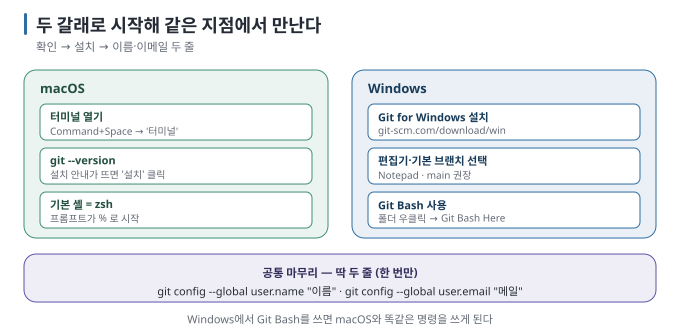

# 03 — 내 컴퓨터에 Git 준비하기: macOS와 Windows

← [02 Git과 GitHub는 다르다](02-git-vs-github.md) · 다음 → [04 Git의 네 공간](04-four-areas.md)

> **왜 읽나:** 대부분의 Mac에는 Git이 이미 있고, Windows에는 없습니다. 그리고 Windows에서는 "어떤 검은 창에 명령을 치는가"가
> 결과를 바꿉니다. 이 문서 하나로 두 환경의 출발선을 맞춥니다.
>
> **읽고 나면:** 내 컴퓨터에 Git이 있는지 확인하고, 없으면 설치하고, 이름·이메일을 설정해 첫 커밋을 만들 준비를 끝냅니다.
>
> **바쁘면:** §1의 확인 명령 한 줄 → 결과에 따라 §2(Mac) 또는 §3(Windows)만.

---

## 0. 결론 먼저 ★

- **터미널은** 명령을 글자로 입력하는 창입니다. AI 코딩 도구 안에도 대개 들어 있어서, 별도 창을 안 열어도 됩니다. `[원리]`
- **macOS:** Git이 이미 있거나, 첫 실행 시 설치를 안내합니다. 기본 셸은 **zsh**. `[실행 검증 · 2026-08-23]`
- **Windows:** **Git for Windows를** 설치하면 **Git Bash라는** 창이 함께 깔립니다. 이 가이드의 명령은 Git Bash 기준입니다. `[문서 확인 · 2026-08-23]`
- 설치 후 **딱 두 줄을** 설정합니다 — 이름과 이메일. 커밋에 "누가 했는지"로 남습니다. `[원리]`

## 1. 먼저 확인 — 이미 있는지

터미널을 열고(여는 법은 §2·§3) 다음을 입력한 뒤 Enter를 누릅니다.

```bash
git --version
```

| 결과 | 뜻 | 다음 |
| --- | --- | --- |
| `git version 2.50.1 …` 처럼 숫자가 나옴 | 이미 설치됨 | §4로 |
| macOS에서 설치 안내 창이 뜸 | 아직 없음 | §2 |
| `command not found` / `'git'은(는) …명령이 아닙니다` | 없음 | §2 또는 §3 |

**★ 성공 판정:** 버전 숫자가 보이면 됩니다. 숫자가 조금 낮아도(2.30 이상) 이 가이드의 모든 명령이 동작합니다.
작성 환경에서는 `git version 2.50.1 (Apple Git-155)`였습니다. `[실행 검증 · 2026-08-23]`

## 2. macOS



### 2.1 터미널 열기

- `Command + Space` → "터미널" 입력 → Enter. (또는 응용 프로그램 › 유틸리티 › 터미널)
- 검은(또는 흰) 창에 `사용자이름@맥이름 ~ %` 같은 줄이 보이면 준비된 것입니다. `%`가 **zsh의** 표시입니다 — macOS의 기본 셸입니다.

> `%` 대신 `$`가 보이면 bash입니다. **이 가이드의 명령은 둘 다에서 똑같이 동작합니다.** 셸 차이는 Git과 무관합니다. `[원리]`

### 2.2 설치

`git --version`을 실행했을 때 **"명령어 개발자 도구를 설치하시겠습니까?"** 창이 뜨면 **설치**를 누릅니다. 몇 분 뒤 다시
`git --version`을 실행하면 버전이 나옵니다. `[문서 확인 · 2026-08-23]`

이 경로가 설치하는 것은 Apple이 함께 배포하는 Git입니다(작성 환경에서 `/usr/bin/git`, `Apple Git-155`). 최신 Git을 원하면
Homebrew로 따로 설치할 수도 있지만, **이 가이드에는 필요 없습니다.** `[실행 검증 · 2026-08-23]`

> 🔧 **한 단계 더 — Homebrew로 최신 Git**
>
> 이미 Homebrew를 쓰고 있다면 `brew install git`. 설치 후 `which -a git`에 `/opt/homebrew/bin/git`이 `/usr/bin/git`보다 먼저
> 나오면 새 버전이 쓰입니다. 굳이 하지 않아도 됩니다. `[해석]`

## 3. Windows

### 3.1 설치 — Git for Windows

1. [git-scm.com/download/win](https://git-scm.com/download/win) 에서 설치 파일을 받습니다.
2. 실행하고 **선택지는 대부분 기본값 그대로** 두고 Next를 누릅니다. 초심자가 신경 쓸 항목은 둘뿐입니다. `[문서 확인 · 2026-08-23]`

| 설치 중 물어보는 것 | 권장 | 왜 |
| --- | --- | --- |
| 기본 편집기(default editor) | 목록에서 **Notepad** 또는 VS Code | 기본값 Vim은 초심자가 빠져나오기 어렵습니다 |
| 기본 브랜치 이름 | **main** (Override…를 선택해 `main`) | 요즘 표준이고 GitHub 기본값과 맞습니다 ([06](06-branches.md)) |

나머지(줄바꿈 처리, 자격 증명 도우미 등)는 기본값이 초심자에게 맞습니다.

### 3.2 어떤 창에서 명령을 치는가 — 이게 중요합니다

Windows에는 명령을 치는 창이 여러 개이고, **Git 명령은 어디서나 되지만 그 외 명령은 다릅니다.** `[원리]`

| 창 | 어떻게 여나 | 이 가이드에서 |
| --- | --- | --- |
| **Git Bash** ✅ | 시작 메뉴 → "Git Bash", 또는 폴더에서 마우스 오른쪽 → Git Bash Here | **권장.** 이 가이드의 모든 명령이 그대로 동작합니다 (Mac과 같은 문법) |
| PowerShell | 시작 메뉴 → PowerShell | Git 명령은 됩니다. `ls`·경로 표기 등 일부 관습이 다릅니다 |
| 명령 프롬프트(cmd) | 시작 메뉴 → cmd | Git 명령은 되지만 가장 불편합니다 |
| WSL(리눅스) | 별도 설치 | 되지만 이 가이드 범위 밖 |

**Git Bash를 쓰세요.** macOS 사용자와 같은 명령을 쓰게 되어 검색·AI 질문·이 가이드가 전부 그대로 맞습니다. `[해석]`

### 3.3 경로 적는 법

Git Bash에서는 Windows 경로를 이렇게 씁니다. `[문서 확인 · 2026-08-23]`

```bash
cd /c/Users/내이름/Documents/내-프로젝트     # C:\Users\내이름\Documents\내-프로젝트
```

폴더 이름에 **띄어쓰기나 한글이** 있으면 따옴표로 감쌉니다: `cd "/c/Users/내이름/내 프로젝트"`.
가장 쉬운 방법은 **탐색기에서 폴더를 열고 마우스 오른쪽 → "Git Bash Here"** 입니다 — 경로를 칠 필요가 없습니다.

## 4. 딱 두 줄 설정 — 이름과 이메일

Git은 커밋마다 "누가 했는지"를 기록합니다. 설정하지 않으면 첫 커밋에서 오류가 납니다. **한 번만** 하면 됩니다.

```bash
git config --global user.name "홍길동"
git config --global user.email "hong@example.com"
```

**★ 성공 판정:** 아래 두 명령이 방금 넣은 값을 그대로 돌려주면 됩니다. `[실행 검증 · 2026-08-23]`

```bash
git config --global user.name
git config --global user.email
```

| 자주 묻는 것 | 답 |
| --- | --- |
| 이메일이 공개되나요? | GitHub에 올리면 커밋에 적힌 이메일이 보입니다. 신경 쓰이면 GitHub가 주는 `아이디@users.noreply.github.com` 주소를 쓰세요 `[문서 확인 · 2026-08-23]` |
| 이름은 본명이어야 하나요? | 아닙니다. 커밋에 표시될 이름일 뿐입니다 |
| `--global`은 뭔가요? | "이 컴퓨터의 모든 프로젝트에 적용". 프로젝트마다 다르게 하려면 그 폴더에서 `--global` 없이 실행 |

### 함께 해 두면 좋은 것 하나

새 저장소의 기본 브랜치 이름을 `main`으로 맞춥니다(안 하면 오래된 기본값 `master`가 될 수 있습니다). `[문서 확인 · 2026-08-23]`

```bash
git config --global init.defaultBranch main
```

## 5. 준비 완료 확인

```bash
git --version                    # 버전 숫자
git config --global user.name    # 내 이름
git config --global user.email   # 내 이메일
```

세 줄이 모두 값을 돌려주면 [README의 10분 경로](README.md)로 가서 첫 커밋을 만들 수 있습니다.

> 💬 **AI에게 이렇게 말하세요:** 설치가 헷갈릴 때 — "내 컴퓨터에 git이 설치돼 있는지, 사용자 이름과 이메일이 설정돼 있는지
> 확인하는 명령을 실행하고, 빠진 게 있으면 뭘 해야 하는지 알려 줘. 나는 (macOS / Windows)를 쓰고 있어."

---

**다음 →** [04 Git의 네 공간 — add·commit·push가 무엇을 옮기는가](04-four-areas.md)
