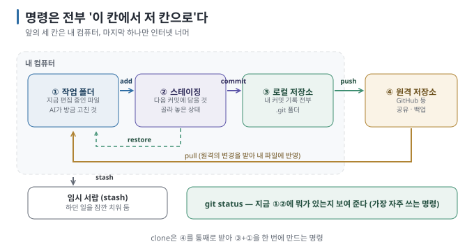

# 04 — Git의 네 공간: add·commit·push가 무엇을 옮기는가

← [03 내 컴퓨터에 Git 준비하기](03-setup-mac-windows.md) · 다음 → [05 커밋과 되돌리기](05-commits-and-undo.md)

> **왜 읽나:** Git 명령이 어려운 게 아니라, **어디서 어디로 옮기는 명령인지** 몰라서 어렵습니다. 공간 네 개를 외우면 명령
> 대부분이 "이 칸에서 저 칸으로"로 읽힙니다.
>
> **읽고 나면:** 그림 한 장으로 add·commit·push·pull·stash를 설명할 수 있고, 오류 메시지가 어느 칸 얘기인지 알아볼 수 있습니다.
>
> **바쁘면:** §1 그림과 §2 표만.

---

## 0. 결론 먼저 ★

- 공간은 넷 — **작업 폴더 · 스테이징 · 로컬 저장소 · 원격 저장소.** 앞 세 개는 내 컴퓨터, 마지막 하나만 인터넷 너머입니다. `[원리]`
- 저장은 **두 단계입니다:** `git add`(담을 것 고르기) → `git commit`(지점 만들기). 이 둘을 나눈 것이 Git의 특징입니다. `[원리]`
- 올리고 받는 것은 **로컬 저장소 ↔ 원격입니다.** 작업 폴더에서 바로 인터넷으로 가는 명령은 없습니다. `[원리]`
- 오류 메시지의 절반은 "지금 어느 칸에 있는 파일 얘기인가"만 알아도 풀립니다. `[해석]`

## 1. 그림 한 장



| 공간 | 무엇이 들어 있나 | 눈으로 보는 법 |
| --- | --- | --- |
| ① **작업 폴더** (working directory) | 지금 내가(또는 AI가) 편집한 실제 파일들 | 파인더·탐색기에서 보이는 그 폴더 |
| ② **스테이징** (staging area, index) | "다음 커밋에 담겠다"고 골라 둔 변경 | `git status`에서 초록색 목록 |
| ③ **로컬 저장소** (local repository) | 지금까지 만든 모든 커밋. 폴더 안 `.git`에 있음 | `git log` |
| ④ **원격 저장소** (remote) | GitHub 등에 올린 복사본 | 웹 브라우저, `git remote -v` |

`[원리]`

> **초심자용 한 줄:** ①은 책상, ②는 "이번에 상자에 넣을 것"을 모아 둔 자리, ③은 상자를 쌓아 둔 창고, ④는 다른 건물의 창고.
> `add`는 자리에 올리기, `commit`은 상자에 넣어 창고에 쌓기, `push`는 다른 건물로 보내기.

## 2. 명령을 "어디→어디"로 읽기

| 명령 | 옮기는 방향 | 한 줄 뜻 |
| --- | --- | --- |
| `git add 파일` | ① → ② | 이 변경을 다음 커밋에 담겠다 |
| `git add .` | ① → ② | 바뀐 것 전부 담겠다 (자주 씀) |
| `git commit -m "메시지"` | ② → ③ | 담아 둔 것으로 저장 지점을 만든다 |
| `git push` | ③ → ④ | 내 기록을 원격에 올린다 |
| `git pull` | ④ → ③ → 현재 branch | 원격의 새 기록을 받고, 설정된 방식으로 현재 branch에 통합한다 |
| `git clone 주소` | ④ → ③+① | 남의(내) 원격 저장소를 통째로 내려받아 시작한다 |
| `git status` | — | 지금 ①②에 뭐가 있는지 보여 준다 (가장 자주 쓰는 명령) |
| `git restore 파일` | ③ → ① | 해당 파일의 미커밋 변경을 버리고 commit된 상태로 되돌린다 ([05](05-commits-and-undo.md)) |
| `git stash` | ① → 임시 서랍 | 기본적으로 tracked file의 작업 중 변경을 잠깐 치워 둔다 ([10 S6](10-scenarios-solo.md)) |

`[원리]` — `fetch`는 원격의 새 기록을 받아 두되 현재 파일에는 반영하지 않습니다. `pull`은 먼저 fetch한 뒤 현재 설정에 따라
merge 또는 rebase로 통합합니다. 처음에는 저장소의 안내와 `git status`를 확인한 뒤 pull하고, 예상치 못한 충돌이 나면 즉시
해결 방법을 선택하지 말고 무엇이 갈라졌는지부터 확인하세요. `[해석]`

## 3. 왜 add와 commit을 나눴을까

AI와 코딩할 때 이 구분이 실제로 쓰입니다. AI가 파일 다섯 개를 고쳤는데 **그중 셋만 저장하고 싶을 때가** 있습니다.

```bash
git add src/login.js src/style.css   # 이 둘만 담고
git commit -m "로그인 화면 정리"       # 이 둘만 저장 지점으로
# 나머지 세 파일의 변경은 작업 폴더에 그대로 남아 있음
```

한 커밋에 관련 없는 변경이 뒤섞이면 나중에 "이 커밋만 되돌리기"가 불가능해집니다. **커밋 하나 = 의미 하나가** 원칙이고,
스테이징은 그것을 가능하게 하는 장치입니다. `[해석]`

> 급할 때는 `git add .`로 전부 담아도 됩니다. 다만 **비밀번호 파일까지 함께 담기는 사고가** 여기서 납니다([11 S10](11-scenarios-share.md)).

## 4. `git status`를 읽는 법

가장 자주 보게 될 화면입니다. 세 덩어리만 구분하면 됩니다. `[실행 검증 · 2026-08-23]`

```text
On branch main                                   ← 지금 어느 브랜치인가 (06)

Changes to be committed:                         ← ② 스테이징: 다음 커밋에 담길 것
        modified:   src/login.js

Changes not staged for commit:                   ← ① 작업 폴더: 바뀌었지만 아직 안 담긴 것
        modified:   src/style.css

Untracked files:                                 ← ① 작업 폴더: Git이 아직 모르는 새 파일
        notes.txt
```

| 덩어리 | 뜻 | 담으려면 |
| --- | --- | --- |
| Changes to be committed | 이미 ②에 있음 | (이미 됨) |
| Changes not staged | ①에 있음. 이전에 커밋된 적 있는 파일 | `git add 파일` |
| Untracked files | ①에 있음. Git이 한 번도 본 적 없는 파일 | `git add 파일` |

**Untracked를 그냥 두면 커밋에 절대 들어가지 않습니다.** "커밋했는데 파일이 없다"의 대부분이 이것입니다. `[원리]`

## 5. `.gitignore` — 일부러 안 담는 것

애초에 Git이 보지 않았으면 하는 파일이 있습니다. 폴더에 `.gitignore`라는 파일을 만들고 이름을 적어 두면 `git add .`에도
안 담깁니다. `[원리]`

```text
.env                # 비밀번호·API 키
node_modules/       # 라이브러리 (용량만 큼, 다시 받으면 됨)
*.log               # 로그 파일
.DS_Store           # macOS가 만드는 숨김 파일
```

> 💬 **AI에게 이렇게 말하세요:** "이 프로젝트에 맞는 .gitignore를 만들어 줘. 비밀번호나 API 키가 들어갈 만한 파일, 라이브러리
> 폴더, 빌드 결과물이 커밋되지 않게 해 줘."

## 6. 이 문서의 점검표

- [ ] 네 공간의 이름을 말할 수 있다
- [ ] `add`와 `commit`이 각각 어느 칸에서 어느 칸으로 가는지 안다
- [ ] `git status`의 세 덩어리를 구분할 수 있다
- [ ] Untracked 파일은 `add` 없이는 절대 커밋되지 않는다는 것을 안다
- [ ] `.gitignore`가 왜 필요한지 안다

---

**다음 →** [05 커밋과 되돌리기 — 세이브 포인트와 안전한 복귀](05-commits-and-undo.md)
