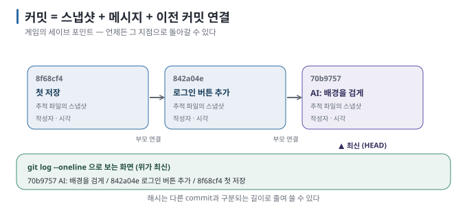
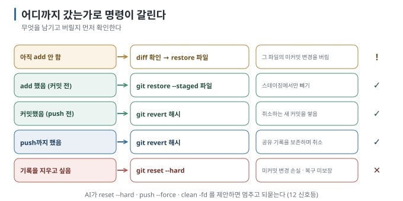

# 05 — 커밋과 되돌리기: 세이브 포인트와 안전한 복귀

← [04 Git의 네 공간](04-four-areas.md) · 다음 → [06 브랜치](06-branches.md)

> **왜 읽나:** AI와 코딩할 때 Git이 필요한 이유의 90%가 이 문서에 있습니다. 그리고 되돌리기 명령 중 **하나는 되돌리기가 아니라
> 삭제**입니다 — 실제로 지워 보며 확인했습니다.
>
> **읽고 나면:** 커밋이 무엇을 저장하는지 알고, 상황별로 안전한 되돌리기 명령을 고르며, AI가 위험한 명령을 제안할 때 멈출 수 있습니다.
>
> **바쁘면:** §0과 §3의 표, 그리고 §4의 경고만.

---

## 0. 결론 먼저 ★

- 커밋은 파일 복사본이 아니라 **"그 시점의 프로젝트 전체 상태"에** 이름표를 붙인 것입니다. 커밋 사이를 오갈 수 있습니다. `[원리]`
- 되돌리기는 **상황별로 명령이 다릅니다.** "아직 안 담았나 / 담았나 / 이미 커밋했나 / 이미 올렸나" 네 갈래. `[원리]`
- `git revert`와 새 commit으로 고치기는 기존 기록을 남깁니다. `git restore`는 범위를 파일로 좁힐 수 있지만, 선택한 파일의
  미커밋 변경은 버리므로 실행 전에 diff를 확인해야 합니다. `[원리]`
- `git reset --hard`는 **커밋하지 않은 작업을 복구 불가능하게 지웁니다.** 실제로 확인했습니다(§4). `[실행 검증 · 2026-08-23]`

## 1. 커밋 = 스냅샷 + 메시지 + 부모



커밋 하나에 들어 있는 것 `[원리]`:

| 요소 | 예 | 왜 |
| --- | --- | --- |
| 스냅샷 | 그 시점의 모든 파일 상태 | 언제든 이 상태로 돌아갈 수 있게 |
| 메시지 | "로그인 버튼 추가" | 나중에 **왜** 바꿨는지 찾으려고 ([08](08-commit-messages.md)) |
| 작성자·시각 | 홍길동, 2026-08-23 14:22 | 누가 언제 |
| 부모 커밋 | 바로 앞 커밋 | 사슬로 이어져 역사가 됨 |
| 해시(ID) | `b975e6c…` | 이 커밋을 가리키는 이름. 앞 7글자만 써도 됨 |

기록을 보는 명령은 하나면 충분합니다.

```bash
git log --oneline
```

작성 환경의 실제 출력입니다. `[실행 검증 · 2026-08-23]`

```text
70b9757 AI: 배경을 검게 (마음에 안 듦)
9609729 AI: 스타일과 스크립트 추가
842a04e 로그인 버튼 추가
8f68cf4 첫 저장: AI와 만든 초기 버전
```

**위가 최신입니다.** 각 줄의 앞 코드가 해시이고, 되돌릴 때 이 코드를 지목합니다.

## 2. 세이브 포인트를 만드는 습관

AI와 작업할 때의 규칙 하나면 됩니다. `[해석]`

> **AI에게 큰 수정을 시키기 전에 커밋한다.**

큰 수정 = 파일 여러 개를 건드리는 요청, 구조를 바꾸는 요청, "전체적으로 개선해 줘" 같은 요청. commit 명령 자체는 짧지만,
이 기준점이 없으면 Git이 변경 전 상태를 복원할 근거가 없습니다.

```bash
git add .
git commit -m "AI에게 로그인 개편 시키기 전"
```

> 💬 **AI에게 이렇게 말하세요:** "지금 상태를 '(무엇을 하기 전)'이라는 메시지로 커밋해 줘. 그다음 (하려는 일)을 해 줘."
> — 이 한 문장이 이 가이드에서 가장 자주 쓰게 될 문장입니다.

## 3. 되돌리기 — 상황별 지도 ★

**"지금 어디까지 갔는가"로** 명령이 갈립니다.



| 상황 | 명령 | 무슨 일이 일어나나 | 안전도 |
| --- | --- | --- | --- |
| 파일을 고쳤는데 마음에 안 듦 (add 전) | `git diff -- 파일` → `git restore 파일` | 확인한 뒤 그 파일의 미커밋 변경을 버림 | ⚠️ 선택한 내용 삭제 |
| `add`했는데 담기 싫어짐 | `git restore --staged 파일` | staging에서만 빼기. 파일 내용은 그대로 | ✅ 내용 유지 |
| commit했는데 그 commit이 잘못됨 | `git revert 해시` | **취소하는 새 commit을** 추가. 기존 기록은 남음 | ✅ 기록 유지 |
| 커밋 메시지만 잘못 씀 (아직 push 전) | `git commit --amend -m "새 메시지"` | 마지막 커밋을 새로 씀 | ⚠️ push 전에만 |
| 최근 커밋들을 통째로 없던 일로 | `git reset --hard 해시` | **기록과 파일을 지움** | ⛔ 위험 (§4) |

`[실행 검증 · 2026-08-23]` — 아래 §5에서 실제 출력으로 확인합니다.

## 4. ⛔ `git reset --hard` — 되돌리기가 아니라 삭제입니다

작성 환경에서 실제로 실행해 본 결과입니다. `[실행 검증 · 2026-08-23]`

```bash
# 한 시간 동안 쓴 내용을 파일에 추가한 상태 (아직 커밋 안 함)
$ git status --short
 M index.html

$ git reset --hard HEAD

$ cat index.html
<h1>내 앱</h1>
<!-- 오타 수정 -->
<footer>작업 중이던 푸터</footer>
```

**한 시간 동안 쓴 줄이 작업 폴더에서 사라졌고 Git으로는 되찾을 수 없었습니다.** commit되지 않은 변경은 Git의 기록에
들어간 적이 없기 때문에 `reflog`에도 없습니다. 편집기 자체 복구 기능이나 별도 backup이 있다면 예외지만, Git은 복구 근거를
제공하지 못합니다.

| 무엇 | reset --hard 후 |
| --- | --- |
| 커밋된 것 | `git reflog`로 찾을 수 있음 (§6 🔧) |
| **커밋 안 된 것** | Git 기록에는 남지 않아 **Git으로 복구할 수 없음** |

> ⛔ **AI가 이 명령을 제안하면 멈추세요.** `git reset --hard`, `git checkout -f`, `git clean -fd`, `git push --force`가 나오면
> "왜 필요한지 설명하고, 지금 커밋 안 된 작업이 사라지는지 먼저 알려 줘"라고 되물으세요. [12 신호등](12-asking-ai.md)에 전체 목록이 있습니다.

이미 commit한 변경을 취소할 때는 먼저 **`git revert`를** 검토합니다. 기록을 지우는 대신 "취소하는 commit"을 새로 쌓아
원래 변경과 취소 사실을 함께 남길 수 있습니다.

## 5. 직접 확인 — revert의 실제 동작

작성 환경에서 실행한 그대로입니다. `[실행 검증 · 2026-08-23]`

```bash
$ git log --oneline
70b9757 AI: 배경을 검게 (마음에 안 듦)     ← 이걸 취소하고 싶다
9609729 AI: 스타일과 스크립트 추가
842a04e 로그인 버튼 추가

$ git revert --no-edit 70b9757
[main cdb126b] Revert "AI: 배경을 검게 (마음에 안 듦)"
 1 file changed, 1 deletion(-)

$ git log --oneline
cdb126b Revert "AI: 배경을 검게 (마음에 안 듦)"   ← 취소하는 새 커밋이 쌓임
70b9757 AI: 배경을 검게 (마음에 안 듦)            ← 원래 커밋도 그대로 남음
9609729 AI: 스타일과 스크립트 추가

$ cat style.css
body { color: red; }        ← 검은 배경 줄만 사라짐
```

**★ 성공 판정:** `Revert "…"` 커밋이 하나 늘고, 취소하려던 변경만 파일에서 사라집니다. 원래 커밋은 기록에 남습니다 — 그래서
기록을 보존하는 방식이며, 그래서 "없던 일"이 되지는 않습니다.

## 6. 파일 세 개 중 하나만 되돌리기

AI가 여러 파일을 고쳤을 때 가장 자주 필요한 동작입니다. `[실행 검증 · 2026-08-23]`

```bash
$ git status --short
 M index.html          ← 이것만 되돌리고 싶다
?? app.js              ← 새 파일, 그대로 두고 싶다
?? style.css           ← 새 파일, 그대로 두고 싶다

$ git restore index.html

$ git status --short
?? app.js              ← 그대로 남음
?? style.css           ← 그대로 남음
```

`restore`는 **지목한 파일만** 건드립니다. 범위는 좁지만 그 파일의 미커밋 변경은 사라집니다. 먼저 `git diff -- index.html`로
버릴 내용을 확인하는 습관이 필요합니다.

> 🔧 **한 단계 더 — reflog, Git의 블랙박스**
>
> `git reflog`는 "HEAD가 어디를 거쳐 왔는지"의 기록입니다. 실수로 브랜치를 지웠거나 `reset --hard`로 **커밋을** 날렸을 때
> 여기서 해시를 찾아 되살릴 수 있습니다. 작성 환경 출력: `353732b HEAD@{0}: reset: moving to HEAD` … `[실행 검증 · 2026-08-23]`
> 다시 강조하면 — **커밋되지 않은 작업은 reflog에도 없습니다.**

## 7. 이 문서의 점검표

- [ ] 커밋이 파일 복사가 아니라 스냅샷+메시지+부모라는 것을 안다
- [ ] AI에게 큰 수정을 시키기 전 커밋하는 습관을 정했다
- [ ] `restore` / `revert` / `reset --hard`의 차이를 말할 수 있다
- [ ] `reset --hard`가 커밋 안 된 작업을 영구 삭제한다는 것을 안다
- [ ] AI가 위험 명령을 제안했을 때 되물을 문장을 안다

---

**다음 →** [06 브랜치 — 시도를 가르는 법](06-branches.md)
