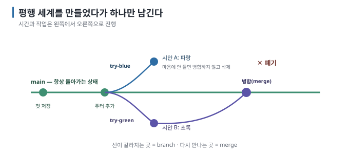
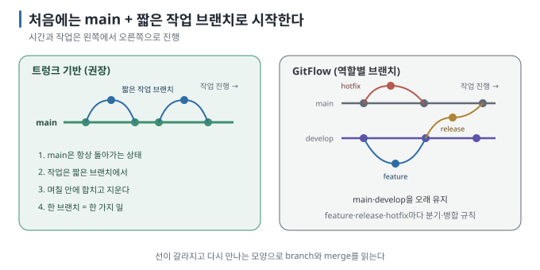

# 06 — 브랜치: 시도를 가르는 법과 트렁크 기반 전략

← [05 커밋과 되돌리기](05-commits-and-undo.md) · 다음 → [07 worktree](07-worktrees.md)

> **왜 읽나:** "두 가지 디자인 중 뭐가 나은지 보고 싶다"를 폴더 복사로 하면 곧 어느 게 어느 건지 모르게 됩니다. 브랜치는 그
> 일을 기록이 남는 별도 갈래로 나눕니다. 처음에는 단순한 branch 흐름 하나만 익혀도 충분합니다.
>
> **읽고 나면:** 브랜치를 만들고 오가고 합치고 지울 수 있으며, 충돌이 나도 당황하지 않고, 트렁크 기반 전략을 내 프로젝트에 적용할 수 있습니다.
>
> **바쁘면:** §0과 §3(트렁크 기반)만.

---

## 0. 결론 먼저 ★

- 브랜치는 **"같은 프로젝트의 평행 세계"입니다.** 파일을 복사하지 않고, 오갈 때 폴더 내용이 통째로 바뀝니다. `[원리]`
- 명령 넷이면 충분 — `git switch -c 이름`(만들며 이동), `git switch 이름`(이동), `git merge 이름`(합치기), `git branch -d 이름`(지우기). `[원리]`
- 초심자·1인 개발은 **트렁크 기반(trunk-based)의** 단순한 형태로 시작하기 좋습니다. `main`을 중심에 두고, 짧게 살다
  사라지는 branch만 사용합니다. `[해석]`
- **충돌(conflict)은 고장이 아닙니다.** "두 세계가 같은 줄을 다르게 고쳤으니 골라 달라"는 요청입니다. `[원리]`

## 1. 브랜치가 실제로 하는 일



이 장의 그림은 Git 내부 commit 객체의 parent 참조 방향을 그린 것이 아닙니다. 시간은 왼쪽에서 오른쪽으로 흐르며, 선이 갈라지는
곳은 branch, 다시 만나는 곳은 merge입니다.

핵심은 **폴더가 하나뿐이라는** 점입니다. `git switch try-blue`를 하면 그 폴더의 파일들이 파랑 버전으로 **바뀌고**, `git switch
main`을 하면 원래대로 돌아옵니다. 복사본이 여러 개 생기지 않습니다. `[원리]`

> **초심자용 한 줄:** 브랜치는 "세이브 파일 슬롯"이 아니라 "게임의 분기 루트"입니다. 루트를 바꾸면 세계가 통째로 바뀌고,
> 마음에 드는 루트만 본편(main)에 합칩니다.

## 2. 실제 동작 — 시안 두 개 비교하기

작성 환경에서 실행한 그대로입니다. `[실행 검증 · 2026-08-23]`

```bash
$ git switch -c try-blue          # 만들면서 이동
$ printf 'body { color: blue; }\n' > style.css
$ git commit -am "시안 A: 파랑"

$ git switch main                 # 본편으로 복귀 (파일이 원래대로 돌아감)
$ git switch -c try-green
$ printf 'body { color: green; }\n' > style.css
$ git commit -am "시안 B: 초록"

$ git branch
  main
  try-blue
* try-green                       ← * 가 현재 위치

$ cat style.css
body { color: green; }

$ git switch try-blue             # A를 다시 보고 싶다
$ cat style.css
body { color: blue; }             ← 같은 파일인데 내용이 바뀜
```

B가 마음에 들었다면:

```bash
$ git switch main
$ git merge try-green             # B를 본편에 합치기
$ git branch -D try-blue          # A는 폐기
$ git branch
* main
  try-green
```

**★ 성공 판정:** `git switch`로 오갈 때 파일 내용이 실제로 바뀌고, merge 후 `main`에 원하는 내용이 들어옵니다.

> 브랜치를 만든 뒤 `main`이 전혀 움직이지 않았다면 merge가 "Fast-forward"라고 나옵니다 — 갈라진 적이 없으니 그냥 포인터를
> 앞으로 옮기는 것이고, 정상입니다. `[실행 검증 · 2026-08-23]`

## 3. 어떤 전략을 쓸 것인가 — 트렁크 기반 ★

검색하면 GitFlow, GitHub Flow, GitLab Flow 같은 이름이 나옵니다. 1인 또는 소수가 AI와 만드는 프로젝트라면 먼저
**main + 짧은 작업 branch만** 사용하는 단순한 흐름으로 시작할 수 있습니다.



### 트렁크 기반 브랜치 전략 (권장)

규칙 넷 `[해석]`:

1. **`main`은 항상 돌아가는 상태로 둔다.** 깨진 코드를 main에 두지 않습니다.
2. **작업은 짧은 브랜치에서.** 이름은 `fix-login`, `try-dark-mode`처럼 무엇인지 알 수 있게.
3. **며칠 안에 합치고 지운다.** 오래 살수록 충돌이 커집니다.
4. **한 브랜치 = 한 가지 일.** 로그인 고치기와 색 바꾸기를 한 브랜치에 섞지 않습니다.

| | 트렁크 기반 | GitFlow |
| --- | --- | --- |
| 장수 브랜치 | `main` 하나 | main·develop·release·hotfix 등 여럿 |
| 적합 | 1인·소수, 빠른 반복, AI 코딩 | 정해진 릴리스 주기가 있는 큰 팀·제품 |
| 처음 익힐 범위 | main·짧은 작업 branch | 장수 branch별 역할과 release 규칙 |
| 이 가이드 | ✅ 기본 경로 | 개념만 소개 |

`[자료 확인 · 2026-08-27]` — GitFlow는 2010년 제안된 branch model입니다. 이 가이드는 팀의 release 규칙이 정해지지 않은
초심자에게 필요한 최소 흐름을 우선합니다. 조직이나 저장소가 별도 규칙을 갖고 있다면 그 규칙을 따릅니다. `[해석]`

### 브랜치 없이도 되나요?

됩니다. `main` 하나에서 커밋만 쌓아도 [05](05-commits-and-undo.md)의 되돌리기는 전부 동작합니다. 브랜치는
**"두 가지를 동시에 살려 두고 비교"할 때** 값어치가 생깁니다. 그 필요가 없으면 안 써도 됩니다. `[해석]`

## 4. 충돌 — 고장이 아니라 질문입니다

`main`과 브랜치가 **같은 파일의 같은 줄을** 다르게 고쳤을 때만 일어납니다. 다른 파일이나 다른 줄이면 Git이 알아서 합칩니다. `[원리]`

작성 환경에서 일부러 만들어 본 실제 출력입니다. `[실행 검증 · 2026-08-23]`

```bash
$ git merge try-blue
Auto-merging style.css
CONFLICT (content): Merge conflict in style.css
Automatic merge failed; fix conflicts and then commit the result.
```

`style.css`에는 다음 세 marker와 양쪽 내용이 들어갑니다.

| 표시 | 의미 |
| --- | --- |
| `<<<<<<< HEAD` | 여기부터 현재 branch의 내용 |
| `body { color: red; }` | 현재 branch(main)의 내용 |
| `=======` | 양쪽 내용의 경계 |
| `body { color: blue; }` | 합치려는 branch(try-blue)의 내용 |
| `>>>>>>> try-blue` | 충돌 구간의 끝 |

**해결은 세 단계입니다.**

1. 파일을 열어 `<<<<<<<`, `=======`, `>>>>>>>` 세 줄을 **지우고**, 남기고 싶은 내용만 남깁니다(둘을 섞어도 됩니다).
2. `git add 파일`
3. `git commit`

```bash
$ printf 'body { color: blue; }\n' > style.css   # 파랑 채택
$ git add style.css
$ git commit -m "병합: 시안 A 채택"

$ git log --oneline --graph
*   7f2d148 병합: 시안 A 채택
|\
| * 619988c 시안 A: 파랑
* | 67f8a33 급하게 빨강으로
|/
* f1933fb 푸터 추가
```

**★ 성공 판정:** 파일에서 `<<<<<<<` 표시가 모두 사라지고, `git status`가 깨끗해지며, 로그에 병합 커밋이 보입니다.

> 💬 **AI에게 이렇게 말하세요:** 충돌이 났을 때 — "지금 충돌이 났어. 어떤 파일의 어느 부분이 충돌했는지 보여 주고, 양쪽이
> 각각 무슨 의도였는지 설명해 줘. 나는 (원하는 쪽)을 살리고 싶어." — AI는 diff와 주변 맥락으로 의도를 추정할 수 있지만,
> **최종적으로 어느 동작을 남길지는 사람이 확인해야 합니다.**

> 겁이 나면 언제든 `git merge --abort`로 병합 전으로 되돌릴 수 있습니다. `[문서 확인 · 2026-08-23]`

## 5. 이름 짓기와 정리

| 상황 | 브랜치 이름 예 |
| --- | --- |
| 기능 추가 | `add-dark-mode`, `feature/login` |
| 버그 수정 | `fix-login-error` |
| 실험 | `try-new-layout` |

합친 브랜치는 지웁니다: `git branch -d 이름` (합치지 않은 브랜치를 강제로 지울 때는 `-D`). 브랜치 목록이 다섯 개를 넘어가면
대개 "며칠 안에 합치기" 규칙이 깨진 신호입니다. `[해석]`

## 6. 이 문서의 점검표

- [ ] 브랜치를 만들고 오가면 폴더 내용이 바뀐다는 것을 안다
- [ ] `switch -c` / `switch` / `merge` / `branch -d` 네 명령을 안다
- [ ] 트렁크 기반 규칙 넷을 말할 수 있다
- [ ] 충돌 표시 세 줄의 의미와 해결 3단계를 안다
- [ ] 충돌에서 무엇을 살릴지는 사람이 정한다는 것을 안다

---

**다음 →** [07 worktree — 브랜치를 여러 작업 폴더에 동시에 펼치기](07-worktrees.md)
