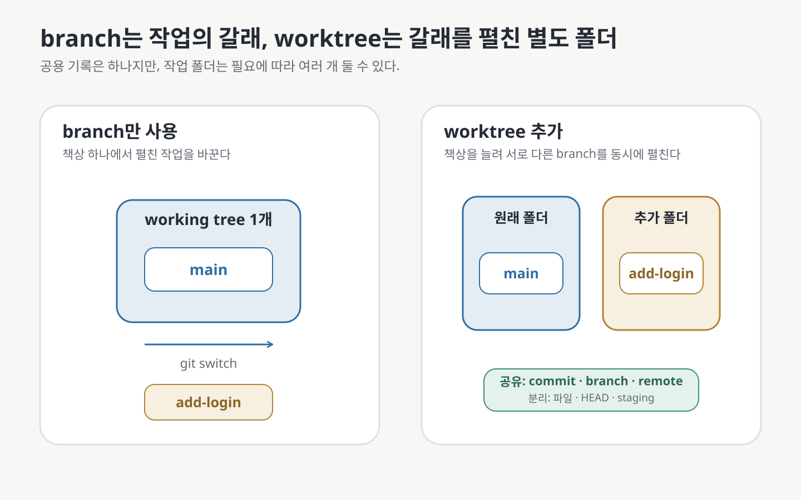
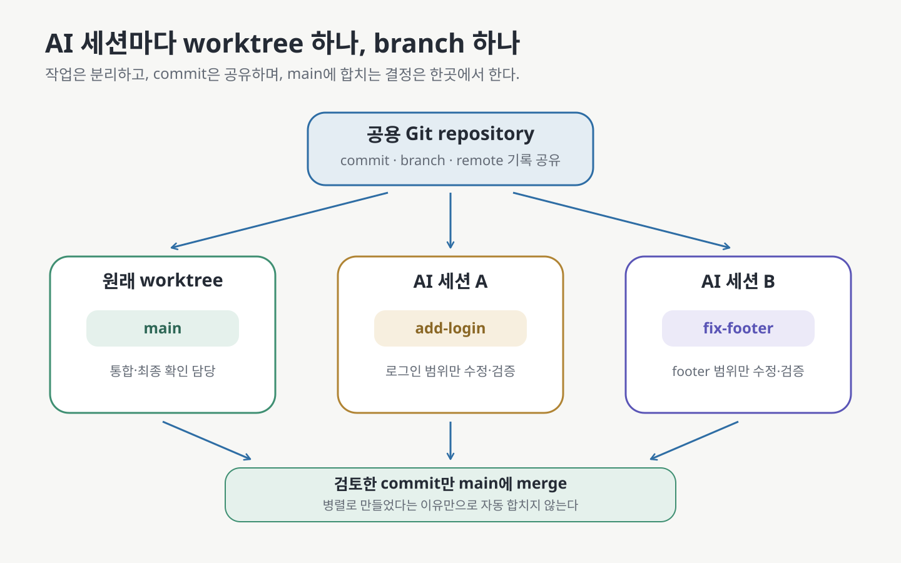

# 07 — worktree: 브랜치를 여러 작업 폴더에 동시에 펼치기

← [06 브랜치](06-branches.md) · 다음 → [08 커밋 메시지 쓰는 법](08-commit-messages.md)

> **왜 읽나:** 한 AI가 큰 기능을 만드는 동안 다른 오류를 고치거나, 두 구현안을 동시에 실행해 비교하려면 브랜치만으로는
> 불편합니다. 브랜치를 바꿀 때마다 같은 폴더의 파일도 바뀌기 때문입니다.
>
> **읽고 나면:** branch와 worktree의 차이를 설명하고, 작업 폴더를 하나 더 만들어 서로 다른 브랜치를 동시에 열어 둔 뒤
> 안전하게 정리할 수 있습니다.
>
> **바쁘면:** §1의 그림 → §3의 명령 다섯 줄 → §6의 주의사항만 읽으세요.

---

## 0. 결론 먼저 ★

- **브랜치는 작업의 갈래이고, worktree는 그 갈래를 펼쳐 놓는 별도의 작업 폴더입니다.** 둘은 경쟁하는 개념이 아닙니다. `[원리]`
- 브랜치만 쓰면 한 폴더에서 `git switch`로 내용을 바꿉니다. worktree를 더하면 서로 다른 폴더에서 여러 브랜치를 동시에
  열어 둘 수 있습니다. `[원리]`
- worktree끼리는 commit과 branch 같은 저장소 기록을 공유하지만, 작업 중인 파일과 staging 상태는 각 폴더에 따로 있습니다. `[원리]`
- 한 번에 한 작업만 한다면 worktree가 필요하지 않습니다. **동시에 실행·비교·수정할 때** 값어치가 생깁니다. `[해석]`

## 1. 책상 비유로 branch와 worktree 구분하기



비유를 정확히 대응시키면 다음과 같습니다. `[원리]`

| Git 개념 | 책상 비유 | 실제 의미 |
| --- | --- | --- |
| repository | 공용 책장 | commit과 branch를 포함한 전체 기록 |
| branch | 책갈피가 놓인 이야기의 갈래 | 특정 commit을 가리키며 작업이 이어질 위치 |
| working tree | 책을 펼쳐 놓은 책상 | 현재 확인하고 고치는 실제 파일 |
| `git switch` | 같은 책상에 펼친 책을 바꾸기 | 한 작업 폴더를 다른 branch 상태로 바꿈 |
| `git worktree add` | 책상을 하나 더 놓기 | 같은 저장소에 연결된 작업 폴더를 추가함 |

초심자용으로는 **“branch는 책상 위 작업을 바꾸고, worktree는 책상을 늘린다”고** 기억하면 충분합니다. 다만 각 책상에
새 책장을 복제하는 것은 아닙니다. commit과 branch 기록은 모두 같은 저장소에서 공유합니다.

## 2. 언제 쓰고, 언제 쓰지 않는가

| 상황 | branch만으로 충분 | worktree가 편리 |
| --- | --- | --- |
| 한 작업을 끝낸 뒤 다음 작업 시작 | ✅ | 불필요 |
| A안과 B안을 번갈아 확인 | 가능하지만 매번 `switch` 필요 | ✅ 두 폴더에서 동시에 실행 |
| 긴 AI 작업 중 긴급 수정 | 기존 작업을 commit 또는 stash한 뒤 전환 | ✅ 기존 폴더를 그대로 둠 |
| AI 세션 두 개에 작업 분담 | 같은 폴더를 공유하면 충돌 위험 | ✅ 세션마다 폴더와 branch를 분리 |
| 현재 변경을 건드리지 않고 리뷰·테스트 | 전환 전 정리가 필요할 수 있음 | ✅ 별도 폴더에서 확인 |

`[해석]` — worktree는 충돌을 없애지 않습니다. 두 branch가 같은 줄을 다르게 고치면 나중에 merge할 때 충돌할 수 있습니다.
worktree가 막는 것은 **두 작업이 진행되는 동안 같은 작업 폴더의 파일을 동시에 덮어쓰는 일입니다.**

## 3. 첫 worktree 만들기

현재 프로젝트 폴더의 **바로 옆에** `내-프로젝트-login`이라는 새 작업 폴더를 만들고, 그곳에 `add-login` branch를
펼치는 예시입니다. `[실행 검증 · 2026-08-27]`

```bash
git status --short
git worktree add ../내-프로젝트-login -b add-login
git worktree list
cd ../내-프로젝트-login
git status --short --branch
```

명령을 나눠 보면 다음과 같습니다.

| 명령 | 하는 일 |
| --- | --- |
| `git status --short` | 현재 폴더에 저장하지 않은 변경이 있는지 먼저 확인 |
| `git worktree add 경로 -b 브랜치` | 새 branch를 만들고 새 작업 폴더에 펼침 |
| `git worktree list` | 연결된 작업 폴더와 각 branch 확인 |
| `cd 경로` | 새 작업 폴더로 이동 |
| `git status --short --branch` | 지금 폴더의 branch와 변경 상태 확인 |

**★ 성공 판정:** `git worktree list`에 원래 폴더의 `main`과 새 폴더의 `add-login`이 서로 다른 경로로 표시됩니다.

> 💬 **AI에게 이렇게 말하세요:** “현재 작업 폴더와 미커밋 변경은 건드리지 마. 프로젝트 옆에 `내-프로젝트-login`
> worktree를 만들고 새 `add-login` branch를 연결해 줘. 만든 뒤 `git worktree list`와 두 폴더의 branch를 보여 줘.”

## 4. 두 폴더에서 동시에 일하기



예를 들어 원래 폴더에서는 문서를 고치고, 새 worktree에서는 AI에게 로그인을 맡길 수 있습니다.

```bash
# 원래 폴더 — main
git status --short --branch

# 새 폴더 — add-login
cd ../내-프로젝트-login
git status --short --branch
# 여기에서 AI 작업 실행·확인·commit
```

각 worktree에는 다음이 따로 있습니다. `[원리]`

- 현재 branch를 가리키는 `HEAD`
- staging 상태(index)
- commit하지 않은 수정 파일과 새 파일

다음은 공유합니다. `[원리]`

- commit과 branch 기록
- remote 설정
- Git object 저장소

그래서 한 worktree에서 commit을 만들면 다른 worktree에서도 `git log --all`로 바로 볼 수 있습니다. 하지만 commit하지 않은
파일 변경은 다른 worktree에 나타나지 않습니다.

### AI 세션을 나눌 때의 규칙

1. **AI 세션 하나에 worktree 하나와 branch 하나를 지정합니다.**
2. 각 세션에 작업 범위와 성공 판정을 하나만 줍니다.
3. 세션이 끝나면 해당 worktree에서 `git status`와 diff를 확인하고 commit합니다.
4. main에 합치는 판단은 별도로 합니다. 병렬로 만들었다고 자동으로 merge하지 않습니다.

같은 애플리케이션을 여러 worktree에서 동시에 실행하면 Git과 무관한 충돌이 생길 수 있습니다. 예를 들어 두 개발 서버가
같은 port를 쓰거나, 각 폴더에서 dependency를 다시 설치해 디스크를 더 사용할 수 있습니다. `[해석]`

## 5. 확인한 작업을 main에 합치기

`add-login` 작업을 직접 확인하고 commit한 뒤, 원래 폴더로 돌아와 합칩니다.

```bash
# add-login worktree에서
git status --short
git add src/login.js
git commit -m "로그인 화면 추가"

# 원래 main worktree에서
cd ../내-프로젝트
git switch main
git merge add-login
```

**★ 성공 판정:** main에서 작업 결과가 동작하고 `git status --short`가 비어 있으며, `git log --oneline --graph --all`에
`add-login`의 commit이 main과 이어져 보입니다.

## 6. worktree와 branch 정리하기

작업을 main에 합치고 새 작업 폴더에 남길 변경이 없는지 확인한 뒤 정리합니다. `[실행 검증 · 2026-08-27]`

```bash
git -C ../내-프로젝트-login status --short
git worktree remove ../내-프로젝트-login
git branch -d add-login
git worktree list
```

순서가 중요합니다.

1. 새 worktree의 미커밋 변경이 없는지 확인합니다.
2. `git worktree remove`로 연결된 작업 폴더를 제거합니다.
3. main에 합친 branch를 `git branch -d`로 지웁니다.
4. `git worktree list`로 남은 작업 공간을 확인합니다.

Git은 변경이 남아 있는 worktree를 기본적으로 제거하지 않습니다. 이 안전장치를 `--force`로 우회하지 마세요. 또한 폴더를
파일 탐색기에서 먼저 지우면 저장소에 연결 정보가 남을 수 있습니다. 그때 쓰는 `git worktree prune`은 **이미 사라진 폴더의
낡은 연결 정보를 청소하는 명령**이지, 정상적인 제거 절차를 대신하는 명령이 아닙니다. `[문서 확인 · 2026-08-27]`

> 💬 **AI에게 이렇게 말하세요:** “`내-프로젝트-login` worktree를 정리하려고 해. 먼저 미커밋 변경과 main 병합 여부를
> 확인해 줘. 둘 다 안전할 때만 `git worktree remove`를 실행하고, branch 삭제는 별도로 확인받아.”

## 7. 꼭 알아야 할 경계

| 경계 | 이유 |
| --- | --- |
| 같은 branch는 보통 worktree 두 곳에 동시에 열 수 없음 | 한 branch의 현재 위치를 두 폴더에서 서로 다르게 움직이는 일을 막음 |
| worktree는 clone이 아님 | 저장소 기록과 branch를 공유함 |
| 폴더가 다르다고 merge 충돌이 사라지지 않음 | 충돌은 branch의 변경 내용이 겹칠 때 발생 |
| 미커밋 변경은 worktree마다 따로 있음 | 정리 전 각 폴더에서 `git status`를 확인해야 함 |
| remote는 공유함 | 한 worktree의 fetch 결과와 remote 설정이 저장소 전체에 영향을 줄 수 있음 |
| submodule을 쓰는 저장소는 추가 확인 필요 | Git 공식 문서는 여러 checkout에서 submodule 지원이 불완전하다고 설명함 |

`[문서 확인 · 2026-08-27]` — Git은 이미 다른 worktree에서 checkout한 branch를 다시 추가하려 하면 기본적으로 거부합니다.
`--force`로 이 보호 장치를 우회하는 방법은 이 가이드에서 다루지 않습니다.

## 8. 이 문서의 점검표

- [ ] branch와 worktree의 역할을 서로 바꿔 말하지 않는다
- [ ] `git worktree add`로 새 branch와 작업 폴더를 함께 만들 수 있다
- [ ] `git worktree list`에서 폴더·commit·branch를 확인할 수 있다
- [ ] AI 세션마다 worktree와 branch를 하나씩 지정할 수 있다
- [ ] 제거 전에 미커밋 변경과 merge 여부를 확인한다
- [ ] worktree가 merge 충돌까지 없애 주는 것은 아니라는 점을 안다

---

**다음 →** [08 커밋 메시지 쓰는 법](08-commit-messages.md)
