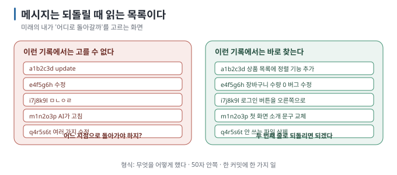

# 08 — 커밋 메시지 쓰는 법: 미래의 나에게 보내는 쪽지

← [07 worktree](07-worktrees.md) · 다음 → [09 GitHub에 올리기와 PR](09-github-and-pr.md)

> **왜 읽나:** 커밋 메시지는 "숙제"가 아니라 **되돌릴 때 읽는 목록**입니다. `update`, `수정`, `ㅁㄴㅇㄹ`로 채워진 기록에서는
> 어느 지점으로 돌아가야 할지 고를 수 없습니다.
>
> **읽고 나면:** 3초 만에 쓸 수 있는 메시지 형식을 갖고, AI에게 메시지를 대신 쓰게 하되 결과를 검토할 수 있습니다.
>
> **바쁘면:** §1의 한 줄 형식만.

---

## 0. 결론 먼저 ★

- 메시지는 **미래의 내가 되돌릴 지점을 고르려고** 읽습니다. 그 용도에 맞으면 충분합니다. `[해석]`
- 한 줄 형식: **`무엇을 어떻게 했다`** — 50자 안쪽, 명사보다 동사로. `[해석]`
- 개발자 관례인 **Conventional Commits**(`feat:`, `fix:` 접두어)는 알아 두면 좋지만 **필수가 아닙니다.** `[자료 확인 · 2026-08-23]`
- **AI에게 초안을 맡기되 읽어 보세요.** AI는 diff에서 "무엇을" 바꿨는지 요약할 수 있지만, 요구한 목적과 실제 변경이
  맞는지는 사람이 확인해야 합니다. `[해석]`

## 1. 형식 — 이 정도면 충분합니다

```text
로그인 버튼을 화면 오른쪽으로 옮김
```

| 규칙 | 이유 |
| --- | --- |
| **한 줄, 50자 안쪽** | `git log --oneline`에서 한 줄로 보임 |
| **무엇을 했는지 동사로** | "버튼 위치" (X) → "버튼을 오른쪽으로 옮김" (O) |
| **한 커밋 = 한 가지 일** | 되돌릴 때 그 일만 되돌릴 수 있음 ([04 §3](04-four-areas.md)) |
| 마침표 없음 | 관례. 안 지켜도 무방 |



**나쁜 예 → 좋은 예** `[해석]`

| 나쁨 | 왜 | 좋음 |
| --- | --- | --- |
| `update` | 뭘 업데이트했는지 없음 | `상품 목록에 정렬 기능 추가` |
| `수정` | 무엇을? | `장바구니 수량이 0이 되던 버그 수정` |
| `AI가 고침` | 무엇을 고쳤는지 없음 | `AI 제안 반영: 로그인 실패 시 안내 문구 추가` |
| `여러 가지 수정` | 한 커밋에 여러 일 | 커밋을 나눌 것 |
| `index.html 변경` | 파일명은 Git이 이미 앎 | `첫 화면 소개 문구 교체` |

## 2. 왜(why)를 남기고 싶을 때 — 본문

한 줄로 부족하면 **빈 줄 하나를 두고** 아래에 이유를 씁니다.

```text
장바구니 수량 계산 방식을 변경

수량을 문자열로 더하고 있어서 "1" + "1" = "11" 이 되는 문제가 있었다.
숫자로 변환한 뒤 더하도록 바꿨다.
```

`git log`(--oneline 없이)에서 본문까지 보입니다. **"왜"는 코드를 봐도 알 수 없으므로 여기 아니면 남을 곳이 없습니다.** `[해석]`

터미널에서 여러 줄을 쓰려면 `-m`을 두 번 씁니다.

```bash
git commit -m "장바구니 수량 계산 방식을 변경" -m "문자열 덧셈으로 11이 되던 문제. 숫자 변환 후 더하도록 수정."
```

## 3. 접두어 관례 (알아만 두기)

여러 프로젝트가 쓰는 **Conventional Commits** 형식입니다. `[자료 확인 · 2026-08-23]`

```text
feat: 다크 모드 추가
fix: 로그인 버튼이 눌리지 않던 문제 수정
docs: 설치 방법 보완
refactor: 중복 코드 정리
chore: 사용하지 않는 파일 삭제
```

| 접두어 | 뜻 |
| --- | --- |
| `feat` | 새 기능 |
| `fix` | 버그 수정 |
| `docs` | 문서만 |
| `refactor` | 동작은 그대로, 코드 정리 |
| `chore` | 잡일 (설정, 삭제 등) |

**혼자 만드는 프로젝트에는 없어도 됩니다.** 팀에 들어가거나 자동 버전 생성 도구를 쓸 때 필요해집니다. 다만 쓰기로 했다면
**끝까지 일관되게** 쓰는 것이 중요합니다 — 반만 붙은 기록이 가장 읽기 어렵습니다. `[해석]`

## 4. AI에게 메시지를 쓰게 하기

AI는 **바뀐 내용(diff)을 읽고 "무엇을"을 요약할** 수 있습니다. 대화와 문서에서 목적을 추정할 수도 있지만, 그 추정이
사용자의 실제 결정과 같은지는 확인이 필요합니다. commit message에는 diff만으로 드러나지 않는 이유와 제약을 사람이
보완하세요. `[해석]`

> 💬 **AI에게 이렇게 말하세요:** "지금 변경 사항을 확인하고 커밋해 줘. 메시지는 한글 한 줄로, 무엇을 왜 바꿨는지 알 수 있게
> 써 줘. 관련 없는 변경이 섞여 있으면 커밋을 나눠 줘."

받은 메시지를 이 세 가지로 검토하세요. `[해석]`

1. **한 줄만 읽고 무슨 일인지 알 수 있는가?**
2. **여러 일이 한 커밋에 섞이지 않았는가?** (섞였으면 "커밋을 나눠 줘"라고 다시 요청)
3. **파일명 나열로 끝나지 않았는가?** (`app.js, style.css 수정` 같은 메시지는 다시 쓰게 하세요)

> 🔧 **한 단계 더 — 메시지를 나중에 고치기**
>
> 방금 만든 커밋의 메시지만 고치려면 `git commit --amend -m "새 메시지"`. **아직 GitHub에 올리지 않았을 때만** 쓰세요.
> 올린 뒤에 고치면 기록이 갈라져 골치 아파집니다([05 §3](05-commits-and-undo.md)).

## 5. 이 문서의 점검표

- [ ] 메시지를 "되돌릴 때 읽는 목록"으로 생각한다
- [ ] 한 줄 50자, 동사로 쓰는 형식을 안다
- [ ] "왜"는 본문에 남긴다는 것을 안다
- [ ] AI가 쓴 메시지를 세 기준으로 검토한다

---

**다음 →** [09 GitHub에 올리기와 PR](09-github-and-pr.md)
