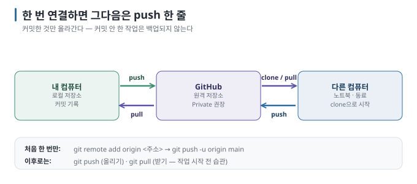
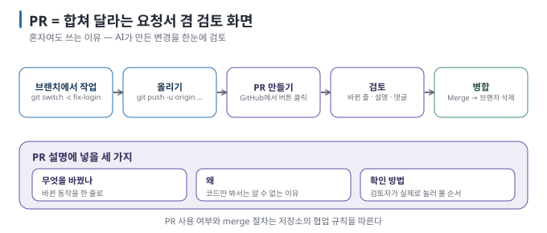

# 09 — GitHub에 올리기와 PR: 원격 복사본, 공유, 검토

← [08 커밋 메시지 쓰는 법](08-commit-messages.md) · 다음 → [10 시나리오: 혼자 만들 때](10-scenarios-solo.md)

> **왜 읽나:** 내 컴퓨터에만 있는 commit 기록은 장비와 함께 잃을 수 있습니다. 원격에 push하면 복사본을 둘 수 있습니다.
> 그리고 PR은 "회사에서 쓰는 어려운 것"이 아니라 **혼자서도 쓸모 있는 검토 화면입니다.**
>
> **읽고 나면:** commit 기록을 GitHub에 올리고, PR이 무엇이고 왜 혼자서도 쓰는지 알며, AI에게 올리기·PR을 맡기되
> 공개 범위와 포함 파일을 직접 확인할 수 있습니다.
>
> **바쁘면:** §1(올리기)만. PR은 필요해질 때 오세요.

---

## 0. 결론 먼저 ★

- 올리기는 **한 번의 remote 연결 + 이후 `git push`입니다.** push한 commit만 원격에 복사됩니다. `[원리]`
- 비공개(Private) 저장소는 공개 범위를 제한하지만, 민감한 값을 commit해도 된다는 뜻은 아닙니다. push 전에 포함 파일과
  비밀값을 확인합니다. `[문서 확인 · 2026-08-27]`
- **PR(Pull Request)은** "이 브랜치를 main에 합쳐 주세요"라는 **요청서 겸 검토 화면입니다.** 혼자여도 쓸 이유가 있습니다(§3). `[해석]`
- HTTPS로 처음 push할 때는 browser 승인, GitHub CLI, credential helper, Personal Access Token 중 설정된 방식으로
  인증합니다. GitHub account password는 Git 인증에 사용할 수 없습니다. `[문서 확인 · 2026-08-27]`

## 1. 올리기 — 세 단계



### ① GitHub에서 빈 저장소 만들기

github.com에 로그인 → 오른쪽 위 **+** → **New repository** → 이름 입력 → **Private** 선택 → **Create repository**.

> ⚠️ 기존 local repository를 그대로 올릴 때는 **"Add a README file" 체크를 해제하세요.** GitHub도 오류를 피하려면 README,
> license, `.gitignore`로 새 remote를 초기화하지 말라고 안내합니다. 이미 remote에 첫 commit을 만들었다면 두 history의 통합
> 방법을 별도로 정해야 합니다. `[문서 확인 · 2026-08-27]`

### ② 내 프로젝트와 연결 (프로젝트당 한 번)

GitHub가 보여 주는 주소를 그대로 씁니다.

```bash
git remote add origin https://github.com/내아이디/내저장소.git
git branch -M main
git push -u origin main
```

| 명령 | 뜻 |
| --- | --- |
| `remote add origin 주소` | "origin"이라는 별명으로 이 원격 주소를 등록 |
| `branch -M main` | 현재 브랜치 이름을 main으로 (이미 main이면 그대로) |
| `push -u origin main` | 올리고, 앞으로 `git push`만 쳐도 되게 기억 |

### ③ 이후로는

```bash
git push
```

**★ 성공 판정:** GitHub 웹페이지를 새로고침하면 내 파일과 커밋 목록이 보입니다. `[문서 확인 · 2026-08-23]`

> 💬 **AI에게 이렇게 말하세요:** "이 프로젝트를 GitHub의 (주소)에 올려 줘. 비밀번호나 키가 든 파일이 커밋에 포함돼 있는지
> 먼저 확인하고, `git status`와 push할 commit 목록을 보여 줘. 내가 확인하기 전에는 push하지 마."

## 2. 처음 push할 때 만나는 것들

| 화면 | 무슨 일 | 어떻게 |
| --- | --- | --- |
| 브라우저가 열리며 로그인·승인 요청 | Git Credential Manager가 인증 처리 | 승인하면 끝. 이후 자동 |
| `Username` / `Password` 를 물음 | account password는 **받지 않습니다** | Password 자리에 **Personal Access Token을** 넣습니다 |
| `Support for password authentication was removed` | 비밀번호 인증 폐지 | 토큰 발급: GitHub → Settings → Developer settings → Personal access tokens |

`[문서 확인 · 2026-08-27]` — GitHub CLI의 `gh auth login`도 browser login을 지원하며, HTTPS Git 인증 정보를 저장하도록
설정할 수 있습니다. credential helper를 쓰지 않고 Git이 Password 입력을 요구할 때만 Personal Access Token을 사용합니다.
**Token은 비밀번호처럼 취급하고 채팅창이나 코드에 붙여넣지 마세요.**

## 3. PR(Pull Request)이란



**PR = "내 브랜치를 main에 합쳐 주세요"라는 요청서.** 그 화면에서 볼 수 있는 것이 진짜 값어치입니다. `[원리]`

| PR 화면이 보여 주는 것 | 왜 유용한가 |
| --- | --- |
| 바뀐 파일과 줄이 색으로 정리 | 커밋 여러 개를 **하나로 묶어** 검토 |
| 설명(제목·본문) | "무엇을 왜" 남김 |
| 댓글 | 특정 줄에 질문·지적 |
| 병합 버튼 | 확인 후 한 번에 main으로 |

### 혼자인데 PR을 왜 쓰나요?

`[해석]` — 세 가지 이유가 있습니다.

1. **AI가 만든 변경을 파일과 줄 단위로 검토할** 수 있습니다. 파일이 많을 때 전체 범위를 파악하기 좋습니다.
2. **기록이 남습니다.** "이 기능은 왜 이렇게 됐지?"를 나중에 PR 설명에서 찾습니다.
3. **main을 안전하게 유지하는** 습관이 생깁니다([06 트렁크 기반](06-branches.md)).

급할 때는 브랜치에서 main으로 바로 merge해도 됩니다. PR은 **의무가 아니라 도구입니다.**

### 만드는 법

```bash
git switch -c fix-login
# ... 작업하고 커밋 ...
git push -u origin fix-login
```

push하면 터미널에 **"Create a pull request for 'fix-login' on GitHub by visiting: …"** 링크가 나옵니다. 그 링크를 클릭하거나,
GitHub 웹에서 노란 띠의 **Compare & pull request** 버튼을 누릅니다. `[문서 확인 · 2026-08-23]`

### PR 설명에 쓸 것

```text
제목: 로그인 실패 시 안내 문구 추가

무엇을 바꿨나
- 비밀번호가 틀렸을 때 빈 화면 대신 안내 문구를 보여 줌

왜
- 사용자가 실패한 건지 로딩 중인지 구분할 수 없었음

확인 방법
- 로그인 화면에서 아무 비밀번호나 넣고 제출 → 빨간 안내 문구가 보이면 정상
```

**"확인 방법"이 가장 중요합니다.** 검토하는 사람(미래의 나 포함)이 실제로 눌러 볼 수 있어야 합니다. `[해석]`

> 💬 **AI에게 이렇게 말하세요:** "지금 branch의 diff와 commit 목록을 먼저 보여 줘. 내가 확인하면 push하고 PR을 만들어 줘.
> 제목은 한 줄로, 본문에는 '무엇을 바꿨나 / 왜 / 확인 방법' 세 항목을 넣어 줘."

`gh` 명령줄 도구가 설치돼 있으면 AI가 `gh pr create`로 한 번에 만들 수 있습니다. `[문서 확인 · 2026-08-23]`

## 4. 합친 뒤

1. GitHub에서 **Merge pull request** 클릭
2. 브랜치 삭제 버튼(Delete branch) 클릭 — 남겨 두면 목록만 지저분해집니다
3. 내 컴퓨터에서 최신 main 받아오기:

```bash
git switch main
git pull
git branch -d fix-login      # 로컬 브랜치도 정리
```

## 5. 이 문서의 점검표

- [ ] 기존 local history를 올릴 remote를 비워 두는 이유를 안다
- [ ] `remote add` → `push -u`는 한 번, 이후는 `git push`인 것을 안다
- [ ] GitHub account password가 아닌 browser·GitHub CLI·credential helper·token 방식으로 인증한다는 것을 안다
- [ ] PR이 요청서 겸 검토 화면이라는 것을 안다
- [ ] PR 설명에 "확인 방법"을 넣는다

---

**다음 →** [10 시나리오: 혼자 만들 때](10-scenarios-solo.md)
