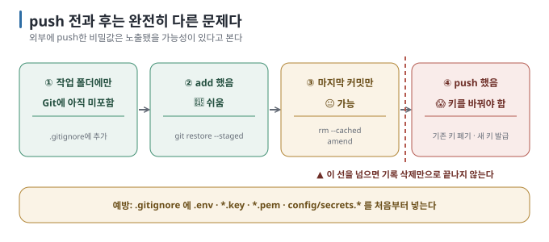

# 11 — 시나리오: 올리고 공개할 때

← [10 시나리오: 혼자 만들 때](10-scenarios-solo.md) · 다음 → [12 AI에게 Git 작업을 지시하는 법](12-asking-ai.md)

> **왜 읽나:** commit 기록이 한 장비에만 있으면 장비 손상과 함께 잃을 수 있습니다. 그리고 **비밀번호를 커밋에 넣는 실수는**
> 올리기 전과 후의 대응이 완전히 다릅니다 — 그 경계를 실제로 만들어 확인했습니다.
>
> **읽고 나면:** 원격 복사본·다른 컴퓨터에서 이어하기·둘이 만들기·비밀값 사고 대응·공개 전 점검을 할 수 있습니다.
>
> **읽는 법:** 목차에서 골라 읽으세요.

> **검증 상태:** clone·Secret 파일 처리는 로컬 저장소로 실제 실행했습니다. `[실행 검증 · 2026-08-23]` GitHub 웹 화면 조작과 인증은
> 공식 문서로만 확인했습니다. `[문서 확인 · 2026-08-23]`

---

## 목차

| 상황 | 절 |
| --- | --- |
| 컴퓨터가 고장 나면 어쩌지 | [S7 백업하기](#s7--백업하기) |
| 다른 컴퓨터에서 이어서 하고 싶다 | [S8 이어하기](#s8--다른-컴퓨터에서-이어하기) |
| 둘이서 같이 만든다 | [S9 같이 만들기](#s9--둘이서-같이-만들기) |
| **비밀번호를 커밋해 버렸다** | [S10 비밀값 사고](#s10--비밀번호를-커밋해-버렸다) |
| Private 저장소를 Public으로 바꾸거나 release하려 한다 | [S11 공개 전 점검](#s11--공개-전-점검하기) |

---

## S7 — 백업하기

**상황:** 프로젝트의 commit 기록을 다른 곳에도 복사해 두고 싶습니다.

1. GitHub에서 빈 저장소 만들기 — **Private 선택**, **"Add a README" 체크 해제** ([09 §1](09-github-and-pr.md))
2. 연결하고 올리기:

```bash
git remote add origin https://github.com/내아이디/내저장소.git
git branch -M main
git push -u origin main
```

3. 이후로는 `git push` 한 줄. **commit한 뒤 push한 것만 올라갑니다.** 미커밋 변경과 untracked file은 원격 복사본에
   포함되지 않습니다.

**★ 성공 판정:** GitHub 페이지를 새로고침하면 파일과 커밋 목록이 보입니다.

| 언제 push하나 | 권장 |
| --- | --- |
| 하루 작업을 마칠 때 | ✅ 최소한 이때는 |
| 잘 되는 상태에 도달했을 때 | ✅ |
| 커밋할 때마다 | 해도 무방 |

> 💬 **AI에게:** "이 프로젝트를 GitHub에 올리려고 해. 먼저 커밋에 비밀번호나 API 키가 든 파일이 포함돼 있는지 확인해 주고,
> 문제없으면 (주소)로 push해 줘."

---

## S8 — 다른 컴퓨터에서 이어하기

**상황:** 집 컴퓨터에서 하던 걸 노트북에서 이어서 하고 싶습니다.

### 처음 한 번 (새 컴퓨터에서)

```bash
git clone https://github.com/내아이디/내저장소.git
cd 내저장소
```

`clone`은 **기록 전체를 통째로** 가져옵니다 — 지금까지의 모든 커밋이 새 컴퓨터에 그대로 생깁니다. 작성 환경에서 확인한 실제
출력입니다. `[실행 검증 · 2026-08-23]`

```text
$ git log --oneline
90a4cbe 설정 추가
11c6e79 gitignore 추가
647f54d 문단과 스타일 추가
877caa4 첫 저장

$ git remote -v
origin  https://github.com/… (fetch)
origin  https://github.com/… (push)
```

### 이후 매번

```bash
git pull          # 시작할 때: 다른 곳에서 올린 변경 받기
# ... 작업하고 커밋 ...
git push          # 끝낼 때: 올리기
```

**습관 하나:** 작업 시작 전에 **원격 변경을 확인합니다.** 저장소 규칙에 따라 `git fetch` 또는 `git pull`을 사용하고,
두 컴퓨터의 기록이 갈라졌다면 통합 방법부터 확인합니다. `[해석]`

| 증상 | 원인 | 해결 |
| --- | --- | --- |
| `push`가 거부됨 (`rejected`) | 원격에 내가 모르는 커밋이 있음 | `git pull` 먼저 → 충돌 나면 [06 §4](06-branches.md) |
| `pull`에서 충돌 | 양쪽이 같은 줄을 고침 | [06 §4](06-branches.md)와 같은 방법으로 해결 |

> 💬 **AI에게:** "다른 컴퓨터에서 작업하던 프로젝트를 여기서 이어서 하려고 해. GitHub 주소는 (주소)야. clone하고 최신 상태인지
> 확인해 줘."

---

## S9 — 둘이서 같이 만들기

**상황:** 친구(또는 동료)와 같은 프로젝트를 만듭니다.

### 준비

1. GitHub 저장소 → **Settings → Collaborators** → 상대 초대 `[문서 확인 · 2026-08-23]`
2. 상대는 `git clone`으로 받아 갑니다

### 충돌을 줄이는 기본 규칙 `[해석]`

| 규칙 | 이유 |
| --- | --- |
| **각자 자기 브랜치에서 작업** | 같은 브랜치에 동시에 push하면 계속 충돌 |
| 작업 시작 전 원격 변경 확인 | 저장소 규칙에 따라 `fetch` 또는 `pull`하고 갈라진 기록이 없는지 확인 |
| **작게 자주 합친다** | 브랜치가 오래 살수록 충돌이 커짐 ([06 §3](06-branches.md)) |

### 흐름

```bash
git switch main
git pull                          # 최신 받기
git switch -c fix-login           # 내 브랜치
# ... 작업하고 커밋 ...
git push -u origin fix-login      # 내 브랜치 올리기
# GitHub에서 PR 만들기 → 상대가 검토 → Merge ([09 §3](09-github-and-pr.md))
git switch main && git pull       # 합쳐진 결과 받기
git branch -d fix-login           # 정리
```

충돌은 "둘이 같은 부분을 다르게 고쳤다"는 뜻이고, 해결은 [06 §4](06-branches.md)의 3단계입니다. AI는 양쪽 diff와 주변
맥락을 설명할 수 있지만, 최종 동작과 의도는 두 사람이 확인합니다.

> 💬 **AI에게:** "지금 브랜치 작업이 끝났어. push하고 PR을 만들어 줘. PR 본문에 무엇을 왜 바꿨는지, 어떻게 확인하는지 넣어 줘."

---

## S10 — 비밀번호를 커밋해 버렸다

**상황:** `.env`나 설정 파일에 API 키가 들어 있는데 `git add .`로 함께 담았습니다. **가장 흔하고 가장 위험한 실수입니다.**



### 어디까지 갔는지가 전부입니다

| 단계 | 심각도 | 해결 |
| --- | --- | --- |
| ① 작업 폴더에만 있음 | 😀 문제 없음 | `.gitignore`에 추가 |
| ② `add`함 (커밋 전) | 🙂 쉬움 | `git restore --staged 파일` |
| ③ 커밋함 (push 전) | 😐 가능 | `git rm --cached` + `commit --amend` |
| ④ **push함** | 😱 **키를 바꿔야 함** | 아래 참조 |

### ② add했지만 커밋 전

`[실행 검증 · 2026-08-23]`

```bash
$ git status --short
A  .env                      ← 스테이징에 들어감

$ git restore --staged .env  ← 빼기
$ printf '.env\n' > .gitignore
$ git add .gitignore
$ git commit -m "gitignore 추가"

$ git status --short
                             ← .env 가 더 이상 보이지 않음 (무시되고 있음)

$ git check-ignore -v .env
.gitignore:1:.env	.env      ← 무시 규칙이 걸린 것을 확인
```

### ③ 커밋했지만 아직 push 전

`[실행 검증 · 2026-08-23]`

```bash
$ git rm --cached secret-config.txt      # 기록에서만 빼기 (파일은 남음)
$ printf 'secret-config.txt\n' >> .gitignore
$ git add .gitignore
$ git commit --amend -m "설정 추가"       # 마지막 커밋을 다시 쓰기

$ git show --stat HEAD
commit 90a4cbe…
    설정 추가
 .gitignore | 1 +                        ← Secret 파일이 커밋에서 사라짐

$ ls -la secret-config.txt
-rw-r--r--  … secret-config.txt          ← 내 컴퓨터에는 그대로 있음 (정상)
```

**★ 성공 판정:** `git show --stat HEAD`의 파일 목록에 Secret 파일이 없고, 디스크에는 파일이 남아 있습니다.

⚠️ 커밋이 **여러 개 전이라면** `--amend`로는 안 됩니다. 기록을 다시 쓰는 도구(`git filter-repo` 등)가 필요하고 복잡합니다 —
이 가이드 범위 밖이며, 아래 ④와 같은 대응을 권합니다. `[해석]`

### ④ 이미 push했다 — 키를 바꾸세요

**이것이 이 문서에서 가장 중요한 문장입니다.** `[해석]`

> 외부 저장소에 push한 비밀값은 **노출됐을 가능성이 있는 것으로 간주합니다.** 기록에서 지우거나 저장소를 비공개로
> 바꾸는 조치는 이미 만들어진 clone·cache·download를 회수하지 못합니다.

해야 할 일의 순서:

1. **해당 키·비밀번호를 즉시 무효화하고 새로 발급합니다.** 서비스 관리 화면에서 직접 처리하고 완료 여부를 확인합니다
2. 새 키를 `.env`에 넣고 `.gitignore`에 등록
3. (선택) 기록에서 지우기 — 하되, 1번을 대신하지는 못합니다

`[문서 확인 · 2026-08-23]` — GitHub는 일부 서비스의 키 형식을 자동 감지해 알려 주는 기능(Secret scanning)을 제공하지만, 모든
비밀을 잡지는 못합니다.

### 예방 — 처음부터

```text
# .gitignore
.env
.env.local
*.key
*.pem
config/secrets.*
```

> 💬 **AI에게:** 커밋 전 습관 — "커밋하기 전에 지금 담긴 파일 중에 비밀번호, API 키, 토큰이 들어 있을 만한 게 있는지 확인해 줘."
> 사고 후 — "방금 커밋에 API 키가 든 파일이 들어갔어. 아직 push는 안 했어. 커밋에서 빼고 .gitignore에 추가해 줘."

---

## S11 — 공개 전 점검하기

**상황:** 기존 Private 저장소를 처음 Public으로 바꾸거나, 이미 공개된 저장소의 새 version을 release하려 합니다.

공개는 단순히 버튼 하나를 누르는 일이 아닙니다. 현재 파일뿐 아니라 **도달 가능한 Git history, release asset, 문서에 적힌
설치·지원 주장, 계정과 내부 경로, 저장소 설정**도 공개 범위에 들어갈 수 있습니다. `[원리]`

### 공개 전에 확인할 것

| 범위 | 확인 질문 |
| --- | --- |
| 파일과 history | 비밀값·개인 정보·내부 URL·장비 경로가 현재 tree나 이전 commit에 남아 있나? |
| 공개 문서 | README·LICENSE·CHANGELOG·설치법과 실제 동작이 맞나? |
| 생성물 | screenshot·log·release asset의 내용과 metadata에 공개하면 안 될 정보가 있나? |
| GitHub 설정 | default branch, branch/tag 보호, issue·discussion·security 기능의 공개 상태가 의도와 맞나? |
| release 결과 | tag·GitHub Release·asset·설치 경로가 실제로 공개되고 다시 받을 수 있나? |

GitHub는 Private→Public 전환 시 code뿐 아니라 Actions history와 log도 누구나 볼 수 있게 되고, 누구나 fork할 수 있으며,
기존 push ruleset이 비활성화된다고 안내합니다. 공개 직전과 직후에 설정을 다시 확인해야 하는 이유입니다.
`[문서 확인 · 2026-08-27]`

### `github-release-guide`로 점검 흐름 고정하기

[`github-release-guide`](https://github.com/kyungseo/skillstead/tree/main/skills/github-release-guide)는 다음 두 경우를 위한
공개 release 점검 skill입니다. `[자료 확인 · 2026-08-27]`

- github.com의 **기존 Private 저장소를 처음 Public으로 전환할** 때
- **이미 공개된 저장소의 새 version을 release할** 때

먼저 읽기 전용 **Assess로** 준비 상태와 막힌 항목을 확인합니다. 실제 변경이 필요하면 **Guided에서** file 수정,
commit·merge, push, tag, 공개 범위, repository 설정, GitHub Release를 서로 다른 승인 단위로 진행합니다. 마지막에는 공개 URL과
tag·asset을 다시 확인해야 완료입니다.

이 skill은 저장소를 처음 만드는 도구나 보안 감사의 대체물이 아닙니다. 민감 정보 scan도 발견 가능한 pattern을 찾는
best-effort 점검이므로 "아무것도 안 나왔다"를 유출 가능성 0%의 증명으로 해석하지 않습니다. 저장소를 다시 Private으로
바꿔도 이미 만들어진 clone·fork·cache·download를 회수할 수 없습니다.

> 💬 **AI에게:** “`github-release-guide`를 Assess mode로 사용해서 이 기존 Private github.com 저장소를 처음 Public으로
> 공개할 준비가 됐는지 점검해 줘. 아직 file 수정, commit, push, visibility 변경, release 생성은 하지 마.”

---

## 이 문서의 점검표

- [ ] 프로젝트를 GitHub에 올려 봤다 (S7)
- [ ] 작업 시작 전 `git pull` 습관을 안다 (S8)
- [ ] 각자 브랜치 → PR → 합치기 흐름을 안다 (S9)
- [ ] `.gitignore`에 Secret 파일을 등록했다 (S10)
- [ ] **push된 비밀값은 기존 값을 폐기하고 새로 발급해야 한다는** 것을 안다 (S10)
- [ ] Public 전환과 version release 전에 file·history·문서·설정·release 결과를 나눠 확인한다 (S11)
- [ ] `github-release-guide`의 Assess와 Guided, 점검과 승인, 공개와 사후 검증을 구분한다 (S11)

---

**다음 →** [12 AI에게 Git 작업을 지시하는 법](12-asking-ai.md)
