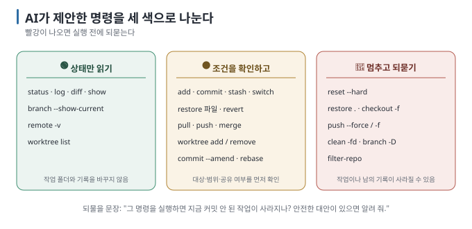

# 12 — AI에게 Git 작업을 지시하는 법: 상황별 문장과 위험 신호등

← [11 시나리오: 올리고 공개할 때](11-scenarios-share.md) · 다음 → [13 용어집](13-glossary.md)

> **왜 읽나:** 이 가이드의 전제가 여기 모입니다 — **명령어를 외우는 대신 작업을 정확히 지시하고, 위험한 제안을 알아채는 것.** 작업 지시문
> 모음과, AI가 제안했을 때 확인하거나 멈춰야 할 명령 목록입니다.
>
> **읽고 나면:** 상황별 작업 지시문을 골라 쓸 수 있고, AI가 제안한 명령을 초록·노랑·빨강으로 분류할 수 있습니다.
>
> **읽는 법:** 북마크해 두고 필요할 때 여는 문서입니다.

---

## 0. 결론 먼저 ★

- 좋은 작업 지시에는 셋이 들어갑니다 — **① 지금 상황 ② 원하는 결과 ③ 하지 말아야 할 것.** `[해석]`
- AI는 diff와 대화에서 변경 의도를 추정할 수 있습니다. 다만 **어느 동작을 남길지, 어디까지 되돌릴지, 무엇을 공개할지는
  사용자가 확인하고 승인해야 합니다.** `[해석]`
- ⛔ **빨강 명령**(`reset --hard`, `push --force`, `clean -fd`, `checkout -f`)이 제안되면 실행 전에 되물으세요. `[해석]`
- AI 코딩 도구가 **자동으로 커밋하기도** 합니다. 무엇을 했는지 `git log`로 확인하는 습관을 들이세요. `[해석]`

## 1. 작업 지시문 모음

### 시작·저장

| 상황 | 이렇게 말하세요 |
| --- | --- |
| Git 시작 | "이 폴더를 git으로 관리 시작해 줘. 먼저 이 프로젝트에 맞는 .gitignore를 만들어 비밀번호·API 키·라이브러리 폴더를 제외하고, 그다음 '첫 저장'으로 커밋해 줘." |
| **큰 작업 전 세이브** | "지금 상태를 '(무엇을 하기 전)'이라는 메시지로 커밋하고, 그다음 (하려는 일)을 해 줘." |
| 커밋만 | "지금 변경 사항을 확인하고 커밋해 줘. 메시지는 한글 한 줄로, 무엇을 왜 바꿨는지 알 수 있게." |
| 커밋 나누기 | "지금 변경에 서로 다른 일이 섞여 있으면 커밋을 나눠서 각각 따로 커밋해 줘." |
| 상태 확인 | "지금 git 상태를 알려 줘. 커밋 안 된 변경, 커밋됐지만 안 올라간 것, 지금 브랜치를 각각 알려 줘." |

### 되돌리기

| 상황 | 이렇게 말하세요 |
| --- | --- |
| 파일 하나만 | "(파일명)만 마지막 커밋 상태로 되돌려 줘. 다른 파일은 그대로 둬." |
| 커밋 취소 | "마지막 커밋을 취소하고 싶어. **reset이 아니라 revert로** 해 줘." |
| 어디로 돌아갈지 모를 때 | "최근 커밋 10개를 한 줄씩 보여 주고, 각각 무슨 작업이었는지 요약해 줘." |
| 위험 확인 | "그 명령을 실행하면 지금 커밋 안 된 작업이 사라지는지 먼저 알려 줘." |

### 브랜치·비교

| 상황 | 이렇게 말하세요 |
| --- | --- |
| 두 안 비교 | "(기능)을 두 가지 방식으로 만들어 보고 싶어. try-a, try-b 브랜치를 만들어 각각 구현하고, 오가는 명령도 알려 줘." |
| 두 작업 동시 진행 | "현재 폴더는 건드리지 말고, 작업마다 별도 worktree와 branch를 만들어 줘. 경로와 담당 범위를 먼저 보여 줘." |
| 채택 | "try-b를 main에 합치기 전에 diff와 검증 결과를 보여 줘. 확인 후 합치고, try-a 삭제는 별도로 물어봐 줘." |
| 충돌 | "충돌이 났어. 어느 파일 어느 부분인지 보여 주고 양쪽 의도를 설명해 줘. 나는 (원하는 쪽)을 살리고 싶어." |
| 변경 확인 | "지금 뭐가 바뀌었는지 파일별로 요약하고, 각각 무슨 의도의 변경인지 설명해 줘." |

### 올리기·공유

| 상황 | 이렇게 말하세요 |
| --- | --- |
| 원격 복사본 | "이 프로젝트를 GitHub (주소)에 올리기 전에 status, push할 commit, 비밀값 의심 파일을 보여 줘. 내가 확인하기 전에는 push하지 마." |
| 이어하기 | "다른 컴퓨터에서 하던 프로젝트를 여기서 이어서 할 거야. 주소는 (주소)야. clone하고 최신인지 확인해 줘." |
| PR | "지금 브랜치를 push하고 PR을 만들어 줘. 본문에 '무엇을 바꿨나 / 왜 / 확인 방법' 세 항목을 넣어 줘." |
| 비밀 사고 | "방금 커밋에 API 키가 든 파일이 들어갔어. 아직 push는 안 했어. 커밋에서 빼고 .gitignore에 추가해 줘." |
| 첫 공개 점검 | "github-release-guide를 Assess mode로 사용해서 기존 Private github.com 저장소의 첫 Public 전환 준비 상태만 점검해 줘. 변경은 하지 마." |

### 배우기

| 상황 | 이렇게 말하세요 |
| --- | --- |
| 명령 이해 | "방금 실행한 명령이 무슨 일을 한 건지, 되돌릴 수 있는지 초심자가 이해할 수 있게 설명해 줘." |
| 상태 진단 | "지금 저장소 상태가 정상인지 봐 줘. 이상한 게 있으면 뭐가 문제고 어떻게 고치는지 알려 줘." |

## 2. ⛔ 위험 신호등 — AI가 이 명령을 제안하면



### 🟢 초록 — 상태만 읽습니다

`git status` · `git log` · `git diff` · `git show` · `git branch --show-current` · `git remote -v` · `git worktree list`

저장소와 작업 폴더를 바꾸지 않고 현재 상태를 보여 주는 명령입니다. 먼저 이 명령들로 범위와 상태를 확인합니다. `[원리]`

### 🟡 노랑 — 변경 범위와 전제부터 확인합니다

| 명령 | 조건 | 물어볼 것 |
| --- | --- | --- |
| `git add` / `git commit` | staging 대상과 commit 내용을 확인 | "어떤 파일과 변경이 들어가나?" |
| `git stash` | 기본 stash에는 untracked file이 빠짐 | "무엇을 치우고 무엇이 남나?" |
| `git switch` | 미커밋 변경과 branch 상태에 따라 거부되거나 변경을 함께 가져갈 수 있음 | "현재 변경은 어디에 남나?" |
| `git restore 파일` | 해당 파일의 미커밋 변경을 버림 | "버릴 diff를 먼저 보여 줘." |
| `git revert` | 취소하는 새 commit을 만듦 | "어떤 commit의 어떤 변경을 취소하나?" |
| `git pull` | 원격 기록을 받고 merge 또는 rebase할 수 있음 | "먼저 fetch하고 갈라진 상태를 보여 줄 수 있나?" |
| `git push` | commit을 외부 remote에 게시 | "어느 remote·branch에 어떤 commit을 올리나?" |
| `git worktree add/remove` | 폴더와 branch 연결을 만들거나 제거 | "대상 경로와 미커밋 변경을 확인했나?" |
| `git commit --amend` | **아직 push 전일** 때만 | "이거 이미 올린 커밋이야?" |
| `git rebase` | 혼자 쓰는 브랜치에서만 | "왜 merge 대신 rebase야?" |
| `git merge` | 충돌 가능 | (충돌 나면 `git merge --abort`로 취소 가능) |

### 🔴 빨강 — 멈추고 되물으세요

| 명령 | 무슨 일이 일어나나 |
| --- | --- |
| `git reset --hard` | **커밋 안 된 작업이 복구 불가능하게 삭제** ([05 §4](05-commits-and-undo.md)에서 실제 확인) |
| `git restore .` (점) | 현재 폴더 아래 tracked file의 미커밋 변경을 한꺼번에 버림 |
| `git push --force` / `-f` | 원격의 남의 커밋을 덮어씀. 협업 중이면 사고 |
| `git clean -fd` | **Git이 모르는 파일들을 삭제** (새로 만든 파일 전부) |
| `git checkout -f` / `--force` | 작업 중인 변경을 버림 |
| `git branch -D` | merge되지 않은 branch도 강제로 삭제 |
| `git filter-repo` / `filter-branch` | 기록 전체를 다시 씀 |

**되물을 문장:**

> 💬 "그 명령을 실행하면 **지금 커밋 안 된 작업이 사라지나?** 사라진다면 먼저 커밋하거나 stash로 저장해 줘. 그리고 같은 목적을
> 안전하게 달성하는 다른 방법이 있으면 알려 줘."

같은 목적을 더 좁은 범위나 기록을 남기는 방식으로 달성할 수 있는지 먼저 확인합니다. `[해석]`

| 하려던 일 | 위험한 방법 | 안전한 방법 |
| --- | --- | --- |
| 마지막 커밋 취소 | `reset --hard HEAD~1` | `git revert HEAD` |
| 파일 되돌리기 | `checkout -f` | `git diff -- 파일` 확인 후 `git restore 파일` |
| 새 파일 정리 | `clean -fd` | 파일 목록 확인 후 하나씩 삭제 |
| 원격 차이 확인 | `push --force` | `git fetch` 후 local·remote commit 비교 |

## 3. AI 코딩 도구가 자동으로 커밋할 때

일부 도구는 작업 후 **알아서 커밋합니다.** 편하지만 확인이 필요합니다. `[해석]`

```bash
git log --oneline -5        # 최근에 뭘 커밋했나
git show --stat HEAD        # 마지막 커밋에 무슨 파일이 들어갔나
```

**확인 포인트 셋:**

1. **Secret 파일이 안 들어갔나** — `git show --stat HEAD`의 파일 목록
2. **한 커밋에 여러 일이 섞이지 않았나** — 섞였으면 나중에 되돌리기 어려움
3. **메시지가 읽을 만한가** — `update` 같은 메시지면 다시 쓰게 하기

> 💬 "방금 네가 만든 커밋들을 보여 주고, 각각 무슨 변경인지, 비밀번호나 키가 포함된 파일이 있는지 확인해 줘."

## 4. AI가 도울 수 있지만 사용자가 승인할 것

| 판단 | AI가 할 수 있는 일 | 사용자가 확인할 것 |
| --- | --- | --- |
| 충돌 해결 | 양쪽 diff와 예상 동작 설명 | 최종적으로 남길 동작과 의도 |
| 되돌릴 범위 | 변경 시점과 영향 후보 제시 | 버려도 되는 사용자 작업 |
| commit 분리 | 파일·diff의 주제별 묶음 제안 | 실제로 하나의 변경 단위인지 |
| 비밀값 사고 | 노출 위치와 대응 순서 정리 | key 무효화·재발급 실행과 완료 여부 |
| main merge | diff·test·review 결과 요약 | 제품이 원하는 결과이고 공개 가능한지 |

`[해석]` — 그래서 이 가이드가 개념을 설명한 것입니다. **실행은 AI에게 맡길 수 있지만, 범위와 결과의 결정권은 사용자가
유지합니다.**

---

**다음 →** [13 용어집](13-glossary.md)
