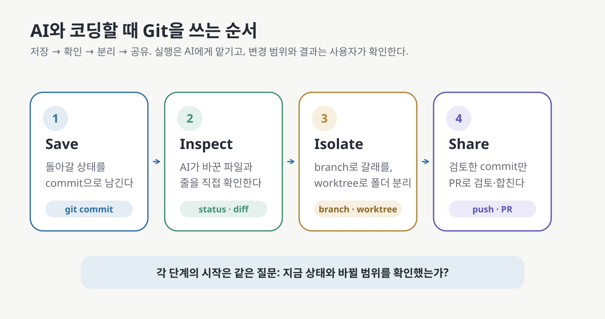

# AI로 코딩하는 사람을 위한 Git


AI 코딩 도구는 여러 파일을 빠르게 바꿉니다. 문제는 속도보다 **무엇이 바뀌었는지, 어디까지 되돌릴지, 어떤 결과를
남길지를 사람이 판단해야 한다는 점**입니다.

Git은 그 판단에 필요한 기록과 경계를 만듭니다. 잘 동작하는 상태를 commit으로 남기고, AI가 만든 diff를 확인하고,
서로 다른 시도를 branch로 나눌 수 있습니다. 동시에 여러 작업을 진행할 때는 worktree로 작업 폴더까지 분리할 수 있습니다.

Git 명령 실행은 AI에게 맡겨도 됩니다. 이 가이드의 목표는 명령어 암기가 아니라, **AI가 제안한 Git 작업의 의미와 위험을 이해하고
결정권을 유지하는 것**입니다.

> 이 가이드는 AI 코딩 도구로 무언가를 만들고 있지만 Git은 처음인 사람을 대상으로 합니다. 터미널을 열어 본 적이 없어도
> 시작할 수 있습니다. macOS에서 실행 가능한 경로를 직접 검증했고, Windows와 GitHub 화면 조작은 공식 문서로 확인한 범위를
> 구분해 표시합니다. 자세한 범위는 [검증 기록](VALIDATION.md)에 있습니다.

**[10분 안에 첫 저장 지점 만들기](#가장-짧은-경로--10분-안에-첫-저장-지점)** ·
**[worktree부터 보기](07-worktrees.md)** ·
**[상황별로 찾기](10-scenarios-solo.md)**

## 학습 달성 목표(Learning Objective)

이 가이드를 끝내면 다음을 할 수 있습니다.

- working tree·staging·commit·branch·remote가 각각 무엇인지 설명할 수 있습니다.
- AI에게 큰 변경을 맡기기 전에 되돌릴 수 있는 저장 지점을 만들 수 있습니다.
- `status`와 `diff`로 AI가 바꾼 파일과 줄을 확인할 수 있습니다.
- 파일 하나, commit 하나처럼 필요한 범위만 골라 되돌릴 수 있습니다.
- branch로 시도를 나누고, worktree로 여러 branch를 별도 폴더에 동시에 열어 둘 수 있습니다.
- 여러 AI 세션에 서로 다른 worktree와 branch를 배정하고 결과를 따로 검토할 수 있습니다.
- GitHub에 올리기 전에 비밀값과 공개 범위를 확인할 수 있습니다.
- 기존 Private 저장소의 첫 Public 전환이나 공개 저장소의 version release 전에 무엇을 점검하고, 어떤 변경을 별도로 승인해야
  하는지 설명할 수 있습니다.
- AI가 제안한 명령이 읽기 전용인지, 변경을 만드는지, 작업을 버릴 수 있는지 구분할 수 있습니다.

## 가이드 작성 중 직접 확인한 실행 기록

- AI가 고친 파일 세 개 중 하나만 `git restore`로 되돌렸고, 다른 두 파일은 그대로 남았습니다. 단, 되돌린 파일의
  미커밋 변경은 사라지므로 실행 전에 diff를 확인해야 합니다. ([05 §6](05-commits-and-undo.md#6-파일-세-개-중-하나만-되돌리기))
- 같은 기능의 두 구현을 branch로 나누어 번갈아 실행한 뒤 하나만 main에 합쳤습니다. ([10 S4](10-scenarios-solo.md#s4--두-가지-안을-비교하기))
- `main`과 새 작업 branch를 서로 다른 worktree에 동시에 열고, 각 폴더의 변경과 staging 상태가 분리되는 것을 확인했습니다.
  ([07](07-worktrees.md))
- `.env`가 staging 또는 commit에 들어간 상황을 만들어 push 전 제거 절차를 확인했습니다. 이미 외부에 공개한 비밀값은
  기록만 지우는 것으로 해결되지 않으며 해당 값을 교체해야 합니다. ([11 S10](11-scenarios-share.md#s10--비밀번호를-커밋해-버렸다))
- `git reset --hard HEAD`를 실행해 commit하지 않은 tracked file 변경이 Git 기록에 남지 않고 사라지는 것을 확인했습니다.
  ([05 §4](05-commits-and-undo.md#4--git-reset---hard--되돌리기가-아니라-삭제입니다))

## 가장 짧은 경로 — 10분 안에 첫 저장 지점

Git이 설치된 컴퓨터에서 지금 AI와 만들고 있는 프로젝트 폴더를 엽니다. 설치 여부를 모르면
[03 내 컴퓨터에 Git 준비하기](03-setup-mac-windows.md)를 먼저 보세요.

### 1. Secret 파일부터 제외하기

프로젝트에 API key나 비밀번호가 있다면 먼저 `.gitignore`에 해당 파일을 적습니다. 무엇을 제외해야 할지 모르겠다면
AI에게 프로젝트 종류를 확인하고 `.gitignore` 후보를 보여 달라고 하세요. 바로 적용하게 하지 말고 목록을 먼저 봅니다.

### 2. Git 관리 시작하기

```bash
git init
git status --short
```

`git status`에 나오는 파일을 확인합니다. 비밀번호, API key, 대용량 dependency나 build 결과가 보인다면 아직 `git add .`을
실행하지 말고 `.gitignore`부터 고칩니다.

### 3. 첫 저장 지점 만들기

```bash
git add .
git diff --staged --stat
git commit -m "첫 저장: AI 작업 전 상태"
git log --oneline -1
```

**★ 성공 판정:** 마지막 명령에 `a1b2c3d 첫 저장: AI 작업 전 상태`처럼 짧은 commit ID와 메시지가 한 줄로 표시됩니다.
이제 이후 변경은 이 지점과 비교하거나 되돌릴 수 있습니다. `[실행 검증 · 2026-08-27]`

> 💬 **AI에게 이렇게 말하세요:** “이 프로젝트를 Git으로 관리하려고 해. 먼저 `git status`와 `.gitignore`를 확인해서
> 비밀번호·API key·dependency·build 결과가 들어가지 않는지 목록으로 보여 줘. 내가 확인하면 첫 commit을 만들어 줘.”

## 이 가이드의 사용법 — Save → Inspect → Isolate → Share



| 단계 | 사람이 답해야 할 질문 | 관련 문서 |
| --- | --- | --- |
| **Save** | 지금 돌아갈 수 있는 상태가 있는가? | 04 → 05 |
| **Inspect** | AI가 무엇을 바꿨으며, 의도한 범위와 맞는가? | 04 → 10 S5 → 12 |
| **Isolate** | 이번 시도를 branch로 나눌까? 동시에 진행하므로 worktree까지 필요할까? | 06 → 07 → 10 S4 |
| **Share** | 무엇을 원격에 올리고, 검토·공개·release를 어떤 승인 단위로 나눌까? | 09 → 11 |

매번 같은 기준으로 현재 상태를 남기려면 [내 프로젝트 Git 카드](GIT-CARD.md)를 복사해 쓰세요.

## 먼저 구분할 여섯 가지

| 개념 | 뜻 | 흔한 혼동 |
| --- | --- | --- |
| **Git** | 내 컴퓨터에서 실행하는 버전 관리 도구 | GitHub가 없어도 commit과 branch는 동작합니다 |
| **GitHub** | Git 저장소의 commit 기록을 올리고 검토·공유하는 서비스 | working tree의 미커밋 파일까지 자동으로 백업하지 않습니다 |
| **commit** | 선택한 변경으로 만든 이름 있는 저장 지점 | 파일을 저장하는 `Ctrl+S`와 다릅니다 |
| **branch** | commit 기록이 이어지는 작업의 갈래 | 파일 복사본이나 별도 폴더가 아닙니다 |
| **working tree** | 현재 branch의 파일을 펼쳐 놓고 고치는 작업 폴더 | 저장소 전체 기록과 다릅니다 |
| **worktree** | 같은 저장소에 연결된 추가 작업 폴더 | clone이 아니며 branch와 commit 기록을 공유합니다 |

## 문서 지도

| # | 문서 | 이럴 때 읽기 |
| --- | --- | --- |
| **1부 — 저장하고 확인하기** | | |
| 01 | [버전 관리란 무엇인가](01-what-is-version-control.md) | `최종_진짜최종` 파일이 늘어날 때 |
| 02 | [Git과 GitHub는 다르다](02-git-vs-github.md) | 계정이 없어서 Git을 못 쓴다고 생각했을 때 |
| 03 | [내 컴퓨터에 Git 준비하기](03-setup-mac-windows.md) | Git 설치와 터미널이 처음일 때 |
| 04 | [Git의 네 공간](04-four-areas.md) | `add`·`commit`·`push`가 어디에 반영되는지 모를 때 |
| 05 | [커밋과 되돌리기](05-commits-and-undo.md) | AI 변경을 일부 또는 전부 취소해야 할 때 |
| **2부 — 작업을 나누기** | | |
| 06 | [브랜치](06-branches.md) | 한 폴더에서 여러 시도를 나누고 합칠 때 |
| 07 | [worktree](07-worktrees.md) | 여러 branch와 AI 작업을 별도 폴더에서 동시에 진행할 때 |
| 08 | [커밋 메시지](08-commit-messages.md) | 나중에 찾고 되돌릴 수 있는 기록을 남길 때 |
| **3부 — 올리고 검토하기** | | |
| 09 | [GitHub와 Pull Request](09-github-and-pr.md) | 원격에 올리고 변경을 검토한 뒤 합칠 때 |
| 10 | [시나리오: 혼자 만들 때](10-scenarios-solo.md) | 망가짐·비교·긴급 작업처럼 지금 상황부터 찾을 때 |
| 11 | [시나리오: 올리고 공개할 때](11-scenarios-share.md) | 원격 복사본·협업·비밀값 사고·Public 전환·release를 다룰 때 |
| 12 | [AI에게 Git 작업을 지시하는 법](12-asking-ai.md) | 안전한 작업 지시문과 위험 신호를 찾을 때 |
| 13 | [용어집](13-glossary.md) | 모르는 Git 단어가 나왔을 때 |
| — | [내 프로젝트 Git 카드](GIT-CARD.md) | 저장·분리·공유·비밀 관리 상태를 한 장에 기록할 때 |

### 목적별 추천 경로

- **오늘 하나만:** 위 10분 경로 → [10 S2 AI 작업 전 저장](10-scenarios-solo.md#s2--ai에게-시키기-전-세이브-포인트)
- **개념부터 정독:** 01 → 02 → 03 → 04 → 05 → 06 → 07 → 08 → 09
- **AI가 방금 망가뜨렸다:** [10 S3](10-scenarios-solo.md#s3--ai가-망가뜨렸다) → [05](05-commits-and-undo.md)
- **AI 작업 두 개를 동시에 돌리고 싶다:** [06](06-branches.md) → [07](07-worktrees.md)
- **GitHub에 올리고 싶다:** [02](02-git-vs-github.md) → [09](09-github-and-pr.md) → [11](11-scenarios-share.md)
- **Private 저장소를 처음 공개하거나 새 version을 release하려 한다:** [11 S11](11-scenarios-share.md#s11--공개-전-점검하기)
- **명령을 직접 치고 싶지 않다:** [12](12-asking-ai.md)에서 상황에 맞는 요청 문장을 고릅니다

## 검증 상태를 읽는 법

| 표기 | 뜻 |
| --- | --- |
| `원리` | 특정 Git version이나 서비스 화면보다 오래 유지되는 설명 |
| `실행 검증 · YYYY-MM-DD` | 기록한 환경에서 명령과 성공 조건을 실제로 확인함 |
| `부분 검증 · YYYY-MM-DD` | 명시한 단계만 실제로 확인함 |
| `문서 확인 · YYYY-MM-DD` | 공식 문서를 확인했지만 직접 실행하지는 않음 |
| `자료 확인 · YYYY-MM-DD` | 공개 자료를 확인했지만 1차 출처 또는 직접 실행으로 확정하지 못함 |
| `미검증` | 아직 직접 확인하지 못함 |
| `해석` | 근거를 바탕으로 저자가 정리한 권장과 판단 |

근거는 [출처](SOURCES.md), 실행 환경과 결과는 [검증 기록](VALIDATION.md)에 있습니다.

## 범위

이 가이드는 **혼자 또는 소수가 AI 코딩 도구와 작업할 때 변경을 저장·확인·분리·공유하는 데 필요한 Git 개념과 안전한
기본 절차**를 다룹니다.

다음 내용은 다루지 않습니다.

- 대규모 조직의 branch·release 전략과 repository governance
- GitHub Actions를 이용한 CI/CD 구성
- commit signing, Git LFS, submodule의 실제 운영
- 이미 외부에 공개된 비밀값을 history에서 완전히 제거하는 절차
- GUI 도구별 화면 사용법과 특정 AI 코딩 제품의 전용 기능

## 변경과 출처

- [이 가이드의 변경 기록](CHANGELOG.md)
- [핵심 정보의 출처](SOURCES.md)
- [환경별 실행 검증 기록](VALIDATION.md)

**다음 →** [01 버전 관리란 무엇인가](01-what-is-version-control.md)
