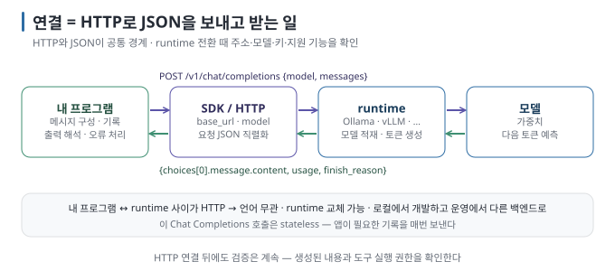
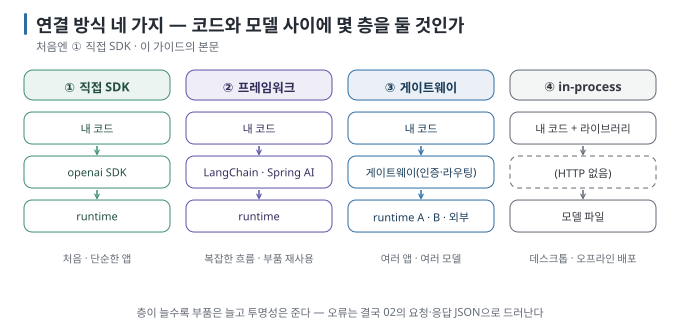
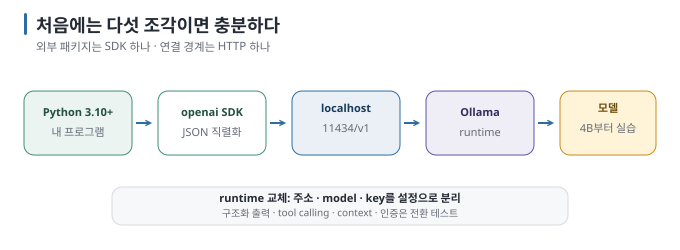

# 01 — 연결의 해부: "LLM을 연결한다"는 무엇을 하는 일인가

"내 프로그램에 AI를 붙인다"는 말은 거창하게 들리지만, 코드 수준에서는 **HTTP 요청 하나를 보내고 응답 하나를 받는 일**입니다.
이 문서는 그 요청이 어디를 거쳐 어디로 가는지, 연결 방식에는 무엇이 있는지, 앱용 모델을 무엇으로 고르는지 정리합니다.

← [README](README.md) · 다음 → [02 OpenAI 호환 API 읽기](02-openai-compatible-api.md)

> **왜 읽나:** "AI를 붙인다"는 말이 거창하게 들리지만, 코드에서는 날씨 API를 부르는 것과 같습니다 — 느리고, 길고, 매번 조금 다르다는 점만 빼면.
>
> **읽고 나면:** 요청이 지나가는 네 층을 그리고, 연결 방식 넷 중 처음에 무엇을 고를지, 앱용 모델을 어떤 기준으로 고를지 말할 수 있습니다.
>
> **바쁘면:** §0 "결론 먼저"와 ★ 절만 읽고 다음 문서로 넘어가도 흐름이 끊기지 않습니다.

---

## 0. 결론 먼저 ★

- 연결은 내 프로그램이 runtime의 HTTP endpoint에 **JSON을 POST하고 JSON 응답을 받는 과정**입니다. 별도의 특수한 프로토콜을 사용하지 않습니다. `[원리]`
- 주요 로컬 runtime은 **OpenAI 호환 형식**을 제공합니다. 전환할 때는 `base_url`·`model`·API Key 변경 외에도 endpoint별 부가 기능(Tool Calling, Response Schema 등)의 지원 방식이 같은지 반드시 검증해야 합니다. `[문서 확인 · 2026-08-24]`
- 연결 방식은 **직접 SDK, 프레임워크, 게이트웨이 경유, in-process 바인딩** 등 네 가지가 있지만, 처음 시작할 때는 직접 SDK를 사용하는 방식이 가장 적합합니다. `[해석]`
- runtime은 대화를 기억하지 않습니다(stateless). 대화 기록은 **내 프로그램**이 들고 매번 보냅니다. `[원리]`

## 1. 요청은 어디를 지나가는가

| 층 | 하는 일 | 내가 다루는 것 |
| --- | --- | --- |
| **내 프로그램** | 사용자 입력을 받아 메시지 목록을 만들고, 응답을 화면·DB·다음 단계로 보냄 | 메시지 구성, 대화 기록, 출력 해석, 오류 처리 |
| **SDK / HTTP 클라이언트** | 메시지 목록을 요청 JSON으로 직렬화해 POST | `base_url`, `model`, 파라미터 |
| **runtime** (Ollama, vLLM, …) | 요청을 받아 모델을 메모리에 올리고(이미 있으면 재사용) 토큰을 생성 | 어느 runtime을 쓰는가, context 창 설정 |
| **모델** | 토큰 생성 | 어떤 모델을 쓰는가 |

`[원리]` 중요한 것은 **내 프로그램과 runtime 사이가 HTTP**라는 점입니다. 그래서 Python·Java·JS·Go 등에서 같은 요청 구조를
구현할 수 있고, 호환 범위 안에서는 클라이언트 코드를 재사용할 수 있습니다. 백엔드를 바꿀 때는 주소·모델·API Key와 지원 기능을 다시 검증합니다.

> **초심자용 한 줄:** 모델 호출은 "웹 API 호출"입니다. 날씨 API를 부르듯 주소와 JSON만 알면 됩니다. 다른 점은 응답이
> 느리고(초 단위), 길고(스트리밍), 매번 조금 다르다는 것뿐입니다.

## 2. 연결 방식 네 가지

| 방식 | 구조 | 장점 | 비용 | 언제 |
| --- | --- | --- | --- | --- |
| **① 직접 SDK** | 내 코드 → openai SDK(또는 HTTP) → runtime | 단순, 투명, 디버깅 쉬움 | 여러 호출을 엮는 코드는 직접 작성 | **처음·대부분의 앱** |
| **② 프레임워크** | 내 코드 → LangChain·LlamaIndex·Spring AI 등 → runtime | 체인·RAG·도구·메모리 부품이 준비됨 | 추상화 아래가 안 보임, 버전 변화 잦음 | 체인이 3단 넘고 부품을 자주 바꿀 때 ([09](09-frameworks-and-architecture.md)) |
| **③ 게이트웨이 경유** | 내 코드 → 게이트웨이(인증·라우팅·로그) → 여러 runtime/외부 API | 모델 교체·키 관리·비용 집계를 한곳에서 | 운영할 구성 요소 추가 | 여러 앱·여러 모델·팀 단위 |
| **④ in-process 바인딩** | 내 코드 안에서 llama.cpp 등을 라이브러리로 직접 로드 | HTTP 없음, 배포물 하나 | 언어·플랫폼 종속, 모델 교체 어려움 | 데스크톱 앱·임베디드·오프라인 배포 |

`[해석]` 이 가이드는 **①**을 본문으로 하고, ②는 09에서 "언제 넘어가는가"를, ③은 경계만 짚습니다. ④는 범위 밖입니다.

### ①에서 ②로 넘어가는 신호

- 같은 "호출 → 파싱 → 다음 호출" 패턴을 세 번째 복붙하고 있다
- 문서 파서·vector store·모델을 자주 바꿔 가며 실험한다
- 팀이 Java/Spring 표준 위에서 서비스로 만든다 (Spring AI·LangChain4j가 자연스러움)

반대로 "챗 하나, 도구 두 개" 정도라면 직접 SDK가 더 단순하고 디버깅하기 쉽습니다. `[해석]`

## 3. runtime별 차이 — 기본 경로는 같지만 세부 기능은 다르다

| runtime | 기본 포트 | OpenAI 호환 | 자체 API | 특징 |
| --- | --- | --- | --- | --- |
| Ollama | 11434 | `/v1/chat/completions`, `/v1/embeddings` 등 | `/api/chat`, `/api/generate`, `/api/embed` — 옵션이 더 많음(`num_ctx`, `keep_alive`) | 모델 관리 내장, 개인·개발용 기본값 |
| llama.cpp `llama-server` | 8080 | 예 | 자체 `/completion` 등 | 엔진 직접, GGUF |
| vLLM | 8000 | 예 (가장 넓은 범위) | — | 다중 사용자 서빙, 배칭 |
| LM Studio | 1234 | 예 | 자체 REST | GUI + 로컬 서버 |

`[문서 확인 · 2026-08-24]` — 포트는 기본값이며 바꿀 수 있습니다. "호환"의 범위는 runtime마다 달라서 **기본 채팅 경로는 비슷하지만, 구조화 출력·tool calling·스트리밍 세부·context 설정은 다릅니다.** 차이표는 [02 §4](02-openai-compatible-api.md).

## 4. 앱용 모델 고르기

대화창에서 쓰기 좋은 모델과 **프로그램이 부르기 좋은 모델**은 기준이 다릅니다. `[해석]`

| 기준 | 왜 | 확인 방법 |
| --- | --- | --- |
| **지시 준수** | "JSON만 출력", "근거만 사용" 같은 규칙을 지키는가 | 짧은 규칙 10개로 직접 시험 |
| **tool calling 지원** | 모델·템플릿이 도구 호출 형식을 학습했는가. 지원하지 않으면 06~08이 동작하지 않음 | `ollama show <model>`의 `Capabilities`에 `tools` 표시 `[문서 확인 · 2026-08-23]` |
| **구조화 출력 안정성** | 스키마 강제 시 의미 있는 값을 채우는가(형식은 runtime이 보장, 내용은 모델) | 05 실습 |
| **크기·속도** | 앱은 대화보다 호출 횟수가 많음. 4~8B가 반응성과 품질의 출발점 | `ollama ps`·응답 시간 |
| **한국어** | 한국어 입력·출력 품질 | 직접 시험 |
| **라이선스** | 업무·배포 조건 | 모델 카드 |

`[자료 확인 · 2026-08-23]` — 2026년 8월 기준 Ollama library에서 tool calling을 지원하는 소형 모델로 Qwen3 계열, Llama 3.1 이후,
Mistral 계열 등이 있으며, Gemma 3는 Ollama에서 tool 템플릿을 제공하지 않습니다. 이 가이드에서는 대화·구조화 출력에 **`gemma3:4b`를**, tool calling에 **`qwen3:4b`를** 예시로 씁니다. 태그와 지원 여부는 바뀌므로 실행 전 `ollama show`로 확인합니다.

## 5. 이 가이드가 고른 최소 구성

`[해석]` 외부 라이브러리는 `openai` 하나만 씁니다. Java·JS 예시는 [02 §5](02-openai-compatible-api.md)에 최소 형태로만 둡니다.

---

**다음 →** [02 OpenAI 호환 API 읽기 — endpoint·요청·응답 해부](02-openai-compatible-api.md)
