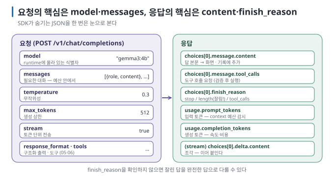
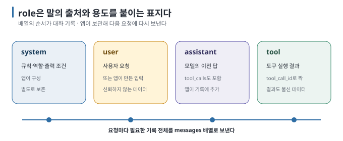
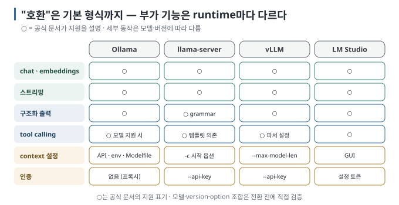

# 02 — OpenAI 호환 API 읽기: endpoint · 요청 · 응답 해부

SDK가 숨기는 JSON을 한 번은 눈으로 봐야 합니다. 그래야 오류 메시지를 읽을 수 있고, 다른 언어에서도 같은 일을 할 수 있으며,
runtime마다 무엇이 다른지 알 수 있습니다. 이 문서는 `curl`로 요청과 응답을 직접 보고, 필드를 하나씩 읽습니다.

← [01 연결의 해부](01-integration-anatomy.md) · 다음 → [03 실습: 작은 Python 대화 프로그램](03-lab-chat-program.md)

> **왜 읽나:** SDK가 숨기는 JSON을 한 번도 본 적 없다면, 첫 오류 메시지를 읽지 못합니다.
>
> **읽고 나면:** curl로 요청·응답을 직접 보고 각 필드를 읽으며, `finish_reason`을 왜 확인해야 하는지와 runtime마다 무엇이 다른지 표로 기억할 수 있습니다.
>
> **바쁘면:** §0 "결론 먼저"와 ★ 절만 읽고 다음 문서로 넘어가도 흐름이 끊기지 않습니다.

---

## 0. 결론 먼저 ★

- 이 가이드는 `/v1/chat/completions`(대화·생성), `/v1/embeddings`(벡터), `/v1/models`(목록)를 기준으로 설명합니다. 일부 runtime은
  `/v1/responses`도 지원하지만 범위가 서로 다릅니다. `[문서 확인 · 2026-08-24]`
- 요청의 핵심은 `model`과 `messages`(역할이 붙은 메시지 배열)이고, 응답의 핵심은 `choices[0].message.content`입니다. `[원리]`
- 역할은 `system`(규칙) · `user`(사용자) · `assistant`(모델의 이전 답) · `tool`(도구 실행 결과) 네 가지입니다. `[원리]`
- "호환"은 **기본적인 요청·응답 형식**이 같다는 뜻입니다. 구조화 출력·tool calling·context 설정 같은 세부 부가 기능은 runtime별 차이표(§4)에서 확인합니다. `[해석]`

## 1. 직접 보내 보기

```bash
curl -s http://localhost:11434/v1/chat/completions \
  -H "Content-Type: application/json" \
  -d '{
    "model": "gemma3:4b",
    "messages": [
      {"role": "system", "content": "한 문장으로만 답한다."},
      {"role": "user", "content": "로컬 LLM이 뭐야?"}
    ]
  }'
```

**★ 성공 판정:** JSON이 돌아오고 그 안에 `"choices"` 배열과 `"content"` 문자열이 있습니다. 아래는 작성 환경에서 실제로 받은
응답입니다(내용은 실행마다 다릅니다). `[실행 검증 · 2026-08-23]`

```json
{
  "id": "chatcmpl-641",
  "object": "chat.completion",
  "created": 1787491739,
  "model": "gemma3:4b",
  "system_fingerprint": "fp_ollama",
  "choices": [
    {
      "index": 0,
      "message": { "role": "assistant", "content": "사용자의 장치에서 실행되는 대규모 언어 모델을 의미합니다." },
      "finish_reason": "stop"
    }
  ],
  "usage": { "prompt_tokens": 31, "completion_tokens": 17, "total_tokens": 48 }
}
```

필드 이름은 OpenAI 형식을 따릅니다. `system_fingerprint`처럼 runtime이 자기 식으로 채우는 필드(`fp_ollama`)나 비워 두는
필드가 있을 수 있으니, 앱 코드는 `choices`·`usage`·`finish_reason`만 믿고 나머지는 있으면 쓰는 정도로 다룹니다. `[해석]`

## 2. 요청 필드 읽기



| 필드 | 뜻 | 메모 |
| --- | --- | --- |
| `model` | runtime에 올라 있는 모델 식별자 | Ollama는 `이름:태그`. `/v1/models`로 목록 확인 |
| `messages` | 대화 전체. 역할·내용의 배열 | **매 요청에 전부** 보낸다 — runtime은 이전 요청을 기억하지 않음 |
| `temperature` | 무작위성 (0 = 가장 결정적) | 앱·추출은 0~0.3 ([04](04-parameters-and-context.md)) |
| `max_tokens` | 생성할 최대 토큰 | 없으면 runtime 기본값. 답이 잘리면 이것부터 |
| `stream` | `true`면 토큰 단위로 흘려보냄 | UI 반응성. 03 실습 |
| `response_format` | `{"type": "json_schema", …}`로 출력 형식 강제 | [05](05-structured-output.md). 지원 범위는 runtime별 |
| `tools` / `tool_choice` | 모델이 호출할 수 있는 함수 목록 | [06](06-tool-calling-workflow-agent.md). 모델 지원 필요 |
| `stop` | 이 문자열이 나오면 생성 중단 | 목록·구분자 출력 제어 |
| `seed` | 같은 입력에 같은 출력을 유도 | 완전한 재현은 보장되지 않음 |

`[문서 확인 · 2026-08-23]`

### 역할(role) 네 가지



`few-shot`은 원하는 입력과 출력의 예시 몇 개를 대화 기록에 넣어 모델이 그 형식을 따라 하게 하는 방법입니다. 내 프로그램은
`assistant` 메시지를 예시로 직접 넣을 수 있으며, 모델은 그 메시지가 실제 대화에서 나온 것인지 확인할 수 없습니다. 같은 특성
때문에 예시를 제공할 수도 있고, 대화 기록을 변조할 수도 있습니다. `[원리]`

## 3. 응답 필드 읽기

| 필드 | 뜻 | 앱에서 어떻게 쓰나 |
| --- | --- | --- |
| `choices[0].message.content` | 답 본문 | 화면에 출력, 다음 `assistant` 메시지로 기록에 추가 |
| `choices[0].message.tool_calls` | 모델이 요청한 도구 호출 목록 | 있으면 도구를 실행하고 `tool` 메시지로 돌려줌 ([06](06-tool-calling-workflow-agent.md)) |
| `choices[0].finish_reason` | `stop`(정상) / `length`(max_tokens 도달) / `tool_calls` | **`length`면 답이 잘린 것** — 이어 받거나 예산을 늘림 |
| `usage.prompt_tokens` | 입력 토큰 수 | context 예산 감시. 기록이 얼마나 커졌는지 |
| `usage.completion_tokens` | 생성 토큰 수 | 속도·비용 계산 |

`[문서 확인 · 2026-08-23]` — `finish_reason`을 확인하지 않는 것이 초보 앱의 가장 흔한 누락입니다. 잘린 답을 완전한 답으로 다룹니다.

### 스트리밍일 때

`stream: true`이면 응답이 한 번에 오지 않고 **Server-Sent Events**로 조각(`chunk`)이 연속해서 옵니다. 각 조각은
`choices[0].delta.content`에 토큰 몇 개를 담고, 마지막에 `finish_reason`이 채워집니다. SDK는 이를 이터레이터로 감싸 줍니다(03 실습).
`[문서 확인 · 2026-08-23]`

## 4. runtime별 차이 — 세부 부가 기능



| 기능 | Ollama | llama-server | vLLM | LM Studio |
| --- | --- | --- | --- | --- |
| `/v1/chat/completions`, `/v1/embeddings` | ○ | ○ | ○ | ○ |
| 스트리밍 | ○ | ○ | ○ | ○ |
| 구조화 출력 (`response_format` json_schema) | ○ | ○ (grammar 기반) | ○ | ○ |
| tool calling (`tools`) | ○ (모델 지원 시) | ○ (모델·템플릿 지원 시) | ○ (파서 설정) | ○ |
| context 창 설정 | 자체 API `options.num_ctx`, 환경변수, Modelfile | 서버 시작 옵션 `-c` | 서버 시작 옵션 `--max-model-len` | GUI 설정 |
| 인증 | 없음 (앞단 프록시) | `--api-key` | `--api-key` | 설정에서 토큰 |
| 모델 내려받기·전환 | 내장(`ollama pull`, 요청 시 자동 로드) | 파일 직접 지정 | 서버 시작 시 고정 | GUI |

`[문서 확인 · 2026-08-23]` — ○ 표시는 "공식 문서가 지원을 설명한다"는 뜻이고, **세부 동작은 모델·버전에 따라 다릅니다.**
특히 Ollama는 context 창을 OpenAI 호환 요청 본문으로 바꿀 수 없어 자체 API나 환경변수를 써야 합니다([04 §2](04-parameters-and-context.md)).

> 🔧 **한 단계 더 — Ollama 자체 API**
>
> `/api/chat`은 OpenAI 형식과 비슷하지만 `options: {num_ctx, temperature, …}`와 `keep_alive`를 요청마다 지정할 수 있고,
> `think` 같은 모델별 옵션도 노출합니다. OpenAI SDK로 시작하되, Ollama 전용 설정이 필요할 때만 이 경로를 쓰면 코드의
> 이식성을 유지할 수 있습니다. `[문서 확인 · 2026-08-23]`

## 5. 다른 언어에서도 같은 일

같은 JSON 구조를 만들 수 있다면 프로그래밍 언어가 달라도 같은 요청을 보낼 수 있습니다. 최소 형태만 둡니다. `[문서 확인 · 2026-08-23]`

**JavaScript / TypeScript (openai 패키지)**

```javascript
import OpenAI from "openai";
const client = new OpenAI({ baseURL: "http://localhost:11434/v1", apiKey: "ollama" });
const resp = await client.chat.completions.create({
  model: "gemma3:4b",
  messages: [{ role: "user", content: "로컬 LLM을 한 문장으로 설명해 줘." }],
});
console.log(resp.choices[0].message.content);
```

**Java — 프레임워크 없이 (java.net.http)**

```java
var body = """
  {"model":"gemma3:4b","messages":[{"role":"user","content":"로컬 LLM을 한 문장으로 설명해 줘."}]}
  """;
var req = java.net.http.HttpRequest.newBuilder(java.net.URI.create("http://localhost:11434/v1/chat/completions"))
    .header("Content-Type", "application/json")
    .POST(java.net.http.HttpRequest.BodyPublishers.ofString(body)).build();
var resp = java.net.http.HttpClient.newHttpClient().send(req, java.net.http.HttpResponse.BodyHandlers.ofString());
System.out.println(resp.body());   // JSON 파싱은 Jackson 등으로
```

**Java — Spring AI (Ollama 스타터)**

```java
// application.properties: spring.ai.ollama.base-url=http://localhost:11434
//                         spring.ai.ollama.chat.options.model=gemma3:4b
@RestController
class ChatController {
  private final ChatClient chat;
  ChatController(ChatClient.Builder b) { this.chat = b.build(); }
  @GetMapping("/ask") String ask(@RequestParam String q) { return chat.prompt().user(q).call().content(); }
}
```

`[자료 확인 · 2026-08-23]` — Spring AI·LangChain4j의 API는 버전 간 변화가 커서 위 코드는 구조를 보여 주는 최소 예시입니다. 사용 전 해당 버전 문서를
확인합니다([09 §1](09-frameworks-and-architecture.md)).

## 6. 이 문서의 점검표

- [ ] `curl`로 요청·응답 JSON을 한 번 눈으로 봤다
- [ ] `messages`를 매 요청에 전부 보낸다는 것을 이해했다
- [ ] `finish_reason`이 `length`일 때 무엇을 할지 정했다
- [ ] 내 runtime의 세부 부가 기능(구조화 출력·tool calling·context 설정) 사용 방법을 §4에서 찾았다

---

**다음 →** [03 실습: 작은 Python 대화 프로그램 만들기](03-lab-chat-program.md)
