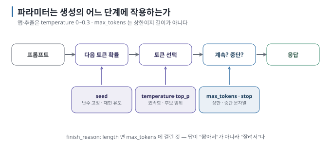
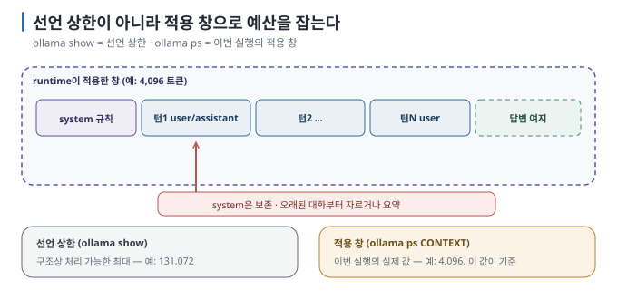
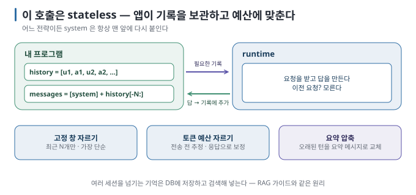

# 04 — 파라미터 · context · 대화 상태: 무엇이 무엇을 바꾸는가

호출 한 번에는 10개 남짓의 손잡이가 있습니다. 대부분은 기본값으로 두어도 되지만, 셋은 반드시 이해해야 합니다 —
**temperature, max_tokens, 그리고 context 창**. 그리고 로컬에서 가장 자주 사람을 속이는 함정 하나, **runtime이 실제로
적용한 context 창**을 다룹니다.

← [03 실습: 대화 프로그램](03-lab-chat-program.md) · 다음 → [05 구조화 출력](05-structured-output.md)

> **왜 읽나:** 작성 환경에서는 모델이 262,144 토큰을 선언했지만 runtime은 4,096을 적용했습니다. 선언 상한만 믿으면 긴 입력이 실제 창을 넘는 문제를 놓치기 쉽습니다.
>
> **읽고 나면:** temperature·max_tokens·context 창이 무엇을 바꾸는지 알고, 적용된 창을 확인·변경하며, 대화 기록을 언제 어떻게 자를지 정할 수 있습니다.
>
> **바쁘면:** §0 "결론 먼저"와 ★ 절만 읽고 다음 문서로 넘어가도 흐름이 끊기지 않습니다.

---

## 0. 결론 먼저 ★

- 앱·추출·도구 호출은 `temperature` 0~0.3, 창작·브레인스토밍은 0.7 이상. 모르면 0.3. `[해석]`
- `max_tokens`는 "답의 상한"이지 "답의 길이"가 아닙니다. `finish_reason == "length"`를 반드시 확인합니다. `[원리]`
- **Ollama가 실제로 적용한 context 창은 모델의 선언 상한과 다를 수 있습니다.** 긴 대화·문서를 넣기 전 `ollama ps`로 적용값을
  확인하고, 초과 입력의 처리 방식은 사용하는 runtime·API 조합에서 시험합니다. `[문서 확인 · 2026-08-24]`
- 대화 기록은 내 프로그램이 들고 있으므로, 자르기·요약도 내 책임입니다. `[원리]`

## 1. 생성 파라미터



| 파라미터 | 작용하는 곳 | 권장 | 메모 |
| --- | --- | --- | --- |
| `temperature` | 다음 토큰을 고를 때 확률 분포의 뾰족함. 0이면 가장 확률 높은 토큰만 | 앱 0~0.3 / 창작 0.7~1.0 | 0이어도 완전히 같은 출력은 보장되지 않음 |
| `top_p` | 누적 확률 상위 p 안에서만 고름 | 기본값 유지 | temperature와 둘 중 하나만 조정 |
| `max_tokens` | 생성 토큰 상한 | 답 길이 + 여유 | 도달하면 `finish_reason: length` |
| `stop` | 이 문자열이 나오면 중단 | 필요할 때만 | 목록 형식 출력 끊기, 모델이 사용자 턴을 이어 쓰는 것 방지 |
| `seed` | 난수 시드 | 테스트·재현 시 | runtime·하드웨어가 같아야 재현 |
| `presence/frequency_penalty` | 반복 억제 | 기본값 | 로컬 runtime마다 지원 차이 |

`[문서 확인 · 2026-08-23]`

> **초심자용 한 줄:** temperature는 "얼마나 모험할까", max_tokens는 "얼마나 길게 말해도 될까", stop은 "이 말 나오면 그만".

## 2. context 창 — 로컬의 1순위 함정 ★

### 2.1 두 숫자

| 숫자 | 뜻 | 확인 |
| --- | --- | --- |
| 모델이 **선언한** 상한 | 구조상 처리 가능한 최대 토큰 (예: 128k) | `ollama show <model>` → `context length` |
| runtime이 **적용한** 창 | 이번 실행에서 실제로 쓰는 토큰 수 (예: 4,096) | `ollama ps` → `CONTEXT` 열 |

두 숫자는 다릅니다. 작성 환경에서 `qwen3:4b`는 `ollama show`에 **262,144**를 선언했지만 `ollama ps`의 CONTEXT는 **4,096**이었습니다
— 64배 차이입니다. 이는 해당 날짜·장비·버전의 관찰값입니다. 현재 Ollama 문서는 VRAM에 따라 기본 context가 달라지며, 창을
늘릴수록 메모리 사용량이 증가한다고 설명합니다. `[실행 검증 · 2026-08-23]` `[문서 확인 · 2026-08-24]`

### 2.2 넘치면 무슨 일이



입력과 답변 여지가 적용 창 안에 들어가지 않으면 잘림·오류·자동 축약 등 처리 결과가 runtime과 endpoint에 따라 달라질 수
있습니다. 앱은 특정 잘림 순서를 전제로 삼지 말고, 입력 예산을 먼저 제한한 뒤 긴 입력으로 실패 방식을 확인해야 합니다. `[해석]`

### 2.3 창을 늘리는 방법 (Ollama)

OpenAI 호환 요청 본문으로는 바꿀 수 없습니다. 세 가지 경로가 있습니다. `[문서 확인 · 2026-08-23]`

| 방법 | 범위 | 예 |
| --- | --- | --- |
| 환경변수 | 서버 전체 기본값 | `OLLAMA_CONTEXT_LENGTH=16384 ollama serve` |
| 자체 API 요청 옵션 | 요청 단위 | `POST /api/chat` 본문에 `"options": {"num_ctx": 16384}` |
| Modelfile | 모델 별칭 단위 | `FROM gemma3:4b` + `PARAMETER num_ctx 16384` → `ollama create gemma3-16k -f Modelfile` |

세 번째가 OpenAI SDK 코드를 그대로 두면서 창만 바꾸는 가장 깔끔한 방법입니다(모델 이름만 `gemma3-16k`로). 늘린 만큼 메모리가
필요하므로 `ollama ps`로 적재 상태를 확인합니다([../local-llm/02](../local-llm/02-model-anatomy.md)의 KV cache 산식).

**★ 확인 판정:** `[미검증]` 창을 늘린 뒤 `ollama ps`의 CONTEXT가 늘어난 값으로 표시되고, 긴 대화에서 시스템 규칙이 유지됩니다.

### 2.4 다른 runtime

vLLM은 `--max-model-len`, llama-server는 `-c`로 서버 시작 시 고정합니다. 요청 단위로 바꾸지 않습니다. `[문서 확인 · 2026-08-23]`

## 3. `keep_alive` — 모델이 메모리에 머무는 시간

Ollama는 마지막 요청 후 일정 시간(기본 5분)이 지나면 모델을 메모리에서 내립니다. 다음 요청은 다시 올리느라 수 초~수십 초
걸립니다. 앱에서 "첫 응답만 느린" 현상의 원인입니다. `[문서 확인 · 2026-08-23]`

| 설정 | 효과 |
| --- | --- |
| `keep_alive: "30m"` (자체 API) 또는 `OLLAMA_KEEP_ALIVE=30m` | 30분 유지 |
| `-1` | 계속 유지 (메모리 점유) |
| `0` | 응답 직후 내림 |

서비스라면 `-1` 또는 충분히 긴 값, 노트북에서 가끔 쓰면 기본값이 맞습니다. `[해석]`

## 4. 대화 기록 관리 — 내 프로그램의 책임



| 전략 | 방법 | 잃는 것 | 언제 |
| --- | --- | --- | --- |
| **고정 창 자르기** | 최근 N개 메시지만 보냄 (03의 `--max-history`) | 오래된 정보 | 가장 단순. 대부분의 챗 |
| **토큰 예산 자르기** | `usage.prompt_tokens`를 보며 예산 초과 시 앞에서 제거 | 오래된 정보 | 메시지 길이가 들쭉날쭉할 때 |
| **요약 압축** | 오래된 턴을 모델에게 요약시켜 한 메시지로 교체 | 세부 | 긴 상담·작업 세션 |
| **외부 기억** | 중요한 사실을 DB에 저장하고 필요할 때 검색해 넣음 | — | 여러 세션에 걸친 기억. 검색 기반 연결은 후속 주제 |

`[해석]` 어느 전략이든 system 메시지는 별도로 보존해 **매 요청의 맨 앞에 다시 붙입니다.** 기록 자르기 함수에는 user·assistant
대화만 넘기는 편이 안전합니다.

```python
def trim(history, max_tokens_est=3000):
    # 문자 수는 임시 대리 지표일 뿐이다. 실제 예산은 tokenizer 또는 usage.prompt_tokens로 보정한다.
    while sum(len(m["content"]) for m in history) > max_tokens_est and len(history) > 2:
        history.pop(0)          # 가장 오래된 메시지부터
    return history
```

## 5. 이 문서의 점검표

- [ ] `ollama ps`로 적용된 CONTEXT 값을 확인했다
- [ ] 내 앱의 한 요청 크기(system + 기록 + 입력 + max_tokens)가 그 값의 절반 이하인지 계산했다
- [ ] `finish_reason == "length"`를 처리하는 코드가 있다
- [ ] 기록 자르기 전략을 정했고 system이 항상 맨 앞에 붙는다
- [ ] 서비스라면 `keep_alive`를 정했다

---

**다음 →** [05 구조화 출력 — 답을 프로그램이 읽게 만들기](05-structured-output.md)
