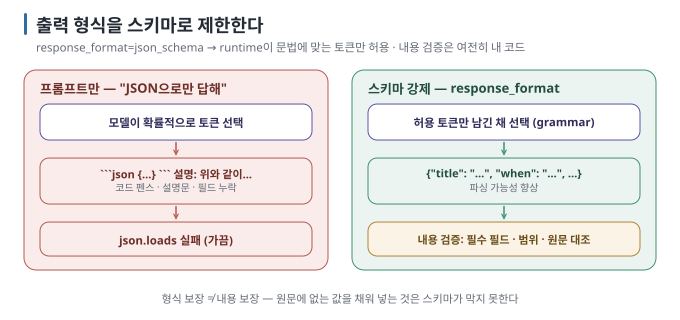

# 05 — 구조화 출력: 답을 프로그램이 읽게 만들기

대화 프로그램의 출력은 사람이 읽는 문자열입니다. 프로그램이 읽으려면 **정해진 모양의 JSON**이어야 합니다. "JSON으로 답해"라고
부탁하는 것과, runtime이 **토큰 단위로 스키마를 강제**하는 것은 다른 일입니다. 이 문서는 그 차이와 사용법을 다룹니다.

← [04 파라미터·context](04-parameters-and-context.md) · 다음 → [06 도구를 쓰는 LLM 이해하기](06-tool-calling-workflow-agent.md)

> **왜 읽나:** "JSON으로만 답해"는 부탁이고, 부탁은 가끔 거절당합니다. 실습에서 같은 요청이 펜스 하나 때문에 파싱에 실패했습니다.
>
> **읽고 나면:** 지원되는 runtime에서 출력을 스키마로 제한하고, 그래도 남는 파싱 실패와 "내용" 문제(confidence 0.9짜리 환각)를 코드로 잡을 수 있습니다.
>
> **바쁘면:** §0 "결론 먼저"와 ★ 절만 읽고 다음 문서로 넘어가도 흐름이 끊기지 않습니다.

---

## 0. 결론 먼저 ★

- 프롬프트로 "JSON만"이라고 해도 모델은 코드 펜스·설명문·누락 필드를 섞습니다. **형식은 부탁이 아니라 강제**해야 합니다. `[해석]`
- 지원되는 runtime에 `response_format: {type: "json_schema", …}`를 주면 스키마에 맞는 출력을 생성하도록 제한합니다. 그래도
  빈 응답·중도 종료·호환성 차이를 처리하고 파싱 뒤 다시 검증합니다. `[문서 확인 · 2026-08-24]`
- 강제되는 것은 **형식**뿐입니다. 값이 맞는지(지어내지 않았는지)는 여전히 내 코드와 프롬프트가 봅니다. `[원리]`
- 스키마는 작게, `required`는 명확하게, "없으면 빈 값"을 프롬프트에 적습니다. `[해석]`

## 1. 왜 부탁으로는 안 되는가



`[원리]` 모델은 확률적으로 토큰을 고르므로 "항상 JSON만"을 100% 지키지 못합니다. 스키마 강제는 생성 단계에서 **문법에 맞지 않는
토큰을 배제**해 형식 실패 가능성을 크게 줄입니다(grammar-constrained decoding). 앱은 응답이 비었거나 잘린 경우까지 처리해야 합니다.

## 2. 실습 — 회의 정보 추출

`labs/extract.py`는 자유 문장에서 회의 정보를 뽑습니다.

> **검증 상태:** 세 실행(스키마 강제·프롬프트만·원문에 없는 정보) 모두 Apple M4 Pro·24GB Mac, Ollama 0.32.7, `gemma3:4b`에서 확인했습니다. `[실행 검증 · 2026-08-23]`
> 아래 출력은 그때의 실제 값입니다.

```bash
cd labs
python3 extract.py "다음 주 화요일 오후 3시에 김서연 팀장과 검색 고도화 프로젝트 중간 점검 회의, 대회의실 D"
```

기대 출력:

```text
원문 응답: {
  "title": "검색 고도화 프로젝트 중간 점검 회의",
  "when": "다음 주 화요일 오후 3시",
  "where": "대회의실 D",
  "attendees": ["김서연 팀장"],
  "confidence": 0.95
}

파싱 결과:
  title       = '검색 고도화 프로젝트 중간 점검 회의'
  when        = '다음 주 화요일 오후 3시'
  where       = '대회의실 D'
  attendees   = ['김서연 팀장']
  confidence  = 0.95
```

**★ 성공 판정:** `json.loads`가 실패하지 않고, 다섯 필수 필드가 모두 있으며, 값이 원문에서 온 것입니다. 값의 표현(예:
"김서연" vs "김서연 팀장")은 모델마다 다를 수 있습니다. `[실행 검증 · 2026-08-23]`

비교를 위해 스키마 없이 실행합니다.

```bash
python3 extract.py "다음 주 화요일 오후 3시에 김서연 팀장과 검색 고도화 프로젝트 중간 점검 회의, 대회의실 D" --no-schema
```

**관찰:** 모델·실행에 따라 코드 펜스(```)가 붙거나 설명문이 따라와 `JSON 파싱 실패`가 나거나, 운 좋게 성공합니다. 작성
환경에서는 내용은 완벽했는데 앞뒤에 ```` ```json ```` 펜스가 붙어 **`JSON 파싱 실패: Expecting value: line 1 column 1`**로 끝났습니다.
같은 모델, 같은 문장, 스키마 한 줄 차이입니다. **운에 맡길 수 없다**는 것이 관찰의 요점입니다. `[실행 검증 · 2026-08-23]`

원문에 없는 정보를 넣어 봅니다.

```bash
python3 extract.py "내일 점심 같이 먹자"
```

**관찰:** 형식은 완벽한 JSON이지만 `title`이 **지어낸 값**일 수 있고, `where`가 빈 문자열이어야 합니다. 작성 환경의 결과:
`title = '회의'`, `when = '내일'`, `where = ''`, `attendees = []`, 그리고 **`confidence = 0.9`**. 원문에 "회의"라는 말은 없는데
제목을 만들었고, 자신감은 0.9였습니다. 형식 보장 ≠ 내용 보장, 그리고 **모델의 자기 평가도 믿을 수 없다** — 이것이 §4에서
"confidence 문턱"만으로는 부족하고 원문 대조가 필요한 이유입니다. `[실행 검증 · 2026-08-23]`

## 3. 코드 읽기

| 번호 | 무엇 | 메모 |
| --- | --- | --- |
| (1) `MEETING_SCHEMA` | JSON Schema. `required`로 누락 방지, `description`으로 모델에게 의미 전달 | 스키마 설명은 프롬프트의 일부처럼 작용 |
| (2) `response_format` | `{"type": "json_schema", "json_schema": {"name", "schema"}}` | runtime별 지원은 [02 §4](02-openai-compatible-api.md) |
| (3) `json.loads` | 강제 시 실패하지 않아야 정상 | 실패하면 runtime이 스키마를 지원하지 않는 것 |
| (4) 내용 검증 | 필수 필드, 값 범위, 원문 대조, `confidence` 문턱 | **형식은 runtime, 내용은 내 코드** |

> 🔧 **한 단계 더 — pydantic으로 스키마와 검증을 한 번에**
>
> `pydantic.BaseModel`로 클래스를 정의하면 `Model.model_json_schema()`가 스키마를, `Model.model_validate_json(raw)`가 파싱+검증을
> 해 줍니다. OpenAI SDK의 `client.beta.chat.completions.parse(response_format=Model)` 같은 편의 API는 runtime 호환 여부를 확인한
> 뒤 씁니다. `[문서 확인 · 2026-08-23]`

## 4. 설계 원칙

| 원칙 | 이유 |
| --- | --- |
| **스키마는 작게** | 필드가 많을수록 모델이 채우느라 지어냄. 꼭 필요한 것만 |
| **"없으면 빈 값"을 명시** | 모델은 빈칸을 싫어함. 프롬프트와 `description`에 적어야 환각이 줄어듦 |
| **enum으로 선택지 고정** | `"status": {"enum": ["승인", "반려", "보류"]}` — 자유 문자열보다 안정 |
| **confidence 또는 근거 필드** | 낮으면 사람 확인 경로로. 모델의 자기 평가는 완벽하지 않지만 없는 것보다 낫다 |
| **내용 검증은 코드로** | 날짜 파싱, 값 범위, 원문 포함 여부 — 스키마가 못 하는 것 |
| **temperature 0** | 추출에 창의성은 불필요 |

`[해석]`

## 5. 어디에 쓰는가

- 자유 텍스트 → 구조화 데이터 (메일→일정, 리뷰→평점·태그, 로그→원인 분류)
- 분류·라우팅 (`{"intent": enum}`으로 다음 단계 결정)
- 검색 기반 앱의 개체·관계 추출
- tool calling의 인자 — 다음 문서. tool calling은 "함수 이름 + 인자 JSON"을 구조화 출력으로 받는 특수한 경우입니다. `[원리]`

## 6. 이 문서의 점검표

- [ ] 프롬프트만으로 요청했을 때와 스키마 강제의 차이를 직접 봤다
- [ ] `required`와 `description`을 채웠다
- [ ] 형식 외 내용 검증 코드가 있다 (필수 필드·범위·원문 대조)
- [ ] 낮은 `confidence`의 처리 경로를 정했다

---

**다음 →** [06 도구를 쓰는 LLM 이해하기 — Tool Calling · workflow · agent](06-tool-calling-workflow-agent.md)
