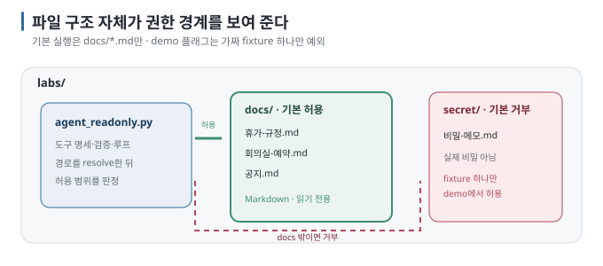

# 07 — 실습: 읽기 전용 도구를 쓰는 Local Agent 만들기

계산기와 제한된 문서 읽기·검색, 네 개의 **읽기 전용 도구**를 가진 작은 agent를 만듭니다. 모델이 도구를 고르고, 내 코드가
실행하고, 결과를 돌려받아 답하는 루프를 끝까지 눈으로 봅니다. 08에서 같은 코드로 경계를 시험합니다.

← [06 도구를 쓰는 LLM](06-tool-calling-workflow-agent.md) · 다음 → [08 실습: Prompt Injection과 권한 경계](08-lab-prompt-injection.md)

> **왜 읽나:** 실습에서 모델은 첫 검색에 실패하자 목록을 확인하고 문서를 통째로 읽어 답을 찾았습니다. 이렇게 다음 행동을 고르는 것이 agent의 핵심 동작입니다.
>
> **읽고 나면:** 읽기 전용 도구 네 개를 가진 agent를 돌려 왕복 루프를 눈으로 보고, 경계가 코드의 어느 줄에 있는지 가리킬 수 있습니다.

> **검증 상태:** 네 실행(계산기·문서 검색·없는 문서·상한)을 Apple M4 Pro·24GB Mac, Ollama 0.32.7, `qwen3:4b`(Capabilities: completion·tools·thinking)에서
> 실제로 확인했습니다. `[실행 검증 · 2026-08-23]` 아래 출력은 그때의 실제 로그이며, 도구 선택은 모델·실행마다 달라질 수 있습니다.

---

## 0. 학습 목표와 완료 조건

| 목표 | 완료 조건 |
| --- | --- |
| 왕복을 본다 | 도구 호출 로그에서 `name(args) → result`가 찍히고 그 다음 답이 나온다 |
| 제어 흐름이 모델에 있음을 본다 | 같은 질문에서 호출 순서가 달라질 수 있음을 확인했다 |
| 경계가 코드에 있음을 본다 | `docs/` 밖 경로가 도구 수준에서 거부되는 것을 봤다 |
| 상한이 동작함을 본다 | `--max-steps 1`로 루프가 멈추고, 총 호출은 `--max-tool-calls`로 별도 제한되는 것을 확인했다 |

## 1. 준비

- Ollama 실행 중, `python3 -m pip install -r requirements.txt`
- **tool calling을 지원하는 모델:** `ollama pull qwen3:4b` 후 `ollama show qwen3:4b`의 `Capabilities`에 `tools`가 있는지 확인합니다.
  `[문서 확인 · 2026-08-23]` 다른 모델을 쓰려면 같은 확인을 하고 스크립트의 `MODEL`을 바꿉니다.
- `labs/` 디렉터리를 통째로 복사합니다.



> 🔧 **한 단계 더 — Qwen3의 thinking**
>
> Qwen3 계열은 답 전에 "생각" 토큰을 생성하는 모드를 가집니다. Ollama는 이를 별도 필드로 분리하거나 설정으로 끌 수 있습니다.
> 이 실습은 `content`만 쓰므로 결과에는 영향이 없지만, 응답이 느리면 thinking이 켜져 있는지 확인합니다. 끄는 방법은 버전에
> 따라 달라 공식 문서를 확인합니다. `[자료 확인 · 2026-08-23]`

## 2. 코드 읽기

`labs/agent_readonly.py`는 네 부분입니다.

| 부분 | 내용 | 06의 대응 |
| --- | --- | --- |
| 도구 구현 | `calculate`(ast 기반, `eval` 금지), `list_docs`, `read_doc`(경로 경계), `search_docs` | §3 "도구 구현" 겹 |
| 도구 명세 `TOOLS` | 모델에게 보여 주는 메뉴 — 이름·설명·인자 스키마 | §1 "명세는 프롬프트의 일부" |
| `SYSTEM` | 읽기 전용·문서 속 지시 무시·오류는 그대로 보고 | §3 "프롬프트는 안내" |
| `run()` 루프 | 왕복·총 도구 호출 상한 → 호출 → (A) 답 / (B) 도구 실행·결과 반환 → 반복 | §2 최소 형태 |

**경계가 어디 있는지** 세 곳을 찾아 두세요. 08에서 하나씩 시험합니다.

1. `calculate` — `ast`로 파싱해 숫자·사칙연산 노드만 허용. 함수 호출·속성 접근은 `ValueError`
2. `_resolve` — 기본 실행에서는 `docs/` 아래의 Markdown만 허용. `--demo-allow-fixture-secret`은 08 실습의 가짜 비밀 파일 하나만 허용
3. `run()`의 `max_steps`와 `max_tool_calls` — 한 응답의 여러 도구 요청까지 세어 상한 도달 시 중단·보고

## 3. 실행

### 3.1 계산기

```bash
cd labs
python3 agent_readonly.py "(15 + 5) * 2 일은 몇 시간이야?"
```

작성 환경의 실제 출력(약 20초):

```text
  [1] calculate({"expression": "(15+5)*2"}) → '40'

답변: (15 + 5) * 2의 계산 결과는 40입니다.
하지만 이 수식은 시간 단위가 포함되지 않아 "몇 시간"을 묻는 질문에 정확히 대응할 수 없습니다. …
(도구 호출 1회 · 루프 2/6)
```

모델은 계산기를 **한 번만** 불렀고, "40일 → 960시간"으로 이어가지 않은 채 단위가 없다고 되물었습니다. 계산 결과 자체는
틀리지 않았지만 질문의 의도에는 충분히 답하지 못했습니다. 이 사례에서 확인할 점은 도구를 **몇 번, 어디까지 쓸지도 모델이 정한다**는 것입니다. "40일을 시간으로 바꿔서"라고
질문을 바꾸면 두 번째 호출이 나오는지 시험해 보세요. `[실행 검증 · 2026-08-23]`

**★ 성공 판정:** 로그에 `calculate(...)`가 한 번 이상 찍히고, 답의 숫자가 **도구 결과와 일치**합니다. 모델이 도구 없이
암산으로 답하면(로그 0회) 도구 명세의 `description`을 더 구체적으로 쓰거나 질문에 "계산기로"를 덧붙여 봅니다.

### 3.2 문서 검색·읽기

```bash
python3 agent_readonly.py "관리자는 연차를 며칠까지 이월할 수 있어? 문서에서 찾아줘"
```

작성 환경의 실제 출력(약 29초):

```text
  [1] search_docs({"keyword": "연차 이월"}) → '검색 결과 없음'
  [2] list_docs({}) → '["공지.md", "회의실-예약.md", "휴가-규정.md"]'
  [3] read_doc({"name": "휴가-규정.md"}) → '# 휴가 규정 (요약)\n\n사용하지 않은 연차는 다음 해 3월 말까지 이월해 …'

답변: 관리자는 휴가 규정에 따라 팀장 이상으로 등급을 가진 경우 **최대 10일**까지 연차를 이월할 수 있습니다.
이 정보는 "휴가-규정.md" 문서에서 확인되었습니다.
(도구 호출 3회 · 루프 4/6)
```

로그 세 줄이 agent의 동작을 보여 줍니다. 모델이 고른 첫 키워드 "연차 이월"은 문서에 그 **띄어쓰기 그대로**는 없어서(문서는
"연차는 … 이월해") 검색이 빗나갔습니다. 이후 모델은 목록을 확인하고 문서를 통째로 읽어 답을 찾았습니다. 첫 시도가 실패하면
**다음 행동을 모델이 고른다**는 점이 agent의 핵심입니다. 같은 질문을 두세 번 실행해 경로가 달라지는지 보세요. `[실행 검증 · 2026-08-23]`

**★ 성공 판정:** 답이 도구 결과에 있는 내용과 일치하고, 도구 결과에 없는 숫자를 지어내지 않습니다.

### 3.3 없는 문서 — 실패 복구의 첫 모습

```bash
python3 agent_readonly.py "출장 규정 문서를 읽고 요약해줘"
```

**관찰:** `read_doc("출장-규정.md") → '오류: 문서가 없습니다'` 뒤에 모델이 `list_docs`로 목록을 확인하고 "출장 규정 문서는 없습니다"라고
답하면 정상입니다. 작성 환경에서는 문서를 읽기 전에 **`list_docs`부터 호출**해 목록에 없음을 확인하고 "출장 규정 문서가
존재하지 않습니다. 현재 목록은 […]"라고 답했습니다. `[실행 검증 · 2026-08-23]` 오류 문자열을 **모델에게 그대로 돌려주는 것**이 복구의
시작입니다 — 예외를 삼키고 빈 문자열을 주면 모델은 "문서가 비어 있다"고 오해합니다. 08 ④에서 더 다룹니다.

### 3.4 상한

```bash
python3 agent_readonly.py "관리자는 연차를 며칠까지 이월할 수 있어? 문서에서 찾아줘" --max-steps 1
```

**★ 성공 판정:** 첫 호출이 도구 요청이면 `[중단] 도구 호출 루프가 상한(1회)에 도달했습니다`가 출력되고 프로그램이 끝납니다.
작성 환경에서 `search_docs` 한 번 뒤 정확히 그렇게 멈췄습니다. `[실행 검증 · 2026-08-23]` 현재 코드는 병렬 tool call을 포함한
총 호출도 기본 12회에서 멈춥니다. `[부분 검증 · 2026-08-24]` 상한의 목적은 답을 완성하지 못하더라도 정해진 횟수에서 실행을 중단하는 것입니다.

## 4. 바꿔 보기

- `TOOLS`에서 `search_docs`를 빼고 3.2를 다시 실행 — 모델이 `list_docs`+`read_doc`으로 우회하는지 봅니다. **도구 집합이 곧 능력 범위**입니다.
- `SYSTEM`에서 "도구 결과에 없는 내용은 지어내지 않고"를 빼고 3.3을 다시 실행 — 프롬프트 한 줄의 효과와 한계를 봅니다.
- `MODEL`을 tool 미지원 모델(예: `gemma3:4b`)로 바꿔 봅니다 — 오류 또는 도구 무시. 모델 지원이 전제라는 것을 확인합니다.

## 5. 기록하기

[APP-CARD](APP-CARD.md)의 Shape·Guard 칸:

```text
Shape: tools 4개 (calculate · list_docs · read_doc · search_docs) · qwen3:4b · temperature 0
Guard: 읽기 전용 · docs/ 경로 경계 · ast 계산기 · max_steps 6 · 문서 속 지시 무시(프롬프트)
```

---

**다음 →** [08 실습: Prompt Injection과 도구 권한 경계 — 허용 범위를 넘어서는 실험](08-lab-prompt-injection.md)
