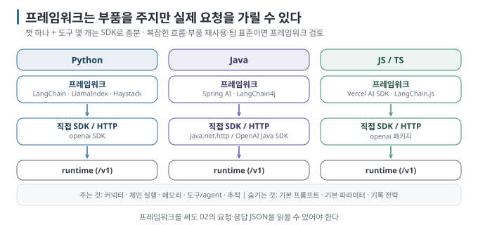
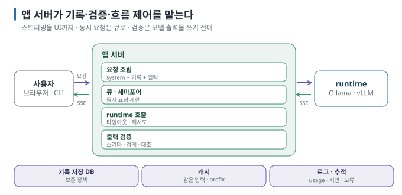
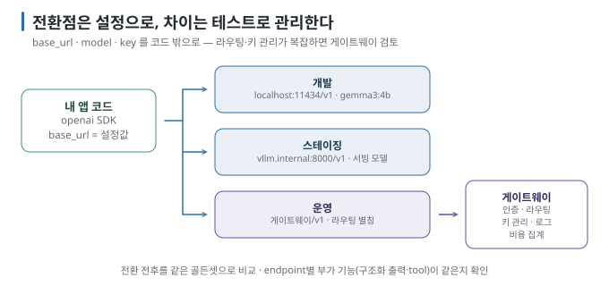

# 09 — 프레임워크와 앱 아키텍처

여기까지는 `openai` SDK 하나로 모든 예제를 만들었습니다. 이 문서는 **언제 프레임워크로 넘어갈지** 판단하는 기준과, 모델 호출
하나를 실제 **앱**으로 확장할 때 필요한 스트리밍 UI·동시성·캐시·백엔드 전환 구조를 다룹니다.

← [08 실습: Prompt Injection](08-lab-prompt-injection.md) · 다음 → [10 신뢰성과 운영](10-reliability-and-operations.md)

> **왜 읽나:** 프레임워크는 반복 구현을 줄여 주지만 실제 요청이 추상화 뒤에 가려질 수 있습니다. 챗 하나에 도구 몇 개라면 SDK로 충분하고, 호출 단계와 분기가 늘어나면 프레임워크가 도움이 됩니다.
>
> **읽고 나면:** 프레임워크로 넘어갈 신호를 알고, 스트리밍·동시성·캐시·기록 저장 결정을 내리며, 로컬과 운영 백엔드 사이의 전환점을 설정으로 분리할 수 있습니다.
>
> **바쁘면:** §0 "결론 먼저"와 ★ 절만 읽고 다음 문서로 넘어가도 흐름이 끊기지 않습니다.

---

## 0. 결론 먼저 ★

- 프레임워크는 **커넥터·체인·메모리·도구 추상화** 같은 부품을 제공해 반복 구현을 줄입니다. 대신 실제 요청과 기본 설정이 추상화 뒤에 가려질 수 있습니다. 챗 하나와 도구 몇 개라면 SDK로 충분합니다. `[해석]`
- Python은 LangChain·LlamaIndex·Haystack, Java는 Spring AI·LangChain4j, JS는 Vercel AI SDK가 2026년 8월 기준 대표적입니다. `[자료 확인 · 2026-08-23]`
- 앱 구조에서는 **스트리밍을 UI까지 전달할지, 동시 요청을 어떻게 제한할지, 백엔드 전환점을 어디에 둘지** 결정해야 합니다. `[해석]`
- 로컬에서 운영 환경으로 전환할 때는 `base_url`·`model`·API Key를 설정으로 분리합니다. 또한 endpoint별 부가 기능(Tool Calling, Response Schema 등)이 같은 방식으로 동작하는지 검증하고, 백엔드가 여러 개라면 게이트웨이를 둡니다. `[해석]`

## 1. 프레임워크 — 언제, 무엇을



| 언어 | 직접 | 프레임워크 (예) | 프레임워크가 주는 것 |
| --- | --- | --- | --- |
| Python | `openai` SDK | LangChain / LangGraph, LlamaIndex, Haystack | 문서 로더·vector store 커넥터, 체인·그래프 실행, 메모리, 도구·agent 추상화, 추적 연동 |
| Java | `java.net.http` 또는 OpenAI Java SDK | **Spring AI**, **LangChain4j** | Spring 통합(자동 설정·`ChatClient`), vector store 추상화, tool 바인딩(`@Tool`), MCP 지원 |
| JS/TS | `openai` 패키지 | Vercel AI SDK, LangChain.js | 스트리밍 UI 훅, 구조화 출력·도구 헬퍼 |

`[자료 확인 · 2026-08-23]` — 이름·기능 범위는 빠르게 바뀝니다. 특히 Spring AI와 LangChain4j는 2025~2026년에 API 변화가 컸으므로
사용 시 **그 버전의 문서**를 기준으로 합니다.

### 넘어가는 신호와 머무는 신호

| 프레임워크로 | SDK에 머물기 |
| --- | --- |
| 문서 로더·vector store·모델을 자주 바꿔 가며 실험 | 백엔드가 하나, 도구가 몇 개 |
| 체인이 3단 이상이고 분기·재시도가 있음 | 흐름이 한 줄로 설명됨 |
| 팀 표준(Spring)에 맞춰 서비스로 배포 | 스크립트·CLI·작은 API |
| 추적(tracing)·평가 도구와 묶어 운영 | 로그 몇 줄로 충분 |

`[해석]` 프레임워크를 쓰더라도 **[02](02-openai-compatible-api.md)의 요청·응답을 읽을 수 있어야** 합니다. 오류는 결국 그 JSON으로
드러납니다.

> 🔧 **한 단계 더 — 프레임워크가 숨기는 세 가지**
>
> 기본 시스템 프롬프트, 기본 `temperature`·`max_tokens`, 그리고 메모리(기록) 전략. 결과가 이상할 때 이 셋을 먼저 확인하세요.
> 대부분의 프레임워크는 "실제 보낸 요청"을 로그로 찍는 디버그 옵션이 있습니다.

## 2. 앱 구조 — 호출 하나에서 서비스로



| 결정 | 선택지 | 기준 |
| --- | --- | --- |
| **스트리밍을 UI까지** | 서버가 runtime의 SSE를 받아 클라이언트로 다시 SSE/WebSocket으로 흘림 / 완성 후 한 번에 | 답이 3초 넘으면 스트리밍. 구조화 출력은 완성 후 파싱 |
| **동시 요청** | 로컬 runtime은 동시 처리 수가 제한됨. 앱 쪽에 큐·세마포어 | Ollama는 `OLLAMA_NUM_PARALLEL`로 동시 슬롯 조정, vLLM은 배칭이 기본 `[문서 확인 · 2026-08-23]` |
| **타임아웃** | 첫 토큰까지 / 전체 | 로컬은 모델 적재 시간(수십 초) 포함. `keep_alive`와 함께 설계 ([04 §3](04-parameters-and-context.md)) |
| **캐시** | 같은 입력 → 같은 출력 캐시 (temperature 0일 때) / prefix cache(runtime) | 반복 질문이 많으면. 시스템 프롬프트가 길면 runtime의 prefix cache가 효과 |
| **기록 저장** | 메모리 / DB | 여러 서버·재시작을 넘기려면 DB. 기록은 사용자 데이터이므로 보존 정책 필요 |
| **검증 위치** | 모델 출력을 쓰기 전에 서버가 검증 | [05 §4](05-structured-output.md), [08](08-lab-prompt-injection.md) — 클라이언트를 믿지 않듯 모델을 믿지 않음 |

`[해석]`

### 스트리밍을 UI로 흘리는 최소 형태 (Python, 개념)

```python
# 서버: runtime 스트림을 받아 그대로 클라이언트에 SSE 로 전달
def stream_answer(messages):
    for chunk in client.chat.completions.create(model=MODEL, messages=messages, stream=True):
        delta = chunk.choices[0].delta.content or ""
        if delta:
            yield f"data: {json.dumps({'t': delta})}\n\n"
    yield "data: [DONE]\n\n"
# 웹 프레임워크의 스트리밍 응답(예: StreamingResponse, text/event-stream)으로 감싼다
```

`[해석]` 클라이언트는 `EventSource`나 fetch 스트림으로 조각을 이어 붙입니다. 03 실습의 루프가 서버로 옮겨간 것뿐입니다.

## 3. 로컬에서 개발하고 운영에서 다른 백엔드로



| 단계 | 해야 할 것 |
| --- | --- |
| 1. 설정 분리 | `base_url`·`model`·키를 환경변수/설정 파일로. 코드에 localhost를 박지 않음 |
| 2. 모델 차이 흡수 | 같은 프롬프트가 모델마다 다르게 동작함. 골든셋으로 전환 전후 비교 ([10 §4](10-reliability-and-operations.md)) |
| 3. endpoint별 부가 기능 확인 | 구조화 출력·tool calling이 새 백엔드에서도 같은 방식으로 지원되는지 ([02 §4](02-openai-compatible-api.md)) |
| 4. 게이트웨이 | 백엔드가 둘 이상이면 라우팅·키 관리·로그·비용 집계를 앱 밖 한곳으로. OpenAI 호환 프록시 형태의 오픈소스·상용 제품이 있음 |

`[해석]` 게이트웨이 자체의 설계(인증·마스킹·정책)는 이 가이드 범위 밖입니다. 앱 코드는 같은 인터페이스를 유지하되,
`base_url`·`model`·API Key뿐 아니라 endpoint별 부가 기능과 응답 차이를 전환 테스트로 확인해야 합니다.

`[자료 확인 · 2026-08-23]` — "OpenAI 호환 게이트웨이"로 불리는 도구들이 여러 백엔드를 하나의 `/v1` 뒤에 묶어 줍니다. 제품은
바뀌므로 이름을 적지 않습니다.

## 4. RAG와 이 가이드의 접점

RAG는 이 가이드의 호출 앞에 **검색 단계**를 붙인 것입니다. `messages`의 `user` 내용에 검색된 조각을 넣고, 임베딩은
`/v1/embeddings`로 부릅니다. 나머지(기록·구조화 출력·도구·경계)는 전부 이 가이드 그대로입니다.
검색·인덱싱·근거 평가는 별도 후속 주제로 다룹니다. `[원리]`

## 5. 이 문서의 점검표

- [ ] 프레임워크가 필요한 신호가 있는지 §1 표로 판단했다
- [ ] 스트리밍·동시성·타임아웃·캐시·기록 저장 다섯 결정을 적었다
- [ ] `base_url`·`model`·키가 설정으로 분리돼 있다
- [ ] 백엔드 전환 전후를 비교할 골든셋이 있다

---

**다음 →** [10 신뢰성과 운영](10-reliability-and-operations.md)
