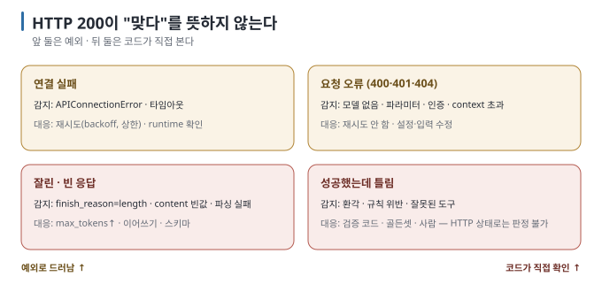
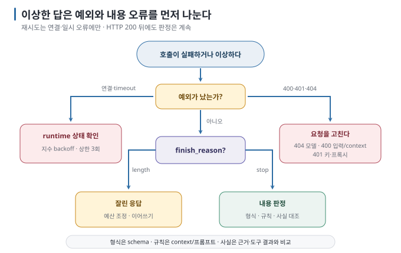

# 10 — 신뢰성과 운영: 오류 · 재시도 · 로그 · 테스트 · 노출

모델 호출은 느리고, 가끔 실패하고, 매번 조금 다릅니다. 보통의 API 호출보다 **실패 유형이 몇 가지 더** 있고, "성공했는데 틀린"
경우가 있습니다. 이 문서는 앱이 갖춰야 할 최소한의 방어와 운영 습관을 다룹니다.

← [09 프레임워크와 앱 아키텍처](09-frameworks-and-architecture.md) · 다음 → [11 용어집](11-glossary.md)

> **왜 읽나:** HTTP 200은 "맞다"를 뜻하지 않습니다. LLM 앱에는 보통의 API에 없는 실패가 두 종류 더 있고, 둘 다 예외를 던지지 않습니다.
>
> **읽고 나면:** 네 가지 실패를 구분해 대응하고, 재시도할 오류와 안 할 오류를 나누며, 로그·골든셋·모킹으로 바꿨을 때 나빠졌는지 알 수 있습니다.
>
> **바쁘면:** §0 "결론 먼저"와 ★ 절만 읽고 다음 문서로 넘어가도 흐름이 끊기지 않습니다.

---

## 0. 결론 먼저 ★

- 실패는 네 종류 — **연결 실패, 요청 거부, 잘린·빈 응답, 성공했는데 틀림.** 앞 둘은 예외, 뒤 둘은 예외가 아니므로 코드가 직접 봐야 합니다. `[원리]`
- 재시도는 **연결·일시 오류에만**, 그것도 상한을 두고. 틀린 답은 재시도로 고쳐지지 않습니다. `[해석]`
- 로그는 기본적으로 **모델·파라미터·길이·해시·finish_reason·usage·지연**을 남깁니다. 본문은 마스킹·접근 통제·보존 기간을
  정한 디버그 환경에서만 제한적으로 기록합니다. `[해석]`
- 로컬 endpoint는 무인증입니다. `0.0.0.0`으로 열지 말고, 열어야 하면 앞에 인증 프록시를 둡니다. `[문서 확인 · 2026-08-23]`

## 1. 오류 유형과 대응



| 유형 | 증상 | 감지 | 대응 |
| --- | --- | --- | --- |
| **연결 실패** | `APIConnectionError`, 타임아웃 | 예외 | 재시도(지수 backoff, 상한 3회), runtime 상태 확인, 사용자에게 "잠시 후" |
| **요청 거부** | 4xx — 모델 없음(404), 잘못된 파라미터(400), 인증(401), context 초과(400, runtime에 따라) | 예외 + 상태 코드 | 재시도 **안 함**. 설정·입력 수정. context 초과면 기록 자르기 |
| **잘린 응답** | `finish_reason == "length"` | 응답 필드 | `max_tokens` 증가 또는 이어쓰기 요청. 구조화 출력이면 파싱 실패로 드러남 |
| **빈·깨진 응답** | `content`가 `None`/빈 문자열, JSON 파싱 실패 | 코드 검사 | 1회 재시도(temperature 0이면 같은 결과일 수 있음 — 프롬프트·스키마 수정이 근본) |
| **느린 첫 응답** | 첫 토큰까지 수십 초 | 지연 측정 | 모델 적재 중 — `keep_alive`·warm-up 호출 ([04 §3](04-parameters-and-context.md)) |
| **성공했는데 틀림** | 환각, 규칙 위반, 잘못된 도구 선택 | **자동으로는 못 잡음** — 검증 코드·골든셋·사람 | [05 §4](05-structured-output.md) 내용 검증, [08](08-lab-prompt-injection.md) 경계, §4 평가 |

`[해석]` 마지막 줄이 LLM 앱 특유의 항목입니다. HTTP 200이 "맞다"를 뜻하지 않습니다.

### 재시도의 규칙

```python
import time
from openai import APIConnectionError, APITimeoutError, RateLimitError

def call_with_retry(fn, attempts=3):
    for i in range(attempts):
        try:
            return fn()
        except (APIConnectionError, APITimeoutError, RateLimitError) as e:   # 일시 오류만
            if i == attempts - 1:
                raise
            time.sleep(2 ** i)        # 1s, 2s, 4s
```

4xx(잘못된 요청·모델 없음)는 재시도해도 같습니다. 잘린·틀린 답도 마찬가지입니다. `[해석]`

### 진단 플로우



## 2. 로컬 endpoint 노출

| 상태 | 위험 | 대응 |
| --- | --- | --- |
| `localhost`만 수신 (기본) | 같은 PC의 프로세스만 호출 가능 | 개인 개발의 기본값 |
| `0.0.0.0` 수신 (`OLLAMA_HOST=0.0.0.0` 등) | **같은 네트워크의 누구나** 무인증 호출, 모델 다운로드·삭제 API까지 | 정말 필요할 때만. 앞에 인증 프록시(리버스 프록시 + 토큰/Basic) 또는 방화벽 |
| vLLM·llama-server `--api-key` | 키 없으면 거부 | 키를 코드가 아니라 환경변수에 |

`[문서 확인 · 2026-08-23]` — Ollama 자체에는 인증이 없습니다. 팀과 공유하려면 프록시 층이 필수이고, 그 층의 설계(인증 연동·
마스킹·정책)는 범위 밖입니다.

## 3. 로깅과 관측

기록할 것 `[해석]`:

| 항목 | 왜 |
| --- | --- |
| 요청: `model`, `messages`(또는 해시+길이), 파라미터, `tools` 이름 | 재현. "그때 무엇을 보냈나" |
| 응답: `content`(또는 해시+길이), `finish_reason`, `tool_calls` 이름·인자 | 판정. 잘림·도구 오남용 추적 |
| `usage.prompt_tokens / completion_tokens` | context 예산 감시, 비용 |
| 지연: 첫 토큰까지(TTFT), 전체 | 체감 성능, 적재 여부 |
| 오류 유형·재시도 횟수 | §1 분류 |
| 세션/요청 ID | 대화 단위로 묶기 |

**개인정보:** 메시지 본문에 이름·연락처·문서 내용이 들어갑니다. 로그에 본문을 남길지, 마스킹할지, 며칠 보존할지를 **먼저** 정합니다.
"디버그용으로 잠깐"이 가장 흔한 유출 경로입니다. `[해석]`

추적(tracing) 도구는 위 항목을 요청 단위로 묶어 화면에 보여 줍니다. 오픈소스·상용 여러 가지가 있으며, 프롬프트를 외부 서비스로
보내는 구성인지 확인하고 씁니다. `[자료 확인 · 2026-08-23]`

## 4. 테스트

| 층 | 방법 | 무엇을 잡나 |
| --- | --- | --- |
| **단위** | 도구 함수를 모델 없이 테스트 (07의 `calculate`·`_resolve`처럼) | 인자 검증·경계. 가장 싸고 확실 |
| **모킹** | `client`를 가짜로 바꿔 정해진 응답(정상·`length`·빈 응답·`tool_calls`)을 돌려줌 | 내 코드의 분기(§1 대응)가 전부 실행되는가 |
| **골든셋** | 질문 20~50개 + 기대 결과(정답 필드·허용 범위·"없음") → 실제 모델로 실행해 비교 | 모델·프롬프트·백엔드를 바꿨을 때 나빠졌는가 |
| **경계 시나리오** | 08의 네 사건을 자동화 | 회귀 방지 |

`[해석]` 출력이 확률적이므로 골든셋은
"문자열 일치"가 아니라 **필드·범위·포함 여부**로 판정합니다. temperature 0과 `seed`로 변동을 줄이되, 완전한 재현은 기대하지 않습니다.

> **다음 단계:** 골든셋 설계, 설정 비교, LLM 판정자의 한계, 추적과 운영 지표는 별도 후속 주제로 확장합니다.

## 5. 운영 수칙 — 로컬에서도

- **버전 고정:** runtime 버전, 모델 태그와 ID(`ollama list`의 ID), SDK 버전을 기록. "같은 모델"이 조용히 바뀔 수 있습니다.
- **warm-up:** 서비스 시작 시 짧은 호출 한 번으로 모델 적재. `keep_alive` 설정.
- **예산:** 요청당 최대 토큰·최대 도구 호출·최대 시간을 정하고 초과 시 중단·보고.
- **변경은 하나씩:** 프롬프트·모델·파라미터·백엔드를 한 번에 하나만 바꾸고 골든셋으로 비교.
- **기록은 사용자 데이터:** 보존·삭제 정책을 정한 뒤 저장.

`[해석]`

## 6. 이 문서의 점검표

- [ ] 네 오류 유형 각각에 대응 코드가 있다 (특히 `finish_reason`·빈 응답)
- [ ] 재시도는 일시 오류에만, 상한이 있다
- [ ] endpoint가 `localhost`만 수신하거나 앞에 인증이 있다
- [ ] 로그 항목과 개인정보 정책을 정했다
- [ ] 도구 단위 테스트 + 모킹 + 골든셋 중 최소 둘이 있다

---

**다음 →** [11 용어집](11-glossary.md)
