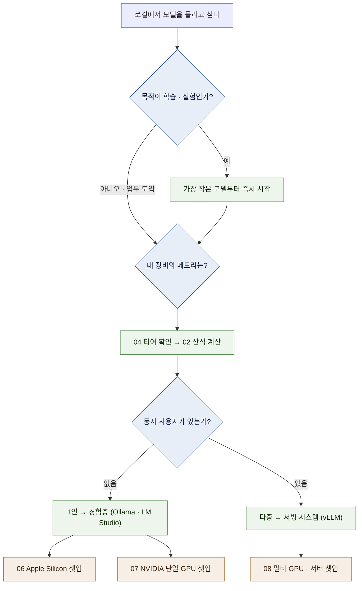

# 01 — 오리엔테이션: 로컬 실행의 전체 지도

**로컬 LLM이 애초에 무엇인지**부터 정의하고, 그것이 **구조적으로 무엇인지**, **언제 그럴 가치가 있는지**를 정리한다.

← [README](README.md) · 다음 → [02 모델 해부](02-model-anatomy.md)

---

## 0. 로컬 LLM이란 무엇인가 — 실행 위치와 weight 공개 범위 ★

ChatGPT·Claude 같은 서비스에서는 model이 **서비스 사업자가 관리하는 환경**에서 실행되고, 사용자는 network를
통해 요청합니다. 이 문서에서는 이런 방식을 **hosted LLM**이라고 부릅니다. **local LLM**은 model inference가
내 노트북, workstation 또는 내가 관리하는 server에서 실행되는 구성입니다. `[원리]`

`hosted/local`은 **실행 위치**, `closed/open-weight`는 **weight 접근 범위**를 구분하는 말입니다. 두 축은 독립적입니다.
open-weight model도 외부 사업자의 hosted API로 사용할 수 있고, 같은 model을 직접 내려받아 local로 실행할 수도
있습니다. 이 가이드는 두 번째 경우를 중심으로 다룹니다.



| 관점 | hosted LLM (상용 API·서비스) | local LLM (직접 실행) |
| --- | --- | --- |
| 모델이 도는 곳 | 사업자 데이터센터 | 내 노트북·워크스테이션·사내 서버 |
| data 흐름 | prompt·첨부 data가 사업자 환경으로 전송됨 | 기본 inference는 직접 관리하는 환경에서 처리됨. model download·remote tool·telemetry는 별도 확인 |
| 비용 구조 | 사용량 기반 요금이 일반적 | 장비·전력·운영 비용을 직접 부담 (§4) |
| model 선택 | 사업자가 제공하는 model | runtime과 license가 허용하는 open-weight model ([09](09-model-landscape.md)) |
| 시작 준비 | 계정·network·필요한 인증 정보 | 실행 장비, runtime, model file과 저장 공간 |

`[원리]` — 어느 쪽이 "낫다"의 문제가 아니라 **제약과 비용 구조가 다른 두 실행 방식**이다. 언제 로컬이 정당화되는지는 §3.

### 조직에서는 hybrid도 선택지다

조직은 실행 위치를 한 가지로 제한하지 않고 workload별로 local과 hosted를 나눠 쓸 수 있습니다. 예를 들어 data
residency와 offline 처리가 우선인 요청은 직접 관리하는 model로, 특정 hosted model의 품질·기능이 필요한 요청은
외부 API로 보낼 수 있습니다. 여기서 **hybrid**는 이 두 경로를 함께 운영하는 구성을 뜻합니다. `[해석]`

여러 runtime이 비슷한 HTTP API를 제공하면 application의 연결 방식을 일부 공통화할 수 있습니다. 그러나
“OpenAI-compatible”은 모든 endpoint·option·model 동작이 같다는 보장이 아닙니다. routing, 인증, 민감 정보 차단,
log와 장애 대응이 추가되므로 hybrid 자체가 항상 더 싸거나 단순한 해법도 아닙니다.

> **이 가이드가 다루는 범위:** hybrid 구성 가운데 **local model을 실행하고 기본 API로 확인하는 지점**까지입니다.
> gateway·masking·routing과 조직 governance는 범위 밖입니다.

---

## 1. 결론 먼저

로컬 실행은 세 가지 층으로 나뉘고, **처음 겪는 혼란의 대부분은 이 층을 구분하지 못해서 생긴다.** `[해석]`


**핵심:** Ollama는 local model을 쉽게 내려받고 실행하는 사용자 경험을 제공하고, vLLM은 API serving과
동시 요청 처리에 초점을 둡니다. 사용 목적과 측정 조건이 다르므로 이름만 놓고 속도 순위를 만들면 안 됩니다.
자세한 선택 기준은 [05 stack 지도](05-stack-map.md)에서 다룹니다. `[자료 확인 · 2026-08-10]`

### "모델을 띄운다"는 실제로 무슨 일인가

초심자가 가장 자주 오해하는 지점이다. 모델은 **질문할 때마다 실행되는 프로그램이 아니라,
한 번 메모리에 올려두고 계속 상주하는 데이터**에 가깝다. `[원리]`



여기서 세 가지가 따라 나온다.

| 관찰 | 이유 |
| --- | --- |
| 첫 질문 전에 한참 기다린다 | 로드 중 — 수 GB를 디스크에서 읽는다 |
| **모델을 안 쓰는 동안에도 메모리를 점유한다** | 상주하기 때문. 다른 작업이 느려질 수 있다 |
| 모델을 바꾸면 다시 기다린다 | 이전 모델을 내리고 새로 로드한다 |

> Ollama는 일정 시간 요청이 없으면 모델을 메모리에서 내린다(기본 5분). 그래서
> **한참 만에 다시 물으면 첫 응답이 느린 것**이 정상이다. `[자료 확인 · 2026-08-10]`

---

## 2. open-weight란 무엇이고 무엇이 아닌가

| 용어 | 의미 | 주의점 |
| --- | --- | --- |
| **open-weight** | **학습된 가중치 파일이 공개**된 모델 | 학습 데이터·학습 코드는 대개 비공개다 |
| **open-source AI** | weight 공개만이 아니라 연구·수정·재현에 필요한 접근 범위를 함께 판단하는 별도 개념 | open-weight라는 이유만으로 자동 분류하지 않는다 |
| **permissive license** | Apache 2.0·MIT처럼 비교적 넓은 이용을 허용하는 license | 고지·재배포 조건과 model별 추가 정책을 확인해야 한다 |

**실무 함정:** "오픈 모델이니 마음대로 써도 된다"는 틀린 전제다.
`[변동]` 예를 들어 Meta Llama 계열은 커뮤니티 라이선스로 월간 활성 사용자 임계치 조건이 붙고,
일부 모델은 Modified MIT·NC(비상업) 조건이 붙는다. 라이선스 구분은 [09 §4](09-model-landscape.md).

> 조직 도입과 재배포에서는 성능 검토와 별개로 “이 license와 model policy가 우리 용도를 허용하는가”를 확인해야
> 합니다. 이 가이드는 법률 자문을 대신하지 않습니다.

---

## 3. 왜 로컬인가 — 네 가지 동기와 각각의 진짜 조건

로컬 실행을 정당화하는 이유는 넷인데, **각각이 요구하는 조건이 다르다.** 섞으면 잘못된 장비를 산다. `[해석]`

| 동기 | 진짜 요구 조건 | 흔한 착오 |
| --- | --- | --- |
| **① 외부 전송을 통제해야 함** (폐쇄망·규제·기밀) | network·tool·log·update 경로를 포함한 격리와 감사 | local이라는 이름만 보고 data egress가 없다고 가정한다 |
| **② 비용** (대량·반복 호출) | **손익분기 계산**. 아래 §4 | 장비값만 계산하고 전력·운영·모델 교체 주기를 뺀다 |
| **③ 지연시간·오프라인** | 네트워크 왕복 제거. 소형 모델로 충분한 경우가 많다 | 대형 모델을 로컬에 올려 오히려 느려진다 |
| **④ 학습·실험** | 저렴하고 빠른 반복. 품질은 타협 가능 | 처음부터 운영급 구성을 하려다 시작을 못 한다 |

**④가 목적이라면** 장비 걱정을 접고 [06](06-setup-apple-silicon.md) 또는 [07](07-setup-nvidia-workstation.md)로 바로 가도 된다.
가진 장비에서 여유 있게 들어가는 작은 model로 먼저 실행 경로를 확인한다.

---

## 4. hosted API와의 손익분기 — 언제 로컬이 싼가

이 계산은 자주 틀린다. **비교 대상이 "GPU 값 vs API 요금"이 아니기 때문이다.** `[해석]`

```text
  hosted API 비용  =  토큰 요금 × 사용량
                     (사용량에 정비례. 안 쓰면 0)

  로컬 비용        =  장비 구입·감가상각
                   +  전력
                   +  운영 시간 (셋업·업데이트·장애 대응)
                   +  model·runtime 교체 비용
                     (사용량과 거의 무관. 안 써도 발생)
```

따라서 구조는 이렇다.

| 사용량 | 유리한 쪽 | 이유 |
| --- | --- | --- |
| 낮음·불규칙 | **hosted API** | 로컬 고정비를 회수할 사용량이 안 나온다 |
| 높음·꾸준함 | **로컬 후보** | 고정비를 많은 요청에 나눌 수 있다. 실제 우위는 장비 이용률과 운영 비용을 포함해 계산 |
| 어떤 양이든, 데이터가 못 나감 | **로컬** | 비용 비교 자체가 성립하지 않는다. 제약 조건이다 |

**결론적 조언:** 개인 학습·개발 목적이면 손익분기 계산 자체가 불필요하다.
목적이 ④(학습)이면 local 실행 자체가 학습 목표일 수 있습니다. 조직 도입 검토라면 token 요금뿐 아니라 장비
이용률, 운영 시간, 장애와 model 교체 비용을 함께 계산합니다. `[해석]`

---

## 5. 의사결정 플로우 — 무엇부터 정할 것인가



**순서가 중요한 이유:** 모델을 먼저 고르고 장비를 맞추면 대개 예산이 터진다.
**장비(제약) → 가용 모델(계산) → 도구(선택)** 순서가 실패가 적다. `[해석]`

---

## 6. 처음 부딪히는 세 가지 장벽

| 장벽 | 증상 | 어디서 다루나 |
| --- | --- | --- |
| **메모리 장벽** | 모델이 로드되다 죽거나, 로드는 됐는데 극단적으로 느리다(스왑 발생) | [02 §1·§4](02-model-anatomy.md) · [10 §3](10-operations.md) |
| **컨텍스트 장벽** | 짧은 대화는 되는데 긴 문서를 넣으면 죽는다 | [02 §5 KV 캐시](02-model-anatomy.md) |
| **선택 마비** | GGUF? Q4_K_M? AWQ? 무엇을 받아야 할지 모르겠다 | [03 §5 선택 규칙](03-quantization.md) |

세 가지 문제 모두 **[02 메모리 산식](02-model-anatomy.md)**을 이해하면 원인이 같다는 것이 보인다. 다음 문서로 간다.

---

**다음 →** [02 모델 해부 — 파라미터·MoE·메모리 산식](02-model-anatomy.md)
