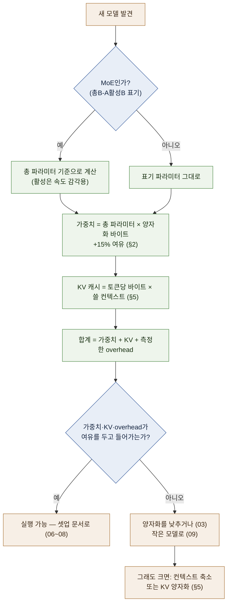

# 02 — 모델 해부: 파라미터·MoE·메모리 산식

**이 가이드에서 가장 실용적인 문서다.** "이 모델이 내 장비에서 돌아가는가"를 스스로 계산하기 위한 것.

← [01 오리엔테이션](01-orientation.md) · 다음 → [03 양자화](03-quantization.md)

---

## 0. 먼저 — 모델이 글을 만드는 방식

산식으로 들어가기 전에 이것부터 본다. **뒤에 나오는 모든 숫자가 "토큰"을 단위로 하기 때문**이다.

### 토큰 — 모델이 세는 단위

모델은 글자나 단어가 아니라 **토큰(token)** 단위로 읽고 쓴다.


같은 문장도 model이 사용하는 tokenizer에 따라 token 수와 경계가 달라집니다. 영어 단어 수나 한국어 글자 수로
정확한 token 수를 환산할 수 없으므로, 비용·context·KV cache를 계산할 때는 실제 model의 tokenizer로 확인합니다.

`[원리]` 컨텍스트 길이도, 생성 속도(TPS)도, KV 캐시 크기도 **전부 토큰 수로 센다.**

### 생성 — 한 번에 한 토큰씩, 자기 출력을 다시 먹는다



`[원리]`

**이 그림 하나에서 이 문서의 거의 모든 것이 파생된다.**

| 겪게 되는 현상 | 왜 그런가 | 어디서 다루나 |
| --- | --- | --- |
| 첫 글자가 늦게 나온다 | ①이 프롬프트 **전체**를 한 번에 처리하는 비용 | [10 §1 TTFT](10-operations.md) |
| 그 뒤로는 일정한 속도로 나온다 | ②는 토큰마다 같은 일을 반복 | [10 §1 TPS](10-operations.md) |
| 대화가 길어질수록 느려진다 | 생성한 토큰이 다음 입력에 계속 붙는다 | §5 · §6 |
| 앞부분을 매번 다시 계산하면 낭비다 | → 중간 결과를 저장해 둔다 = **KV 캐시** | §5 |
| 그래서 긴 대화일수록 메모리를 더 먹는다 | KV 캐시가 토큰 수에 비례해 자란다 | §5 |

> **초심자용 한 줄:** 모델은 "생각해서 문장을 쓰는" 것이 아니라
> **"다음 토큰 하나를 고르는 일을 계속 반복"**한다. 속도·메모리 이야기는 전부 이 반복의 비용이다. `[해석]`

---

## 1. 결론 먼저 — 외울 것은 식 두 개

```text
  ① 가중치 메모리  =  총 파라미터 수 × 파라미터당 바이트 수

  ② KV 캐시       =  토큰당 KV 바이트 × 컨텍스트 길이 × 동시 요청 수
                      (토큰당 KV 바이트를 구하는 상세식은 §5 — 모델 구조에서 나온다)

  필요 메모리 ≈ ① + ② + runtime·driver·activation overhead
```
`[원리]`

**overhead**란 가중치·KV 외에 runtime이 추가로 쓰는 몫입니다. 계산 중간값을 담는 activation buffer,
framework 자체 memory, graphics driver 예약분이 포함됩니다. model 구조, runtime, batch와 backend에 따라 달라지므로
고정된 GB를 더해 확정하지 말고 runtime log와 실제 peak memory로 검산합니다. 계획 단계에서는 반드시 여유를 남깁니다. `[해석]`

여기서 실수가 나오는 지점은 정확히 셋이다.

1. **"총" 파라미터를 써야 한다** — MoE 모델에서 활성 파라미터를 쓰면 메모리를 크게 과소평가한다 (§3)
2. **파라미터당 바이트는 양자화가 정한다** — FP16이면 2, INT4면 0.5 (§2)
3. **②를 빼먹으면 안 된다** — 긴 컨텍스트에서는 ②가 ①보다 커지는 일도 있다 (§5)

식에 들어가는 숫자(레이어 수·KV 헤드 수 등)는 **모델 스펙 카드에서 읽는다** — 조회 방법은 §2 끝의 "이 숫자들을 어디서 보나".

---

## 2. 파라미터 수와 정밀도 — 왜 "7B = 14GB"인가

**파라미터**는 모델이 학습으로 얻은 숫자(가중치) 하나하나다. 모델 규모에 붙는 `B`는 billion(10억)을
뜻하므로, 7B는 70억 개다.
이 숫자 하나를 메모리에 몇 바이트로 저장하느냐가 **정밀도(precision)**다. `[원리]`

| 정밀도 | 파라미터당 | 7B 모델 | 70B 모델 | 성격 |
| --- | --- | --- | --- | --- |
| FP32 | 4 byte | 28 GB | 280 GB | 전통적 학습·연구용. 추론에는 거의 안 씀 |
| **FP16 / BF16** | **2 byte** | **14 GB** | **140 GB** | 배포 원본의 기본값 |
| FP8 | 1 byte | 7 GB | 70 GB | 최신 GPU(H100·Blackwell)의 네이티브 형식 |
| INT8 (8bit) | 1 byte | 7 GB | 70 GB | 품질 손실 거의 없음 |
| **INT4 (4bit)** | **0.5 byte** | **3.5 GB** | **35 GB** | local 배포에서 널리 쓰는 급. 실제 file은 scale·metadata 때문에 더 큼 |

**"7B는 14GB"의 정체:** 7×10⁹ 개 × 2 byte = 14×10⁹ byte ≈ 14 GB. 그뿐이다. `[원리]`

> **왜 4bit를 많이 쓰나.** 이론상 FP16 weight의 1/4 크기라 같은 memory에 더 큰 model을 넣을 수 있습니다.
> 품질 손실은 model, quantization 방식과 task에 따라 달라지므로 “체감되지 않는다”고 일반화하지 않습니다. 원리와
> 선택 기준은 [03](03-quantization.md)에서 다룹니다.

### 실측이 계산보다 큰 이유

계산값 6 GB인 모델이 실제로는 7 GB로 표기되는 일이 흔하다. 이유는 셋이다. `[원리]`

- **모든 레이어를 4bit로 낮추지 않는다** — 임베딩(토큰을 내부 표현으로 바꾸는 첫 층)·출력층(내부 표현을
  다시 토큰 확률로 바꾸는 끝 층) 등 민감한 부분은 더 높은 정밀도로 남긴다
- **양자화 스케일 값**을 블록마다 추가로 저장한다
- **GGUF는 토크나이저·메타데이터를 파일에 함께 번들**한다

→ **실무 규칙: 계산값에 10~20% 여유를 더한다.** 이 가이드의 표는 일괄 +15%를 쓴다.
   "Q4는 정확히 4bit가 아니라 실측 4.8bit 안팎"이라는 사실이 이 여유의 정체다 — 상세는 [03 §4의 bpw 표](03-quantization.md). `[해석]`

### 이 숫자들을 어디서 보나 — 모델 스펙 카드 읽는 법

산식의 변수는 전부 **Hugging Face 모델 페이지의 `config.json`**에 있다. 모델 페이지 → `Files` 탭 → `config.json`을 연다. `[자료 확인 · 2026-08-10]`

| 산식의 변수 | `config.json` 필드 | 예 (70B급 dense) |
| --- | --- | --- |
| 총 파라미터 수 | (모델명·카드에 표기 — `70B`, `35B-A3B`) | 70B |
| 레이어 수 | `num_hidden_layers` | 80 |
| KV 헤드 수 | `num_key_value_heads` | 8 |
| 헤드 차원 | `head_dim`, 없으면 `hidden_size ÷ num_attention_heads` | 8,192 ÷ 64 = 128 |
| 컨텍스트 상한 | `max_position_embeddings` | 131,072 |

GGUF 파일 하나로 배포되는 경우에는 HF 페이지의 **GGUF 메타데이터 뷰어**(파일명 클릭)로 같은 값을 본다.

> 🔧 **한 단계 더** — 카드 없이 값만 빠르게 볼 때:
> `huggingface-cli download <repo> config.json` 으로 config만 받거나,
> 받은 GGUF는 llama.cpp 동봉 도구(`gguf-dump`)로 메타데이터를 덤프한다.
> Ollama로 받은 모델은 `ollama show <model>`이 파라미터·컨텍스트·양자화를 요약해 준다.

---

## 3. dense vs MoE — total과 active를 구분한다 ★

MoE(Mixture of Experts, 전문가 혼합) model에는 흔히 total parameter와 token마다 선택되는 active parameter가 함께
표기됩니다. 두 숫자는 서로 다른 질문에 답하므로 하나만 보고 장비나 속도를 판단하면 안 됩니다.


| 무엇이 | 무엇을 따르는가 |
| --- | --- |
| **메모리 소요** | **총(total) 파라미터** — 35B-A3B는 35B 기준으로 계산한다 |
| **연산량·속도** | active parameter의 영향을 크게 받지만 memory access, routing, backend와 hardware도 함께 작용 |
| **품질** | total·active parameter 숫자만으로 예측할 수 없음. model별 evaluation 필요 |

`[원리]`

**표기법 읽는 법:** `35B-A3B`처럼 표기됐다면 total 35B, token당 active 3B라는 뜻입니다. 정확한 정의는 해당
model card에서 다시 확인합니다. `[자료 확인 · 2026-08-10]`

> **가장 흔한 치명적 실수:** "35B-A3B니까 3B 모델이네, 8GB에서 돌겠다" → **틀렸다.**
> memory는 35B 전체 weight 기준으로 계획해야 합니다. 반대로 active 3B라는 이유만으로 dense 3B model과 같은
> 속도라고 단정할 수도 없습니다.

**MoE의 실질적 의미:** 전체 weight를 보관할 memory가 필요하지만 token마다 일부 expert만 계산할 수 있다는
비대칭입니다. 큰 unified memory는 VRAM보다 큰 weight를 담는 선택지를 넓힐 수 있지만, 실제 속도와 품질 우위를
보장하지는 않습니다. [04 §1](04-hardware-tiers.md) 참조. `[해석]`

> 🔧 **한 단계 더 — "총 파라미터 전부 메모리에"의 예외, 전문가 오프로딩.**
> llama.cpp에는 MoE의 **전문가 텐서만 시스템 RAM에 두고** 공유 부분만 GPU에 올리는 옵션이 있다
> (`--n-cpu-moe`, `--override-tensor`). 활성 파라미터가 작은 MoE는 이렇게 해도 실사용 속도가 나와서,
> VRAM보다 큰 모델을 돌리는 우회로가 된다. 단, 순수 GPU 상주보다는 느리다. `[자료 확인 · 2026-08-10]`

---

## 4. 검산 예제 3종 ★

산식이 실제로 맞는지 손으로 확인한다. **결론을 외우지 말고 과정을 가져간다** — 새 모델에 그대로 적용해야 하므로.

### 예제 A — dense 소형: 12B 모델을 4bit로

```text
  가중치 = 12 × 10⁹ × 0.5 byte = 6.0 GB
  실측 여유 +15%               ≈ 6.9 GB
  KV 캐시 (8K 컨텍스트, 1요청)   ≈ 1.3 GB   ← 아래 계산
  오버헤드                      ≈ 1.5 GB
  ─────────────────────────────────────
  합계                          ≈ 9.7 GB

  KV 계산 (레이어 40, KV 헤드 8, 헤드 차원 128, FP16 가정 — §5 산식.
           이 값들은 §2 "스펙 카드 읽는 법"대로 config.json에서 읽은 12B급 dense의 대표 구성이다)
    토큰당 = 2 × 40 × 8 × 128 × 2 byte = 163,840 byte ≈ 0.16 MB
    8,192 토큰 = 0.16 MB × 8,192 ≈ 1.3 GB
```
→ **16GB VRAM / 통합메모리에서 편안하게 동작.** 8GB에서는 컨텍스트를 크게 줄여야 겨우 가능.
HF에 배포된 Gemma 4 12B의 Q4 파일 크기(~7GB)와 가중치 부분이 일치한다. `[자료 확인 · 2026-08-10]`

### 예제 B — dense 대형: 70B 모델을 4bit로

```text
  가중치 = 70 × 10⁹ × 0.5 byte = 35.0 GB
  실측 여유 +15%               ≈ 40.3 GB
  KV 캐시 (8K, 1요청, GQA)      ≈ 2.6 GB   ← §5
  오버헤드                      ≈ 2.0 GB
  ─────────────────────────────────────
  합계                          ≈ 45 GB
```
→ **소비자용 단일 GPU(24~32GB)로는 불가.** 필요한 것은 ① 64GB 이상 통합메모리 Mac,
② 96GB급 프로 GPU 1장, ③ 24~32GB GPU 2장 이상 중 하나다. [04](04-hardware-tiers.md) 참조.

### 예제 C — MoE: 35B-A3B를 4bit로 ★

```text
  ✗ 틀린 계산: 3 × 10⁹ × 0.5 = 1.5 GB   ← 활성 파라미터로 계산하는 실수
  ✓ 옳은 계산: 35 × 10⁹ × 0.5 = 17.5 GB

  가중치                        ≈ 17.5 GB
  실측 여유 +15%               ≈ 20.1 GB
  KV 캐시 + 오버헤드            ≈ 2.5 GB
  ─────────────────────────────────────
  합계                          ≈ 22.6 GB   → 24GB 장비에 "빡빡하게" 들어감

  단, token당 활성 연산량은 총 35B보다 작다
  실제 생성 속도는 runtime·memory 이동·hardware까지 측정해야 한다
```

**세 예제의 교훈:** 필요한 것은 결론이 아니라 **"총 파라미터 × 정밀도 바이트 + 15% + KV + 2GB"**라는 절차다. `[해석]`

---

## 5. KV 캐시 — 컨텍스트가 길어지면 죽는 이유 ★

### 무엇인가

모델은 토큰을 하나씩 만든다. 100번째 토큰을 만들 때 앞의 99개를 매번 다시 계산하면 낭비이므로,
중간 결과(Key·Value)를 저장해 둔다. 이것이 **KV 캐시**다. `[원리]`

**결정적 성질: 컨텍스트 길이에 정비례해 커진다.** 모델 파일과 달리 **실행 중에 자란다.**
"짧은 대화는 되는데 긴 문서를 넣으면 죽는다"는 증상의 정체가 이것이다.

### 산식

```text
  토큰당 바이트 = 2 × 레이어 수 × KV 헤드 수 × 헤드 차원 × 요소당 바이트

      2         : Key와 Value 두 벌
      요소당    : FP16이면 2, FP8이면 1

  총 KV 캐시   = 토큰당 바이트 × 컨텍스트 길이 × 동시 요청 수
```
`[원리]`

> **이 산식의 적용 범위.** 위 식은 표준 어텐션(MHA/GQA) 모델 기준이다. 일부 최신 계열은
> 어텐션 구조 자체를 바꿔 KV를 크게 줄인다 — DeepSeek 계열의 MLA, Gemma 계열의 sliding-window,
> 하이브리드 SSM 계열 등은 **이 식보다 훨씬 작게** 나온다. 식이 주는 값은 "많아야 이 정도"의
> 상한으로 쓰고, 정확한 값은 런타임이 로드 시 출력하는 KV 할당량을 본다. `[변동]` 조회 2026-08-10

### 검산 — 70B급 모델 (레이어 80, KV 헤드 8, 헤드 차원 128, FP16)

```text
  토큰당 = 2 × 80 × 8 × 128 × 2 byte
         = 327,680 byte
         ≈ 0.31 MB / 토큰

  8,192 토큰 (1요청)  = 0.31 MB × 8,192  ≈  2.6 GB
  8,192 토큰 (32요청) = 2.6 GB × 32      ≈  83 GB   ← 서빙에서 KV가 지배적인 이유
```
`[원리]` — 공개 자료의 계산과 일치한다 `[자료 확인 · 2026-08-10]`

### GQA가 왜 중요한가

위 예에서 KV 헤드가 8인 것은 **GQA(Grouped Query Attention)** 덕분이다.
구형 방식(MHA)이면 KV 헤드가 64개여서 **KV 캐시가 8배**가 된다. `[원리]`

**어텐션 헤드**란 모델이 앞 토큰들을 "돌아보는" 병렬 시선이라고 생각하면 된다. 시선(쿼리 헤드)마다
따로 KV를 저장하면(MHA) 비싸고, 여러 시선이 KV 한 벌을 나눠 쓰면(GQA) 싸진다. `[원리]`

```text
  위 검산과 같은 조건(80레이어 · 헤드 차원 128 · FP16 · 8,192 토큰)에서

  MHA (KV 헤드 64) :  토큰당 2.62 MB → 8,192 토큰 ≈ 21.5 GB
  GQA (KV 헤드  8) :  토큰당 0.31 MB → 8,192 토큰 ≈  2.6 GB   ← 8배 차이
```

→ GQA는 KV cache를 줄이는 중요한 구조 중 하나입니다. **model spec에서 KV head 수를 확인**하면 같은 context
길이에서 필요한 KV memory를 더 정확히 계산할 수 있습니다. `[해석]`

### 실무 함의 3가지

| 상황 | 대응 |
| --- | --- |
| 로드는 되는데 긴 입력에서 죽는다 | **컨텍스트 길이를 줄인다.** 현재 runtime 기본값과 실제 request token 수를 확인한다 |
| 컨텍스트를 못 줄인다 | KV cache 양자화를 지원하는 runtime에서 실제 memory·품질 변화를 측정한다. bit 폭만 보면 이론상 절감되지만 metadata와 backend 때문에 정확히 절반이라고 단정하지 않는다 |
| 여러 명이 동시에 쓴다 | KV가 사용자 수에 비례한다. 이때가 [서빙 시스템](05-stack-map.md)이 필요해지는 지점 |

`[해석]`

> 🔧 **한 단계 더 — 같은 프롬프트 앞부분은 다시 계산하지 않게 할 수 있다.**
> 시스템 프롬프트처럼 매 요청 동일한 앞부분의 KV를 재사용하는 기능이 **prefix caching**이다
> (llama.cpp `llama-server`는 기본 동작, vLLM은 `--enable-prefix-caching`). 반복 호출에서
> 첫 토큰 지연(TTFT)이 크게 줄어든다. 컨텍스트 예산을 잡을 때는 `num_ctx`를 모델 스펙이 아니라
> **"실제 넣을 최대 입력 + 생성 여지"**로 잡는 편이 KV 낭비를 막는다(§6). `[자료 확인 · 2026-08-10]`

---

## 6. 컨텍스트 길이 — 스펙의 숫자를 믿으면 안 되는 이유

모델 스펙에 "262K 컨텍스트"라고 적혀 있어도, **내 장비에서 262K를 쓸 수 있다는 뜻이 아니다.** `[원리]`

- 스펙의 숫자는 **모델이 학습된 최대 길이**다 (= 아키텍처 상한)
- 실제 가능한 길이는 **남은 메모리 ÷ 토큰당 KV 바이트**로 정해진다 (= 하드웨어 상한)

```text
  예: 48GB 장비에 70B Q4를 올리는 경우 (§5 검산과 같은 모델 — 토큰당 KV 0.31 MB)
      가중치 ~40GB를 빼면 ~8GB. OS·오버헤드 몫을 빼고 KV에 ~3GB를 쓸 수 있다면
      3 GB ÷ 0.31 MB/토큰 ≈ 9,600 토큰   ← 스펙이 262K여도 실제 상한은 이것
```

→ **"긴 컨텍스트를 쓰고 싶다"와 "큰 모델을 쓰고 싶다"는 같은 메모리를 두고 경쟁한다.** 둘 중 하나를 포기해야 한다. `[해석]`

### 컨텍스트는 "예산"이다 — 답이 중간에 끊기는 이유

컨텍스트 창은 입력만 담는 곳이 아니다. **입력과 출력이 같은 창을 나눠 쓴다.**


`[원리]`

**증상별 원인**

| 증상 | 원인 |
| --- | --- |
| 답이 몇 줄 쓰다 뚝 끊긴다 | **생성 여지 고갈** — 입력이 창을 거의 다 먹었다 |
| 긴 대화에서 앞 내용을 잊는다 | 창을 넘긴 앞부분이 잘려 나갔다 |
| 문서를 넣으니 프로세스가 죽는다 | 창은 남았지만 **KV 캐시 메모리**가 부족(§5) |

앞의 둘은 **창 크기 문제**, 마지막은 **메모리 문제**다. 대응이 다르다 —
앞의 둘은 입력을 줄이거나 창을 늘리고, 마지막은 컨텍스트를 줄이거나 모델을 작게 한다. `[해석]`

> 🔧 **한 단계 더 — 스펙 이상으로 늘리는 것과 스펙만큼 못 쓰는 것.**
> RoPE scaling으로 학습 길이 너머까지 창을 늘릴 수 있지만(런타임 옵션), 늘린 구간의 품질은 떨어진다.
> 반대로 **"유효 컨텍스트"는 광고 수치보다 짧은 경우가 많다** — 장문 벤치마크에서 스펙보다 훨씬
> 이른 지점에서 회상 정확도가 무너지는 모델이 흔하다. 긴 문서 작업이 핵심이라면 스펙이 아니라
> 장문 벤치마크 결과를 본다. `[해석]`

---

## 7. 요약 — 계산 절차 한 장

새 모델을 볼 때의 판단 흐름이다.



체크리스트로는 이렇다.

- [ ] **총** 파라미터가 몇인가 (MoE면 `총B-A활성B` 표기 확인)
- [ ] 어떤 양자화로 받을 것인가 → 파라미터당 바이트 결정 ([03](03-quantization.md))
- [ ] 가중치 = 총 파라미터 × 바이트, **+15%**
- [ ] 쓸 컨텍스트 길이가 얼마인가 → KV 캐시 계산 (변수는 §2 스펙 카드에서)
- [ ] runtime·driver·activation overhead를 실제 load log 또는 보수적인 여유로 반영
- [ ] 가중치·KV·overhead 합계가 OS와 다른 application 몫을 남기고 장비 memory에 들어가는가 ([04 §2](04-hardware-tiers.md))
- [ ] 라이선스가 내 용도에 맞는가 ([09 §4](09-model-landscape.md))

---

**다음 →** [03 양자화 — 포맷 선택](03-quantization.md)
