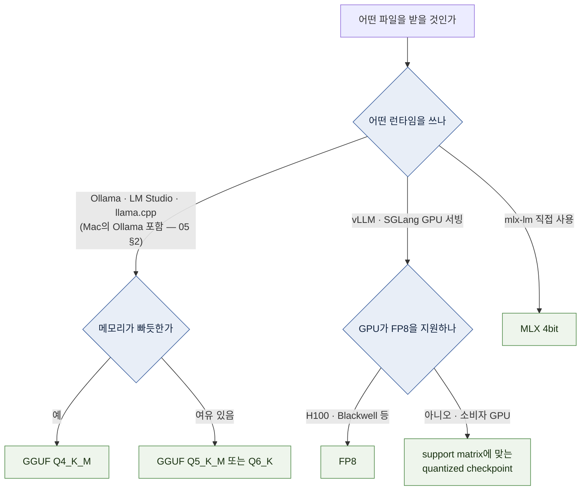

# 03 — 양자화: 무엇을 받아야 하는가

`Q4_K_M`? `AWQ`? `MLX-4bit`? 모델 페이지에 파일이 20개씩 있을 때 **무엇을 받을지 결정하는 문서**다.

← [02 모델 해부](02-model-anatomy.md) · 다음 → [04 하드웨어 등급](04-hardware-tiers.md)

---

## 1. 결론 먼저 — 규칙 세 줄

| 무엇으로 돌리나 | 무엇을 받나 |
| --- | --- |
| Ollama | model library에서 hardware와 version에 맞는 tag를 고르고 `ollama show`로 format·quantization 확인 |
| LM Studio · llama.cpp | **GGUF `Q4_K_M`를** 첫 후보로 삼고 memory·quality를 실제 task로 확인 |
| mlx-lm을 직접 쓰는 Mac | **MLX-compatible 4bit**를 첫 후보로 삼고 model card의 conversion·license 확인 |
| vLLM 등 GPU serving | vLLM의 current support matrix에 있는 original/BF16·FP8·AWQ·compressed-tensors checkpoint 중 hardware와 kernel에 맞는 것 |

`[자료 확인 · 2026-08-10]` — 런타임 자체를 아직 안 골랐다면 [05 스택 지도](05-stack-map.md)부터. 나머지는 이 선택을 이해하고 예외를 판단하기 위한 내용이다.

---

## 2. 양자화란 무엇인가

모델 파라미터 하나를 저장하는 **숫자 정밀도를 낮추는 것**이다. 16bit로 저장하던 숫자를 4bit로 저장하면 용량이 1/4이 된다. `[원리]`

```text
  원본 FP16:  0.4823156...  →  2 byte로 저장
  4bit 양자화: 값의 범위를 16단계로 나눠 "몇 번째 칸인가"만 저장  →  0.5 byte

  잃는 것: 미세한 값 차이 (품질 소폭 열화)
  얻는 것: 용량 1/4, 메모리 대역폭 부담 감소 → 속도도 대개 빨라진다
```

**JPEG과 비슷하게 용량과 손실 사이의 tradeoff가 생긴다**고 이해할 수 있습니다. 다만 language model의 손실은
image처럼 눈으로 바로 비교하기 어려우며, task·language·prompt에 따라 다르게 드러납니다. `[해석]`

### 눈금 비유 — "몇 칸짜리 자로 재는가"

정밀도를 낮춘다는 것은 **같은 값을 더 성긴 눈금으로 기록**한다는 뜻이다.


`[원리]`

**그런데 왜 4bit가 쓸 만한가.** 파라미터 하나하나의 오차는 커 보이지만, 수십억 개가 함께 작동하면서
오차가 서로 상쇄된다. 게다가 실제 포맷은 **블록 단위로 배율(scale)을 따로 저장**해 눈금 간격을
값의 분포에 맞춰 조정한다 — 위 그림보다 실제 오차가 훨씬 작다. `[해석]`

> 🔧 **한 단계 더 — 캘리브레이션 데이터가 품질을 가른다.**
> AWQ·GPTQ·imatrix 계열은 "어느 가중치가 중요한가"를 **샘플 텍스트(캘리브레이션 데이터)로** 측정해
> 그쪽 정밀도를 지킵니다. 같은 알고리즘이라도 calibration data와 구현이 다르면 결과가 달라질 수 있습니다.
> 한국어가 핵심 workload라면 영어 benchmark만 보지 말고 실제 한국어 prompt set으로 원본 또는 더 높은 bit
> checkpoint와 비교합니다. `[해석]`

> 반대로 **2~3bit에서 급격히 나빠지는 이유**도 같다. 눈금이 4~8칸까지 줄면
> 상쇄로 덮이지 않는 수준의 왜곡이 남는다.

> **양자화가 속도까지 올리는 이유** `[원리]`
> decode는 memory bandwidth의 영향을 크게 받으므로 weight가 작아지면 빨라질 가능성이 있습니다. 다만 dequantization
> kernel, hardware 지원과 batch에 따라 오히려 느려질 수도 있으므로 실제 runtime에서 측정합니다.

---

## 3. 포맷 지도 — 무엇이 무엇과 같은 층인가 ★

**가장 큰 혼란은 성격이 다른 것들이 나란히 비교되는 데서 온다.** `[해석]`



`[자료 확인 · 2026-08-10]`

**핵심 정리:** GGUF는 **포맷**이고 GPTQ·AWQ는 **알고리즘**이다. `[자료 확인 · 2026-08-10]`
"GGUF vs AWQ"라는 비교는 엄밀히는 층위가 어긋나 있지만, 실무에서는 **"llama.cpp 계열로 갈 것인가, GPU 서빙으로 갈 것인가"라는 선택**을 뜻하므로 그렇게 읽으면 된다. `[해석]`

---

## 4. 품질과 용량 — 순위보다 bpw

**4bit급 포맷 사이에 믿을 만한 전역 품질 순위는 없다.** 포맷마다 실효 비트폭(bpw)과 캘리브레이션
데이터가 달라 동일 조건 비교가 성립하지 않고, 공개 비교 자료들도 결과가 서로 엇갈린다. `[해석]`
대체적 경향만 정리하면:

- 알고리즘 이름보다 같은 base model, 실효 bit 폭, calibration, runtime kernel과 실제 task를 맞춰 비교합니다.
- FP4·INT4·AWQ·GPTQ·K-quant는 저장 형식, 알고리즘과 hardware 최적화 조건이 서로 다릅니다.
- 다른 조건의 benchmark를 이어 붙여 전역 품질 순위를 만들지 않습니다.

여기서 **perplexity**라는 지표가 자주 인용된다 — 모델이 다음 토큰을 얼마나 "덜 놀라며" 맞히는가의
값으로, 낮을수록 좋다([11 용어집](11-glossary.md)). 포맷 간 차이는 대개 perplexity 소수점 수준이다.

> **순위를 과대 해석하지 말 것.** file이 runtime에서 안정적으로 load되는지, 실제 한국어 task에서 결과가
> 유지되는지, memory·latency 목표를 지키는지를 함께 봅니다. `[해석]`

### GGUF 파일명 읽는 법

`model-Q4_K_M.gguf` 같은 이름의 구조: `[원리]`

| 부분 | 의미 |
| --- | --- |
| `Q4` | 기본 4bit |
| `_K` | K-quant 계열 — 블록을 묶은 상위 블록(super-block)에 배율을 이중으로 저장하고, 텐서 종류별로 비트를 차등 배분하는 개선 방식 |
| `_S` / `_M` / `_L` | Small / Medium / Large — 같은 4bit 안에서 품질·용량 미세 조정 |

**표기와 실제 비트폭은 다르다** — 배율 값 등이 더해져 "Q4"도 실제로는 4bit보다 크다.
[02 §2](02-model-anatomy.md)의 "+15% 여유"의 정체가 바로 이것이다. `[자료 확인 · 2026-08-10]`

| 표기 | 실효 bpw (대략) | 7B 모델 파일 크기 감각 |
| --- | --- | --- |
| `Q3_K_M` | ~3.9 | ~3.4 GB |
| `Q4_K_S` | ~4.6 | ~4.0 GB |
| **`Q4_K_M`** | **~4.8** | **~4.2 GB** |
| `Q5_K_M` | ~5.7 | ~5.0 GB |
| `Q6_K` | ~6.6 | ~5.7 GB |
| `Q8_0` | ~8.5 | ~7.4 GB |

**첫 비교 선택:** `Q4_K_M`에서 시작하고, 같은 model의 더 높은 bit 또는 original checkpoint와 실제 task를
비교합니다. memory가 빠듯하면 더 작은 quantization이나 더 작은 model을 시험합니다. bit 수가 낮을수록 정보 손실
위험이 커지지만 체감 경계는 model과 task마다 다릅니다. `[해석]`

### IQ 계열 — 저비트로 내려가야 할 때의 우선 후보

파일 목록에 `IQ4_XS`·`IQ3_M` 같은 이름도 보인다. **importance matrix(imatrix)** — 어떤 가중치가
중요한지 측정한 행렬 — 를 써서 만든 양자화로, **같은 용량에서 같은 급의 `Q` 표기보다 품질이 낫다**는
보고가 일반적이다. 메모리가 1~2GB 모자랄 때 `Q3_K_M`으로 내려가기 전에 `IQ4_XS`가 있는지 먼저
확인한다. 대신 일부 구형 하드웨어에서 약간 느릴 수 있다. `[자료 확인 · 2026-08-10]`

---

## 5. 선택 규칙 — 결정 순서 ★



### 표로 다시

| 상황 | 받을 것 | 이유 |
| --- | --- | --- |
| Ollama로 처음 시작 | library의 소형 4bit급 tag | file을 직접 고르기 전에 실행·검증 흐름을 익힘 |
| llama.cpp·LM Studio로 처음 시작 | **GGUF Q4_K_M** | 널리 배포되는 출발점. model별 호환 확인 필요 |
| Mac에서 mlx-lm을 직접 쓴다 | **MLX 4bit** | Apple 프레임워크 네이티브 ([05 §2](05-stack-map.md) — Ollama 경로면 불필요) |
| 메모리가 1~2GB 모자람 | 더 작은 GGUF 변형을 후보로 두기 | file size를 확인하고 실제 task quality를 한 단계 높은 정밀도와 비교 (§4) |
| 품질을 최대한 지키고 싶음 | GGUF `Q6_K` / `Q8_0` | 용량 대가를 지불 |
| GPU serving(vLLM) | support matrix와 GPU에 맞는 checkpoint | AWQ·FP8·compressed-tensors 등은 model·GPU·kernel 조건이 다름 |
| FP8 지원 GPU 보유 | pre-quantized FP8 또는 supported online quantization | memory 절감과 성능은 hardware·kernel·workload에서 측정 |
| 아무 양자화도 없음(신규 모델) | 원본 FP16/BF16 | 커뮤니티 양자화가 나올 때까지 |

> 🔧 **한 단계 더 — vLLM 경로의 현행 실무.** vLLM 생태계의 사전 양자화는 AWQ 외에
> `llm-compressor`(compressed-tensors 형식, W4A16 등)로 만든 체크포인트가 표준으로 자리잡는 흐름이고,
> Blackwell에서는 NVFP4 체크포인트도 쓰인다. 모델 페이지에서 `-AWQ` 외에 `-W4A16`·`-FP8`·`-NVFP4`
> suffix를 함께 검색하면 선택지가 넓어진다. `[변동]` 조회 2026-08-10

### 실제로 받기 — 세 경로

여기까지가 "무엇을"이었다면, 이제 "어떻게"다. 경로는 셋 중 하나다. `[자료 확인 · 2026-08-10]`

**① Ollama / LM Studio — 파일을 고를 필요가 없는 경로 (권장 시작점)**

```bash
ollama pull gemma3:4b          # library 이름:tag. 실제 format은 ollama show로 확인
```

LM Studio는 앱 내 검색에서 모델명을 치면 양자화별 목록과 "내 장비에 맞는가" 표시가 뜬다.
이 경로에서는 이 문서의 지식이 "**목록에서 어느 줄을 고를까**"에 쓰인다.

**② Hugging Face에서 GGUF 직접 받기 — llama.cpp 직접 사용 경로**

모델 페이지의 `Files` 탭에는 같은 모델이 양자화별로 십수 개 나열된다. 예:

```text
  qwen3.6-27b-Q3_K_M.gguf        11.2 GB
  qwen3.6-27b-IQ4_XS.gguf        13.7 GB
  qwen3.6-27b-Q4_K_M.gguf        15.1 GB   ← 기본 선택
  qwen3.6-27b-Q5_K_M.gguf        17.8 GB
  qwen3.6-27b-Q8_0.gguf          26.9 GB
```

```bash
huggingface-cli download <배포자>/<모델명>-GGUF <파일명>.gguf --local-dir ./models
```

**누구의 quantization을 받는가:** model 제작사가 배포한 file 또는 model card에서 provenance·base revision·
quantization 방법·license를 확인할 수 있는 배포를 우선합니다. account의 인지도만으로 file integrity와 quality를
보장하지 않습니다. `[해석]`

**대형 모델의 분할 파일:** `-00001-of-00003.gguf`처럼 나뉘어 있으면 **전부 받아 같은 폴더에 두고
첫 파일만 지정**한다 — 최신 llama.cpp가 나머지를 자동으로 읽는다(수동 병합 불필요). `[자료 확인 · 2026-08-10]`

**③ safetensors 디렉터리 통째로 — vLLM·mlx-lm 경로**

GGUF와 달리 단일 파일이 아니다. `config.json`·토크나이저까지 **디렉터리 전체**가 필요하므로
개별 파일이 아니라 repo 단위로 받는다 (`huggingface-cli download <repo> --local-dir ...`).
vLLM은 HF repo 이름을 주면 자동으로 받아 준다 ([07 §5](07-setup-nvidia-workstation.md)).

---

## 6. 함정 다섯 가지

| 함정 | 실제 |
| --- | --- |
| "4bit면 품질 손실이 항상 작다" | model·task·language·quantizer에 따라 다르다. 실제 prompt set으로 높은 precision과 비교 |
| "더 큰 model의 낮은 bit가 항상 낫다" | parameter 수와 bit 폭만으로 quality 순위를 정할 수 없다. 두 후보를 같은 task와 resource budget에서 비교 |
| "양자화 file이면 아무거나 되겠지" | runtime마다 지원 format·quantization·kernel이 다르다. current support matrix 확인 |
| "파일 크기 = 필요 메모리" | KV 캐시와 오버헤드가 빠졌다. [02 §1 산식·§4 검산](02-model-anatomy.md) |
| "양자화 모델의 컨텍스트도 같이 줄어든다" | 아니다. 컨텍스트는 별개다. 다만 **KV 캐시는 기본적으로 양자화되지 않으므로** 절약분을 컨텍스트가 잠식할 수 있다 `[원리]` |
| "같은 Q4_K_M이면 어디서 받아도 같다" | 배포자마다 캘리브레이션·imatrix 유무가 달라 품질이 다르다. §5 "실제로 받기"의 배포자 기준을 따른다 `[해석]` |

---

## 7. KV 캐시 양자화 — 한 단계 더

가중치를 4bit로 줄여도 KV 캐시는 대개 FP16으로 남는다. 긴 컨텍스트에서는 이쪽이 병목이 된다([02 §5](02-model-anatomy.md)).
여러 runtime은 **KV cache 자체를 FP8/INT8 계열로 양자화**하는 option을 제공합니다. bit 폭만 보면 큰 절감이
가능하지만 실제 memory와 quality 변화는 backend와 model에서 측정합니다. `[문서 확인 · 2026-08-10]`

- llama.cpp: `--cache-type-k` / `--cache-type-v` 플래그
- Ollama: 환경변수 `OLLAMA_KV_CACHE_TYPE` (플래그가 아니라 환경변수다)
- vLLM: `--kv-cache-dtype fp8`

**언제 쓰나:** model은 들어가는데 context에서 memory가 부족할 때입니다. 적용 전후에 peak memory와 실제 task
quality를 함께 비교합니다. `[해석]`
구체적 명령은 [06](06-setup-apple-silicon.md)·[07](07-setup-nvidia-workstation.md).

> 🔧 **한 단계 더 — 어느 단계까지 낮추나.** `q8_0`과 `q4_0`의 memory·quality 차이는 model과 긴 context를
> 포함한 실제 prompt set으로 비교합니다. llama.cpp의 K/V cache type과 Flash Attention 관계는 version에 따라
> 바뀔 수 있으므로 현재 `--help`와 공식 문서를 확인합니다. `[자료 확인 · 2026-08-10]`

---

**다음 →** [04 하드웨어 등급 — 내 장비는 어느 티어인가](04-hardware-tiers.md)
