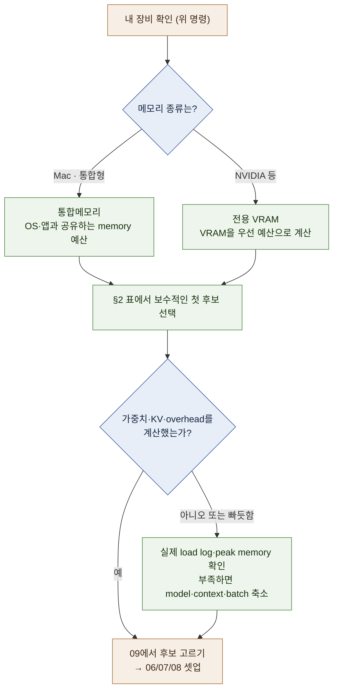

# 04 — 하드웨어: GPU 종류와 등급 분류

**내 장비에서 어느 크기의 model부터 시험할지** 정하는 문서입니다. 아래 표는 구매 추천이나 지원 보장이 아니라
실행 전 memory budget을 잡는 출발점입니다.

← [03 양자화](03-quantization.md) · 다음 → [05 스택 지도](05-stack-map.md)

---

## 1. 결론 먼저 — capacity와 bandwidth부터 본다

```text
  ① 메모리 용량 (VRAM 또는 통합메모리)  →  "무엇이 올라가는가"를 결정  (가부의 문제)
  ② 메모리 대역폭 (GB/s)               →  "얼마나 빠른가"를 결정      (정도의 문제)
```
`[원리]`

한 token씩 생성하는 decode 단계는 weight를 반복해서 읽어 memory bandwidth의 영향을 크게 받습니다. 반면 긴
prompt를 처음 처리하는 prefill, 여러 요청을 묶는 batch와 일부 kernel은 compute 성능의 영향도 큽니다. 실제 속도는
model architecture, quantization, runtime kernel과 software version까지 함께 측정해야 합니다. `[원리]`

이 사실이 만드는 두 가지 실무 결론:

- model weight, KV cache와 overhead가 memory에 들어가지 않으면 먼저 model·context·batch·quantization을 줄입니다.
- capacity가 충분한 후보끼리는 bandwidth와 실제 runtime benchmark를 비교합니다. 세대 이름만으로 속도를 정하지 않습니다.

> **prefill은 따로 본다:** 긴 prompt를 처리하는 단계는 decode와 다른 compute·memory 특성을 보이며,
> hardware와 runtime에 따라 bottleneck이 달라질 수 있다.
> 그래서 "짧은 질문은 빠른데 긴 문서를 넣으면 첫 응답이 오래 걸린다"는 현상이 생긴다. [10 §1](10-operations.md)

---

## 2. memory별 첫 후보 — 보수적으로 시작하기 ★

아래 범위는 **4bit급 weight**를 기준으로 첫 시험 대상을 고르는 보수적 heuristic입니다. KV cache, runtime overhead,
OS와 다른 application 몫은 별도이며, multimodal·MoE 구조와 runtime에 따라 크게 달라질 수 있습니다. `[해석]`

| 사용 가능한 memory | 첫 시험 후보 | 다음 단계 |
| --- | --- | --- |
| **8 GB** | 1~4B | 7~8B는 짧은 context로만 시험하고 memory pressure 확인 |
| **12~16 GB** | 4~8B | 12~14B는 실제 file size와 KV budget 계산 후 시험 |
| **24 GB** | 8~14B | 20~27B는 context와 다른 application 몫을 줄여 단계적으로 시험 |
| **32 GB** | 14~27B | 30B급은 runtime log와 peak memory 확인 |
| **48 GB** | 20~35B | 50B급은 quantization·context 조건을 먼저 계산 |
| **64~96 GB** | 35~70B | 70B급은 Q4 file, KV, overhead 합계를 model별로 검산 |
| **128 GB 이상** | 70B부터 계산 | 큰 MoE는 active가 아니라 total weight로 memory 계획 |

이 표보다 [02의 산식](02-model-anatomy.md)이 우선합니다. model file이 memory에 들어간다는 사실만으로 쓸 만한
context와 속도가 확보되는 것은 아닙니다.

> **시작용 여유 규칙:** 초기 후보를 고를 때는 model file이 전체 memory를 차지하지 않게 하고, 대략 30~40%를
> OS·KV cache·runtime·다른 application에 남겨 두면 실패를 줄일 수 있습니다. 이는 hard limit가 아닙니다. 실제
> runtime의 load log와 peak memory를 확인해 장비별로 조정하세요. `[해석]`

---

## 3. GPU·가속기 등급 분류 ★

### 3.1 다섯 등급


`[자료 확인 · 2026-08-10]`

### 3.2 공식 사양을 읽는 예 — 구매 전 다시 확인

제품 목록을 넓게 나열하는 대신, official specification에서 무엇을 가져와 계산에 넣는지 보여 주는 예입니다.

| 경로 | 공식 사양에서 확인한 예 | 계산에 쓰는 값 |
| --- | --- | --- |
| Apple unified memory | Mac Studio의 M4 Max는 구성별 최대 128GB·약 410/546GB/s, M3 Ultra는 최대 512GB·약 819GB/s | 실제 chip 구성의 memory·bandwidth |
| AMD unified memory | Ryzen AI Max+ 395는 제품별 최대 128GB와 약 256GB/s memory bandwidth | system이 GPU에 허용하는 memory와 runtime 지원 |
| workstation GPU | RTX PRO 6000 Blackwell은 96GB memory와 약 1,792GB/s bandwidth | VRAM, power·form factor와 지원 kernel |

`[문서 확인 · 2026-08-10]` — 사양은 같은 이름 안에서도 configuration·form factor에 따라 달라집니다.
구매나 대여 전 [출처](SOURCES.md)의 official page와 실제 판매 configuration을 다시 확인하고, model 상한은
제품명이 아니라 [02의 산식](02-model-anatomy.md)으로 계산합니다.

### 3.3 통합메모리 vs 전용 VRAM — 구조적 차이 ★

**이 차이를 이해하면 "왜 Mac이 이 분야에서 이상하게 강한가"가 풀린다.** `[해석]`


`[원리]`

| 관점 | 통합메모리 (Apple) | 전용 VRAM (NVIDIA) |
| --- | --- | --- |
| **큰 memory 구성** | 하나의 address space에 큰 unified memory를 구성할 수 있음 | GPU별 VRAM. 큰 단일 card와 multi-GPU 선택지가 있음 |
| **bandwidth** | chip 구성에 따라 다름 | card·memory type에 따라 다름. 상위 card는 높은 bandwidth 제공 |
| **runtime** | Metal·MLX·llama.cpp 계열 | CUDA를 우선 지원하는 serving·optimization 도구가 많음 |
| **여러 사용자 serving** | 가능한 도구가 있지만 이 가이드의 vLLM 경로는 CUDA 중심 | vLLM 등 CUDA 중심 경로 선택 가능 |
| **전력·소음** | system 전체 설계에 따라 다름 | card와 system 전체 설계에 따라 다름 |

**한 줄 요약:** 큰 unified memory가 필요한 1인 실험과 CUDA 중심 serving은 서로 다른 강점을 가집니다.
Mac 또는 NVIDIA라는 이름만으로 결론내리지 말고 model size, runtime, latency와 concurrency를 같은 workload로
측정합니다. `[해석]`

### 3.4 다중 GPU에 관한 주의

- 카드 2장은 **VRAM이 단순히 합쳐지는 것이 아니다.** 모델을 나누는 방식(텐서 병렬 — 계산을 카드들에 쪼개는 기법, [08 §2](08-setup-multi-gpu-server.md))과 카드 간 통신 대역이 성능을 좌우한다.
- card 간 경로는 generation과 form factor에 따라 PCIe, NVLink, NVSwitch 등이 될 수 있습니다. 이름만 보고
  추정하지 말고 `nvidia-smi topo -m`과 product specification으로 현재 system topology를 확인합니다. `[변동]`
- 같은 total VRAM이라도 큰 card 한 장과 작은 card 여러 장은 동등하지 않습니다. model이 single GPU에 들어가면
  분산 통신 없이 시작할 수 있지만, 가격·가용성·throughput 요구에 따라 multi-GPU가 맞을 수도 있습니다. `[해석]`

> 🔧 **한 단계 더 — 다중 카드 전 확인 목록.** 메인보드의 PCIe 레인 배분(두 번째 슬롯이 x4로 떨어지는
> 보드가 있다), power 용량과 connector, cooling, card 크기, 동일 model/runtime의 multi-GPU 지원 여부를
> 확인합니다. 상세 진단은 [08 §3](08-setup-multi-gpu-server.md). `[해석]`

---

## 4. 구매보다 먼저 측정할 것

이미 가진 장비에서 가장 작은 후보를 실행해 보면 필요한 model quality, context, latency와 concurrency를 구체적인
숫자로 바꿀 수 있습니다. 새 장비나 cloud GPU에 큰 비용을 쓰기 전에는 다음 순서로 확인합니다.

1. 사용할 model과 quantization을 고정합니다.
2. 실제 prompt의 input/output token 분포를 측정합니다.
3. 허용할 첫 token latency, 생성 속도와 동시 요청 수를 정합니다.
4. local 장비 또는 시간 단위로 빌린 환경에서 peak memory와 throughput을 잽니다.
5. 장비 가격뿐 아니라 전력, 운영 시간, 보증, model 교체와 낮은 이용률을 포함해 비교합니다.

개인 학습이 목적이라면 현재 장비와 소형 model로 먼저 시작하는 편이 안전합니다. 팀 serving이라면 “큰 model이
load된다”보다 실제 동시 요청에서 latency 목표를 지키는지가 더 중요한 구매 기준입니다. `[해석]`

> 🔧 **한 단계 더 — 스펙표에 없는 구매 변수.** ① **실효 VRAM**: 디스플레이 출력·OS 예약이 1~2GB를
> 가져가고, ECC를 켜면 가용량이 또 줄어든다 — 스펙 24GB ≠ 가용 24GB. ② **전력·커넥터**: 최상급
> 소비자 카드는 500W 이상을 끌어 파워·케이블 요건이 따라온다. ③ **중고 시장**: 이전 세대 24GB 카드
> (3090 등)는 capacity 대비 가격 후보가 될 수 있지만, 보증·수명·전력·cooling과 필요한 software support를 함께
> 확인해야 합니다. `[해석]`

---

## 5. 내 장비 확인 방법

```bash
# macOS — 칩·코어·메모리
sysctl -n machdep.cpu.brand_string
system_profiler SPHardwareDataType | grep -E 'Chip|Memory'
system_profiler SPDisplaysDataType | grep -E 'Chipset|Cores'

# Linux / Windows(WSL 또는 PowerShell) — NVIDIA GPU와 VRAM
nvidia-smi --query-gpu=name,memory.total,driver_version --format=csv

# 리눅스 시스템 메모리
free -h
```
`[자료 확인 · 2026-08-10]`

`nvidia-smi`는 Windows 네이티브(PowerShell)에서도 동일하게 동작한다. 모델을 이미 돌리고 있다면
`ollama ps`가 실제 메모리 점유와 GPU/CPU 배분을 보여 준다.

확인한 메모리 값으로 아래 흐름을 따라가면 **가용 모델 범위**가 나온다.
구체적 후보를 줄이는 방법은 [09 §2](09-model-landscape.md)의 memory별 검색 범위에서 이어집니다.



---

**다음 →** [05 스택 지도 — 어떤 도구를 쓸 것인가](05-stack-map.md)
