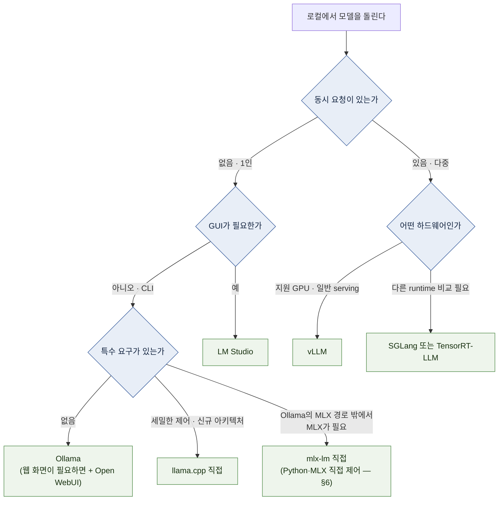

# 05 — 스택 지도: 어떤 도구를 쓸 것인가

Ollama·LM Studio·llama.cpp·MLX·vLLM·SGLang·TGI. **이름이 나란히 놓이지만 같은 층이 아니다.**

← [04 하드웨어 등급](04-hardware-tiers.md) · 다음 → [06 Apple Silicon 셋업](06-setup-apple-silicon.md)

---

## 1. 결론 먼저 ★

처음 model 하나를 실행하려는 독자에게는 Ollama가 가장 짧은 경로입니다. 세밀한 engine option, 특정 format,
동시 요청 serving 같은 요구가 생기면 llama.cpp·MLX·vLLM을 검토합니다. `[해석]`

먼저 알아야 할 도구는 셋뿐이다. 계층 구분은 [01 §1](01-orientation.md)에서 소개한 그 구조다.

| 도구 | 계층 | 무엇인가 | 언제 쓰나 |
| --- | --- | --- | --- |
| **Ollama** | 경험층 | model 받기·실행·API를 묶은 CLI와 desktop application | 첫 local 실행, 개인 개발·실험 |
| **llama.cpp** | 엔진 | C/C++ 추론 엔진. CPU·Metal·CUDA 지원 | 세밀한 제어·특수 하드웨어·최신 모델 |
| **vLLM** | 서빙 시스템 | 다중 요청 배칭·KV 관리 server | 목표 concurrency·throughput을 운영할 때 |

`[자료 확인 · 2026-08-10]`

**핵심:** Ollama와 vLLM은 기능이 일부 겹치지만 주된 최적화 대상이 다릅니다. 전자는 쉬운 local 실행,
후자는 serving과 throughput에 초점을 둡니다. `[문서 확인 · 2026-08-10]`

나머지는 필요해졌을 때 보면 된다.

| 도구 | 계층 | 성격 |
| --- | --- | --- |
| **LM Studio** | 경험층 | Ollama의 GUI 대응물. 모델 검색·다운로드·실행을 화면에서 |
| **Jan · GPT4All** | 경험층 | 데스크톱 챗 앱 |
| **Open WebUI** | **프런트엔드** | Ollama·OpenAI 호환 API 위에 얹는 **"ChatGPT 같은 화면"** (§2) |
| **MLX (mlx-lm)** | 엔진 | Apple Silicon용 MLX 기반 inference·fine-tuning package |
| **SGLang** | 서빙 시스템 | 별도의 serving runtime. model·hardware 지원과 workload를 비교해 선택 |
| **TGI** | 서빙 시스템 | Hugging Face 서빙 스택 `[변동]` |
| **TensorRT-LLM** | 서빙 시스템 | NVIDIA 극한 최적화 스택 |

`[변동]` 조회 2026-08-10

---

## 2. 무엇이 무엇을 감싸는가



`[자료 확인 · 2026-08-10]`

**"ChatGPT 같은 화면"은 어디에 있나:** Ollama 자체는 CLI다. 웹 채팅 화면을 원하면 **Open WebUI**
같은 프런트엔드를 Ollama 위에 얹는다(설치형 웹 앱 — Ollama의 API를 바라보게 설정하면 끝).
LM Studio·Jan은 이 두 층이 앱 하나에 합쳐진 형태다. `[자료 확인 · 2026-08-10]`

**Apple Silicon에서의 구조 변화 (2026):** Ollama 0.19는 지원 model을 대상으로 MLX engine preview를 도입했고,
이후 release는 MLX 경로와 GGUF·llama.cpp 호환 경로를 함께 확장했습니다. 어떤 engine과 format이 사용되는지는
Ollama version, model tag와 hardware에 따라 달라지므로 이름만 보고 추정하지 말고 `ollama ps`, model tag와 release
note를 확인합니다. `[문서 확인 · 2026-08-10]`

mlx-lm을 직접 쓰면 MLX-compatible model, Python API, 변환·quantization option을 직접 선택할 수 있습니다.
Ollama의 편의성이 필요한지, MLX를 직접 제어해야 하는지가 선택 기준입니다. `[해석]`

> 🔧 **한 단계 더 — "엔진 vs 서빙"의 경계는 실제로는 겹친다.** llama.cpp에 동봉된 `llama-server`는
> 연속 배칭과 prefix caching을 자체 제공하는 훌륭한 소규모 서버다. "엔진이니까 서빙은 못 한다"가
> 아니라, **동시성 규모가 커질수록 vLLM 계열의 이점이 커진다**로 읽는 것이 정확하다. `[자료 확인 · 2026-08-10]`

---

## 3. 성능 비교를 올바로 읽는 법 ★

`tokens/s` 하나만으로 runtime을 비교할 수 없습니다. 최소한 다음 조건이 같아야 합니다.

- model identifier와 quantization
- hardware, runtime version과 backend
- input/output token 길이
- 동시 요청 수와 batch 설정
- TTFT, 요청당 latency, 전체 throughput 중 무엇을 측정했는지

**왜 이런 차이가 나나** `[원리]`

- **연속 배칭(continuous batching)**: 생성 중인 요청 사이에 새 요청을 끼워 넣어 GPU를 계속 채운다
- **PagedAttention**: KV cache를 block 단위로 관리해 memory 낭비를 줄인다

이 기법들은 특히 여러 요청이 겹칠 때 GPU 이용률과 KV memory 관리를 개선합니다. 요청 하나의 latency와 많은
요청의 총 throughput은 다른 지표이므로 각각 측정합니다.

> **판단 규칙:** 개인 사용이라면 설치·model 호환·latency를 먼저 보고, serving이라면 목표 concurrency에서 TTFT,
> p95 latency와 throughput을 함께 측정합니다. “vLLM이 항상 빠르다” 또는 “한 명이면 같다”는 식으로 일반화하지
> 않습니다. `[해석]`

> 🔧 **한 단계 더 — Ollama도 소규모 동시성은 처리한다.** `OLLAMA_NUM_PARALLEL`(모델당 동시 요청 수),
> `OLLAMA_MAX_LOADED_MODELS`(동시 상주 모델 수)로 가족·소규모 팀 수준의 동시 사용은 Ollama로도
> 충분한 경우가 많다. vLLM으로 넘어갈 신호는 §6의 "졸업 신호" 열. `[자료 확인 · 2026-08-10]`

---

## 4. OpenAI 호환 API — 왜 이게 중요한가

Ollama, llama.cpp server와 vLLM 등 여러 runtime이 OpenAI API와 비슷한 HTTP endpoint를 제공합니다. 구현하는 API와
option 범위는 runtime마다 다릅니다. `[문서 확인 · 2026-08-10]`

```text
  POST http://localhost:11434/v1/chat/completions     ← Ollama 기본 포트
  POST http://localhost:8000/v1/chat/completions      ← vLLM 기본 포트

  {"model": "...", "messages": [{"role": "user", "content": "..."}]}
```

**실무적 의미 세 가지** `[해석]`

1. 기본 chat request shape를 공통 adapter 뒤에 둘 수 있습니다.
2. 지원 범위가 맞으면 기존 SDK·client를 재사용할 수 있습니다.
3. backend를 바꿀 때도 model ID, 인증, context, tool calling, structured output과 error 처리 차이를 검증해야 합니다.

> 조직 규모에서는 이 interface 앞에 gateway를 둘 수 있지만 인증·masking·routing이 자동으로 생기는 것은 아닙니다.
> 그 설계는 이 가이드의 범위 밖입니다.

> 🔧 **한 단계 더 — "호환"의 구멍.** 기본 채팅은 어디서나 동작하지만 가장자리는 런타임마다 다르다:
> **tool calling·구조화 출력(JSON) 지원 여부와 문법**, 스트리밍 응답의 usage 필드 유무, `/v1/models`
> 응답 형식. 그리고 Ollama의 컨텍스트 길이(`num_ctx`) 같은 런타임 고유 옵션은 OpenAI 호환 API가
> 아니라 **네이티브 API(`/api/chat`)나 Modelfile로만** 조정되는 경우가 있다. 앱을 붙이다 막히면
> 여기부터 의심한다. `[자료 확인 · 2026-08-10]`

---

## 5. 선택 플로우



플로우의 끝은 실제 절차 문서로 이어진다 — Ollama·llama.cpp·mlx-lm은 [06](06-setup-apple-silicon.md)(Mac)
또는 [07](07-setup-nvidia-workstation.md)(NVIDIA), vLLM은 [07 §5](07-setup-nvidia-workstation.md)(단일 GPU)와 [08](08-setup-multi-gpu-server.md)(다중 GPU).

---

## 6. 각 도구의 실제 성격

| 도구 | 강점 | 감수할 것 | 졸업 신호 — 다음 단계로 갈 때 |
| --- | --- | --- | --- |
| **Ollama** | model download·실행·local API를 한 경로로 제공 | engine·format 선택과 세밀한 parameter 제어가 직접 engine보다 제한적 | 목표 concurrency에서 latency·throughput이 부족함 → serving runtime 측정. 세밀 제어·format 필요 → llama.cpp·MLX |
| **LM Studio** | model 검색·download GUI, MLX 지원, headless server mode와 `lms` CLI | application license·network·authentication 설정 확인 | 자동화·server 운영 비중이 커짐 → 다른 runtime과 비교 |
| **llama.cpp** | 다양한 hardware backend와 세밀한 option, 빠른 architecture 지원 | build·flag를 직접 다뤄야 함 | 목표 model·backend 지원 여부를 먼저 확인 |
| **MLX (mlx-lm)** | Apple Silicon native, Python API, MLX-compatible model의 직접 실행·변환 | Apple Silicon 중심, Python 환경과 model compatibility 확인 필요 | — (직접 MLX 제어가 필요할 때) |
| **vLLM** | continuous batching, KV 관리, OpenAI-compatible server와 분산 option | 설치·driver·model compatibility와 serving 설정이 더 복잡 | single-node memory·throughput 한계 → multi-GPU·분산 검토 |

`[문서 확인 · 2026-08-10]` — tool license와 model license는 별개입니다. 조직 도입과 재배포 전에는 각
project repository와 model card의 current license를 다시 확인합니다.

---

## 7. runtime benchmark를 남기는 최소 형식

MLX, llama.cpp, Ollama와 vLLM의 상대 속도는 model·quantization·prompt·hardware·version에 따라 달라집니다.
배수만 인용하지 말고 다음 항목을 함께 남깁니다.

```text
model / quantization:
runtime / version / backend:
hardware / available memory:
input tokens / output tokens / concurrency:
TTFT / decode tokens per second / p95 latency / total throughput:
```

같은 조건을 만들 수 없다면 비교가 아니라 각 환경의 관측값으로 기록합니다. 구체적인 측정 방법은
[10 §1](10-operations.md)에서 다룹니다.

---

**다음 →** [06 Apple Silicon 셋업](06-setup-apple-silicon.md)
